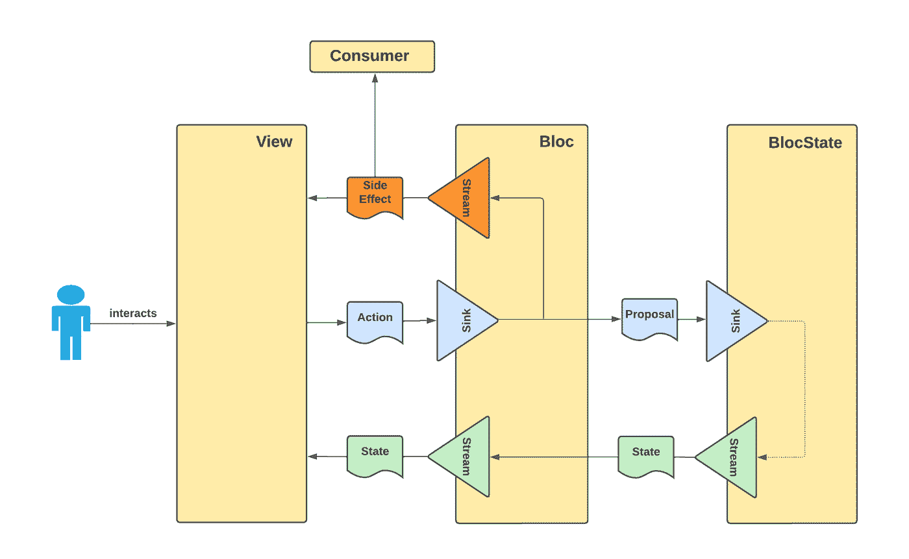
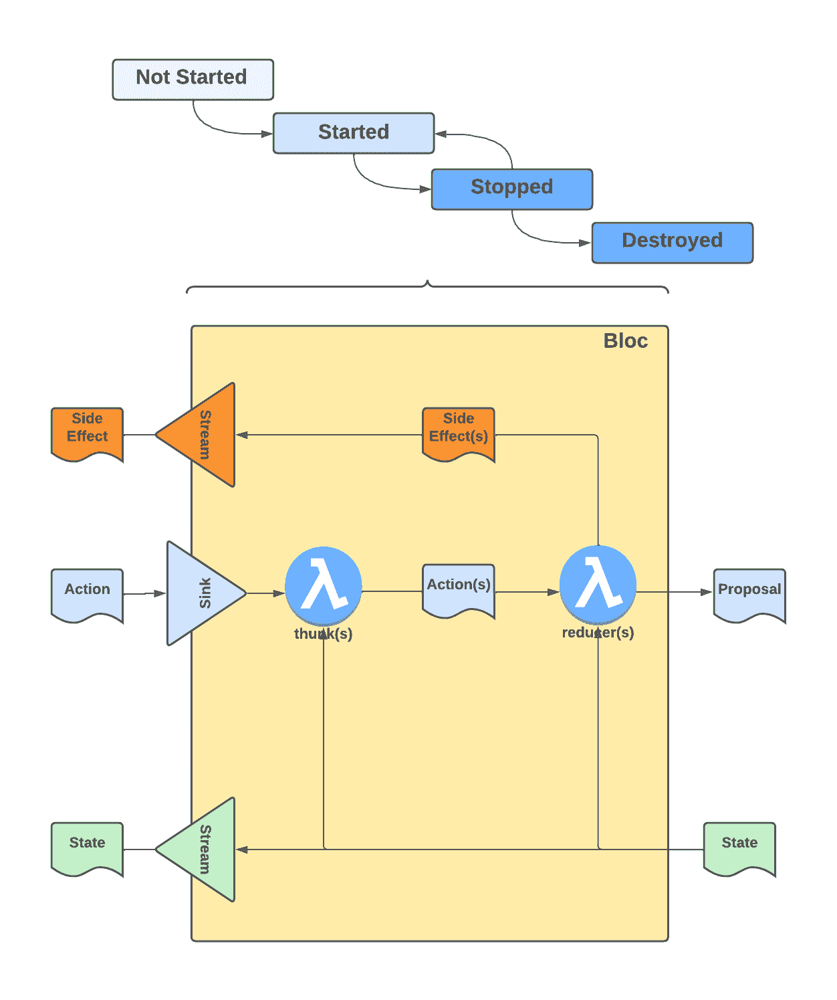
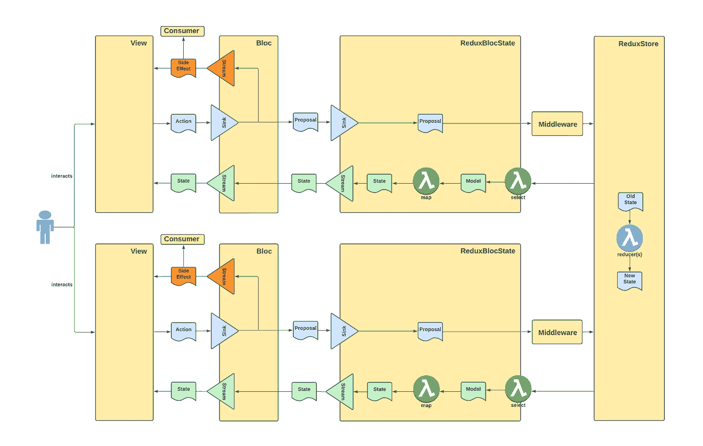

# KMM 用户界面架构-第二部分

> 原文：<https://medium.com/nerd-for-tech/kmm-ui-architecture-part-2-e52b84aeb94d?source=collection_archive---------4----------------------->


# 介绍

这是两篇系列文章的第 2 部分:

*   第 1 部分:常见用户界面模式的总结以及我们从中学到的东西
*   [**第二部分**](/p/e52b84aeb94d) **:为 Kotlin 多平台创建一个简单的、适应性强的、可预测的和可组合的 UI 框架**

第 1 部分中讨论的模式/框架是为 Kotlin 多平台定义 UI 框架的灵感来源。我们从他们那里得到的基本想法是:

*   模型和视图之间的数据流是不可变的
*   数据单向地从视图流向模型，然后返回
*   数据流是被动的
*   每一个关注点都被映射到一个组件或一个功能上，以便进行清晰的分离
*   功能是一等公民

仍然不清楚的是:

1.  如何分解/组合用户界面和业务逻辑
2.  状态应该如何存储，是存储在单一的集中存储中，还是存储在分散的、特定于业务逻辑组件的状态中

在[https://dev . to/feresr/a-case-against-the-mvi-architecture-pattern-1 add](https://dev.to/feresr/a-case-against-the-mvi-architecture-pattern-1add)中，针对第 1 点提出了一些很好的问题，显然，围绕单个商店与多个商店以及本地状态容器的问题，正在进行大量的讨论。

我在这里采取的方法是尽可能不固执己见，支持不同的“风格”。目标是为业务逻辑和状态容器创建一个支持集中和分散方法的框架。

# 架构目标

帮助形成该解决方案的架构目标是:

*   与平台无关:这是一个 KMM 框架，所以这是显而易见的。
*   Be **反应式**:反应式用户界面在最近几年已经成为标准，这是有充分理由的。
*   Be **composable** :能够将 ui 分解成小组件，然后再将它们组合成更大的组件。
*   尽可能不固执己见:支持不同的技术、编程风格、应用程序复杂性和团队规模。
*   **极简**和**轻量级**:一些现有的框架非常全面，但也很重，需要编写大量的样板代码(例如[分解](https://arkivanov.github.io/Decompose/))。组件之间的严格契约(导致样板代码)在大型团队中至关重要，但是当速度至关重要时(以及在小型团队中)，它们会降低团队的生产力。应该支持更严格的方法，但不是强制执行。
*   可预测性**:执行的顺序(同步和异步)和并发模型必须明确规定，并导致可预测和可重复的结果。**

# **科特林集团**

**`Kotlin Bloc`是满足这些架构目标的框架的名称。Bloc 代表商业逻辑组件，这个术语是由谷歌创造的，在动荡的世界[中很流行。完整的框架文档可以在这里找到:](https://bloclibrary.dev/#/)[https://1gravity.github.io/Kotlin-Bloc](https://1gravity.github.io/Kotlin-Bloc)。**

## **概观**

****

**该框架有两个主要部分:**

*   ****块**(业务逻辑组件)封装了应用程序的业务逻辑。它从视图接收**动作**，处理这些动作并输出**建议**和可选的**副作用**。**
*   ****块状态**保存组件的**状态**。它独立于实际的块，以支持不同的场景，如:
    -在业务逻辑组件之间共享状态
    -保持状态(数据库、网络)
    -使用像 Redux 这样的全局状态容器**

****视图**显然也是一个重要的组件，但从技术上讲不是框架的一部分(尽管有许多[扩展](https://1gravity.github.io/Kotlin-Bloc/docs/extensions/overview)支持/简化不同目标平台的实现)。**

**不出所料，颤振阻止命名法也用于这种结构的一些其它部件/子部件:**

*   **一个**接收器**是任意数据的目的地，用于将数据从一个组件发送到另一个组件。Bloc 有一个用于**动作**的接收器，而 BlocState 有一个用于**提议**的接收器。**
*   ****流**是异步数据的来源。流总是“热”的，这意味着无论组件是否在监听(或订阅或收集- >同一事物的不同名称)，数据都会被发出。一个块有两个流，一个用于**状态**，一个用于**副作用**，而一个块状态有一个用于**状态**。**

## **集团**

**下图描述了块的内部工作方式:**

****

**挡块的主要部件有**减速器**、**挂钩**和**启动器**。**

****1。减速器****

> ***reducer 是一个函数，它接收当前状态和一个动作对象，在必要时决定如何更新状态，并返回新的状态:*`*(state, action) => newState*` *(*[*https://redux . js . org/tutorials/fundamentals/part-2-concepts-data-flow*](https://redux.js.org/tutorials/fundamentals/part-2-concepts-data-flow)*)***

**以上定义是 Redux reducer 的官方定义，并且抓住了它的本质，尽管`Kotlin Bloc`上下文中的 reducer 稍微复杂一些:**

```
suspend (State, Action, CoroutineScope) -> Proposal
```

**与 Redux 减压器相比，这款减压器:**

1.  **悬浮**
2.  **将协同作用域作为参数(在`State`和`Action`之上)**
3.  **返回一个`Proposal`而不是`State`**

**有不同类型的减速器，我们将在最后一章“不同类型”中详细讨论。这里有一个简单的例子:**

```
// single-action reducer
reduce<Increment> { state + 1 }
reduce<Decrement> { state - 1 }// catch-all reducer
reduce {
    when (action) {
        Increment -> state + 1
        Decrement -> state - 1
    }
}
```

****2。Thunk****

**虽然 reducers 是异步执行的，但它们的预期目的是及时更新`State`,以确保用户界面响应用户输入并更新“没有”可察觉的延迟。应使用`Thunk`执行较长时间的运行操作:**

> **单词“thunk”是一个编程术语，意思是“一段做一些延迟工作的代码”。我们可以编写一个函数体或代码，用于以后执行工作，而不是现在执行一些逻辑。
> [*https://redux.js.org/usage/writing-logic-thunks*](https://redux.js.org/usage/writing-logic-thunks)**

**`Kotlin Bloc`上下文中的`Thunk`正是上述定义所暗示的，尽管它的实现，尤其是它的执行与 Redux thunk 完全不同。后者是一个函数，作为一个动作被分派给 Redux store，并由 redux-thunk 中间件处理，“我们的”thunk 不是作为一个动作被分派，而是通过对发送给`Bloc`的`Action`作出反应，以与触发 reducer 相同的方式被触发。还有更多不同之处:**

1.  **这是一个暂停功能**
2.  **它采用一个协同作用域作为参数(在`GetState`、`Action`和`Dispatcher`参数旁边)**
3.  **`Actions`的调度遵循严格的规则(此处解释**

**这里有一个简单的例子:**

```
thunk<Load> {
    dispatch(Loading)
    val result = repository.load()
    dispatch(Loaded(result))
}reduce<Loading> {
    state.copy(loading = true)
}reduce<Loaded> {
    state.copy(loading = false, items = action.result)
}
```

****3。初始值设定项****

**初始化器是创建块时执行的函数。它们类似于 thunks，因为它们可以执行异步代码并分派动作由其他 thunks 和 reducers 处理。与 thunks 不同，初始化器只在块的生命周期中执行一次。**

```
onCreate { 
    if (state.isEmpty()) dispatch(Load) 
}
```

## **BlocState**

**`BlocState`是`State`的实际持有者，是异步状态数据(`StateStream`)的来源，也是`Proposals`(潜在地)改变其状态的`Sink`。它的界面很简单:**

```
// StateStream
public val value: State
public suspend fun collect(collector: FlowCollector<State>)// Sink
public fun send(proposal: Proposal)
```

**默认的 BlocState 实现采用一个`accept()`函数来接受/拒绝**提议**作为对**状态**的更新(取自 [SAM](https://sam.js.org/) ):**

****

**由于 Bloc 和 BlocState 之间的明显区别，我们可以很容易地将一个特定的 BlocState 与另一个 Bloc state 交换，例如，从我们的 [todo 应用程序示例](https://1gravity.github.io/Kotlin-Bloc/docs/examples/todo):**

```
fun toDoBloc(context: BlocContext) = bloc<List<ToDo>, ToDoAction>(
    context = context,
[**blocState = PersistingToDoState()**](https://1gravity.github.io/Kotlin-Bloc/docs/examples/todo) 
) {
```

**`PersistingToDoState`顾名思义就是持久地存储待办数据。更改一行代码可以改变这种行为(对块透明):**

```
fun toDoBloc(context: BlocContext) = bloc<List<ToDo>, ToDoAction>(
    context = context,
    **blocState = blocState(emptyList())** 
) {
```

# **不同的风格**

**如前所述，我们希望支持不同的编程风格，以支持不同类型的应用程序、不同的复杂程度、不同的团队规模和不同的做事方式。**

## **集团**

**支持这些目标的一个特征是**全包**与**单作用**减速器，这使得编写更多整体式减速器或更孤立的减速器成为可能:**

**相同的语法也可以用于 thunks 和副作用:**

```
thunk<Load> { ... }
thunk<Save> { ... }
thunk { 
    when(action) {
        Load -> ...
        Save -> ...
    }
}sideEffect<Load> { ... }
sideEffect { ... }
```

**“[轨道](https://orbit-mvi.org/)”模型将这个想法推进了一步。 [Orbit](https://orbit-mvi.org/) 框架有一个`ContainerHost`的概念，用于想要启动 Orbit `intents`的类:**

**因为任何类都可以是一个`ContainerHost`类，所以任何类都可以包含 reducer 代码来解决本文[中提出的主要问题。](https://dev.to/feresr/a-case-against-the-mvi-architecture-pattern-1add)**

**`Kotlin Bloc`有`[BlocOwners](https://1gravity.github.io/Kotlin-Bloc/docs/architecture/blocowner/bloc_owner)`的概念，一个可以被任何类实现的接口，允许我们使用 Orbit/MVVM+语法:**

**因此，我们可以声明 reducers 并认为是“构建器风格”(集中在一个构建器块中)或“BlocOwner 风格”(分散)。显然，我们也可以使用常规的 Kotlin 特性来分解/组合业务逻辑代码(比如将 reducer 代码提取到单独的函数中，或者使用扩展函数)。**

## **BlocState**

**支持“不固执己见”目标的另一个重要特性是状态容器(BlocState)和实际业务逻辑(Bloc)之间的分离，以及两者之间的交互遵循严格协议的事实。这允许我们在**单店**与**多店**与**地方州**战略(或三者的组合)之间进行选择。**

**例如，我们可以在集团之间共享状态:**

```
// define the shared state
private val commonState = blocState<BookState>(BookState.Empty)// first Bloc to use the commonState
private val clearBloc = bloc<BookState, BookAction.Clear>(
  context, 
  commonState
) {
  // business logic
}// second Bloc to use the commonState
private val loadBloc = bloc<BookState, BookAction>(
  context, 
  commonState
) {
  // business logic
}
```

**我们还可以使用像 Redux 这样的全局状态容器来跨所有业务逻辑组件共享状态:**

****

**事实上，`Kotlin Bloc`带有一个 [Redux 适配器](https://1gravity.github.io/Kotlin-Bloc/docs/extensions/redux/redux_motivation)，它将 Redux 存储转换为 BlocState 并支持[记忆选择器功能](https://redux.js.org/usage/deriving-data-selectors)。**

# **摘要**

**`Kotlin Bloc`是一个简单且可组合的 Kotlin 多平台 UI 框架，它将适应您的编程风格，并能很好地集成到现有的应用程序中。它在实现业务逻辑、状态容器和如何不太死板地连接到用户界面之间找到了最佳点。**

**感谢您的阅读，感谢您在评论区的反馈。**