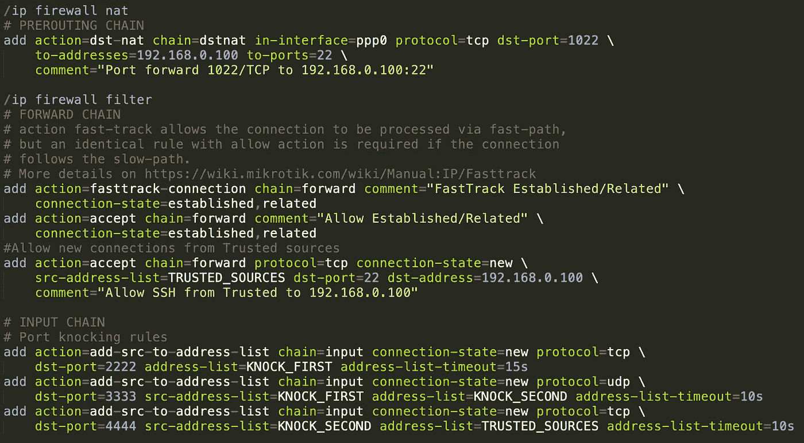
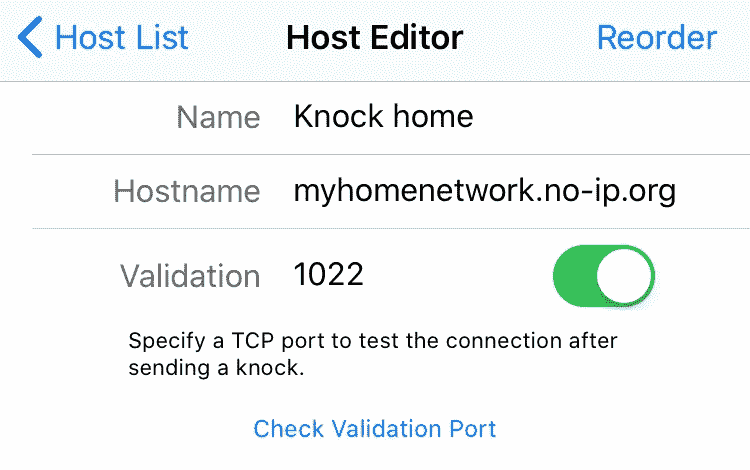
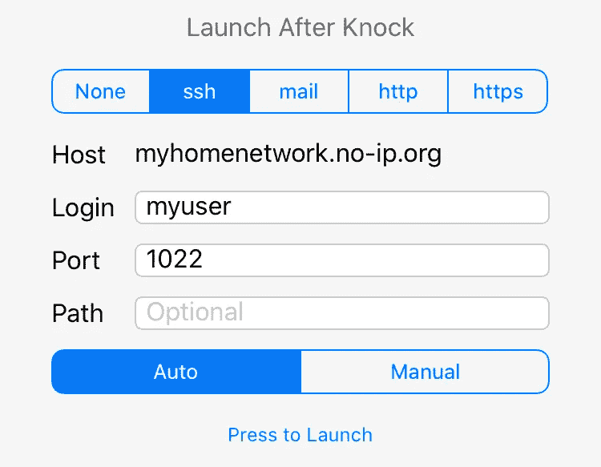
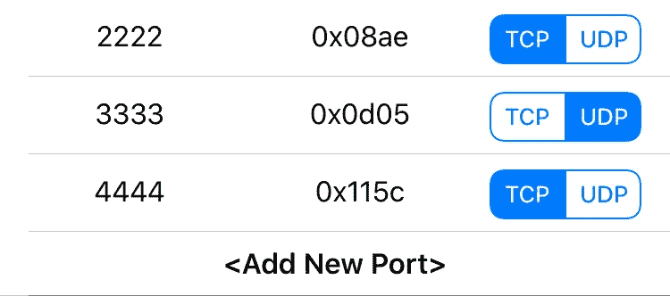

# 咚咚咚，能打开防火墙吗？(Linux 和 MikroTik 实际例子)

> 原文：<https://medium.com/nerd-for-tech/knock-knock-can-you-open-the-firewall-linux-mikrotik-practical-examples-6ee16742c988?source=collection_archive---------0----------------------->

## 简单的扫描器可以持续扫描公共网络的 IP 地址，而不会放弃从互联网访问您的家庭网络资源，如果没有暴露在这些扫描器下的服务，岂不是很神奇？

## 介绍

许多在家里有服务器或 NAS 的人需要通过他们家庭路由器上的所谓端口转发技术在互联网上发布一些服务。公开服务使它们可以被端口扫描器检测到，端口扫描器可以了解您的家庭网络中正在运行什么机器或服务器，它们运行什么版本的软件，以及哪些漏洞可能会影响它们。这种分析可能是想要渗透到您的内部网的恶意用户的第一步。

## linux knockd 守护进程解决方案

几年前，我的家用路由器是一台简单的低功率 alix-1c 微型计算机，我已经通过使用 [port knock server knockd](https://linux.die.net/man/1/knockd) 完成了不将服务暴露给端口扫描器的任务:正如链接的手册页所解释的那样，该服务监听网络接口上接收的每个数据包，并可以在接收到单个数据包或更有用的数据包序列时执行特定命令。如手册页上的示例所示，您可以告诉 knockd，当它在指定的时间内看到特定的数据包序列时，插入一个 *iptables* 规则，然后等待几秒钟，并在计时器到期时执行另一个命令。

让我们假设**您有一个 IP 地址为 192.168.0.100 的服务器，正在侦听端口 22/TCP 上的 ssh 连接，您希望在公共网络**上的端口 1022/TCP 上公开该连接，但只有在路由器看到 15 秒时间帧内收到的一系列数据包(如 2222/TCP、3333/UDP、4444/TCP)时，才会使用**。**

为了完成我上面所说的，我将配置一个永久的端口转发规则，即**将在 linux 路由器**的*面向互联网的*接口**上接收的目的端口为 1022/TCP** **的数据包，如 ppp0，转换为目的端口为 22/TCP 和目的 IP 地址为 192.168.0.100** 的数据包。这是在 iptables 的 *NAT* 表的*预路由*链中完成的。然后，我将跳转到一个特殊的 *KNOCKD_FWD_RULES* (我将它命名为 FWD_RULES，因为我也可以有一个特殊的链用于 *KNOCKD_INPUT_RULES* ，用于与去往 linux 路由器的流量相关的规则)链，就在允许*建立的规则之后，在*过滤器*表的*转发*链中相关的*流量(已经被授权)并配置 *knockd*

## Linux 实现示例

Iptables 配置(它必须适应您的配置，这里我考虑一个新的防火墙，在链上有一个丢弃策略，即丢弃所有没有明确允许的内容):

基本 Iptables 设置

Knockd 配置:

Knockd Linux 守护进程配置

**注意:**我们只为 TCP SYN 数据包开门，因为来自外部的后续数据包将与允许数据包属于相关或已建立连接的第一转发规则相匹配。

现在，当您在家庭网络之外需要连接到家庭服务器时，您可以执行以下操作:

1.  使用 myhomenetwork.no-ip.org 之类的 FQDN，将这三个神奇的数据包发送到您家庭路由器的公共 IP 地址(例如，您可以在无 IP 地址上免费注册 3 个 IP 地址)
2.  在发送神奇的数据包序列后的 10 秒钟内建立 SSH 连接

因此，让我们尝试从一个存在于互联网上的带有 IP x.x.x.x 的客户端进行连接

```
ssh -p 1022 myhomenetwork.no-ip.org
[**timeout** - firewall closed]# Send the magic sequence of packets from client x.x.x.x
**nmap -Pn -sS -p 2222 myhomenetwork.no-ip.org
nmap -Pn -sU -p 3333 myhomenetwork.no-ip.org
nmap -Pn -sS -p 4444 myhomenetwork.no-ip.org**
[**firewall opens the door**, new connections allowed from x.x.x.x]
sleep 2sssh -p 1022 myhomenetwork.no-ip.org
[**connection established**]
[**firewall closes the door**, no NEW connections are allowed from x.x.x.x]
[**established connection from x.x.x.x keeps going on**]
```

我发现这种方法的美妙之处在于:

*   您的防火墙只对您的客户端公共 ip 地址开放，并且只开放 10 秒钟，因此该服务只对生成神奇数据包序列的 IP 地址开放。
*   该服务在 10 秒钟后停止公开，如果您在这一小段时间内建立了连接，在从 *KNOCKD_FWD_RULES* 中删除特殊规则后，它不会停止，因为您的流量在 *FORWARD* 链的开始处匹配 *established connections 的* accept 规则。这意味着，如果你的客户端与数十个其他客户端连接在一个公共 IP 地址上，你的服务将只对同一公共地址后面的其他客户端开放 10 秒钟，然后它将“消失”。

正如您在我上面链接的 knockd 手册页上看到的，您可以实现更复杂的行为，例如，通过使用一个包含可用于触发 knockd 事件的序列列表的文件，每次使用序列时，它都会失效，以避免有人在嗅探您的客户端连接的网络并理解您使用的*神奇序列*时受到回复攻击。

## 敲 MikroTik 的门

3 年前，我在我的家庭网络中从 Linux 路由器转移到 MikroTik HAP 路由器，我想通过使用 *RouterOS* 提供的工具实现一种 knockd。我们没有针对 RouterOS 的 knockd 实现，但是我们可以使用动态*地址列表*来实现上一节的示例，这是一种对 IP 地址进行分组的有用方法，可以用作防火墙规则中的匹配条件，并且允许您添加带有到期时间的 IP 地址。

我们可以做以下事情:

1.  检查 ppp0 接口上是否接收到目的端口为 2222/TCP 且 SYN 标志为 on 的数据包，并将源 IP 地址添加到 *KNOCK_FIRST* 地址列表中，过期时间为 15 秒。
2.  检查是否通过 KNOCK_FIRST 地址列表中的 IP 地址在 ppp0 接口上接收到目的端口为 3333/UDP 的数据包，并将源 IP 地址添加到 *KNOCK_SECOND* 地址列表，过期时间为 10 秒(我减少了超时时间，因为完成*魔术序列*需要更少的数据包)。
3.  检查 ppp0 接口上的 KNOCK_SECOND 地址列表中的 IP 地址是否接收到目标端口为 4444/TCP 且 SYN 标志为 on 的数据包，并将源 IP 地址添加到 TRUSTED_SOURCES 地址列表中，过期时间为 10 秒，这是客户端必须开始连接临时公开服务的时间范围。
4.  实现一个转发规则，允许从 TRUSTED_SOURCES 到 IP 192.168.0.100 的端口 22/TCP 上的 intranet 服务的新会话(我们仍然允许已建立的/相关的会话继续进行，而不检查源)。

## MikroTik 实现示例

这是 MikroTik 的实现:

RouterOS 配置

在这里，您可以看到以更易读的语法高亮格式显示的配置(我使用的是带有 MikroTik 语法高亮显示的 Sublime-Text):



RouterOS 配置

您可以使用以下命令监控地址列表中公共 IP 地址的插入:

```
[admin@MikroTik] > /ip firewall address-list print 
Flags: X - disabled, D - dynamic 
# LIST              ADDRESS CREATION-TIME TIMEOUT 
0 D KNOCK_FIRST     x.x.x.x jun/15/2020   15:17:30 12s 
1 D KNOCK_SECOND    x.x.x.x jun/15/2020   15:17:30 8s 
2 D TRUSTED_SOURCES x.x.x.x jun/15/2020   15:17:30 9s
```

## 从移动客户端敲门

在前面的章节中，我已经向您展示了如何使用 nmap 从计算机敲门，但是如果您需要通过智能手机或平板电脑连接到您的家庭服务器呢？您可以很容易地找到端口敲门应用程序，如 iOS 上的 Port Knock，它允许您指定要发送的 TCP/UDP 数据包的序列，发送神奇序列后要探测的端口，甚至允许您通过 SSH 等协议建立连接(我更喜欢使用专用客户端，如 iOS 上的 Prompt)。也许我们使用的 10 秒超时太短了，如果你计划通过移动设备使用不同的应用程序进行端口敲门和 SSH 连接，我认为你可以安全地将它增加到 20-30 秒。

下面是一个端口敲门 iOS 应用程序配置的例子，它敲门到端口 2222/TCP、3333/UDP、4444/TCP 上的 myhomenetwork.no-ip.org，然后探测端口 1022/TCP 以检查它是否打开，为您提供关于您的家庭路由器接收神奇序列的即时反馈(它还在敲门后使用用户 *myuser* 启动到端口 1022 的 SSH 连接，但是如果您想使用其他客户端进行 SSH 连接，可以省略这一步)



IOS 端口敲门

## 结论

我希望这篇文章对那些想让自己的家庭网络少受互联网威胁的人有用。同样，您可以在将 MikroTik 云路由器应用到您的网络中之前，或者在说服自己购买他们令人惊叹的路由器之前，尝试一下我在 EVE-NG 上展示的配置。

*原载于 2020 年 6 月 15 日 http://networkingpills.wordpress.com*[](https://networkingpills.wordpress.com/2020/06/15/knock-knock-can-you-open-the-firewall-mikrotik-practical-example/)**。**