# 了解 Inception v2 和 v3；使用 Pytorch 实现

> 原文：<https://medium.com/nerd-for-tech/know-about-inception-v2-and-v3-implementation-using-pytorch-b1d96b2c1aa5?source=collection_archive---------3----------------------->

嗨伙计们！在这个博客中，我将分享我的知识，在阅读了[这篇研究论文](https://arxiv.org/pdf/1512.00567v3.pdf)之后，它是关于什么的！在我开始之前，我想让你知道我没有去广泛地学习。这只是理解的手段

*   这篇研究论文是关于什么的？
*   与之前最先进的型号有何不同？
*   与旧方法(以前的方法)相比，这种新方法的结果如何？

所以。所有这些都写在这里作为重点。

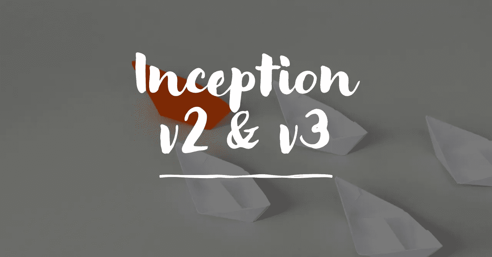

> Inception v2 是 Inception 的扩展，使用了**分解非对称卷积**和**标签平滑** g
> 
> 从不同的 Inception v2 模型中选择 Inception v3(Inception v2+BN-Auxiliary)作为最佳实验结果。

# 摘要

*   虽然增加的模型大小和计算成本往往会转化为大多数任务的即时质量增益，但**计算效率和低参数计数仍然是各种用例的使能因素。**
*   在这里，他们探索了一种扩大网络规模的方法，目的是通过适当的**分解卷积**和**积极正则化**尽可能有效地利用增加的计算

# 分解具有大滤波器尺寸的卷积

*   由于初始网络是完全卷积的，每个权重对应于每次激活的一次乘法。因此，**计算成本的任何减少都会导致参数数量的减少**。
*   就计算而言，具有较大空间滤波器(例如 5 × 5 或 7 × 7)的卷积往往非常昂贵。

> 比如说；根据研究论文，

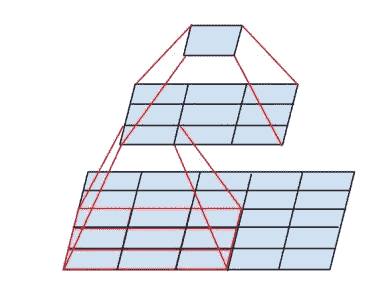

用 3x3 conv 和 1x1 conv 取代 5x5 conv 的小型网络

> 在具有 m 个滤波器的网格上，与具有相同数量滤波器的 3 × 3 卷积相比，具有 n 个滤波器的 5 × 5 卷积的计算开销要高 25/9 = 2.78 倍。当然，一个 5×5 的过滤器可以捕捉早期层中更远的单元的激活之间的信号依赖性，因此**过滤器几何尺寸的减小是以表现力的巨大成本为代价的**。然而，**我们可以问，在输入大小和输出深度相同的情况下，5 × 5 卷积是否可以用参数更少的多层网络来代替**。在给出的左图中，如果我们放大 5 × 5 卷积的计算图，我们会看到每个输出看起来像一个小的全连接网络，在其输入上滑动 5×5 块。

*   用两层代替 5 × 5 层，分两步达到这种扩展似乎是合理的:在两步中以√α增加滤波器的数量。
*   最终，计算量净减少(9+9)/25 倍，通过这种因式分解，相对增益为 28%。

## 但这提出了两个问题:

Q1——这种替换会导致表现力的丧失吗？

Q2——如果我们的主要目标是分解计算的线性部分，是否建议在第一层保持线性激活？

Ans-我们已经运行了几个控制实验(例如参见图 1)

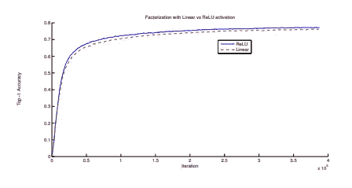

图一。

在因式分解的所有阶段使用**线性激活总是不如使用整流线性单元**。

他们将这种收益归因于网络可以学习的变化空间的增加，特别是如果我们批量标准化输出激活。**当对降维组件使用线性激活时，可以看到类似的效果。**

# 空间分解成非对称卷积

*   我们可以问这样一个问题，是否应该将它们分解成更小的，例如 2×2 卷积。然而，事实证明，通过使用非对称卷积的**，例如 n × 1** ，可以做得比 2 × 2 更好。

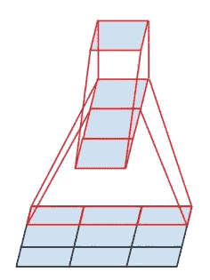

图 3:替代 3 × 3 卷积的微型网络。该网络的下层由具有 3 个输出单元的 3 × 1 卷积组成

> 例如(根据研究论文),使用 3 × 1 卷积后再使用 1 × 3 卷积，相当于滑动一个具有与 3 × 3 卷积相同感受野的两层网络(见图 3)
> 
> 然而**如果输入和输出滤波器的数量相等，对于相同数量的输出滤波器**，双层解决方案要便宜 33%。**相比之下，将一个 3 × 3 卷积分解为两个 2 × 2 卷积仅节省 11%的计算量。**

*   可以用一个 1 × n 卷积后接一个 n × 1 卷积来代替任何 n × n 卷积，随着 n 的增加，计算成本的节省会显著增加(见下图 6)。

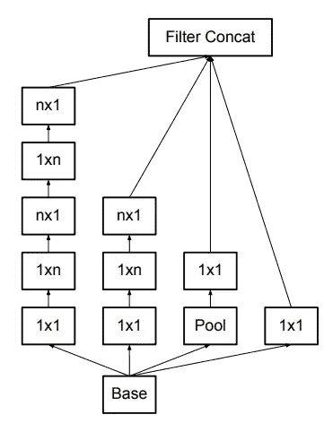

图 6:分解 n × n 卷积后的初始模块。

# 辅助分类器的效用

他们发现

*   **辅助分类器在训练早期没有改善收敛**:在两个模型达到高精度之前，具有和不具有侧头的网络的训练进程看起来几乎相同。
*   **在训练接近结束时，具有辅助分支的网络开始超过没有任何辅助分支的网络的精度，并达到稍高的平稳状态。**

辅助分类器充当**正则化器**。这是由以下事实支持的:如果侧分支是批量标准化的或者具有丢弃层，则网络的主分类器执行得更好。

# 有效的网格尺寸缩减

*   为了避免代表性瓶颈，在应用最大或平均池之前，网络过滤器的激活维度被扩展。
*   我们可以使用两个并行的 stride 2 模块:P 和 c。P 是池化层(平均池化或最大池化)激活，它们都是 stride 2，其滤波器组如图 5 所示连接。

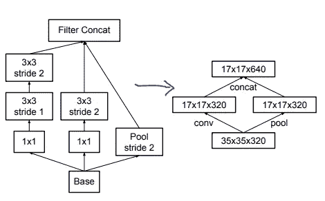

图 10

# 盗梦空间-第二版

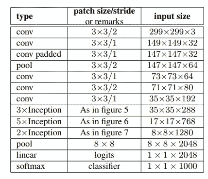

表 1:Inception-v2 的架构

*   将传统的 7 × 7 卷积分解为三个 3 × 3 卷积。
*   对于网络的初始部分，我们有 3 个 35×35 的传统初始模块，每个模块有 288 个滤波器。使用网格缩减技术，这被缩减为具有 768 个滤波器的 17 × 17 网格。

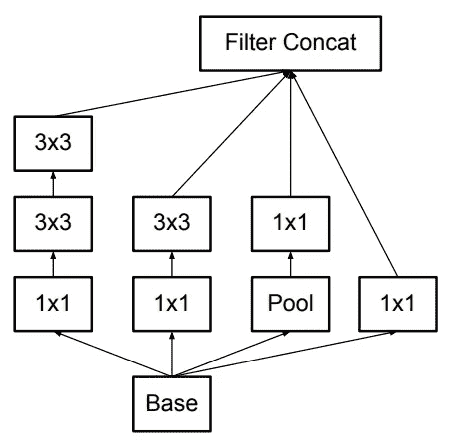

图 5:(3x 异常)在表 1 中

*   接下来是 5 个分解的初始模块的实例，如图 5 所示。

图 6:(5x inception)——已经在上面了。在“空间分解成非对称卷积”一节中。

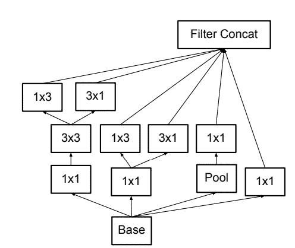

图 7: (2xInception)在表 1 中

*   通过图 10 所示的网格缩减技术(在“有效的网格尺寸缩减”一节中),网格缩减为 8 × 8 × 1280。

*   在最粗略的 8 × 8 级别，我们有两个初始模块，如图 6 所示，每个瓦片的级联输出滤波器组大小为 2048。

这个网络有 42 层，计算成本仅比 GoogLeNet 高 2.5 倍，但仍然比 VGGNet 更有效。

# 基于标签平滑的模型正则化

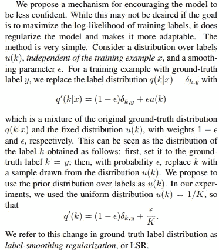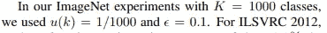

# 培训方法

*   随机梯度利用 TensorFlow 分布式机器学习系统，使用 50 个副本，每个副本在 NVidia Kepler GPU 上运行
*   批量=32
*   纪元=100
*   0.9 衰减和 1.0 噪声的 RMSProp
*   学习率为 0.045，使用 0.94 的指数率每两个时期衰减一次。此外，发现阈值为 2.0 的梯度削波有助于稳定训练。

# 实验结果和比较

*   表 3 显示了关于我们提出的架构(Inceptionv2)的识别性能的实验结果

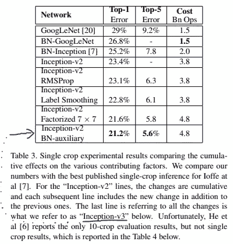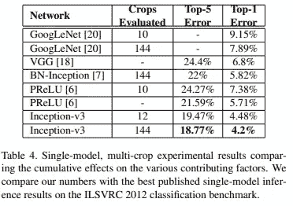

**BN-auxiliary** 指的是辅助分类器的全连接层也被批量规格化的版本，而不仅仅是卷积。

# 从头开始完成代码

这就是本文研究的全部重点。希望你明白了。

感谢您的阅读，祝您有美好的一天！:D

这里是我的 [LinkedIn 简介](http://linkedin.com/in/sahil-40a621168)。