# 知道这 10 个勤杂工应用程序如何在南非引起轰动吗

> 原文：<https://medium.com/nerd-for-tech/know-how-these-10-handyman-apps-have-created-a-stir-in-south-africa-4b206672b358?source=collection_archive---------7----------------------->

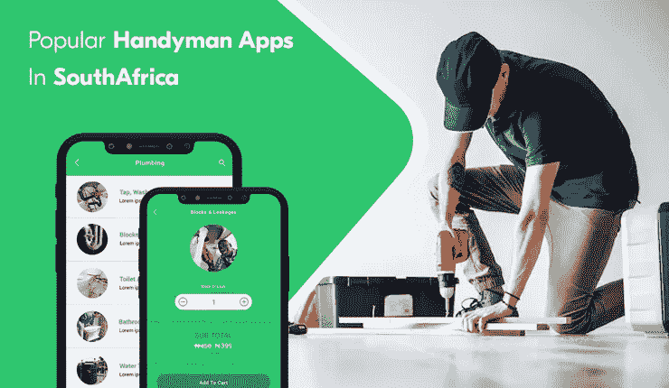

杂工应用

你打算在南非开展一项杂工业务吗？什么事？那你来对地方了。你会惊讶地发现，对于一个典型的勤杂工来说，每小时的收入超过 100 美元。因此，如果你开展一项业务，使生活在那里的人们能够方便地获得这些服务，你就可以赚取很高比例的利润。此外，你可以保证在你的应用程序中注册的勤杂工将通过他们提供的服务获得足够的收入。

然而，这篇文章并不打算为在那里创业提供一个议程。相反，我们列出了已经在南非次大陆流行的十个应用程序。这是因为它是罚款有一个指南，将概述创造奇迹的步骤。然而，如果你面前有一个解决方案的列表，它将成为鼓励新创业公司理解这些解决方案是如何取得成功的，以及它们的包含是否会让他们获得成功的源泉！

因此，让我们开始这篇文章。我相信在阅读它之后，你将能够独立开发 handyman 应用程序，以确保客户在需要时获得快速帮助。

# 南非 10 大流行勤杂工应用

## 任务应用程序

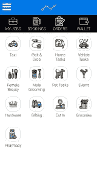

上图描绘了通过任务应用程序向客户提供的不同服务。这包括乘坐出租车、送餐、提供快速家庭帮助的杂工服务，如修理电器、让门把手正常工作等等。

通过极其简单的操作，客户可以在需要时轻松获得快速帮助。

## 向前固定

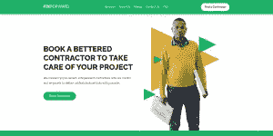

Fix Forward 是一个按需打杂服务应用程序，允许居住在南非的客户获得管道、防水、焊接等服务。，都在一个地方。

顾客所要做的就是在服务上点击一下，然后添加他们的位置。通过这样做，他们将获得附近的服务提供商列表，从中选择符合其要求的服务提供商。因此，总的来说，它易于操作，便于客户在必要时获得快速上门服务。

## 勤杂工直接

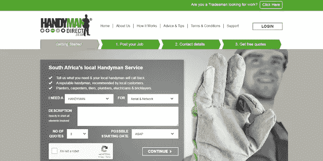

Handyman Direct 解决方案为客户提供了木匠、瓦工、电工等服务。，并确保这些任务的执行没有任何挑战。

由于拥有下列特征，它在南非非常受欢迎。

*   在一个地方提供 21 种服务
*   多种付款方式
*   应用内通话和聊天

## 去找托德

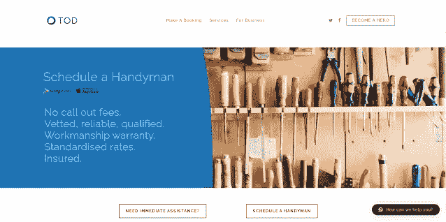

解决方案应该是当你着手开发一个勤杂工应用程序时，提到的一个是 get TOD。该应用程序提供了将客户与合格的勤杂工联系起来的承诺，操作非常简单。

它只需要客户进入应用程序，添加他们的位置信息，从一系列服务中选择他们需要的服务，然后获得附近服务提供商的列表。从那里，客户可以选择符合他们要求的服务提供商，然后预订他们的服务。

所以，你看，总的来说，这是一个非常容易操作的解决方案，让生活在南非的客户能够接触到勤杂工，他们可以帮助他们提供服务，如管道，修理电气设备等。

## 扫南连接

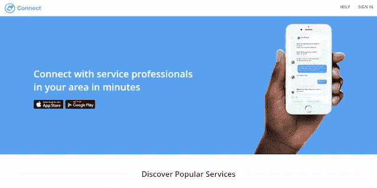

致力于将居住在南非的客户与水管工、电工等专业服务提供商联系起来。只需点击应用程序上的几个按钮，Sweep South Connect 就是一款受欢迎的按需家庭服务应用程序。

它具有以下特性，这些特性是其受欢迎和整体操作简单的主要原因。

*   预订管理
*   联系附近的一个勤杂工
*   预订的勤杂工服务的实时通知

## 批发商

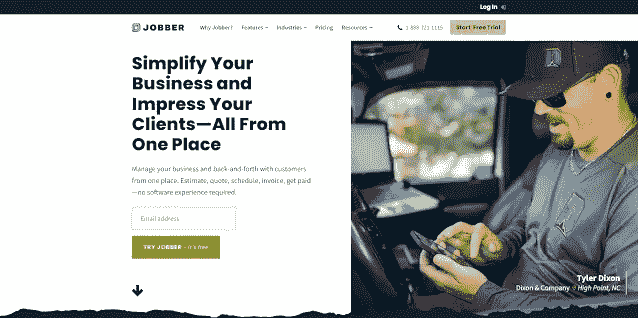

Jobber 应用程序是南非一款流行的家庭服务应用程序，尤其允许家庭服务企业以最简单的方式开展业务。

拥有发票、报告、分析等功能。特别是勤杂工行业，可以非常轻松地灵活执行不同的任务。

## 同步团队

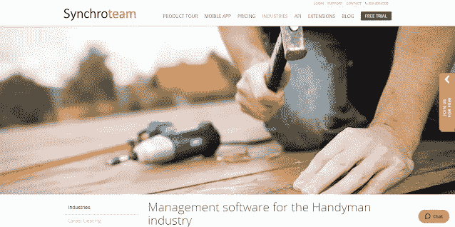

南非勤杂工的现场管理软件，它帮助企业管理他们的业务和执行不同的任务，如运营管理、客户管理和勤杂工管理，此外还帮助了解他们的日常收入。

Synchroteam 拥有以下特性，是您需要了解的另一个解决方案，尤其是当您踏上旅程，为您在南非次大陆的家庭服务企业准备一个[优步杂工应用程序](https://www.peppyocean.com/uber-clone-app/)时。它们包括报告和分析、应用内聊天等。，不一而足。

## 踢球者

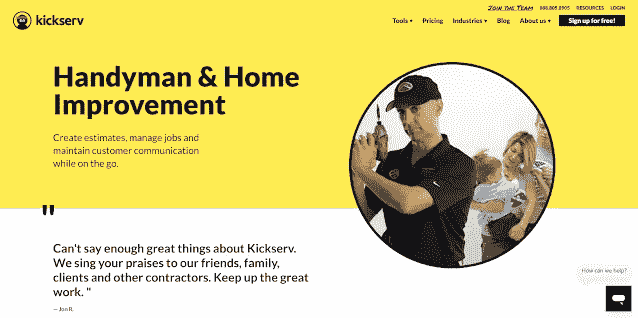

在南非流行的家庭服务软件为那里的企业提供了最大限度清晰地管理他们与客户的通信的灵活性。它还支持企业检查通过他们的解决方案执行的日常任务等等。

这是因为存在如下所列的功能

安排工作
客户管理
共享发票

## 服务巨头

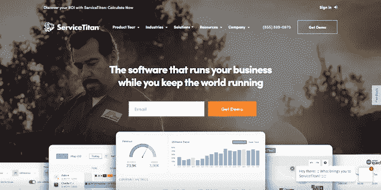

服务巨头支持南非的勤杂工业务，并提供所需的援助来经营他们的企业。具有报告和分析、维护协议等功能。-商业运作是小菜一碟！

因此，如果你在南非，并计划开发一个勤杂工应用程序来提高你的家庭服务企业的知名度，你应该知道这个解决方案。

## 服务融合

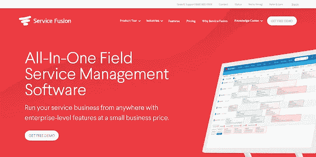

最后，在我们列出的南非十大最受欢迎的优步打杂应用中，服务融合榜上有名。它为家庭服务企业执行不同的业务操作提供了便利。

包括客户管理、创建工作评估等功能，业务管理任务变得轻而易举。

所有这些流行的应用程序和软件都帮助南非的家庭服务行业变得有利可图。

因此，如果你正在考虑在那里开办一家企业，让客户与电工、水管工、机械师等建立联系。，附近，并执行业务范围内的杂工业务轻松，现在是时候了。

# 如何执行按需家庭服务应用程序开发以在南非推出 Handyman 应用程序？

1.  确定包含哪些功能可以让用户方便地访问家庭服务。
2.  进行研究，了解你的竞争对手在做什么，并找出他们的家庭服务解决方案中缺少的元素。
3.  研究南非家庭服务业务的当前市场，并评估人口统计数据，以了解用户在使用应用联系电工、水管工等时如何与应用进行交互。在他们附近。

除了强调这些方面，把项目外包给一个[杂工 app 开发公司](https://www.peppyocean.com/handyman-app-development/)。
原因如下。

# 外包应用程序开发与杂工应用程序开发公司的相关性

从头开始构建一个应用程序无疑是一件非常耗时的事情。最终也会消耗大量的财政。所以，联系一家离岸的杂工 app 开发公司，才是最好的出路。他们将让您接触到一个开发人员和设计人员团队，他们将共同努力构建一个为您创造价值的解决方案。

如前所述，从头构建一个应用程序需要耗费时间和金钱。因此，为了确保您节省时间和资金，请与全球各地的企业联系。他们将为你提供一个现成的解决方案——勤杂工优步应用程序。作为一个可定制的解决方案，您可以根据未来的业务需求轻松修改解决方案。这将确保在南非推出时，你能留住最大数量的客户。

# 包扎

南非有一个蓬勃发展的勤杂工商业潜力，目前勤杂工执行的任务，如电工和机械师，每小时可以赚 100 多美元。因此，很明显，当你开发一个勤杂工应用程序时，你将成为有利可图的家庭服务业务的一部分，使生活在那里的人们能够以一种简化的方式轻松获得这些不同类型的支持。所以，不要再等了。与杂工应用程序开发公司联系，获得所需的帮助来为你构建这个应用程序，这样你就可以为未来做好准备，并从第一天开始赚取巨额利润！