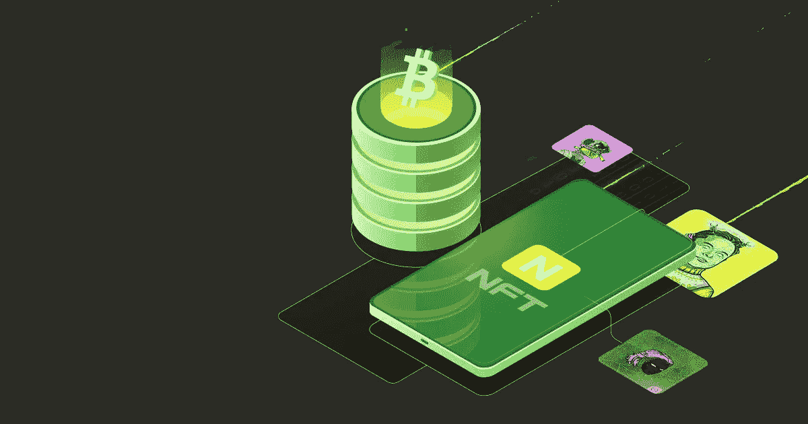

# 在推出像 Nifty Gateway 这样的 NFT 市场之前，请了解这一点！

> 原文：<https://medium.com/nerd-for-tech/know-this-before-launching-an-nft-marketplace-like-nifty-gateway-caf637399047?source=collection_archive---------4----------------------->

像漂亮门户一样的 NFT 市场

自从不可替代代币(NFT)出现后，数字艺术家开始涉足区块链世界，这个领域得到了巨大的推动。这种对技术的适应率导致了 2021 年的 NFT 高潮。然而，主要归功于 NFT 市场促进交易，其中一些平台甚至在繁荣之前就已经存在。**[**Nifty Gateway**](https://niftygateway.com/)是 NFT 市场的一个主要例子，早在 NFT 繁荣之前就已经开始运营(自 2018 年以来)。它专门出售经过验证的数字艺术品，甚至出售过 NFT 著名艺术家的作品，包括 **Beeple 和 Pak** 。鉴于数字艺术收藏家社区的强大存在，在 NFT 世界运营 Nifty Gateway 这样一个基于利基市场的独家 NFT 市场可能是一个巨大的商机。在这篇博客中，我们将简要介绍如何像 Nifty Gateway 一样推出一个[**NFT 市场。**](https://bit.ly/3Nr7OXK)**

# **拥有像 Nifty Gateway 这样的 NFT 市场的好处**

****✔** NFT 收藏品(Nifty Gateway 中的**“nifties】)可以通过平台随时(24 x 7)交易。****

****✔** 由于严格的了解你的客户(KYC)和反洗钱(AML)审查程序，只有经过认证的艺术家和收藏家才能到场。**

**✔在 Nifty Gateway 这样的平台上出现了一个自动汽油费选择器，为创作者和艺术家节省了资金。**

****✔** 冷热钱包在 Nifty Gateway 这样的市场平台上链接在一起，以便在门户网站上轻松处理点对点(P2P)交易和各种费用。**

# **像 Nifty Gateway 这样的 NFT 市场的主要特征**

**搜索引擎— 我们可以在 NFT 市场找到一个扩展的搜索引擎，比如 Nifty Gateway，它可以帮助用户毫不费力地搜索他们喜欢的创作者。用户还可以根据自己的喜好选择过滤选项。**

**L **列表门户—** 在 Nifty Gateway 等 NFT 市场的列表门户中，我们可以查看 NFT 商品的实时数据。显示的数据包括 NFT 物品的令牌 ID、创建者姓名、价格和 NFT 物品的图片。**

**C **饱和水滴—** 使用这个选项，创作者可以在 Nifty Gateway 这样的 NFT 市场直接向粉丝出售他们的 NFT。订户或投资者可以收到 NFT 项目的更新，包括发布日期、初始价格和早期投标的机会。**

**V 这些项目符合智能合同标准。感兴趣的买家可以验证他们的帐户，并在查看 NFT 产品的详细信息后出价。**

# **建立像 Nifty Gateway 这样的 NFT 市场的步骤**

**✔找到你的业务的目标利基**

**✔分配用户角色并定义它们(对于市场—买方、卖方和管理员)**

**✔创建项目文档并制定白皮书**

**✔为平台进行前端和后端开发**

**✔为您的平台创建智能合约令牌生成器**

**✔测试、部署和启动平台**

**值得注意的是，对于像 Nifty Gateway 这样的市场解决方案的发布，关于开发的步骤是不相关的，它们可以根据您的需求通过定制现有的草案来代替。**

# **最后的想法**

**因此，我们可以说，由于新创造者进入 NFT 世界，像 Nifty Gateway 这样基于利基型 NFT 市场的创业可以获得成功。此外，NFT 将永远存在，这使得 NFT 市场的商业模式从长远来看是成功的。如果你计划开发一个像 Nifty Gateway 这样的 [**NFT 市场，有几家公司可以帮你创建这个平台，因为他们在这个过程中有专业知识。**](https://bit.ly/3vbcniw)**