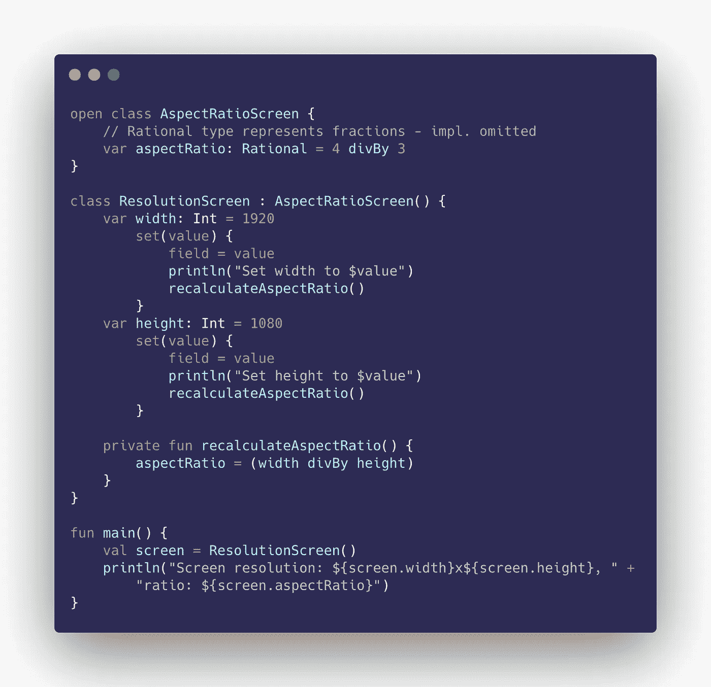

# 了解这个 Kotlin 陷阱可以让你远离 bug

> 原文：<https://medium.com/nerd-for-tech/knowing-this-kotlin-pitfall-may-save-you-from-bugs-b9744060c7ad?source=collection_archive---------1----------------------->

Kotlin 是一种令人敬畏的语言，但它的“语法糖”有时会令人困惑。虽然在文档中提到了这个特殊的东西，但是它很容易被忽略。让我们从一个例子开始:



我们有一个带有一个属性的类`AspectRatioScreen`，默认为老好人`4:3`。然后我们有`ResolutionScreen`和`width`属性的`height`。它们的设置器会自动更新纵横比。

在 main 中，我们创建一个`ResolutionScreen`对象并打印其参数。默认情况下，分辨率设置为与`16:9`纵横比相对应的`1920x1080`。但是程序输出是:

```
Screen resolution: 1920x1080, ratio: 4/3
```

纵横比与分辨率不匹配。为什么？科特林文件中写道:

> 如果定义了自定义 setter，则每次为属性赋值时都会调用它，初始化除外。

这意味着设置`width`和`height`的初始尺寸不会调用它们的设置器。解决这个问题的一个方法是在`ResolutionScreen`类中添加一个`init`块:

```
**class** ResolutionScreen : AspectRatioScreen() {
    **var width** = 1920
        **// ...**
    **var height** = 1080
        **// ...**

    **init** {
        **width** = 1920
        **height** = 1080
    }
}
```

这将重新分配默认值和调用设置器。现在显示的结果是正确的:

```
Set width to 1920
Set height to 1080
Screen resolution: 1920x1080, ratio: 16/9
```

这种解决方案有一个缺点:您必须声明默认值两次，因为属性不能没有初始值设定项。一种解决方法是定义常量:`private const val DEFAULT_WIDTH = 1920`并在两个地方使用它们。

最简单的解决方案是在`init`块中直接调用`reacalculateAspectRatio()`:

```
**class** ResolutionScreen : AspectRatioScreen() {
    **var width** = 1920
        **// ...**
    **var height** = 1080
        **// ...**

    **init** {
        recalculateAspectRatio()
    }
}
```

对于这种特殊情况，这是最明确的解决方案。还有另一种方法，当只有一个属性时看起来更好，我们希望初始化它的*后台属性*:

```
**class** Duration {
    **var durationInSeconds**: Int = 1
}**class** EnhancedDuration : Duration() {
    **var durationInHours** = 1.**also** { durationInSeconds = 3600 * **it** }
        **// ...**
}
```

这种语法有一个优点——我们在初始化原始属性的相同位置初始化支持属性(本例中为`durationInSeconds`)。

在我们的例子中，它看起来像这样:

```
**class** ResolutionScreen : AspectRatioScreen() {
    **var width** = 1920
        **set**(value) {
            **field** = value
            recalculateAspectRatio()
        }
    **var height** = 1080.***also*****{ aspectRatio** = width divBy **it** **}
        set**(value) {
            **field** = value
            recalculateAspectRatio()
        }

    **// ...**
}
```

`also`块只存在于`height`初始化器中，因为初始化是从上到下进行的——在初始化之前，我们不能使用`width`或`height`。即使在`also`块中，`height`也不能使用，因为它还没有被初始化。这就是为什么在两个或更多属性以某种方式相关的情况下，最好使用`init`块。

就这些了，编码快乐！

[](https://kotlinlang.org/docs/properties.html#getters-and-setters) [## 属性| Kotlin

### Kotlin 类中的属性既可以用 var 关键字声明为可变的，也可以用 val…

kotlinlang.org](https://kotlinlang.org/docs/properties.html#getters-and-setters)