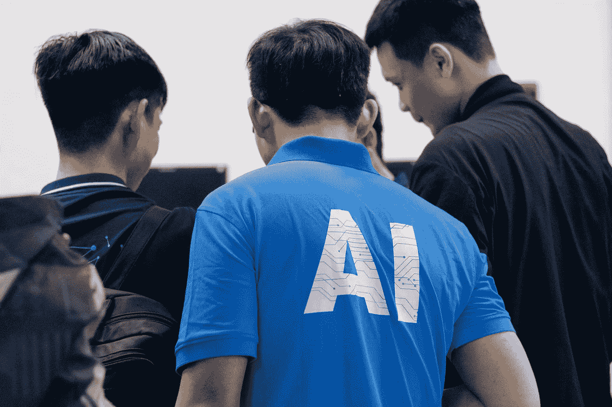

# Python OpenCV 的知识体系

> 原文：<https://medium.com/nerd-for-tech/knowledge-system-of-python-opencv-8cd6dbaf1402?source=collection_archive---------15----------------------->

本文的目的是给大家详细列出 Python OpenCV 的学习路线和重要知识点。核心分为 24 个小块，全部掌握。

Nguyen Dang Hoang Nhu 在 [Unsplash](https://unsplash.com/s/photos/artificial-intelligence?utm_source=unsplash&utm_medium=referral&utm_content=creditCopyText) 上拍摄的照片

## OpenCV 第一次理解和安装

这部分你需要了解 OpenCV(开源计算机视觉库)的相关介绍。OpenCV 可以在多种平台上运行。它是轻量级和高效的。它由一系列 C 函数和少量 C++类组成。它提供了 Python，Ruby，MATLAB 等。语言接口，所以你学习的时候要注意参考资料的语言实现相关问题。

除了现阶段安装 OpenCV 相关库，建议通过官网、官方手册、官方入门教程。这些是最好的学习材料。

模块安装完成后，需要重点测试 OpenCV 是否安装成功，可以通过 Python 查询已安装的版本。

## OpenCV 模块介绍

首先，从全局角度把握 OpenCV 由哪些模块组成。比如以下模块，你需要找到以下模块的应用场景和介绍。

**core，imgproc，highgui，calib3d，features2d，contrib，flann，gpu，legacy，ml，objdetect，photo，stitching**

整理各模块的核心函数，完成第一个 OpenCV 案例，读取显示图片。

## OpenCV 图像读取、显示、保存

安装 OpenCV 后，从图像采集开始学习，包括图片的本地加载、图片的相机采集、视频采集、图像创建。

只有在获取图像后，才能对图像进行操作、处理、信息提取、输出、**图像显示**和**图像保存**。

对于一个图像，在 OpenCV 中读取和显示的步骤如下，你可以对应它的代码。

*   图像阅读；
*   窗口创建；
*   图像显示；
*   图像保存；
*   资源释放；

涉及的函数要学习 *cv2.imread()、cv2.namedWindow()、cv2.imwrite()、cv2.imwrite()、cv2.destroyWindow()、cv2.destroyAllWindows()、cv2.imshow()、cv2.cvtColor()、cv2 . im write()、cv2.waitKey()。*

## 相机和视频读取和保存

首先要重点学习 **VideoCapture** 类，常见的方法有:

*   open()函数；
*   isOpened()函数；
*   release()函数；
*   grab()函数；
*   retrieve()函数；
*   get()函数；
*   set()函数；

除了阅读视频，你还需要掌握 Opencv 提供的保存视频文件的 **VideoWriter** 类。

学习完相关知识后，可以进行这样一个实验，将一段视频逐帧保存为图片。

## OpenCV 常用的数据结构和颜色空间

这部分类已经掌握了**点**类、**矩形**类、**大小**类、**标量**类，另外，在 Python 中使用 **NumPy** 图像操作、 **NumPy** 的相关知识，建议提前学习，越好。

OpenCV 中常用的颜色空间包括 BGR 颜色空间、HSV/HLS 颜色空间和 Lab 颜色空间。所有这些都需要理解，首先应该掌握 BGR 色彩空间。

## OpenCV 常用绘图函数

掌握以下函数的用法，就可以熟练地在 Opencv 中绘制图形。

*   cv2 . line()；
*   cv2 . circle()；
*   cv2 . rectangle()；
*   cv2 . ellipse()；
*   cv2 . fill poly()；
*   cv2 .折线()；
*   cv2 . puttext()；

## OpenCV 界面事件操作的鼠标和滑块

首先要掌握的函数是鼠标操作消息回调函数 **cv2.setMouseCallback()** 。滑块涉及两个函数，分别是: **cv2.createTrackbar()** 和 **cv2.getTrackbarPos()** 。

掌握以上内容后，可以实现两种情况。一种是用鼠标拖动一张图片上的帧选择区域进行截图，另一种是使用滑动条让视频以双倍速度播放。

## 图像像素、通道分离和合并

了解图像像素矩阵，熟悉图片的像素构成，可以访问指定像素的像素值并进行修改。

通道分离功能 **cv2.split()** ，通道合并功能 **cv2.merge()** 。

## 图像逻辑运算

为了掌握图像之间的计算，涉及的函数如下:

*   cv2 . add()；
*   cv2 . add weighted()；
*   cv2 . subtract()；
*   cv2 . ABS diff()；
*   cv2 . bitwise _ and()；
*   cv2 . bitwise _ not()；
*   cv2 . bitwise _ xor()；

还可以学习图像乘除法。

## 图像 ROI 和遮罩

这部分属于 OpenCV 中的关键知识。第一个是感兴趣区域 ROI，第二个是掩膜操作。在学习 ROI 部分的时候，也可以了解一下图像的暗副本和浅副本。

## 图像几何变换

图像几何变换仍然是基本函数的学习和理解，内容如下:

*   图像缩放 cv2 . resize()；
*   图片翻译 cv2 . warpaffine()；
*   图像旋转 cv2 . getrotationmatrix 2d()；
*   图像转置 cv2 . transpose()；
*   镜像 cv2 . flip()；
*   image remap cv2 . remap()；

## 滤像

了解什么是滤波，高频低频滤波，图像滤波功能。

线性滤波:箱式滤波、均值滤波、高斯滤波、
非线性滤波:中值滤波、双边滤波、

*   箱式过滤器 cv2 . box filter()；
*   均值滤波 cv2 . blur()；
*   高斯滤波 cv2。Gaussian blur()；
*   中值滤波 cv2 . medianblur()；
*   双边过滤器 cv2 . bilateral Filter()；

## 图像固定阈值和自适应阈值

图像阈值分割是图像处理的重要基础部分。它被广泛使用。可以根据灰度的差异分割图像的不同部分。通过阈值处理的图像通常是单通道图像(灰度)。核心必须掌握两个功能:

*   固定阈值:cv2 . threshold()；
*   自适应阈值:cv2.adaptiveThreshold()。

## 图像膨胀和腐蚀

膨胀和腐蚀是形态学操作，是基于图像形状的一系列图像处理操作。
膨胀和腐蚀基于高亮部分(白色)的操作。扩展是高亮部分的扩展，类似于“场扩展”。腐蚀是突出部分的腐蚀，类似于“领域被侵蚀。”

膨胀腐蚀的应用和作用；

*   消除噪音
*   拆分独立元素或连接相邻元素；
*   找到图像中明显的最大和最小区域；
*   求图像的渐变；

需要掌握的核心功能如下:

*   dilate cv2 . dilate()；
*   腐蚀 cv2 . erode()；

其他的形态学操作，**开运算，闭运算，高帽，黑帽，形态学渐变**都是在膨胀腐蚀的基础上通过 **cv2.morphologyEx()** 函数进行操作。

## 边缘检测

边缘检测可以提取图像的重要轮廓信息，减少图像内容，可用于图像分割和特征提取等操作。

边缘检测的一般步骤:

*   滤波:滤除噪声和检测边缘的影响；
*   增强:可以突出像素邻域的强度变化——梯度算子；
*   检测:阈值法确定边缘；

常见的边缘检测运算符:

*   Canny 算子，Canny 边缘检测函数 cv2。canny()；
*   索贝尔算子，索贝尔边缘检测函数 cv2。Sobel()；
*   Scharr 算子，Scharr 边缘检测函数 cv2。scahrr()；
*   拉普拉斯算子，拉普拉斯边缘检测函数 cv2。拉普拉斯()；

## 霍夫变换

霍夫变换(Hough Transform)是图像处理中的一种特征提取技术。该过程计算参数空间中累积结果的局部最大值，以获得符合特定形状的集合，作为霍夫变换的结果。

本部分要学习的功能:

*   标准霍夫变换，多尺度霍夫变换 cv2。HoughLines()；
*   累积概率霍夫变换 cv2。HoughLinesP()；
*   霍夫圆变换 cv2。HoughCricles()；

## 图像直方图计算和绘制

先掌握直方图概念，在掌握核心函数，最后通过 matplotlib 来绘制直方图模块。用于计算直方图的函数是 **cv2.calcHist()。**

直方图相关应用:

*   直方图均衡 cv2 . equalize hist()；
*   直方图比较 cv2 . compare hist()；
*   反投影 cv2.calcBackProject()。

## 模板匹配

模板匹配是一种寻找一幅图像与另一幅模板图像最匹配(相似)部分的技术。

内核使用的功能如下:

*   模板匹配 cv2 . match template()；
*   矩阵归一化 cv2 . normalize()；
*   求最大值 cv2.minMaxLoc()。

## 轮廓搜索和绘制

核心是理解在 OpenCV 中，寻找轮廓就像在黑色背景上寻找白色物体。

常用功能:

*   找到轮廓 cv2 . find contours()；
*   绘制轮廓 cv2.drawContours()。

最后，你应该掌握每个轮廓的操作。

## 概述特征属性和应用

这部分内容比较重要，知识点也比较多，核心内容和作用如下:

*   求凸包 cv2.convexHull()和凸性检测 cv2 . iscontourconvex()；
*   轮廓外接矩形 cv2 . bounding rect()；
*   轮廓 cv2.minAreaRect()的最小外接矩形；
*   轮廓的最小外接圆 cv2 . minenclosingcircle()；
*   轮廓椭圆拟合 cv2 . fit ellipse()；
*   近似多边形曲线 cv2 . approxpolydp()；
*   计算轮廓面积 cv2 . contour area()；
*   计算等高线长度 cv2 . arclength()；
*   计算点与轮廓的距离和位置关系 cv2 . pointpolygontest()；
*   形状匹配 cv2.matchShapes()。

## 改进的部分分水岭算法和图像修复

掌握分水岭算法的原理，掌握核心函数 **cv2.watershed()** 。

可扩展补充图像修复技术及相关功能 **cv2.inpaint()** ，学习后可以尝试人像祛斑应用。

## GrabCut & FloodFill 图像分割、角点检测

这部分内容需要一些图像的专业背景知识，先掌握相关概念的知识，重点学习相关功能。

*   GrabCut 算法 cv2 . grab cut()；
*   洪水填充算法 cv2 . flood fill()；
*   哈里斯角点检测 cv2 . corner Harris()；
*   Shi-Tomasi 角点检测 cv2 . goodfeaturestotrack()；
*   亚像素角点检测 cv2.cornerSubPix()。

## 特征检测和匹配

特征点的检测和匹配是计算机视觉中非常重要的技术之一，在物体识别、视觉跟踪和三维重建等领域有着广泛的应用。

OpenCV 提供了以下特征检测方法:

*   “快速”FastFeatureDetector
*   “星”号星特征探测器；
*   “SIFT”SIFT(非自由模块)Opencv3 移除，需要调用 xfeature2d 库；
*   “SURF”SURF(非自由模块)Opencv3 移除，需要调用 xfeature2d 库；
*   “ORB”ORB opencv 3 被移除，需要调用 xfeature2d 库；
*   “MSER”MSER；
*   “GFTT”号 GoodFeaturesToTrackDetector
*   “哈里斯”(带哈里斯探测器)；
*   “密集”密度特征探测器；
*   " SimpleBlob" SimpleBlobDetector。

## OpenCV 应用部分的运动目标跟踪和人脸识别

什么被理解为运动对象检测，OpenCV 通常使用的利用背景减法检测运动对象的方法，帧差法，光流法，通常使用的跟踪算法是 meanShift，camShift，粒子滤波器，光流等。

*   meanShift 跟踪算法 cv2 . mean shift()；
*   CamShift 跟踪算法 cv2。CamShift()。

如果学习人脸识别，涉及的知识点有:

*   人脸检测:从图像中找到人脸的位置并标记；
*   人脸识别:从定位的人脸区域中分辨出人的姓名或其他信息；
*   机器学习。