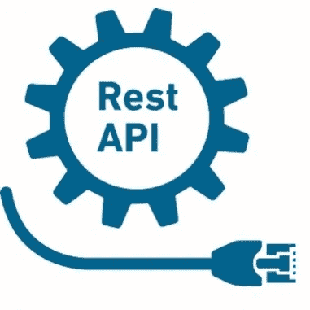
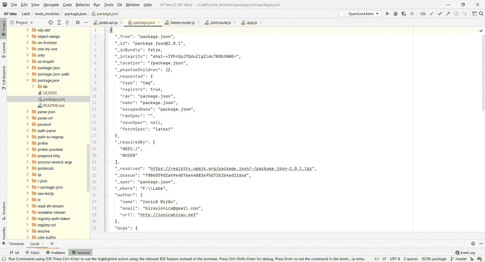
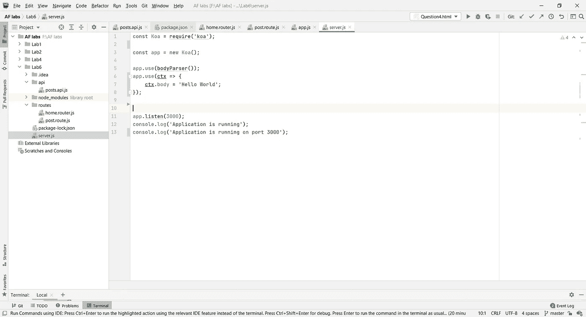
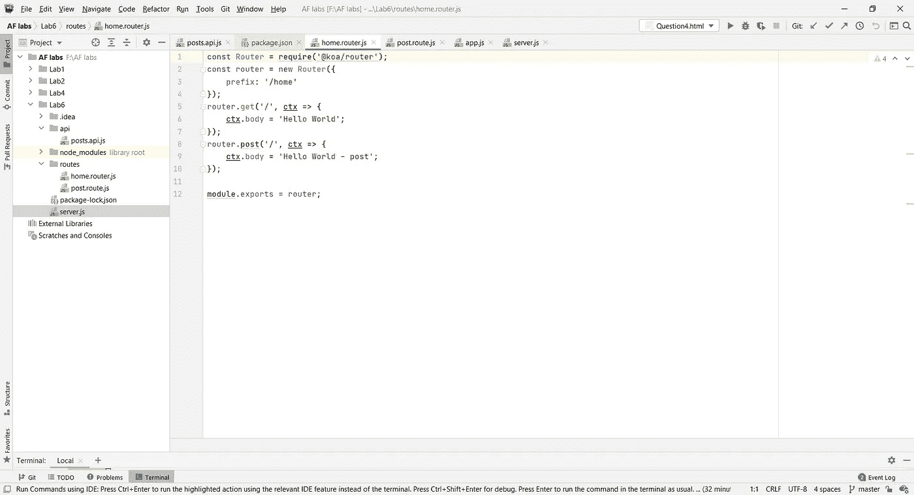
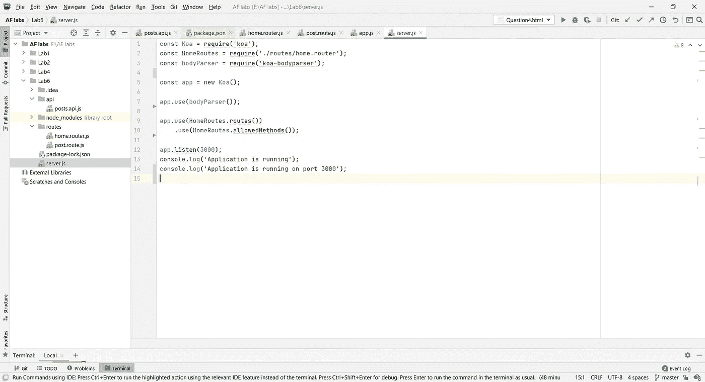
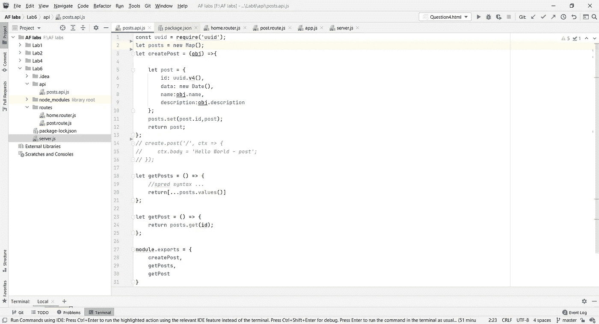
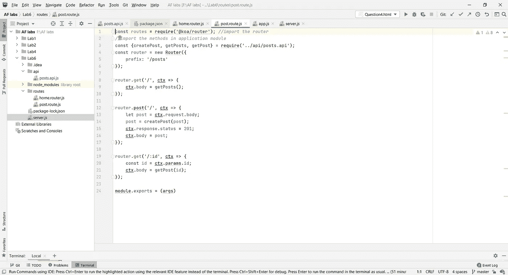

# KOA . js—RESTful API

> 原文：<https://medium.com/nerd-for-tech/koa-js-restful-apis-36f28eca1138?source=collection_archive---------1----------------------->


图 1: Koa.js 徽标

在本文中，我将讨论**KOA . js**&**REST API。使用这些东西，我们可以用 **Node.js** 构建一个**服务器端 API** 作为运行时环境。**

# **KOA . js 是什么？**

Koa 也是 ExpressJS 背后的团队设计的开源 Node.js web 框架。他们的主要目标是为 web 应用程序和 API 建立一个更小、更有表现力、更健壮的基础。Koa 是一个用于 node.js 的富于表现力的 HTTP 中间件框架。

**Koa 有这么多函数叫，**

*   *app.callback()*
*   *app.context()*
*   *app.keys =*
*   *app.listen()*
*   *app.use()*
*   *请求&响应* s(这两个也有这么多功能)

这些特性用于处理 API 的异步调用。这意味着 Koa 有助于消除回调的需要，并显著改进错误处理。

## Koa.js 的特点

Koa.js 有自己的特性，这些特性使它成为一个更具表现力、对开发人员更友好、更健壮的基础。以下是它的特点:

*   **ES6 生成器:**用于异步编程，控制代码执行。
*   **现代且经得起未来考验:** Koa.js 构建基于 ES6。因此，它通过提供新的类和模块使复杂的应用程序变得更简单。利用这一点，开发人员可以构建更易维护的应用程序。
*   **占用空间小:**与其他 Node.js 框架相比，Koas 占用空间小。这有助于编写更薄的中间件。它使 web 应用程序和 API 编写起来更加愉快。
*   **设计为 Node.js 的轻量级灵活框架:**这为开发 web 应用和 API 提供了一个最小的接口。
*   **识别并理解所有 HTTP 方法:**HTTP 方法这么多。Koa 可以识别这些方法，这将有助于开发人员更可靠地构建他们的应用程序。
*   **有一个内置的捕获器:**这将有助于错误处理。
*   **使用上下文对象:**是请求和响应对象的封装。

# 什么是 Rest APIs？



图 2: Rest API

Rest APIs 是由计算机科学家罗伊·菲尔丁创建的。 **RESTful API** 或**REST API**是一个应用编程接口(API 或 web API)。它允许与 RESTful web 服务进行交互。“REST”代表**具象状态转移。**

> API 是一组用于构建和集成应用软件的定义和协议。它有时被称为信息提供者和信息用户之间的契约—建立消费者所需的内容(调用)和生产者所需的内容(响应)。

# Koa.js 怎么安装？

首先，我们必须启动一个 npm 项目。我们可以用**作为我们的 IDE。为所有与项目相关的文件创建一个目录。**

```
**$ npm init**
```

**这将生成一个`package.json`文件，保存我们添加到项目中的所有依赖项。**

****

**图 3: Package.json 文件**

**然后将 Koa 添加到本地依赖项中。Koa 要求 **node v7.6.0** 或更高版本支持 ES2015 和异步功能。**

```
**$ npm i koa --dev -- save**
```

## **Koa 应用**

**创建一个名为 server.js 的文件。(需要对它的“koa”依赖)**

****

**图 4: server.js**

**现在，打开**终端或您的浏览器**并运行以下命令；**

```
**[http://localhost:3000](http://localhost:3000)**
```

**现在，您可以在浏览器中看到“Hello World”消息。**

****

**图 5:“Hello World”**

## **构建 REST API**

**将“@koa/router”安装到您的项目中。**

```
**$ npm i @koa/router**
```

**然后创建一个名为 **routes** 的目录，并在其中创建一个名为“*home . router . js”*的文件。并导入“@koa/router”。**

**然后**根据下图导出**路由器对象。**

****

**图 6:“home . router . js”**

**将此文件导入您的 server.js 文件。(注意:这将根据您的文件名而有所不同)**

```
**$ const HomeRoutes = require('./routes/home.router');**
```

**然后，您需要您的服务器理解 JSON 类型，这可以通过使用 body-parser 来实现。为此，您需要安装一个 koa-body 解析器，并将其注册到您的 koa 应用程序中。**

```
**$ const bodyParser = require('koa-bodyparser');app.use(bodyParser()); //register this with your koa application**
```

**接下来，允许 HTTP 方法。**

****

**图 7:“KOA 主体解析器”**

**您还可以使用 GET、POST 方法来改进您的应用程序。**

****

**图 8: POST 方法**

****

**图 9: Post.route.js**

**这是对 koa.js 和 REST APIs 的一点介绍。您可以关注更多文档和文章了解更多详情。**

## **参考**

```
**[https://koajs.com/](https://koajs.com/)
[https://www.redhat.com/en/topics/api/what-is-a-rest-api](https://www.redhat.com/en/topics/api/what-is-a-rest-api)
[https://www.tutorialspoint.com/koajs/koajs_restful_apis.htm](https://www.tutorialspoint.com/koajs/koajs_restful_apis.htm)**
```