# KoaJS 简介&构建一个简单的 API (POST，GET)

> 原文：<https://medium.com/nerd-for-tech/koajs-brief-introduction-build-a-simple-api-post-get-8365737e2c32?source=collection_archive---------2----------------------->

# **什么是节点？😕**

Node 也称为 node.js 是一个跨平台的服务器端运行时环境，它帮助 web 开发人员用 JavaScript 构建网络应用程序。即使开发它是为了用 JavaScript 构建 web 应用程序的后端，但现在开发人员使用 node 来开发前端和后端。

Node 有很多针对 node.js 的框架，Hapi.js，Express.js，Koa.js，Sails.js，Meteor.js 都是比较著名的一些框架。让我们多看看 KoaJS。

# **什么是 KoaJS？**

Koa.js 由 Express.js 框架的创建者开发。Koa.js 是一个包含一系列中间件函数的对象，这些函数根据请求以堆栈方式组合和执行，使 web 开发人员更容易用 JavaScript 构建快速网络应用程序。

# **为什么要快递到 KoaJS？**

Express.js 是一个著名的节点框架，仍然被许多开发人员使用。但是它仍然有一些缺点。

*   中间件缺乏对承诺的本地支持。
*   库核心与路由器逻辑的强耦合。
*   编写中间件的错误方式。
*   在库的核心中包含模板、发送文件和 JSONP 支持等特性。

# **KoaJS 的一些特性👌**

*   **Modern** ~~ koa.js 是基于 ECMAScript 6 或 ECMAScript 5 规范构建的。
*   **轻量灵活** ~~有助于写出更好更薄的中间件。可以通过插入模块来扩展框架。
*   **级联中间件** ~~有助于避免编写额外的代码来流式传输文件和关闭流。更适合错误处理。
*   **路由器模块** ~~简单安装 koa-router 模块即可使用。
*   **核心中的承诺和异步/等待支持**
*   **识别并理解所有 HTTP 方法**

# 让我们创建一个简单的 API(应用程序编程接口)项目💻

**要求:节点、IDE、邮差、JavaScript 知识**

**入门**

在开始创建项目之前，请确保已经安装了 node。下载链接->[https://nodejs.org/en/download/](https://nodejs.org/en/download/)

然后在命令行(CMD)中检查键入 ***node -v*** 或 ***node - version*** 。如果您得到这样的版本，那么您已经成功安装或拥有节点。

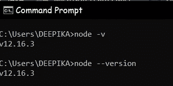

让我们开始创建我们的项目

对于这个项目，我将使用 JET BRAINS 的 **WebStorm 2020.3.2，**JavaScript 开发的最佳 IDF 之一。你可以找到你喜欢的那个 IDE。

首先在您喜欢的位置创建一个文件夹，然后使用 IDE 打开它。我创建了一个名为“学生”的文件夹(空项目)。

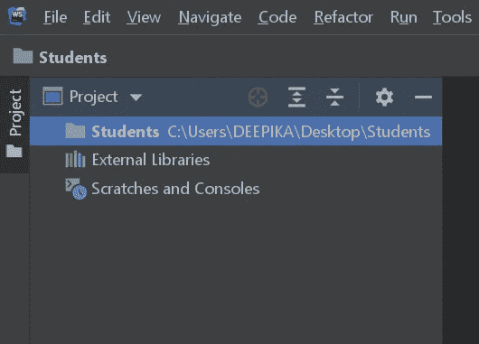

然后我们需要创建一个 **package.json** 文件，保存我们使用 **npm** 添加到项目中的依赖项的记录。要做到这一点，去终端(你可以在你的 IDE 底部找到它，然后输入 ***npm init -y.*** ，会给你类似如下的结果。

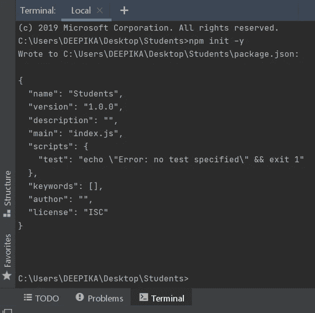

可以在你的项目文件夹中看到与 package.json 相同的文件，我准备修改 ***【作者】:“我的名字”*** 和 ***“脚本”:{“测试”:“NPM start”}***和***“main”:“server . js”。*** 如果你喜欢，可以更改描述。将测试更改为“npm 启动:将允许我使用“npm 启动”来运行项目。如果你使用其他名字，你需要将测试改为 ***节点 yourMainFileName.js.***

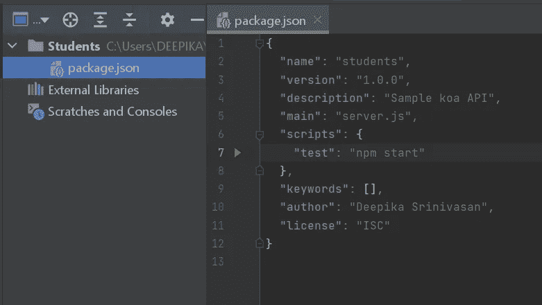

**安装 Koa**

现在安装 koa 并将其保存为一个依赖项。在项目的终端中输入 ***npm i koa - save*** 。现在，在 package.json 中，您可以看到 koa 被添加为一个依赖项。

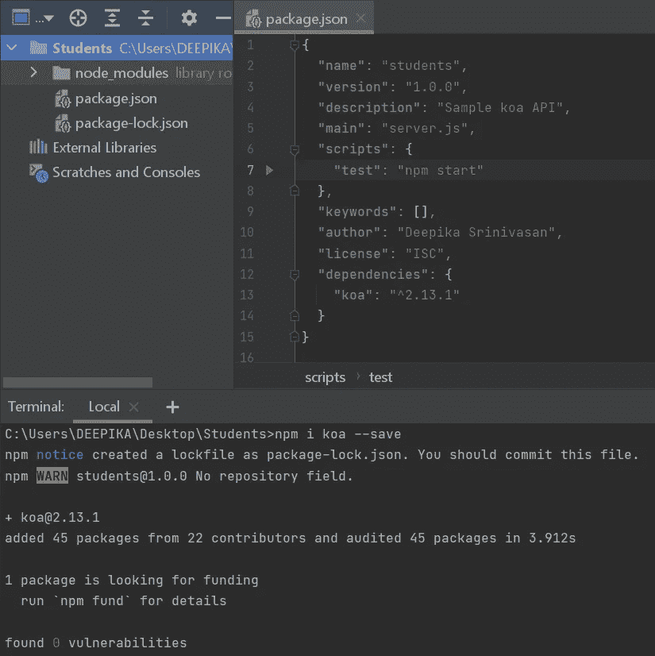

**创建首个 Koa 应用**

为了更好地理解 koa，让我们创建一个简单的开始程序。在您的项目中创建一个名为 **server.js** 的 JavaScript 文件，并添加以下代码。

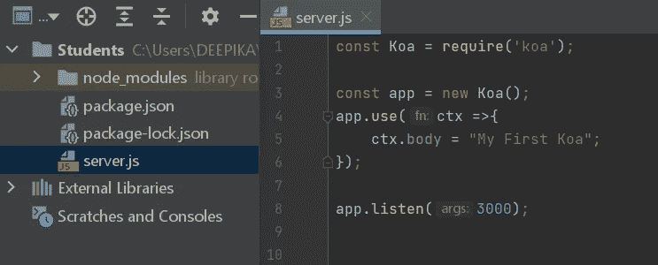

让我们了解一下代码。

*   const KOA = require(' KOA ')；→我们要求 koa 依赖于 index.js 文件
*   const app = new KOA()；→创建返回“我的第一个 koa”的 koa we 服务器。
*   app.use() →中间件函数。我们使用这个中间件功能作为路由。
*   ctx →被称为上下文。在这里，我们使用 ctx 作为中间件函数的参数。它将请求和响应对象封装为单个对象。
*   app . listen(3000)；→我们指定端口号为 3000。这就是服务器知道使用哪个端口号来运行应用程序的方式。

现在我们可以在 localhost:3000 中运行项目了

要运行，我们可以在终端中键入 ***npm start*** 。如果您使用了任何其他名称，如 index.js，请键入 ***节点 index.js.***

现在转到 [http://localhost:3000/](http://localhost:3000/) 并检查您是否得到这样的输出。如果是的话，恭喜你..您已经在 koa 中创建了您的第一个应用程序。

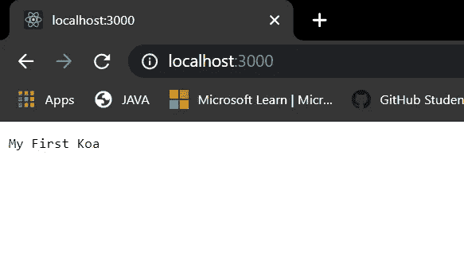

**现在让我们创建 REST API**

首先，我们需要使用 npm i koa-router - save 安装并保存名为 koa-router 的依赖项。检查是否添加到 **package.json.**

现在安装 koa-bodyparser 使用***NPM I KOA-body parser-save***。您需要您的服务器理解 JSON 类型，这可以通过使用 body parser 来实现

还要安装 **uuid** 依赖项供我们个人使用。这将生成随机数，我们可以使用它作为一个关键或 id。 ***npm i uuid -保存***

现在需要 ***server.js*** 中的***KOA-body parser***并修改代码如下。

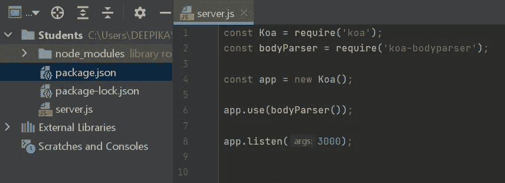

现在，在您的项目中创建一个名为“ ***api*** 的目录，并在 api 中创建一个名为***student . API . js***的文件

**发布方法**

然后 ***要求 UUID*** 和 ***创建一个名为*** 的地图来保存学生创建的数据。创建一个方法“createStudent ”,该方法接受一个具有属性(姓名、教师和年龄)的对象。这将允许我们输入数据。然后导出 createStudent。

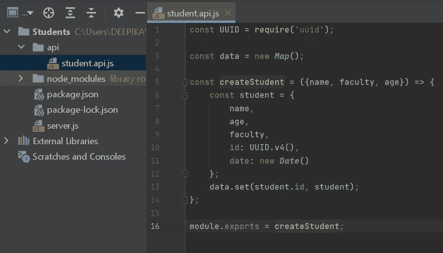

现在创建一个名为 ***路由器*** 的目录，并在里面创建一个名为***student . route . js***的文件

不需要 ***koa-router*** 和 ***createStudent。*** 然后创建 ***新路由器*** 并添加我们将要用来调用 HTTP 方法的前缀。然后我们创建 post 方法来添加学生的详细信息。

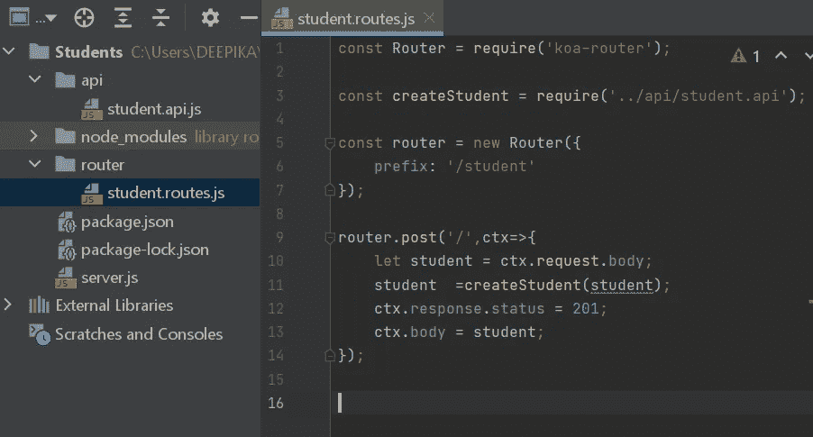

让我们也创建 GET 方法。以便我们可以检查我们的 API 是否在工作。

**获取方法**

现在在 student.api.js 文件中创建一个名为" ***getStudents*** "的方法，并修改代码以获取值。然后导出***get students***too。

然后在 student.routes.js 中要求 ***getStudents*** 并创建 get 方法来获取数据。

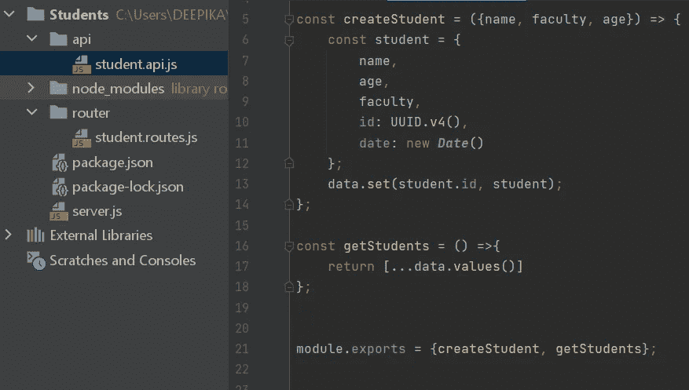

学生应用编程接口

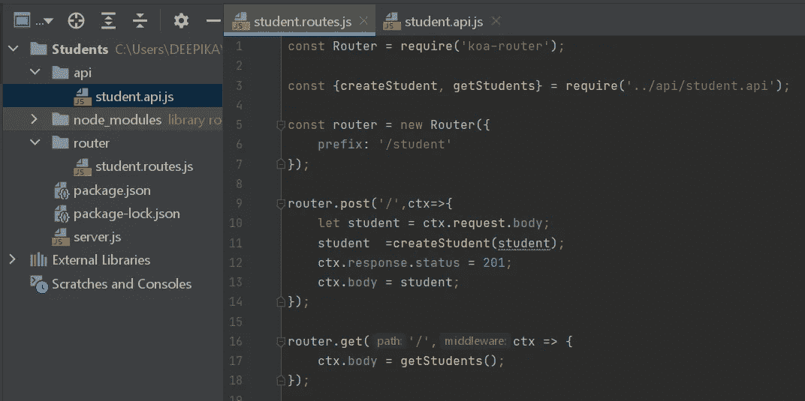

student.routes.js /还使用 **module.exports = router 导出路由器；**

现在让我们转到 server.js 并要求 student.routes.js 作为 StudentRoutes。使用该路由器进行 HTTP 呼叫。

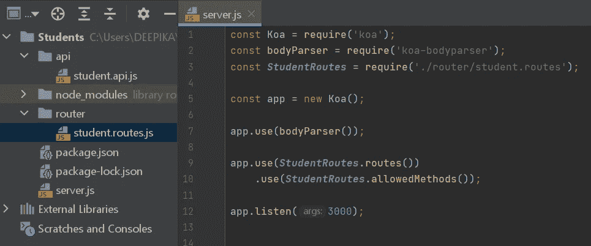

现在运行应用程序，让我们使用 **PostMan** 插入一些数据。

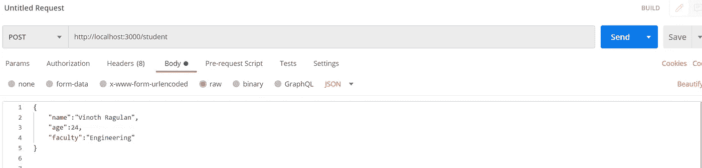

我已经添加了这两个数据。看我已经用 POST 方法添加数据了。

现在我们使用 GET 方法检查数据是否被保存。

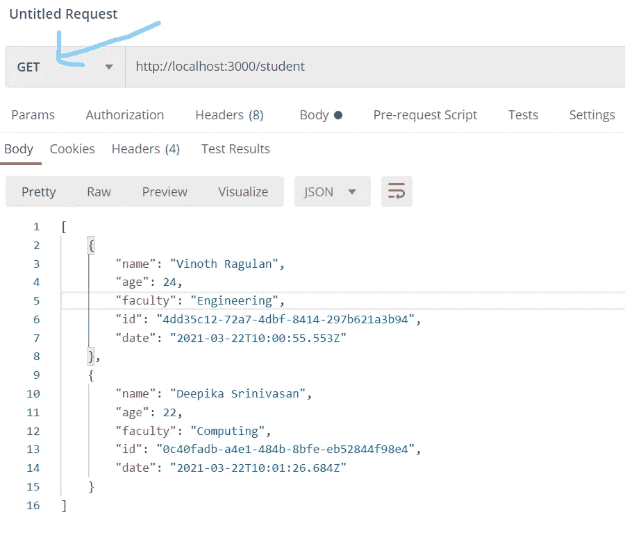

必须使用 PostMan 来添加数据。但是你也可以在浏览器中获取数据。

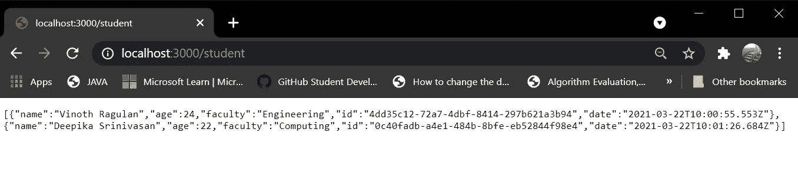

我们也可以添加 ID 搜索作为 GET 方法。不要忘记在相关部分中导出和导入。

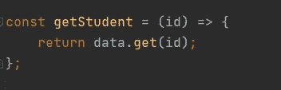

在 **students.api.js**

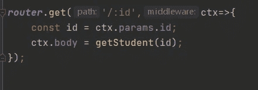

在 **student.routes.js**

如果您使用在对每个数据使用 GET 方法时获得的 id。您可以在 URL 中添加该 id，并获取特定的数据。

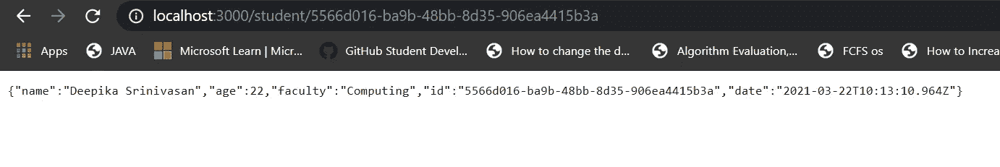

就这些…😄您已经用 KoaJS 完成了第一个 REST API 应用程序。👍 👏

# **参考文献🙏**

*   [https://hackr.io/blog/nodejs-frameworks](https://hackr.io/blog/nodejs-frameworks)
*   [https://koajs.com/](https://koajs.com/)