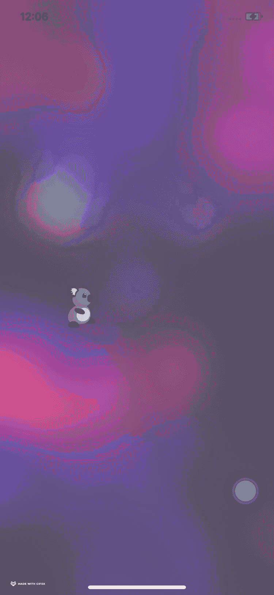
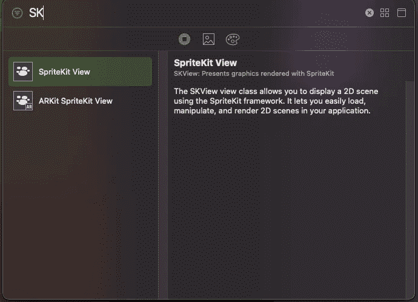
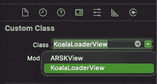
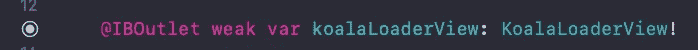
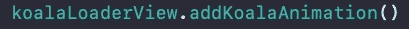

# 🐨活动指示器的考拉行走动画

> 原文：<https://medium.com/nerd-for-tech/koala-animation-for-activity-indicator-6c67582ff185?source=collection_archive---------3----------------------->

## iOS 动画指南

这将是一篇短文。我刚刚用 SpriteKit 完成了一个小的 swift 包。我想把它带给这里的人们。

# 介绍🐨KoalaActivityIndicator！

考拉 ActivityIndicator 是为喜欢考拉的人打造的🐨💙并且想要添加活动指示器的非无聊版本。如果您有任何问题或需要任何功能，请在 Github 上创建一个问题。

# 📜安装指南

## 📦Swift 软件包管理器

使用 SPM 轻松安装此软件包。请遵循以下步骤。

🚶🏽‍Xcode >文件> Swift 软件包>添加软件包相关性>选择您的项目>输入软件包相关性 URL

🔗URL—[https://github . com/Rajaikumar-IOs dev/koalaactivityindicator . git](https://github.com/Rajaikumar-iOSDev/KoalaActivityIndicator.git)

# 📃使用指南

步骤 1:转到故事板，从对象库中添加一个 SKView 对象。

步骤 2:将身份检查器中的类名更改为 KoalaLoaderView。

步骤 3:从故事板为 SKView 创建一个 IBOutlet

步骤 4:使用 outlet 调用 addKoalaAnimation()方法。

# 🥞技术堆栈

Xcode、UIKit 和 SpriteKit。

# 🙏🏽特别感谢这些资产

https://www.gameartguppy.comT2&维基·温德里奇

# 📂示例项目

[https://github . com/Rajaikumar-IOs dev/KoalaActivityIndicatorExample](https://github.com/Rajaikumar-iOSDev/KoalaActivityIndicatorExample)

 [## rajaikumar-IOs dev/koalaactivityindicatore 示例

### 使用 KoalaActivityIndicator 的示例项目。考拉 ActivityIndicator 是为喜欢考拉的人打造的🐨 💙…

github.com](https://github.com/Rajaikumar-iOSDev/KoalaActivityIndicatorExample)