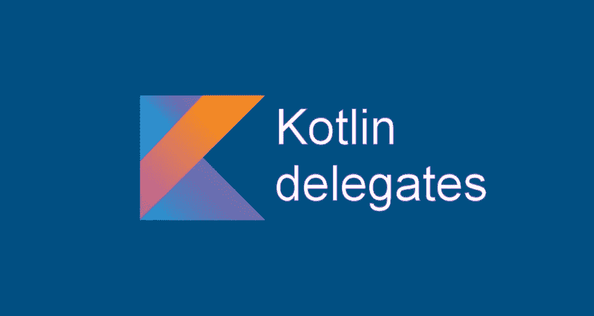

# Kotlin 代表团

> 原文：<https://medium.com/nerd-for-tech/kotlin-delegation-92acfaeb3b8b?source=collection_archive---------4----------------------->

## Kotlin 委托属性

在本文中，我们将探索什么是 Kotlin 委托，什么是 Kotlin 委托属性。首先，让我们讨论一下委托的一般含义。

## 什么是代表？

Kotlin delegate 是一个常规属性，它将获取和设置(读/写)其值的负担转移到与之相关的另一个函数。Kotlin 提供了几种不同类型的代表团。

## Kotlin 委托属性

Kotlin 为几种委托提供了标准的工厂方法。

## 惰性初始化

当需要初始化一个变量或常数时，惰性初始化很重要。在下面显示的代码片段中，通过关键字的*表示我们将使用一个*委托*来初始化*init by azy*常量的值。表示如果需要，我们将只在块内运行一次代码。一旦第一次调用*initby azy*时，Kotlin 会将该值隐藏起来，并在将来的引用中使用该值。*

但是安卓视图的*惰性*初始化有一个潜在的问题。如果视图像这样被隐藏起来，它会保存对上下文的引用，这可能会导致内存泄漏。

惰性初始化

## 可观察量

***可观察的*** 委托属性在每次值改变时被要求做某事时很方便。如果我们看看下面给出的代码片段，最初 *observableData* 是 0，而*是 ValueChanged* 是 false。

在给 *observableData 赋值后，*存储的值被改变，并且*被赋值的*变为真*。*每次回调函数都是在值更新后才被调用。

Kotlin 可观察到

## 可否决

***可否决*** 委托与 ***可观察*** 委托非常相似。唯一的区别是回调应该有一个条件来更新变量的值。在以下示例中，新值应大于或等于 0，以更新*否决数据*。只有在满足这个条件后，才会调用回调。

Kotlin 可否决

当处理代码中不断变化的属性时，惰性初始化、可观察的和可否决的委托属性变得方便和有用。我相信本文有助于您更好地理解 ***科特林委托*** 属性。