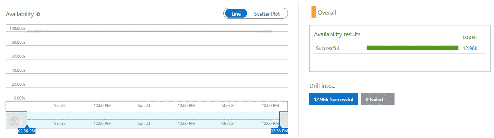
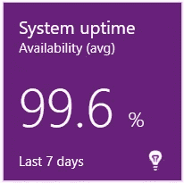
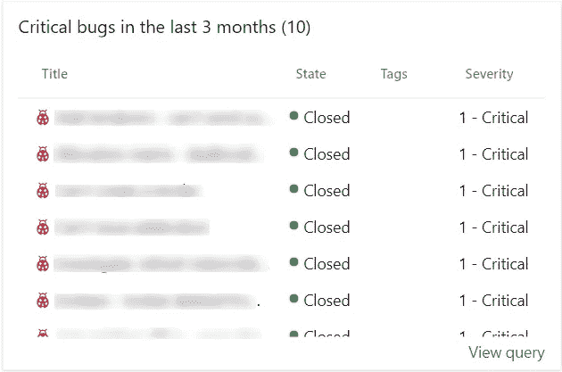
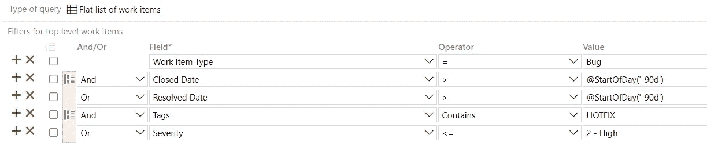
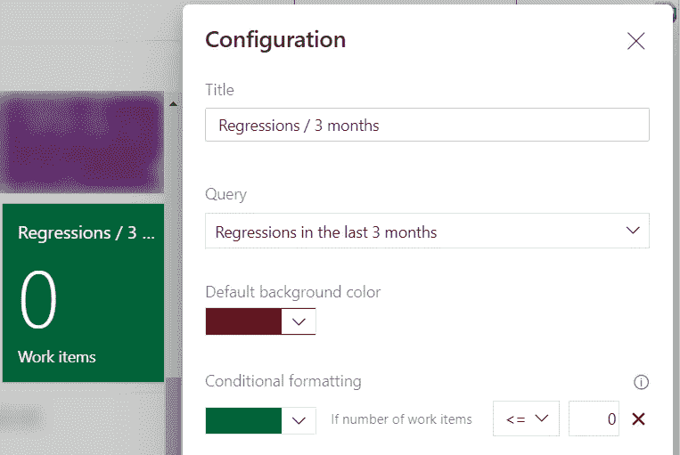
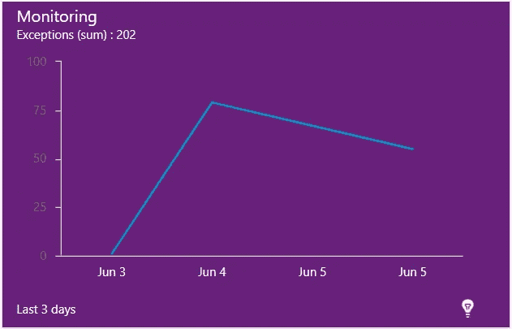
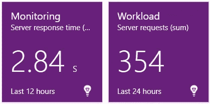
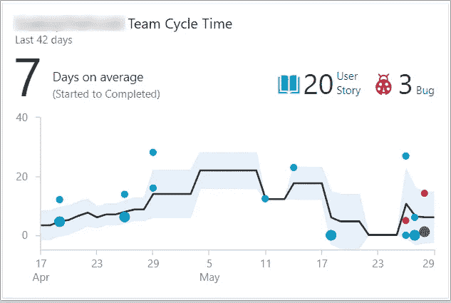
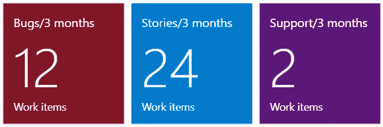
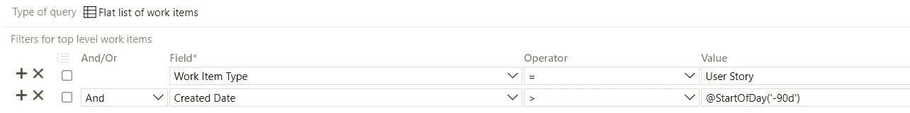

# 软件开发团队领导的 KPI

> 原文：<https://medium.com/nerd-for-tech/kpis-for-software-development-team-leads-4cf26b2402a7?source=collection_archive---------3----------------------->

## 开发团队领导的关键绩效指标，以及如何在 Azure DevOps 中衡量它们。

开发团队领导显然是软件开发生命周期中非常重要的一环。你会期望他们不仅有技术上的装备，而且有人员管理技能。虽然指定和交付技术解决方案是他们工作的一大部分，但确保团队的其他成员学习、改进并朝着集体目标努力也同样重要。他们还应该负责并调查项目的健康状况。
作为如此重要的一部分，他们必须非常小心，但他们的表现也需要以某种方式进行衡量。

你将衡量什么取决于你对团队的期望。请注意，我们谈论的是您对*团队*的期望，而不是单独对团队*领导*的期望，因为如果团队表现良好，那么团队领导也会表现良好。

让我们看看有哪些关键绩效指标可以指出团队中的潜在问题。

## 工作质量

事件、严重错误、倒退等的数量或缺失。可能意味着团队正在做高质量的工作。没有什么会对客户端或用户产生极其不利的影响。

*   **事件** 请注意，事件不是 bug，而是降低系统性能或危及其安全的事件。我们遇到的一个例子是一些 beta 访问密钥无意中在 GitHub 上公开了。这里不应该指手画脚，而是应该谈论如何自动化或修改流程，以减少事件重复发生的可能性。
*   **系统宕机** 系统可以因为任何原因而宕机，而不是专门因为团队出错。然而，它会影响用户，所以如果有任何停机，有理由调查它以及它为什么会发生。
    这可以通过各种工具轻松测量。我们使用 [Application Insights 的可用性测试，](https://docs.microsoft.com/en-us/azure/azure-monitor/app/monitor-web-app-availability)结合仪表板中的 [Application Insights 小部件](https://tfs.mca.mk/_gallery/items/?itemName=ms-appinsights.ApplicationInsightsWidgets)。

应用洞察可用性测试预览

widget 在仪表板中的外观

*   每个应用程序都必须处理那些需要立即解决的、影响用户的重大错误。
    您可以通过在 Azure DevOps 中创建查询来衡量它们。取过去 3 个月内关闭或解决的所有 bug，这些 bug 具有严重或高严重性。如果您遵循 git 流模型，您也可以搜索那些被标记为“热修复程序”的。然后，您可以在仪表板中添加查询结果。

为此，您可以使用[查询结果](https://docs.microsoft.com/en-us/azure/devops/report/dashboards/widget-catalog?view=azure-devops#query-results-widget)小部件

这就是这个查询在 Azure DevOps 中的定义

*   **回归** 回归意味着在同一个 bug 上花费了两倍甚至三倍的时间，只是因为一开始没有调查清楚，或者一开始没有找到根本原因。应用的修复实际上是一种变通，这只是增加了技术债务，而不是修复 bug 的方法。
    在 Azure DevOps 中，你可以创建一个与上面非常相似的查询，只需找到被标记为“回归”的 bug 即可。这有点容易出错，因为团队可能不会正确标记所有的回归，所以你必须考虑到这一点。

您可以选择使用[查询磁贴](https://docs.microsoft.com/en-us/azure/devops/report/dashboards/widget-catalog?view=azure-devops#query-tile)进行查询，并添加一些视觉线索

*   **意外事件** 虽然项目中发生的大多数事故都包含在前面的要点中，但是您可以让团队领导谈论其他意外事件，这些事件将用户或风险承担者置于尴尬的境地，或者给开发团队带来压力。
*   **bug 监控**
    任何项目都必然会发生 bug。开发团队对它们的反应才是最重要的。如果团队通过手工测试或者涉众的电子邮件发现了错误，你可能需要做出反应，因为团队没有积极地监控问题。然而，如果团队对监控系统的自动警报做出反应，那么他们就没有更多的事情可做了，因为他们可能在用户知道之前就已经发现并修复了 bug。
    如果您使用[应用洞察](https://docs.microsoft.com/en-us/azure/azure-monitor/app/app-insights-overview)，您可以通过将 bug 的小部件添加到仪表板中来监控 bug。

仪表板小部件的外观

*   **性能监控**
    这个系统可能是最好的，但是如果它太慢，用户不会停留太久。检查团队对绩效的监控也非常重要。
    如果您使用应用洞察，除了跟踪 bug 之外，测量性能是开箱即用的事情之一。您可以向仪表板添加更多的小部件，这样您就可以得到平均响应时间，如果在您的场景中有意义的话，还可以得到请求的数量。实际上，你应该测量第 95 或第 99 百分位，但是这个小工具至少可以给你一个想法。

## 协力

团队领导的主要工作之一是确保团队像一台运转良好的机器，没有阻碍地工作。

*   **Sprint 目标** 预先计划工作，让所有开发人员知道他们在下一次 Sprint 中的工作可能意味着工作组织得很好，每个人都知道该做什么。
    你可以使用 [sprint goal](https://marketplace.visualstudio.com/items?itemName=keesschollaart.sprint-goal) 扩展，或者用“sprint goal”标签来标记故事，这样团队就知道应该关注什么。然后，您可以通过检查扩展或进行类似上面的查询，只需搜索“sprint goal”标签，来检查是否为最后一期设置了 Sprint goal。
*   **周期时间** 这显示了一个用户故事从活动状态到完成状态需要多少时间。这是一个重要的度量标准，因为它告诉我们团队是否创建了太大的用户故事，是否在同行评审中有瓶颈，是否有不可维护的代码，或者可能是一些普遍缓慢的过程。周期时间应该小于 1 次冲刺，理想情况下应该是(按我的说法)~冲刺长度的 30%。

[周期时间控件](https://docs.microsoft.com/en-us/azure/devops/report/dashboards/cycle-time-and-lead-time?view=azure-devops)非常适合这种情况

*   **团队活动的&已完成的拉请求** 在 Azure DevOps 中查看团队活动的和已完成的拉请求的状态也可以发现问题。
    是否有旧的拉取请求？这可能会有丢失代码的危险，因为随着时间的推移，合并代码的成本会越来越高。需求可能被改变，它应该被再次测试，可能有许多冲突等等。
    对拉取请求没有意见吗？这可能意味着开发人员没有足够认真地对待同行评审过程。可能会引入 bug，团队的新成员学习速度较慢，项目的不同部分可能有不同的模式(因此更难阅读和调试，这将再次导致更多的 bug 或更多的时间来解决 bug)。
    是否有太多主动拉取请求？这可能意味着团队没有积极地进行同行评审，这带来了上面列出的大多数问题。
    任何绕过的拉取请求？这可能意味着团队跳过了自动策略，这可能会将项目带入无法构建的状态，并且在一段时间之后，将需要更多的时间来修复这个问题。只要浏览一下“拉取请求”子菜单，您就可以大致了解所有这些问题。

## 投资概况

客户将他们的资源投入到开发团队中，因此他们将在产品上获得有价值的新特性。然而，客户还负责许多带有一次性任务或报告的电子邮件、评估请求或新功能的特别会议。尽管他们认为这是一个 1 分钟的工作，不会从 sprint 中得到任何东西，但实际上，这分散了开发人员的注意力，产生了更大的影响。
对客户投资有影响的另一件事是 bug 的数量——了解这些信息和一段时间内的原始支持数量将有助于您制定与客户沟通的策略。

*   如果团队主要致力于 bug，这意味着客户的投资并没有得到回报。显然会有 bug，就像之前提到的，但是应该保持在一个有意义的比例内。
    理想情况下，bug 不应该超过用户故事数量的 20–30%。
*   **支持** 通常设计师、销售人员或其他利益相关者会向开发团队提出“简单”的问题，或者从数据库中请求“简单的一次性”报告。虽然这些任务不超过 15 分钟，但它分散了开发人员的注意力，他们将需要更多的时间来再次关注问题。非开发人员不理解这一点是可以理解的，但是每个这样的任务都应该贴上“支持”的标签，这样你就可以在以后向涉众提交报告。如果你提出事实，在过去的 3 个月里你有 30 张支持票，而在那段时间里你可以实现 3-4 个更大的用户故事，利益相关者在再次要求简单的事情之前会三思。

您可以使用查询切片微件来实现这一点，更具体地说是其中的 3 个

以及对用户故事的查询

在 Azure DevOps 中测量这一点需要您创建 3 个相当简单的查询。只需在一个查询中搜索所有创建的用户故事，在另一个查询中搜索过去 3 个月内的 bug。对于支持，您需要查询任何标记为“支持”的工作项。

## 其他的

除了可衡量的事情，你还应该与团队领导讨论一系列开放式话题，这可以让你深入了解他们运营和管理团队的方式。

谈论**他们最近开发的新功能**和他们背后的技术决策可能会让你对他们的技术准备情况有所了解。如果您甚至深入到代码或拉取请求的一部分，也没关系。重构的发生，尤其是第二次在代码的同一个部分，可能意味着特性在一开始就没有计划好。主动性**或缺乏主动性也能揭示项目动机或兴趣方面的问题。谈论团队领导**如何激励**团队的其他成员可以向你展示他们的性格、管理团队的方式和期望。**

**团队领导还应严格遵守**公司政策**。你有行会和分会，或者其他鼓励分享知识的方式吗？团队领导应该是主要贡献者。**

**团队领导还应该对他们需要改进的地方以及如何改进有一个清晰的认识。**

**显然，一个团队领导不可能掌握所有这些要点，但在大多数要点上应该高于平均水平。**

## **结论**

**由于大多数 KPI 直接涉及团队领导的工作，请确保领导清楚地意识到这不是一次评判会议，您不是在试图变得聪明，而是在试图发现团队中是否存在问题，并讨论如何解决这些问题，以便团队和团队领导变得更好。**

**通过覆盖并确保减少事故、停机时间和错误，您可以减轻直接影响最终用户和客户的问题。着眼于冲刺目标和周期时间，您在某种程度上确保团队及其过程足够高效。您还可以通过测量支持票证来管理客户端，并让他们知道他们产生的额外工作量。度量所有这些的关键是在创建工作项时用数据丰富它们。将它们标记为支持或回归，或者设置严重性，可以为您提供如此多的信息，并帮助您在接下来的步骤中做出明智的决策。**