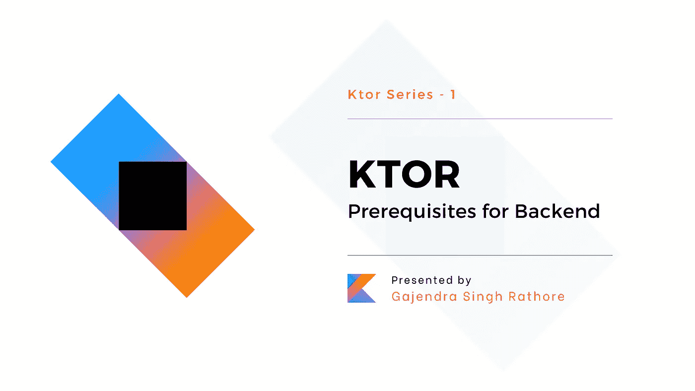

# Ktor -后端的先决条件

> 原文：<https://medium.com/nerd-for-tech/ktor-prerequisites-for-backend-89c58ed459fe?source=collection_archive---------1----------------------->

Ktor 简介，为什么要用 Ktor 做后端，什么是路由，序列化和反序列化，Ktor 应用的 ide。

朋友们好，这是 **Ktor** 系列的第一篇文章。我们中的大多数人，作为原生的 Android 应用程序开发者，我们非常精通 Kotlin，但没有简单的选项来探索 Android 应用程序的后端。现在，我们可以通过用 Kotlin 编写代码来使用 Ktor 构建后端。
我们将了解 Ktor，为什么考虑将 Ktor 用于后端开发，路由、序列化和反序列化的基础知识，我们可以用来创建 Ktor 项目和替代选项的 ide。

# 我们将在这个博客中讨论的话题

*   Ktor 是什么？
*   后端开发为什么选择 Ktor？
*   路由？
*   序列化和反序列化？
*   使用哪个 IDE？
*   下一步是什么？

# Ktor 是什么？

Ktor 是 JetBrains 使用 Kotlin 构建的框架。这个框架可以用来构建应用程序，如 web 应用程序、HTTP 服务、移动应用程序和基于浏览器的应用程序。为了给用户提供最好的体验，Kotlin 协同程序的特性以一种非常简单明了的方式提供了异步机制。
考虑到面向互联应用的端到端多平台应用框架和 Ktor 的广泛接受性，它将成为人们可以学习和掌握的高要求技术堆栈之一。

# 后端开发为什么选择 Ktor？

*   **Kotlin 和 Coroutines** Ktor 是使用 Kotlin 和 Coroutines 从零开始构建的，它是用于多平台应用程序开发的语言之一。不能忽视异步编程的力量。
*   轻量级和灵活的 Ktor 允许我们通过删除大量的样板代码来使用我们需要的东西。我们可以灵活地自由构建我们的应用程序。除此之外，我们可以很容易地用自己的插件扩展 Ktor。
*   **可互操作** 您可以将 Ktor 用于任何现有的 Java 项目。Kotlin 完全可以与 Springboot 等许多 Java 框架互操作。
*   **社区支持
    一个好的社区已经在那里随时帮助你解决你的疑问。**
*   **工具支持
    对于 ide，JetBrains 提供了两个 ide，分别名为 **IntelliJ IDEA Ultimate** 和**IntelliJ IDEA Community Edition。****

# 按指定路线发送

路由是为网络中或多个网络之间的流量选择路径的过程。

# 序列化和反序列化

序列化是将使用的数据转换为可以通过网络发送或接收的格式，或者保存在数据库或文件中的过程。与此类似，反序列化是序列化的相反过程，反序列化是从外部源读取数据并将其转换为基于平台的运行时对象的过程。序列化和反序列化都是应用程序交换数据的重要部分。

# 哪个 IDE？

你可以用来创建 KTOR 项目的 IDE 是 T2 IntelliJ IDEA Ultimate。如果你想安装 IntelliJ IDEA 点击这里— [***安装 IntelliJ IDEA***](https://www.jetbrains.com/help/idea/installation-guide.html)***。*** 虽然可以使用社区版进行开发，但是在社区版中没有创建 KTOR 项目的选项。如果你使用的是社区版的 IntelliJ IDEA，你可以使用这个基于网络的 KTOR 项目生成器— [***生成 Ktor 项目*** 。](https://start.ktor.io/)

# 下一步是什么？

在下一篇文章中，我们将学习如何创建一个 Ktor 项目，项目结构，理解在哪里写什么样的代码，最后我们将看到如何运行一个 Ktor 应用程序。

# **参考文献**

*   [https://himanshoe.com/kotlin-for-backend](https://himanshoe.com/kotlin-for-backend)
*   [Ktor.io](https://ktor.io)

# ❤️最后是❤️

我希望这篇文章值得一读，你能从中有所收获。如果你有任何问题或建议，请在评论中告诉我，并请与可能需要了解上述主题的人分享。
拍手👏，注释💭分享❤️

谢谢，注意安全，继续编码。干杯🍻！