# Kubernetes:所有基础知识

> 原文：<https://medium.com/nerd-for-tech/kubernetes-all-basics-7995d9d7c2d5?source=collection_archive---------6----------------------->

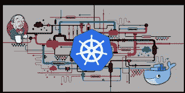

# **✨什么是 kubernetes？？**

> 我们中的许多人对 Kubernetes 的工作感到困惑，所以基本上 Kubernetes 是一个开源的容器系统，通常用于自动化计算机应用程序的部署、扩展和管理。【kubernete 于 2014 年 6 月 7 日首次发布，它是基于 Go
> 编程语言构建的。Kubernetes 最初是由谷歌的工程师开发和设计的，因为谷歌是 Linux 容器技术的早期贡献者之一，并公开谈论谷歌的一切是如何在容器中运行的。

# ✨Why 库伯奈特在世界各地被广泛使用？

> Kubernetes 支持云应用的弹性 web 服务器框架的操作。Kubernetes 可以支持将数据中心外包给公共云服务提供商，也可以用于**大规模虚拟主机**。

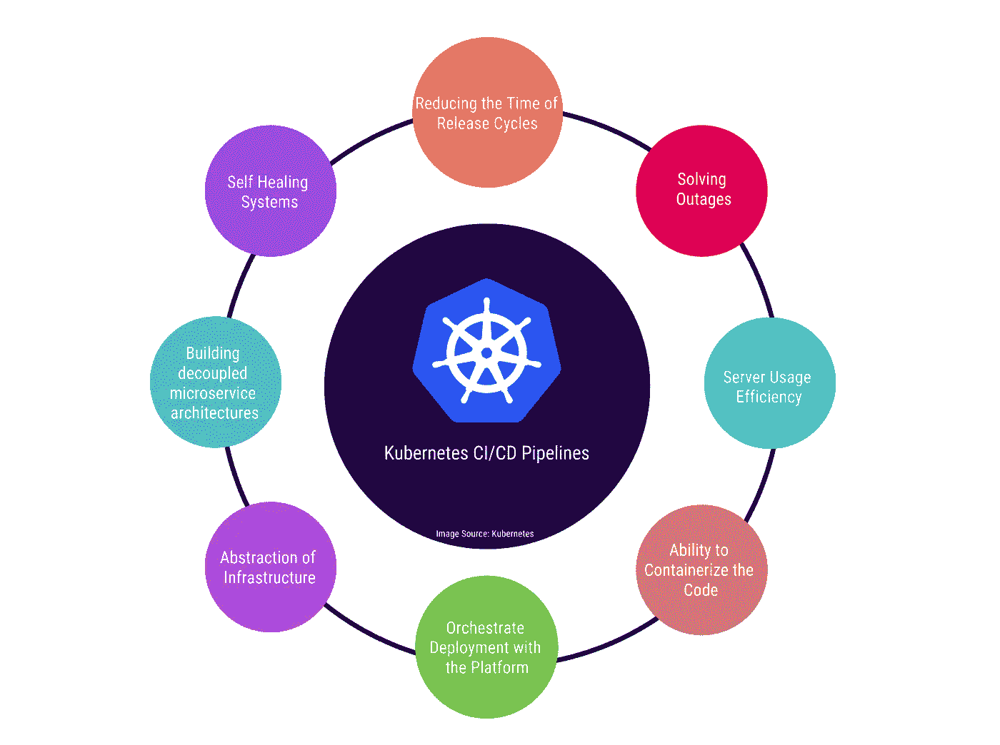

# ✨ **如何在 windows 上部署 kubernetes？**

> Kubernetes 在 windows 上的安装过程非常简单，我想一步一步地描述它。对于部署，我们将使用 **Minikube(** minikube 是一个让您在本地运行 Kubernetes 的工具。 **)**
> 下载 forMinikube 的安装程序:[点击这里](https://minikube.sigs.k8s.io/docs/start/)

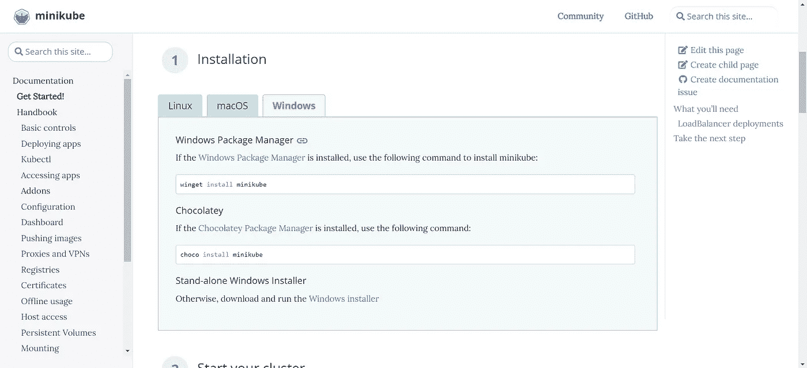

> 现在点击 windows installer，如果你想使用自定义安装，你也可以使用命令行命令，如
> * `winget install minikube
> * choco install minikube`

安装 minikube 后，进入 minikube 安装路径
并在命令行打开**minikube.exe**。

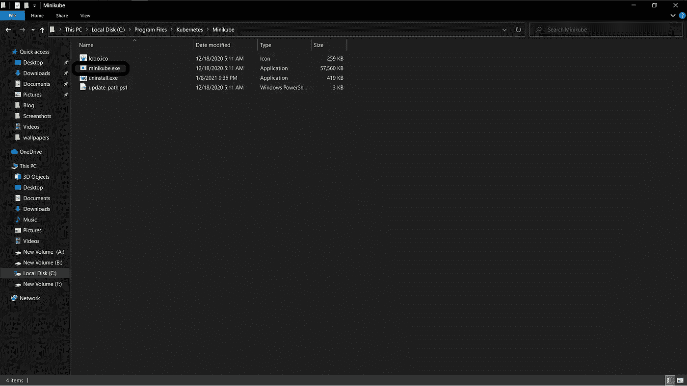

> 现在在 cmd 中键入**" minikube . exe start—driver = virtualbox "**来启动 kubernetes 服务，或者您也可以使用"**minikube start—kubernetes-version = v 1 . 20 . 0—driver = virtualbox**"

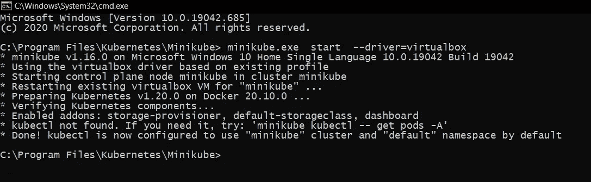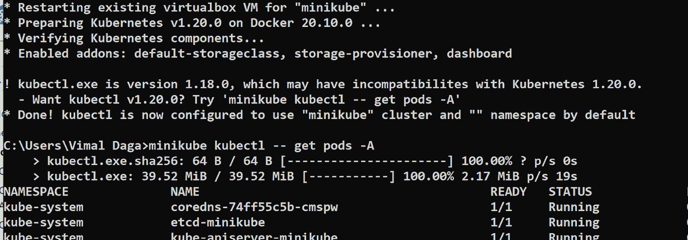

> 现在通过“**minikube.exe 启动**”启动 minikube，以启动 Minikube 服务。

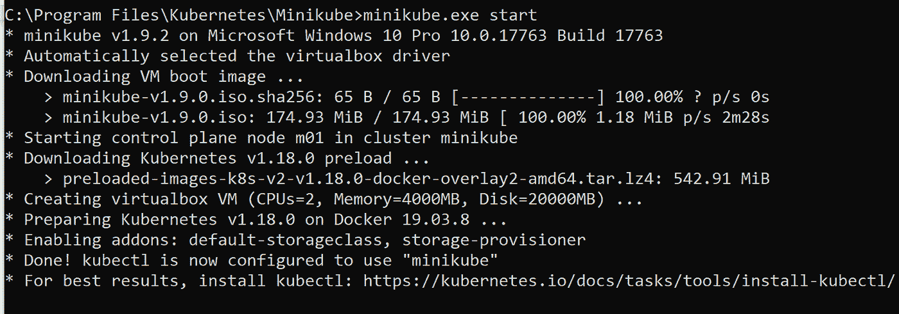

> 与此同时，我们还可以看到，在 virtual box 上创建了一个虚拟机

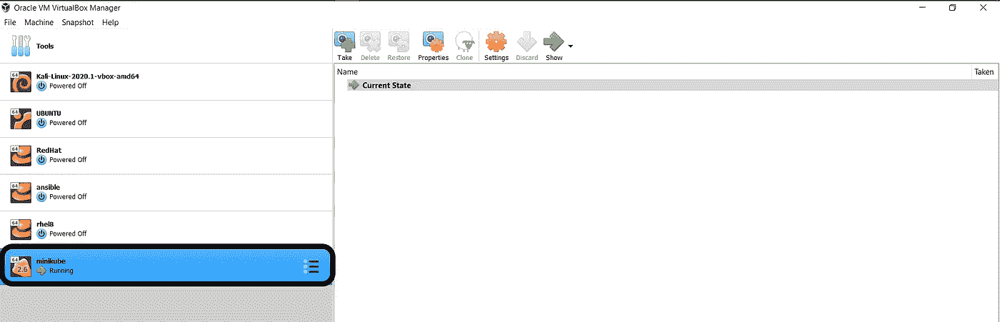

> 现在，为了获得 minikube 机器的 ip，请在 cmd 中键入“**minikube.exe IP**”。
> 现在要检查状态，我们可以使用“**minikube.exe 状态**

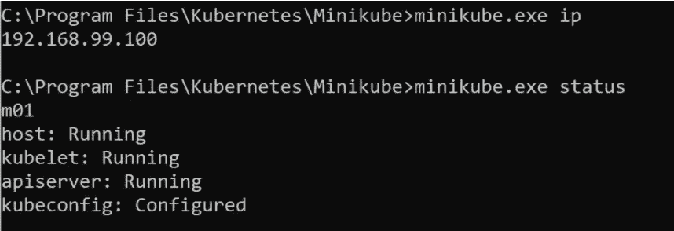

> 对于 ssh 连接类型“**minikube.exe ssh**

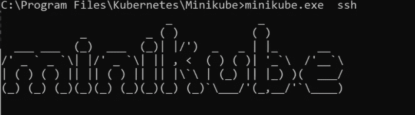

现在 minikube 已成功配置🌈🌈

> 现在我们将使用 **kubectl** ，因为它允许您对 Kubernetes 集群运行命令。

> 现在为了安装 kubectl，打开另一个命令行:
> 并键入命令

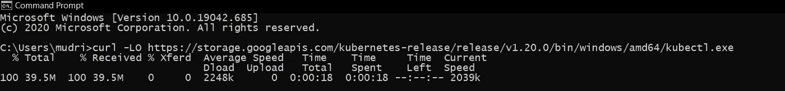

> 现在使用“**kubectl.exe 版本—客户端**检查版本

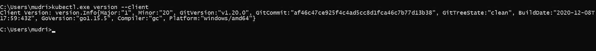

> 现在使用“**minikube.exe 仪表板**访问仪表板

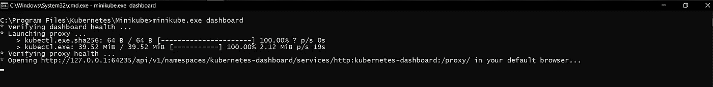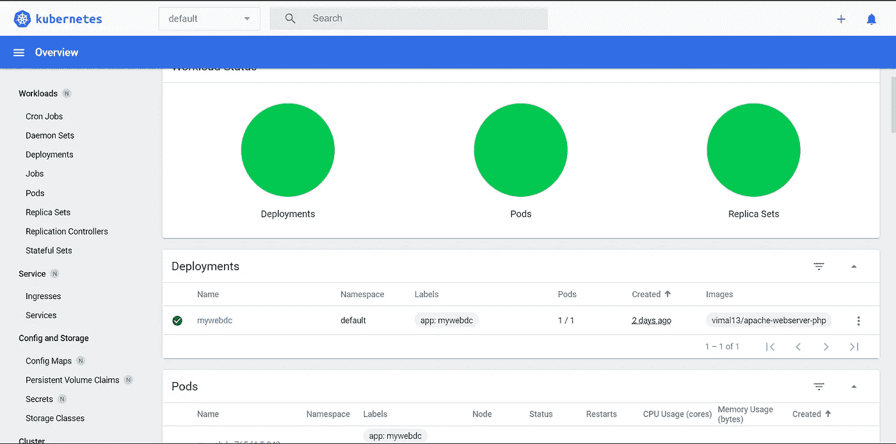

> 现在你可以自由使用**kubernetes architecture**
> 感谢您的阅读👾👾👾👾