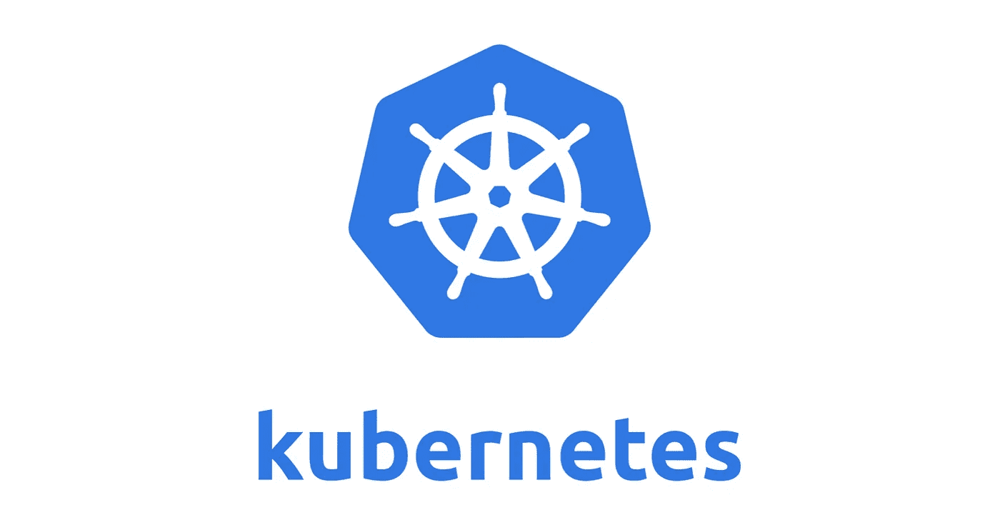
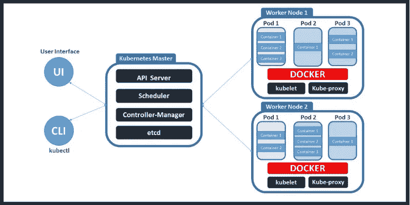

# 库伯内特建筑

> 原文：<https://medium.com/nerd-for-tech/kubernetes-architecture-76557c5812f8?source=collection_archive---------9----------------------->

# 什么是 Kubernetes？

Kubernetes 是一个跨节点集群管理容器化应用程序的系统。简单来说，你有一组机器和容器化的应用程序(例如 Dockerized 应用程序)，Kubernetes 将帮助你轻松管理这些机器上的应用程序。它被用作 docker 群的替代。

# 库伯内特建筑

Kubernetes 遵循客户端-服务器架构。主服务器由各种组件组成，包括 kube-apiserver、etcd 存储器、kube 控制器管理器、云控制器管理器、kube 调度器和用于 Kubernetes 服务的 DNS 服务器。

库伯内特建筑

# 掌握

主节点是 Kubernetes 架构中最重要的组件。它是所有管理任务的入口点。总是有一个节点要检查容错性。

主节点具有各种组件，例如:

1.  ETCD
2.  控制器管理器
3.  调度程序
4.  API 服务器
5.  库贝特尔

## 1.ETCD

该组件存储配置详细信息和重要值。它与所有其他组件进行通信，以接收执行某个操作的命令。管理网络规则和后转发活动

## 2.控制器管理器

*   一个连续循环运行的守护程序(服务器),负责收集信息并将其发送到 API 服务器。致力于获取共享的集群集，并将它们更改为服务器的所需状态
*   关键控制器是复制控制器、端点控制器、命名空间控制器和服务帐户控制器
*   控制器管理器运行控制器来管理节点和端点

## 3.调度程序

*   调度器将任务分配给从节点
*   它负责分配工作负载，并存储每个节点上的资源使用信息
*   跟踪工作负载在集群上的使用情况，并将工作负载放在可用资源上。

## 4.API 服务器

*   Kubernetes 使用 API 服务器在集群上执行所有操作
*   它是一个中央管理实体，接收所有 REST 修改请求，充当集群的前端
*   实现一个接口，该接口使不同的工具和库能够有效地通信

## 5.库贝特尔

*   Kubectl 控制 Kubernetes 集群管理器

语法—ku bectl[标志]

# 奴隶

从节点具有以下组件:

## 1.豆荚

pod 是作为单个应用程序控制的一个或多个容器。它封装了应用程序容器、存储资源，并由唯一的网络 ID 和管理容器操作的其他配置来标记

## 2.码头工人

*   节点的一个基本要求是 Docker
*   它有助于在一个独立但轻量级的操作环境中运行应用程序。它运行已配置的 pod
*   它负责从 Docker 映像中下载和运行容器

## 3.库伯莱

*   负责在控制平面服务之间传递信息的服务
*   它从 API 服务器获取 pod 的配置，并确保容器高效工作
*   kubelet 进程负责维护工作状态和节点服务器

## 4.Kubernetes 代理

*   充当负载平衡器和网络代理，在单个工作节点上执行服务
*   管理节点上的 pod、卷、秘密、新容器的创建、健康检查等。
*   在每个节点上运行的代理服务，使服务对外部主机可用

就是这样。希望你觉得这篇文章有用，感谢你阅读它。