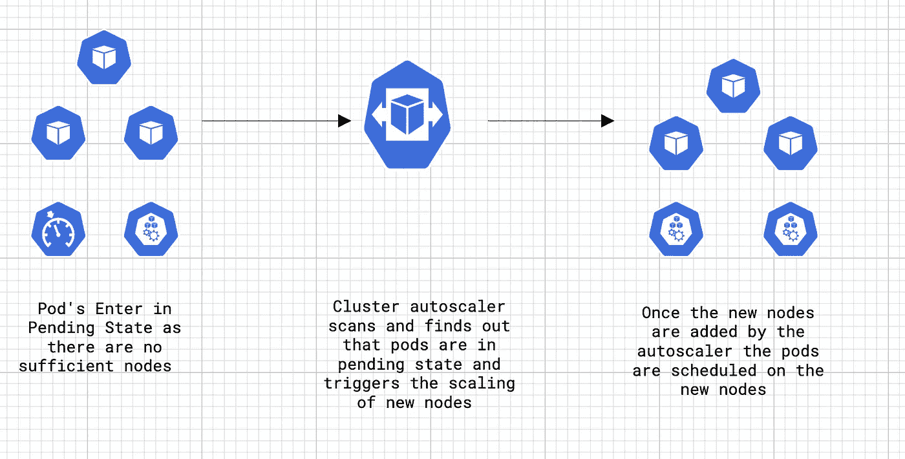
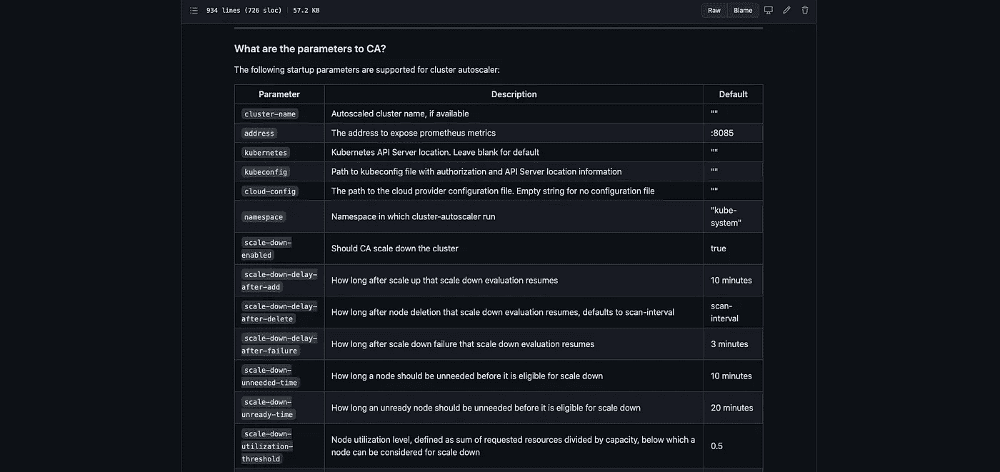
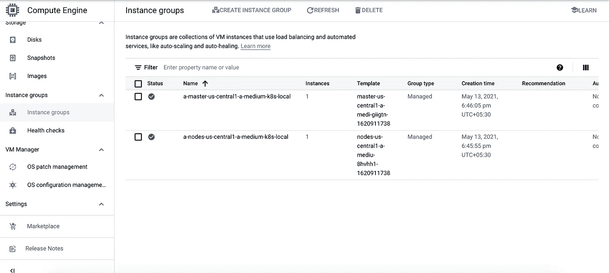
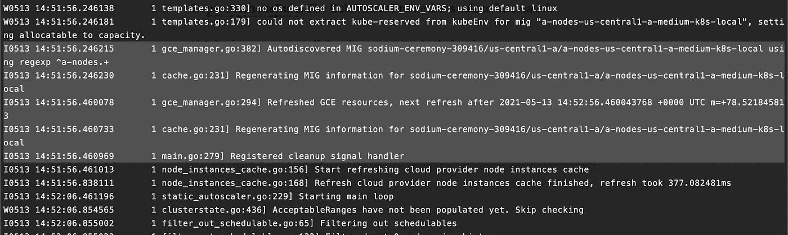
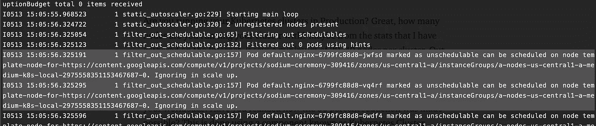
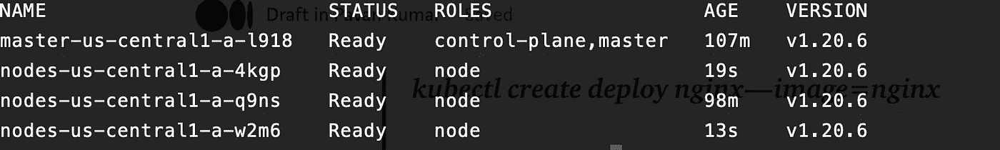
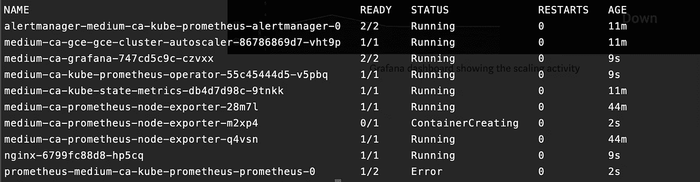
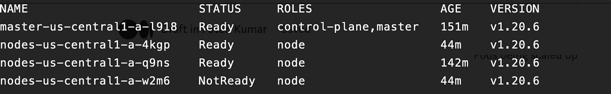
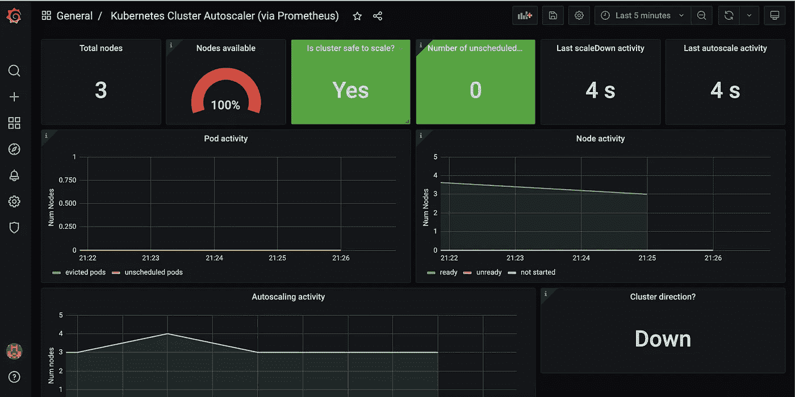
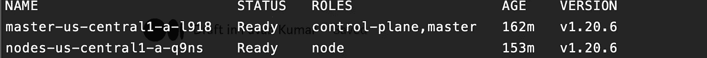

# Kubernetes 集群自动缩放器正在运行

> 原文：<https://medium.com/nerd-for-tech/kubernetes-cluster-autoscaler-in-action-6172a023f542?source=collection_archive---------1----------------------->

使用 Kubernetes 集群自动缩放器有效节约成本

您是否在生产环境中运行 Kubernetes 集群？太好了，您有多少节点在运行您的集群？就我个人而言，我一直在运行一个 Kubernetes 集群来托管一个简单的自助服务应用程序，最初有大约 40 个工作节点。

我们认为这是必要的，因为我们在高峰时段会有较高的负载，但我们注意到大多数工作节点在晚上和周末等负载较低的时段处于空闲状态，因此浪费了我们的预算。

进入[**Kubernetes Cluster Autoscaler**](https://github.com/kubernetes/autoscaler)，多亏了 auto scaler，我们成功地将资源使用量减少了约 50%，同时保持了应用程序的高性能和高响应性。

kubernetes Cluster auto scaler**根据您的工作负载需求，自动调整给定集群中工作节点的数量。您不需要手动添加或删除节点，也不需要过度配置集群。相反，您可以为集群指定最小和最大大小，扩展是自动的，由集群自动缩放器自行完成。**

****

**运行中的集群自动缩放器**

# **整个故事是关于什么的？(TLDR)**

1.  **了解集群自动缩放。**
2.  **在 GCE 上的 Kubernetes 集群上实现集群自动缩放。**

# **先决条件**

1.  **一个 GCP 账户(你可以获得一个有 300 美元免费信用的免费级账户)。**
2.  **安装在你机器上的 Helm 二进制文件。**

# **故事资源**

1.  **GitHub 链接:[https://github.com/pavan-kumar-99/medium-manifests](https://github.com/pavan-kumar-99/medium-manifests)**
2.  **GitHub 分支: [cluster-autoscaler-gce](https://github.com/pavan-kumar-99/medium-manifests/tree/cluster-autoscaler-gce)**

## **集群自动缩放器**

****1)放大****

**让我们首先了解一下集群自动缩放在纵向扩展节点时是如何工作的。CA ( Cluster Autoscaler)每 10 秒检查一次任何不可计划的 pod。如果不可安排的 pod 列表中有任何项目，Cluster Autoscaler 会尝试找到一个新的位置来运行它们。CA 假设底层节点是自动缩放组的一部分，并尝试基于此来缩放它们。创建的节点出现在 Kubernetes 中可能需要一些时间。它几乎完全取决于云提供商和节点供应的速度。**

****2)缩小比例****

**集群自动缩放通过执行以下计算来检查哪些节点是不需要的:**

****a)** 该节点上运行的所有 pod 的 CPU 和内存请求之和小于该节点可分配容量的 50%。**

****b)** 如果在节点上调度的 Pod 具有以下条件**

*   **不能驱逐带有注释`"cluster-autoscaler.kubernetes.io/safe-to-evict": "false"`的 pod。**
*   **带本地存储的 pod。**
*   **不受控制器对象支持的窗格。**
*   **kube-没有 PDB 氏综合症的系统舱。**
*   **豆荚有限制性 PDB 氏症(如 100% PDB)。**

****c)** Kubernetes Worker 节点用以下注释进行了注释**

```
"cluster-autoscaler.kubernetes.io/scale-down-disabled": "true"
```

**CA 检查所有上述条件，然后如果超过 10 分钟不再需要，就终止节点。**

## **使增大者**

**好吧，我希望缩放逻辑非常明显。但是现在，如果您想在缩放实例之前执行一些数学运算，该怎么办呢？例如，当附加了多个实例组时，您可能希望缩放选定自动缩放组中的节点。您可能希望选择成本最低的节点组，同时选择其计算机与集群大小相匹配的节点组。扩张者出现了。扩展器提供不同的策略来选择要添加新节点的节点组。到目前为止，CA 有 5 种不同类型的扩展器。扩展器是:**

1.  ****随机**:这是默认的扩展器。从组中随机选择实例，并随机缩放。**
2.  ****most-pods**:CA 选择节点组，该节点组将在向上扩展时调度大多数挂起的 pods。**
3.  ****最少浪费**:CA 选择在纵向扩展后具有最少空闲 CPU 的节点组。**
4.  ****价格**:CA 选择成本最低的节点组，同时，其机器将匹配集群大小(目前为 GKE GCE 工作)。**
5.  ****优先级**:CA 根据用户给定的自定义优先级选举节点组。您可以在这里 了解如何配置自定义优先级 [**。**](https://github.com/kubernetes/autoscaler/blob/master/cluster-autoscaler/expander/priority/readme.md)**

## **自定义参数**

**除了使用默认值创建集群自动分类器之外，还可以显式覆盖这些值。例如，您可以配置一个节点在多长时间内不需要，然后才可以按比例缩小，按比例放大后多长时间恢复按比例缩小评估，等等。所有这些 CA 的参数都可以在 [**这里**](https://github.com/kubernetes/autoscaler/blob/master/cluster-autoscaler/FAQ.md#what-are-the-parameters-to-ca) **找到。****

****

**集群自动缩放器的参数**

**好了，谈够了。让我们现在开始行动吧。作为本文的一部分，我已经在 GCE 上使用 [kOps](https://kops.sigs.k8s.io/) 创建了集群。到目前为止，CA 支持以下 Kubernetes 集群安装方法**

1.  **GCE(在 GCE 节点上安装 Kubernetes 集群)**

**2.自动警报系统**

**3.天蓝色 AKS**

**4.OpenStack Magnum。**

**集群自动缩放器可以使用舵图表[T3 这里](https://github.com/kubernetes/autoscaler/tree/master/charts/cluster-autoscaler)安装。**

**在安装 autoscaler 之前，让我们首先使用 kOps 创建一个 Kubernetes 集群。创建 Kubernetes 集群还有许多其他方法，但是在本文的范围内，我使用 kOps。让我们也用 grafana 安装 Prometheus-Operator，这样我们就可以在一个漂亮的仪表盘[上看到缩放比例。一旦安装了 Prometheus stack，您还应该将该仪表板导入 Grafana，您应该会发现该仪表板已经显示了数据。](https://grafana.com/grafana/dashboards/3831)**

**使用 Kops 创建集群**

**一旦集群准备就绪，让我们首先用实例组前缀配置 CA helm 图表。我们现在将转到 GCP UI，然后获取实例组的前缀。**

****

**GCP 云控制台**

**在我的例子中，worker 节点实例组的名称是 a-nodes-us-central 1-a-medium-k8s-local。这是我的 values.yaml 文件。让我们探讨一下目前的选择。**

1.  ****auto discovery . cluster name**:您的 Kubernetes 集群的名称。**
2.  ****云提供商**:云提供商的名称。该值应该是 gce、aws、azure 或 magnum。**
3.  ****autoscalinggroupsname Prefix . name**:工作者节点实例组的前缀。
    **min size**:K8s 集群的最小节点数。
    **maxSize** :集群可以扩展到的最大节点数。**
4.  ****extraArgs** :附加容器参数
    **skip-nodes-with-local-storage = false**:这仅用于开发目的，不适用于生产环境。这将替换在一个节点上计划缩减到另一个节点的 pod，即使它有本地存储。默认值为 true。
    **scale-down-delay-after-add = 2m:**将工作节点添加到集群后，CA 应等待的分钟数，以开始评估工作节点的缩减。这也是出于开发目的，以帮助我们更快地扩展。对于生产，请考虑将该值设置为更高的值。
    **scale-down-needless-time = 2m:**节点被标记为不需要后缩小的分钟数。这也是出于开发目的，以帮助我们更快地扩展。对于生产，请考虑将该值设置为更高的值。**
5.  ****service monitor**:service monitor 有一个标签选择器来选择服务及其底层端点对象。它描述了普罗米修斯要监控的一组目标。**
6.  ****普罗米修斯规则**:要创建的库伯内特普罗米修斯规则。**

**好了，现在让我们安装集群自动缩放器[舵图](https://github.com/kubernetes/autoscaler/tree/master/charts/cluster-autoscaler)。**

```
$ git clone [https://github.com/pavan-kumar-99/medium-manifests.git](https://github.com/pavan-kumar-99/medium-manifests.git) \
-b [cluster-autoscaler-gce](https://github.com/pavan-kumar-99/medium-manifests/tree/cluster-autoscaler-gce)$ helm repo add autoscaler [https://kubernetes.github.io/autoscaler](https://kubernetes.github.io/autoscaler)$ helm upgrade -i medium-ca-gce autoscaler/cluster-autoscaler -f as.yaml
```

**从日志中，您应该看到托管实例组应该被自动发现。**

> ****ku bectl logs medium-ca-GCE-cluster-auto scaler-568 f 44 fc 67–675 dx****

****

**突出显示了自动发现日志**

> ****kube CTL get no | awk“{ print $ 1 }”****
> 
> ****名字****
> 
> ****主美国中央 1-a-l918****
> 
> ****节点-美国-中央 1-a-q9ns****

**这是我们的集群拓扑，现在有一个主节点和一个工作节点。让我们创建一个简单的 nginx 部署，并将其扩展到 100 个副本。**

> ****kubectl 创建部署 nginx — image=nginx****
> 
> ****kubectl scale deploy nginx—replicas = 40****

**当我的 pod 进入挂起状态时，CA 会计算所需的节点数量，并触发新节点的扩展。**

****

**豆荚被放大**

**大约一分钟后，您应该会发现添加到集群中的新节点。我所有的豆荚现在都处于运行状态。**

> ****库贝克获取号****

****

**现在让我们检查一下 grafana 的仪表板。**

****

**集群自动缩放仪表板**

**现在让我们将 nginx 部署扩展到 1。**

> ****kubectl scale deploy nginx—replicas = 1****

**几分钟后，CA 会评估不需要的节点，并将不需要的节点上的 pod 重新安排到另一个节点，然后优雅地终止该节点。**

****

**单元被重新安排到另一个节点**

**一旦 CA 认为该节点是不需要的，CA 就在不需要的节点上添加污点，这样就不会在该节点上安排新的 pod。**

> ****ToBeDeletedByClusterAutoscaler = 1620921499:无计划****
> 
> ****DeletionCandidateOfClusterAutoscaler = 1620921376:preferno schedule****

**如果节点上有任何 PDB，只有在满足 PDB 约束后才会发生驱逐。**

****

**正在缩小的节点**

****

**显示缩放活动的 Grafana 仪表板**

**现在，一旦 CA 完成了所有活动，我们就应该知道集群中主节点和数据节点的实际数量了。**

****

**kubectl 获取号**

## **打扫**

**好了，现在让我们删除整个集群。**

> ****kops 删除集群 medium.k8s.local —是****

# **结论**

**至此，我们已经了解了 Cluster Autoscaler 的工作原理，并通过终止不需要的资源来帮助我们降低成本。在我即将发表的文章中，我将写一篇关于如何利用集群自动缩放器和 Spot 实例(Preemptale 节点)的文章。如有任何新想法或问题，请随时联系我。另外，欢迎在评论区发表你的想法。**

**直到下次……..**

# **被推荐的**

**[](/nerd-for-tech/deep-dive-into-thanos-part-i-f72ecba39f76) [## 深入灭霸——第一部分

### 使用灭霸和普罗米修斯操作员监控 Kubernetes 的工作负载

medium.com](/nerd-for-tech/deep-dive-into-thanos-part-i-f72ecba39f76) [](https://www.techmanyu.com/creating-self-hosted-github-runners-in-a-kubernetes-cluster-fd05560de34a) [## 在 Kubernetes 集群中创建自托管 GitHub 运行程序

### 在您自己的 Kubernetes 集群上运行 GitHub 操作

www.techmanyu.com](https://www.techmanyu.com/creating-self-hosted-github-runners-in-a-kubernetes-cluster-fd05560de34a) [](/nerd-for-tech/logging-at-scale-in-kubernetes-using-grafana-loki-3bb2eb0c0872) [## 使用 Grafana Loki 在 Kubernetes 进行大规模伐木

### 使用 Grafana Loki 在 Kubernetes 中进行日志聚合

medium.com](/nerd-for-tech/logging-at-scale-in-kubernetes-using-grafana-loki-3bb2eb0c0872) [](/nerd-for-tech/running-apache-spark-on-eks-with-aws-spot-instances-f8ce91d319b9) [## 使用 AWS Spot 实例在 EKS 上运行 Apache Spark

### 通过 AWS Spot 实例为 EKS 上的 Apache Spark 工作负载有效节约成本

medium.com](/nerd-for-tech/running-apache-spark-on-eks-with-aws-spot-instances-f8ce91d319b9)**