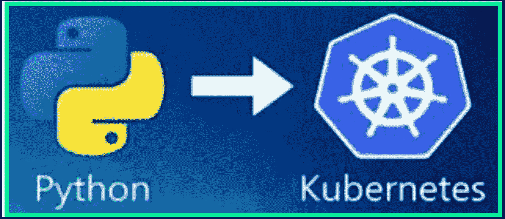
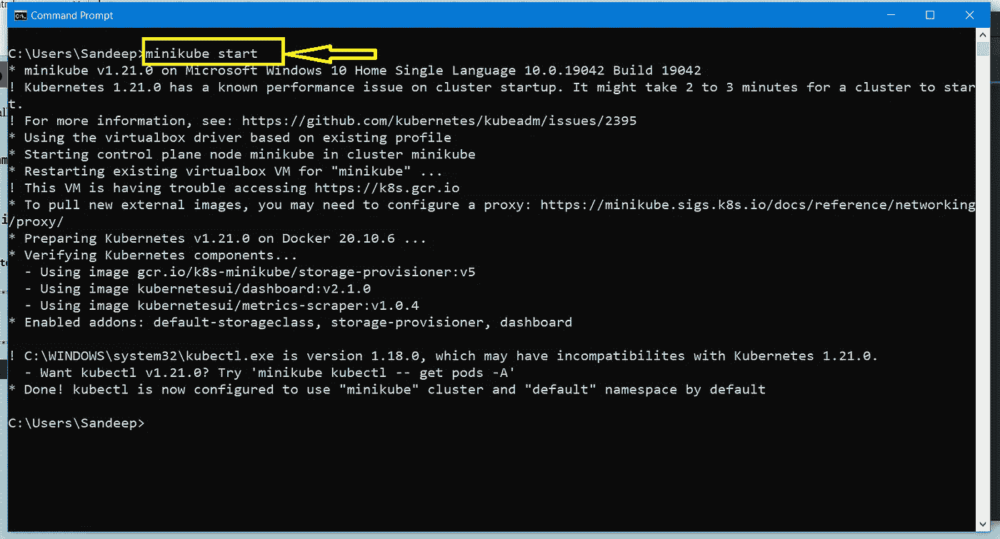
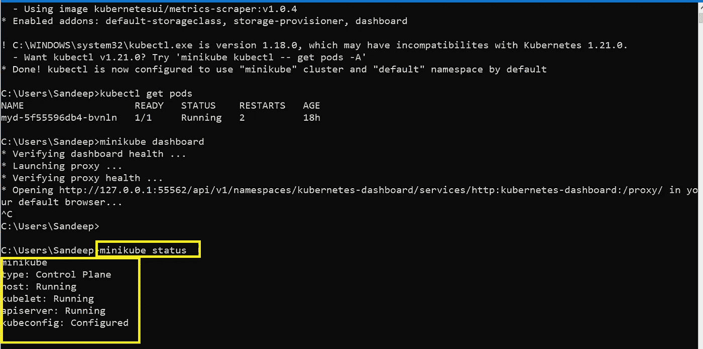
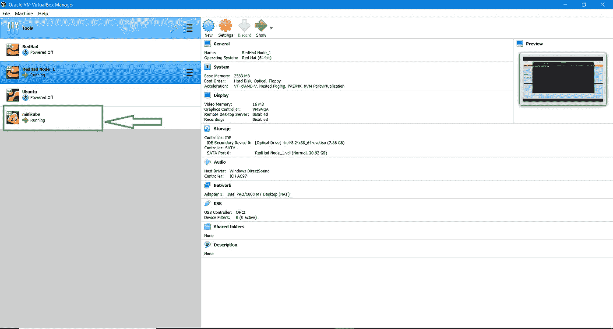
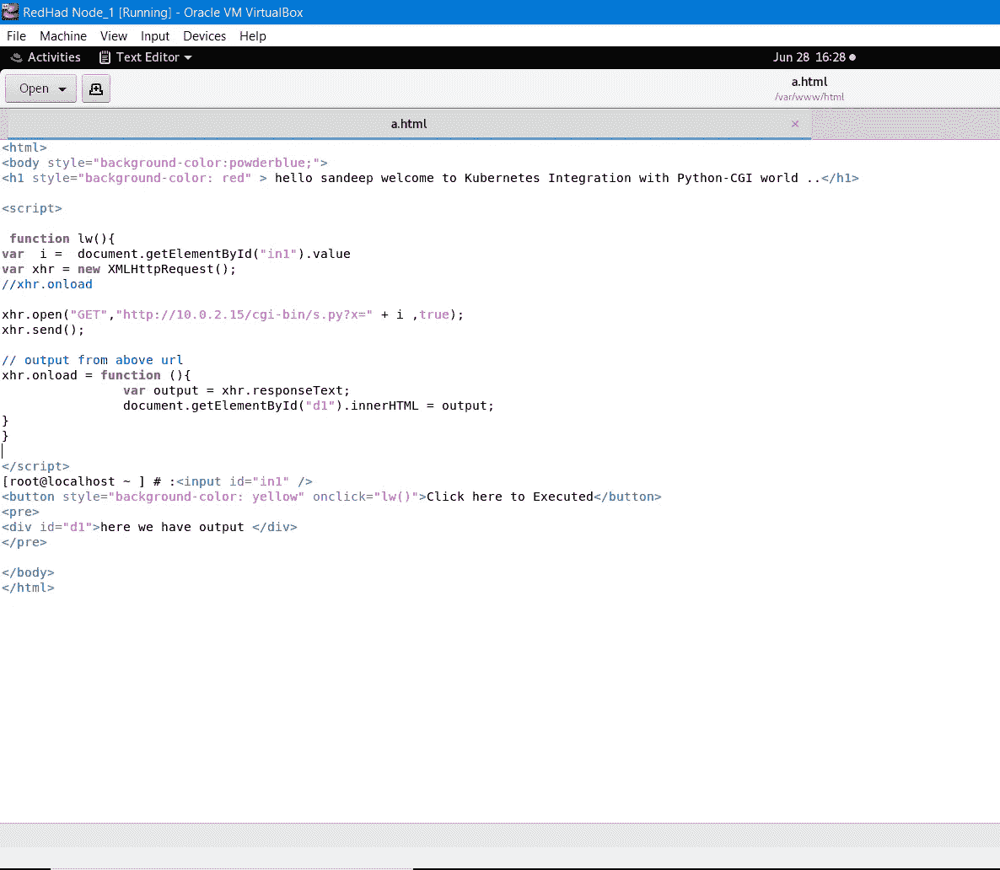
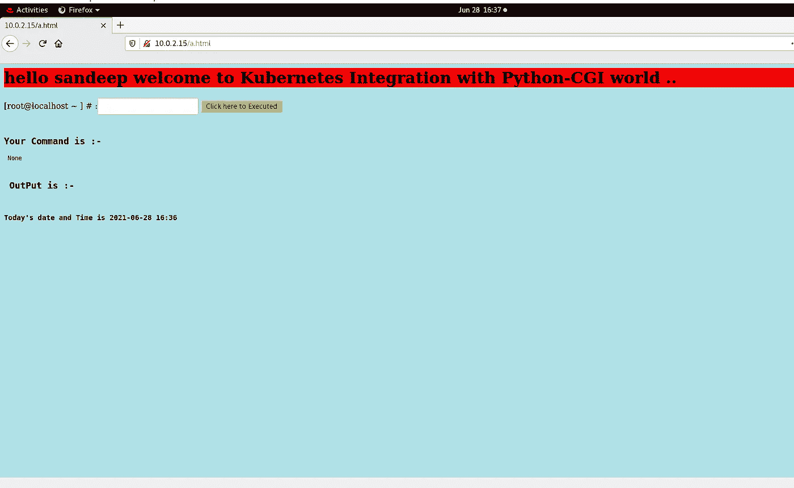
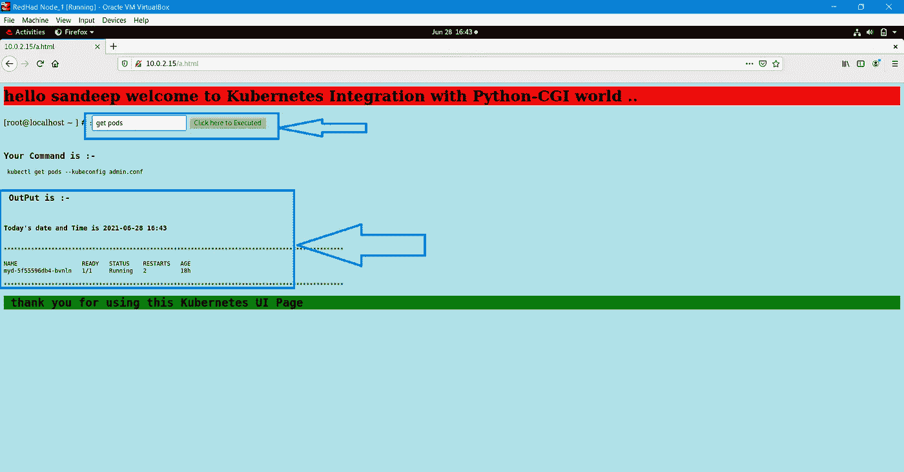
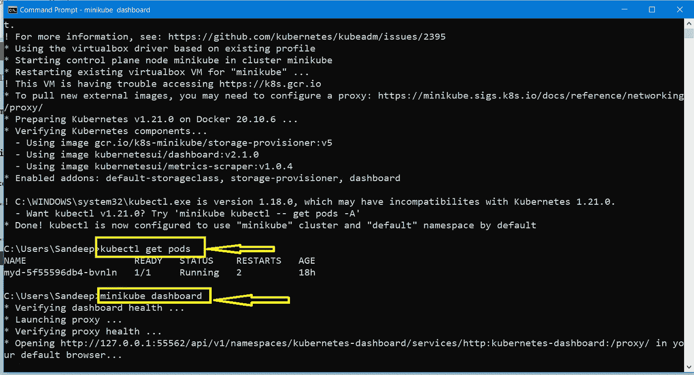
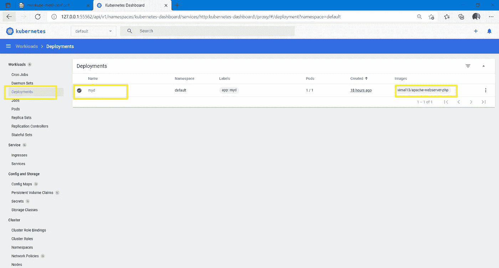
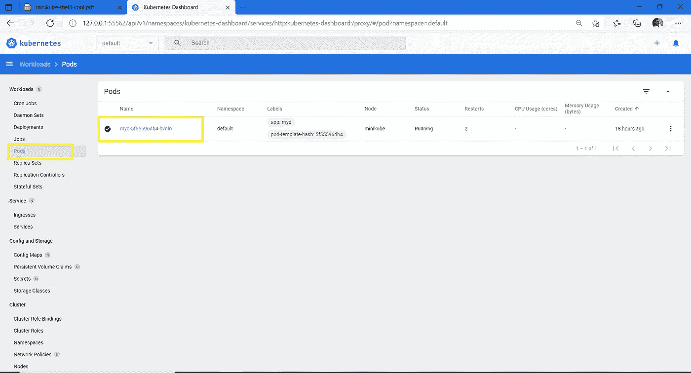

# Kubernetes 与 Python-CGI 的集成

> 原文：<https://medium.com/nerd-for-tech/kubernetes-integration-with-python-cgi-47ba26197c45?source=collection_archive---------17----------------------->

LW _ DATE _ 28 _ 06 _ 2021 _ 任务 09

# 库伯内特斯

Kubernetes(也称为 k8s 或“kube”)是一个开源容器编排平台，它自动化了许多涉及部署、管理和扩展容器化应用程序的手动流程。换句话说，您可以将运行 Linux 容器的主机集群在一起，Kubernetes 可以帮助您轻松高效地管理这些集群。

# Kubernetes 组件

当您部署 Kubernetes 时，您会得到一个集群。

Kubernetes 集群由一组称为[节点](https://kubernetes.io/docs/concepts/architecture/nodes/)的工作机组成，运行容器化的应用程序。每个集群至少有一个工作节点。

工作节点托管作为应用程序工作负载组件的[pod](https://kubernetes.io/docs/concepts/workloads/pods/)。[控制平面](https://kubernetes.io/docs/reference/glossary/?all=true#term-control-plane)管理集群中的工作节点和 pod。在生产环境中，控制平面通常在多台计算机上运行，一个群集通常运行多个节点，从而提供容错和高可用性。

本文概述了拥有一个完整的、正常工作的 Kubernetes 集群所需的各种组件。

# Kubernetes 组件-

## Kubernetes 与 Python-CGI 的集成

在这个实践中，我们尝试使用 Python CGI 对 k8s、JavaScript 感兴趣。在这个询问中，我们可以执行一些功能

特征

👉它可以启动用户给定的特定名称的吊舱。

👉使用用户提供的映像和名称运行部署。

👉在给定的用户输入端口号上公开服务。

👉根据用户需要缩放副本。

👉删除创建的完整环境。

👉删除用户给定的特定资源。

## 第一步

使用**迷你立方体启动**命令启动迷你立方体设置

使用 **minicube 状态**命令检查我们的状态是否正常

当状态正常时，微型多维数据集在 VMware 中运行

## 第二步

这是一个前端代码

后端 python 代码

**步骤 3-**

用户界面输出页面

在此 UI 页面中，我们启动 get port 命令并执行，然后查看输出结果

同样，我们可以检查 **cubectl get ports** 命令来检查端口是否正在运行

## 第四步-

如果你在任何浏览器中需要仪表板，我们使用 mini cube dasboard 命令，因为这个命令给出了

在该控制面板中，有检查窗格详细信息、部署详细信息以及我们可以看到和执行的所有服务类型

这个应用程序工作正常，你可以执行所有类型的 cubectl 命令…..

**感谢您的宝贵时间……..！！！**