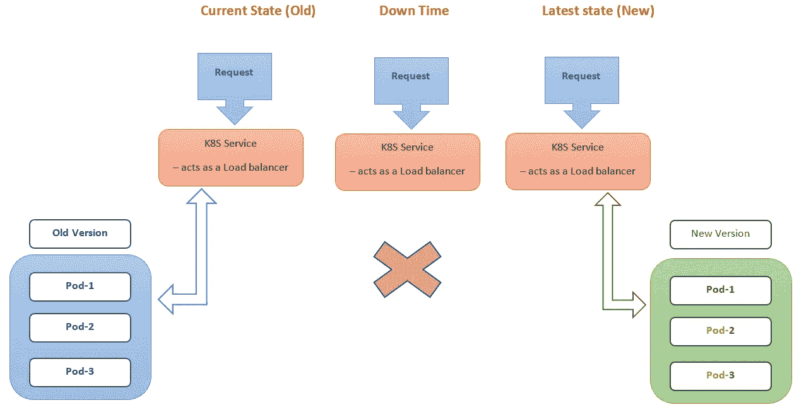
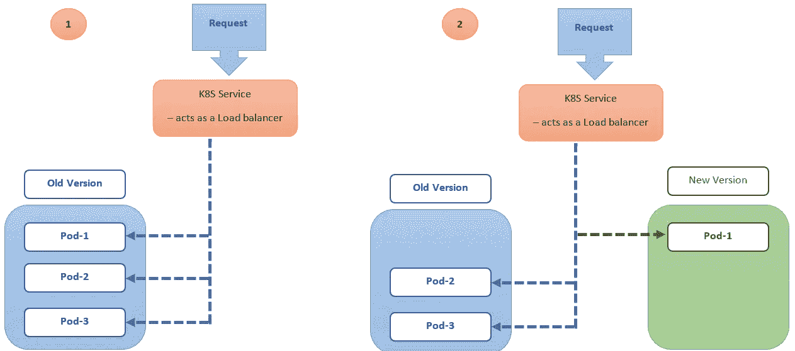
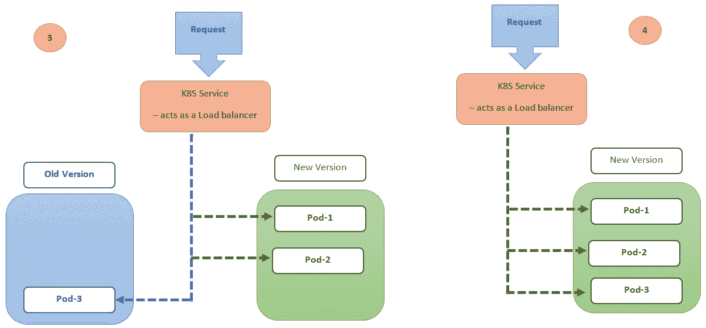
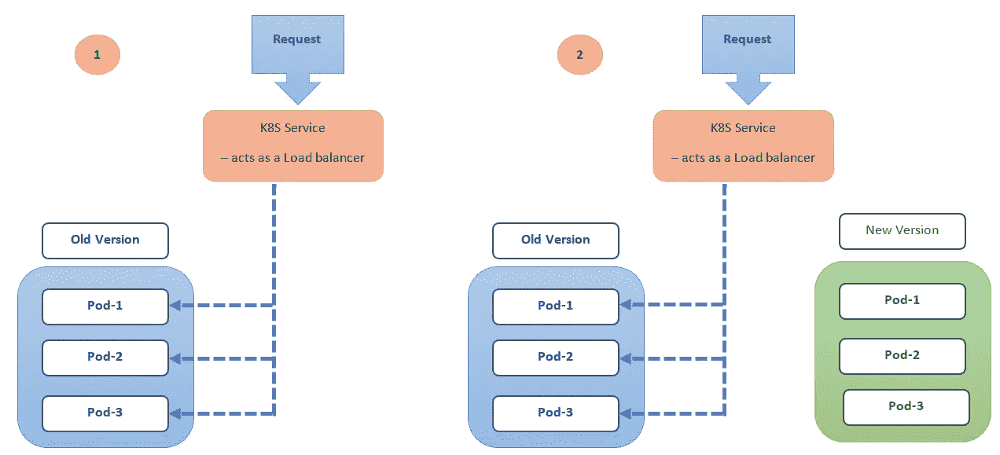
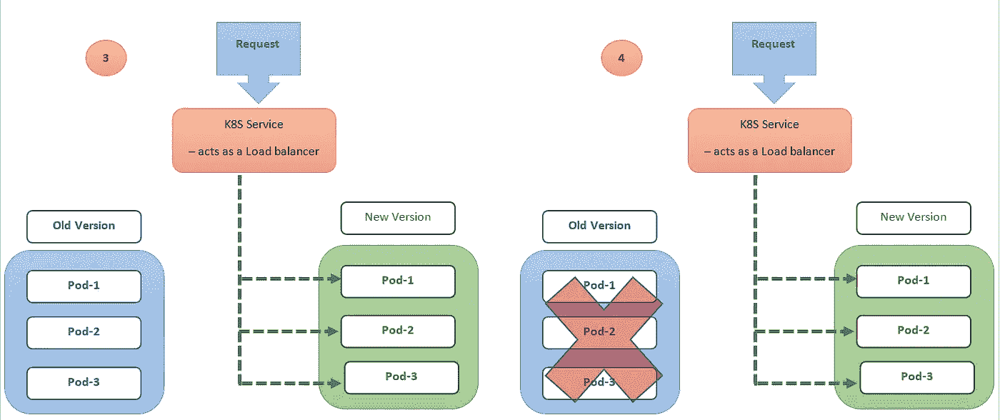
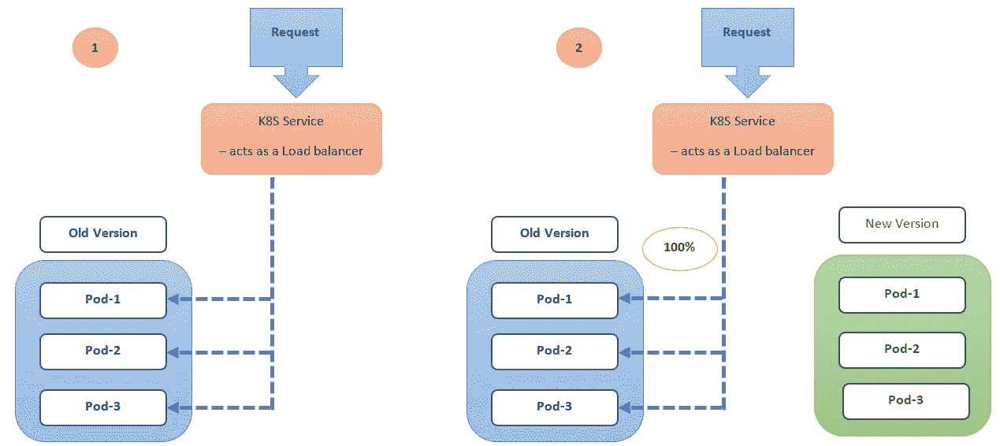
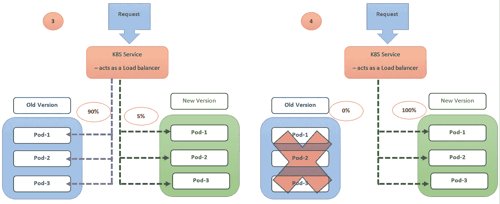
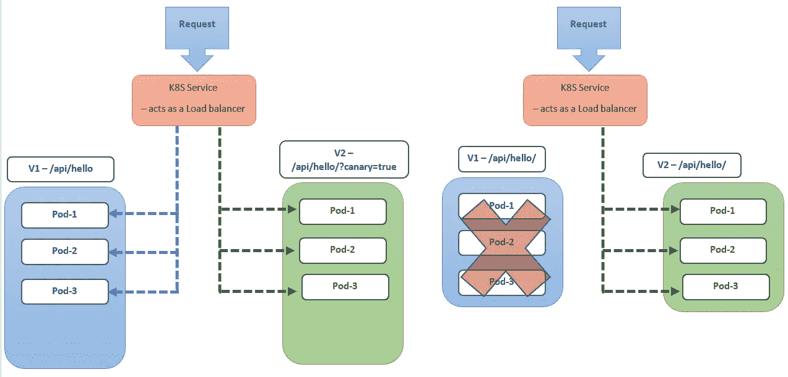
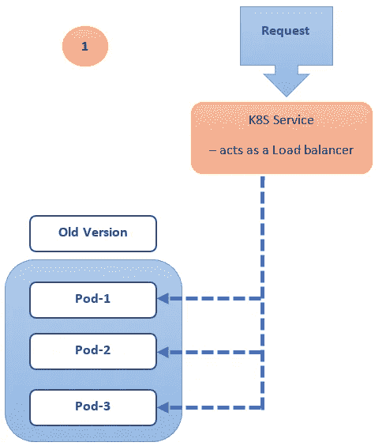
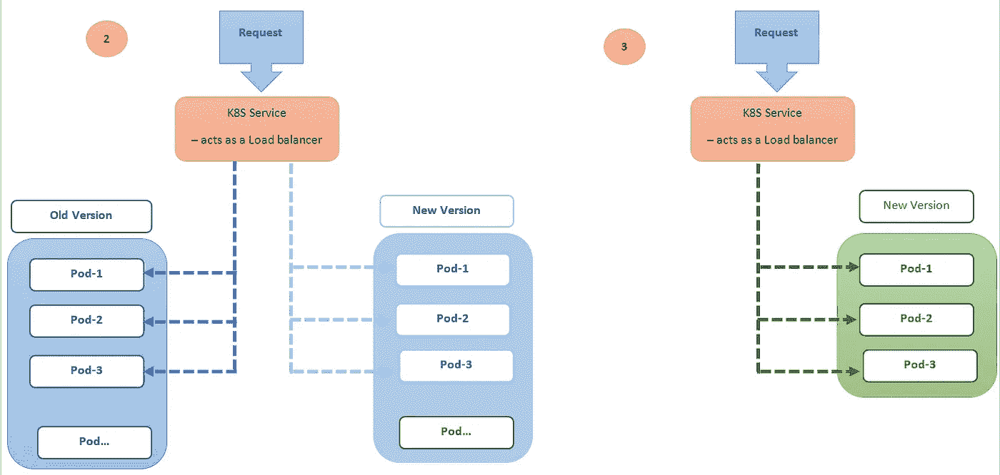

# Kubernetes (K8S)部署策略

> 原文：<https://medium.com/nerd-for-tech/kubernetes-k8s-deployment-strategies-1ef4c1dc1c6c?source=collection_archive---------1----------------------->

微服务架构在最近很常见，我们可以利用频繁发布的优势，快速上市，接收市场反馈，并根据当前市场标准改进应用功能。

有多种 Kubernetes 部署策略可用，根据我们的需求选择正确的策略非常重要。让我们列出部署策略。

> *1。重新创建部署
> 2。滚动更新部署
> 3。蓝色/绿色(或)红色/黑色展开
> 4。金丝雀部署
> 5。A/B 展开
> 6。影子(或)镜像部署*


[华凌](https://unsplash.com/@linghua?utm_source=medium&utm_medium=referral)在 [Unsplash](https://unsplash.com?utm_source=medium&utm_medium=referral) 上拍照

**什么是 Pod？**

Pod 是 Kubernetes (K8S)中部署的基本原子单位。

在 K8S 中，pod 是一组包含一个或多个共享存储和网络的容器。让我们详细了解一下每个 K8S 部署策略

> ***重建部署*** *:*

在这个部署策略中，所有的旧豆荚将被一次性杀死，并被新豆荚取代。

```
[...]
kind: **Deployment**
spec:
   replicas: **3**
   strategy:
      type: **Recreate**
[...]
```



重新创建策略的设置非常简单，但是由于应用程序停机时间，我们可以看到对用户体验的一些负面影响—考虑到关机/启动时间和回滚到以前版本的复杂性可能需要时间(如果对最新版本有任何影响)。

> ***滚动更新*** *:*

该策略以滚动更新或增量方式(即一个接一个)重新创建 pod，在这里，它将在不中断应用程序不可用的情况下终止并重新创建 pod。

```
[...]
kind: **Deployment**
spec:
   replicas: **3**
   strategy:
      type: **RollingUpdate**
[...]
```



与重新创建策略相比，滚动更新策略的设置可能比较复杂，但我们解决了应用程序停机的问题，从而减少了对用户体验的影响。我们仍然担心回滚到以前的版本，我们无法控制这里的流量。

> ***蓝/绿(或)红/黑调配*** *:*

在此策略中，旧(蓝色)和新(绿色)应用程序版本将一起部署。在这里，绿色部署通过不同的服务/端口提供，它将根据要求进行测试，并在以后用绿色部署替换蓝色部署。

我们可以通过单个服务或多个服务(使用入口)实现蓝/绿策略。



Blue/Green 在费用方面略高，因为它需要双倍的资源(因为它同时运行蓝色和绿色版本，直到它经过适当的测试并签署发布),并且新旧版本的设置都很复杂。它还需要对整个平台进行适当的测试，因为我们在生产中将应用程序的流量从旧版本完全更改为新版本。

> ***金丝雀部署*** *:*

Canary 部署将非常有助于向用户子集发布和测试新功能，并有助于全面推广(当新版本无缝运行时)。

假设我们需要用新功能转换 5%的流量，其余 95%的流量通过旧的稳定版本的应用程序。因此，如果我们发现新变化有任何问题，那么只有 5%的用户会受到影响。一旦确定新的变更可以顺利进行，我们就可以向其他用户展示这些变更，并通过新的变更实现 100%流量的金丝雀配置。



```
**Example**:...
kind: **Deployment**
metadata:
    name: shasr-app-v1
spec:
    replicas: 5
    template:
        labels:
            app: shasr-app
            version: v1.0.0
...

...
kind: **Deployment**
metadata:
    name: shasr-app-v2
spec:
    replicas: 1
    template:
        labels:
            app: shasr-app
            version: v2.0.0
...

...
kind: **Service**
metadata:
    name: shasr-app
spec:
    selector:
        app: shasr-app
...

...
kind: **RouteRule**
metadata:
    name: shasr-app
    spec:
        destination:
            name: shasr-app
        route:
        - labels:
            version: v1.0.0
          weight: **95** # 95% traffic
        - labels:
            version: v2.0.0
          weight: **5** # 5% traffic
...
```

金丝雀策略给我们带来了几个好处——零停机时间、流量监控、良好的客户体验、回滚非常快，因为我们可以将金丝雀(新版本)流量恢复到旧的稳定版本。缺点—与重新创建和滚动更新策略相比，设置 canary 配置有点复杂。

> **:**

*A/B 测试部署有点类似于 Canary 部署，在 A/B 部署中，我们在特定条件下将请求路由到用户子集，并且可以通过在顶级 Canary 部署上添加附加功能来实现。*

*我们可以用于 A/B 的可能条件*

*1.查询参数
2。技术支持:浏览器或版本、渠道、操作系统等。
3。自定义标题
4。语言 5。地理定位—基于地理位置
6。饼干*

**

```
*Example:kind: **RouteRule**
metadata:
    name: shasr-app-v1
spec:
    destination:
        name: shasr-app
    route:
    - labels:
        version: **v1.0.0**
    match:
        request:
            headers:
                x-api-version:
                    exact: "**v1.0.0**"kind: **RouteRule**
metadata:
    name: shasr-app-v2
spec:
    destination:
        name: shasr-app
    route:
    - labels:
        version: **v2.0.0**
    match:
        request:
            headers:
                x-api-version:
                    exact: "**v2.0.0**"*
```

*通过 A/B 测试，我们可以实现零停机时间、流量控制和目标用户、快速回滚。与其他部署策略相比，它的配置有点复杂。*

> ****阴影(或)镜像部署*** *:**

*在影子部署中，在发布旧版本的同时发布新版本。传入流量将被镜像到新版本，不会影响应用流量。它有助于在新版本上测试生产流量，并且可以根据应用程序的性能/稳定性进行部署。*

****

```
***Example**:kind: **RouteRule**
spec:
    destination:
        name: shasr-app-v1
    route:
    - labels:
        version: v1.0.0
        weight: 100
    - labels:
        version: v2.0.0
        weight: 0
    **mirror**:
        name: shasr-app-v2
        labels:
            version: v2.0.0*
```

*通过影子/镜像测试，我们可以实现零停机时间、流量控制和快速回滚。与其他部署策略相比，它的配置有点复杂，因为它需要双倍的资源(因为它同时运行实际资源和影子资源)，所以它的费用也很高。在正式发布的镜像版本上进行适当的测试和签署之前，不得进行首次展示。*