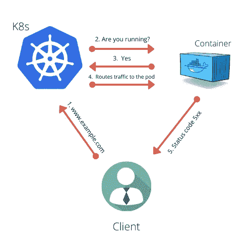

# Kubernetes 活性探针

> 原文：<https://medium.com/nerd-for-tech/kubernetes-liveness-probe-e4319b8ecee0?source=collection_archive---------5----------------------->

# 健康检查

使用 [Kubernetes](https://www.technologiesinindustry4.com/2020/09/Docker-Engine-What-is-Kubernetes.html) 的最大好处之一就是让我们的容器在集群中的某个地方运行。
但是如果其中一个集装箱坏了怎么办？如果一个 pod 的所有容器都死了怎么办？
如果应用程序容器因应用程序中的错误而崩溃， [Kubernetes](https://www.technologiesinindustry4.com/2020/09/Docker-Engine-What-is-Kubernetes.html) 会自动重启你的应用程序容器。但是当你的应用程序因为陷入无限循环或死锁而停止响应时，你会怎么说呢？
[Kubernetes](https://www.technologiesinindustry4.com/2020/09/Docker-Engine-What-is-Kubernetes.html) 为我们提供了感谢检查您的健康应用程序。
pod 通常被配置为从表面定期检查应用程序的健康状况，而不依赖于应用程序在内部进行检查。
您可以为 pod 规范中的每个容器指定一个活跃度。
[Kubernetes](https://www.technologiesinindustry4.com/2020/09/Docker-Engine-What-is-Kubernetes.html) 会定期执行探测，如果探测失败，会重启容器。
要点:“容器被重启”意味着旧的容器被杀死，全新的容器被创建— —这不是一个等价的容器被再次重启。

# 探针类型

有三种探针

1.  **HTTP GET**
    探针被计入[账户故障，如果
    探针收到错误响应码
    容器 app 没有丝毫响应
    **2，容器将自动**](https://www.technologiesinindustry4.com/2020/09/Docker-Engine-What-is-Kubernetes.html)重启。TCP Socket
    TCP Socket probe 倾向于打开一个 TCP 连接到容器的所需端口。
    如果连接保持成功，则探测成功。
    否则，重新启动容器。
    **3。Exec 探针**
    一个 EXEC 探针执行你在容器内部提供的一些命令，并检查命令的退出状态代码。
    如果状态代码声明为 0，则探测成功。
    所有其他代码都被视为失败。

更多详情请访问:[https://www . technologiesinindustry 4 . com/2020/10/kubernetes-liveness-probe . html](https://www.technologiesinindustry4.com/2020/10/kubernetes-liveness-probe.html)