# Kubernetes MiniKube 安装和运行基础命令

> 原文：<https://medium.com/nerd-for-tech/kubernetes-minikube-install-and-run-basics-command-46a206b747e3?source=collection_archive---------14----------------------->

**By- SANDEEP KUMAR PATEL**


# 迷你库贝

像 kind 一样，minikube 是一个让你在本地运行 Kubernetes 的工具。minikube 在您的个人电脑(包括 Windows、macOS 和 Linux PCs)上运行单节点 Kubernetes 集群，以便您可以试用 Kubernetes，或者进行日常开发工作。
minikube 在 macOS、Linux 和 Windows 上快速建立本地 Kubernetes 集群。我们自豪地专注于帮助应用程序开发人员和新的 Kubernetes 用户。

**注意-这种类型设置主要用于测试和学习目的，但实时生产水平我们不能使用这种结构。**

# 突出

1.支持最新的 Kubernetes 版本(+6 以前的次要版本)
2。跨平台(Linux，macOS，Windows)
3。作为虚拟机、容器或裸机进行部署
4。多容器运行时(CRI-O，containerd，docker)
5。Docker API 端点提供超快的图像推送
6。负载平衡器、文件系统挂载和 7 . 0 等高级功能。特性门
8。易于安装的 Kubernetes 应用程序的插件。

# Minikube 安装-

Minikube 是本地 Kubernetes，专注于让 Kubernetes 易于学习和开发。

您所需要的只是 Docker(或类似的兼容)容器或一个虚拟机环境，而 Kubernetes 只需一个命令

# 你需要什么

*   2 个或更多 CPU
*   2GB 的可用内存
*   20GB 的可用磁盘空间
*   互联网连接
*   容器或虚拟机管理器，例如:Docker、Hyperkit、Hyper-V、KVM、Parallels、Podman、VirtualBox 或 VMWare

**转到此链接，此链接是 minikune 的官方网站-**

 [## minikube 启动

### minikube 是本地 Kubernetes，专注于让 Kubernetes 易于学习和开发。你所需要的是码头工人…

minikube.sigs.k8s.io](https://minikube.sigs.k8s.io/docs/start/) 

# 在 Windows 上安装和设置 kubectl

您必须使用与您的集群相差一个次要版本的 kubectl 版本。例如，1.21 版客户端可以与 1.20 版、1.21 版和 1.22 版控制平面通信。使用最新版本的 kubectl 有助于避免不可预见的问题。

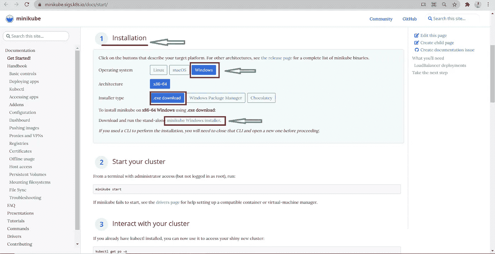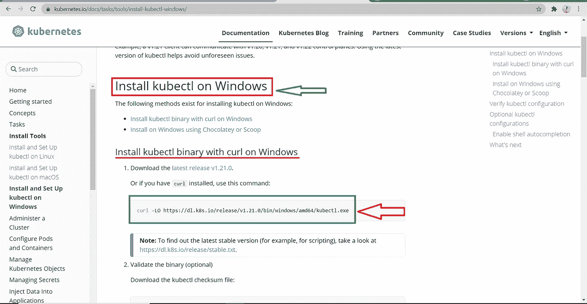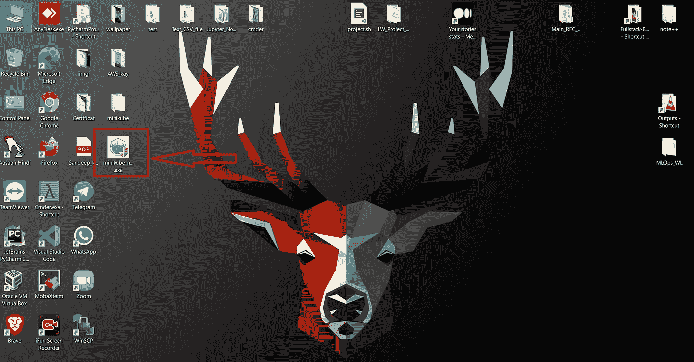

现在安装程序已经下载完毕，可以在一些图片下一步一步安装了

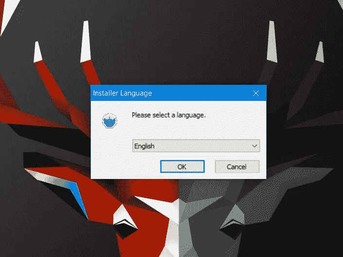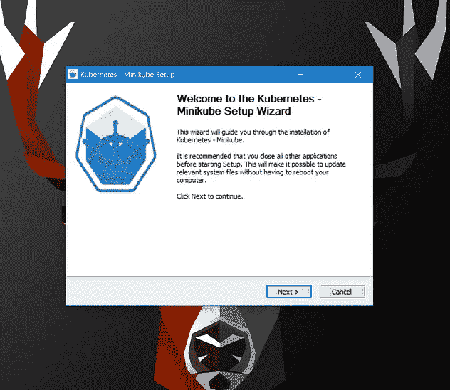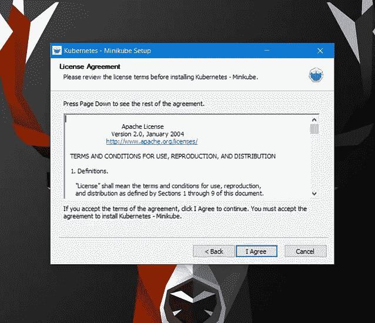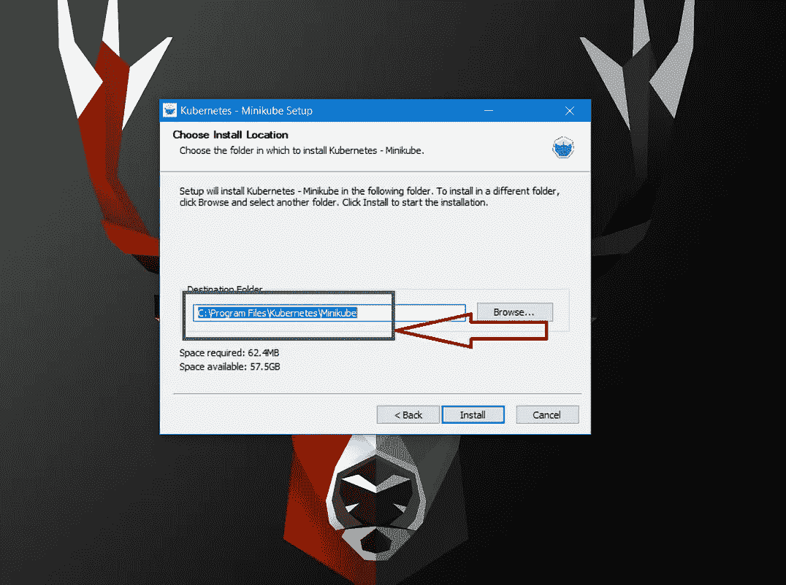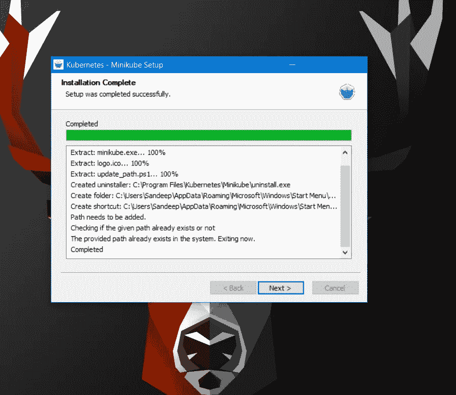

打开 CMD 命令提示符，但要确保命令提示符是以管理员级别打开的，否则这是由于问题是权限被拒绝而设置的

在我的例子中，我使用的是 commander 命令行界面

**开始使用 Minikube-**

```
minikube start
```

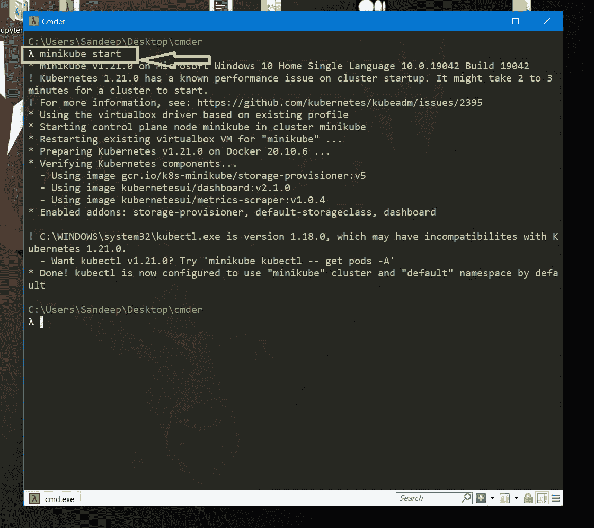

Minicube 启动这个命令时，我们正在火的时间需要一些时间，这取决于互联网的速度和系统配置，所以请耐心等待一段时间

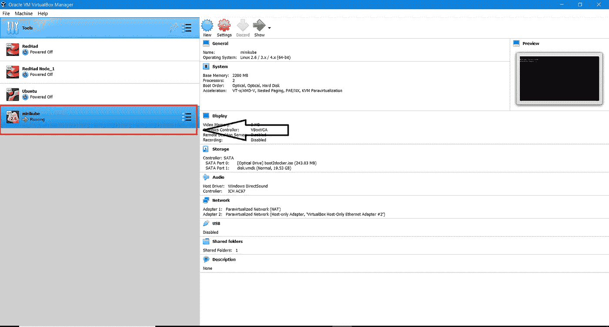

Open 命令执行成功，此时我们必须检查 Oracle virtualbox one mini cube 设置中的 Oracle virtualbox 是否已安装并自动运行

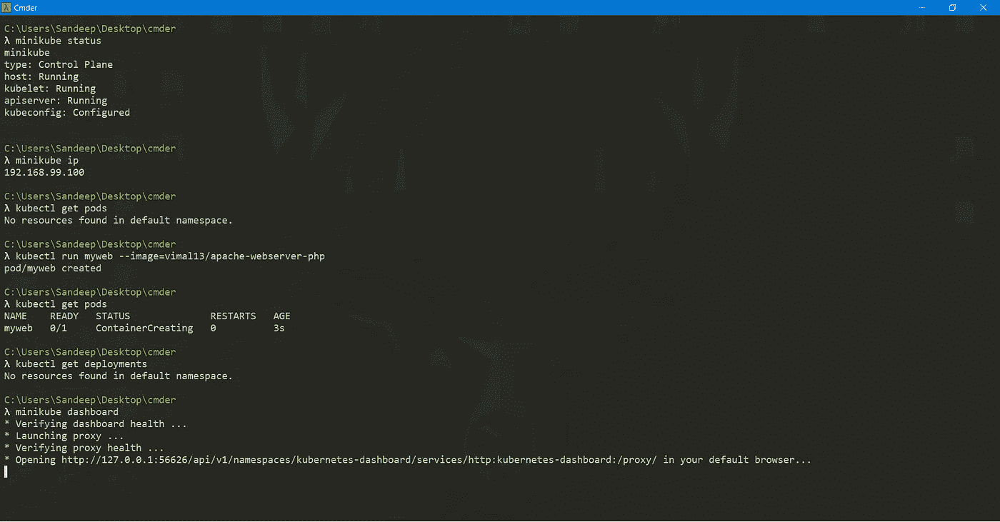

现在，我们可以运行所有基本命令，如

**minikube 状态
Minikube 版本
mini kube IP**
还有一些 kubectl 命令也
**Kubectl 获取 pod
kube CTL 运行**

**Minikube dashboard**
此命令当我们在此 webUI 页面中打开一个 web 门户 web UI 时，我们可以运行所有的 cubectl 和命令，并在仪表板上查看输出

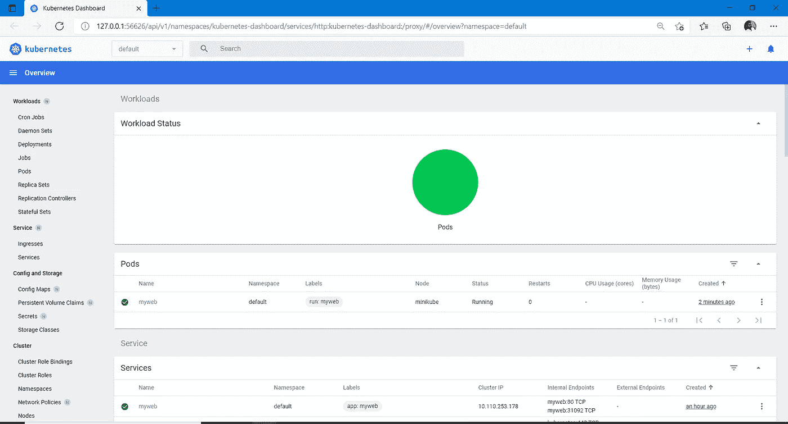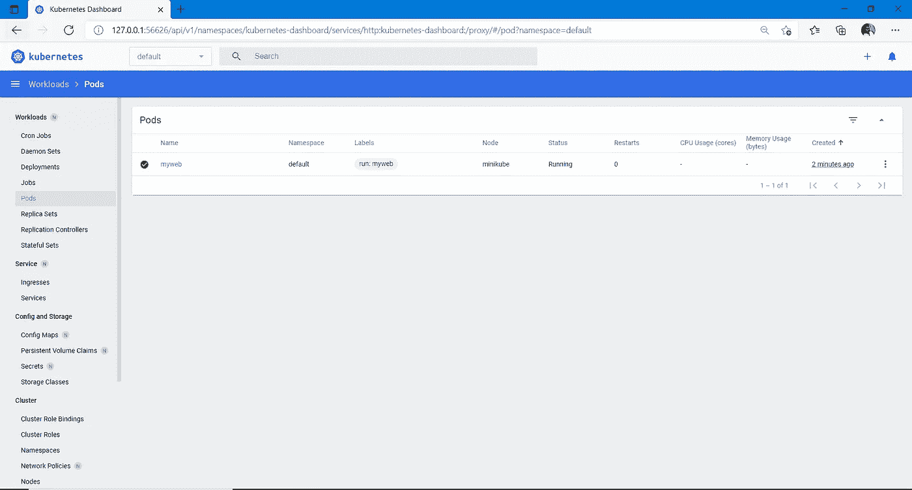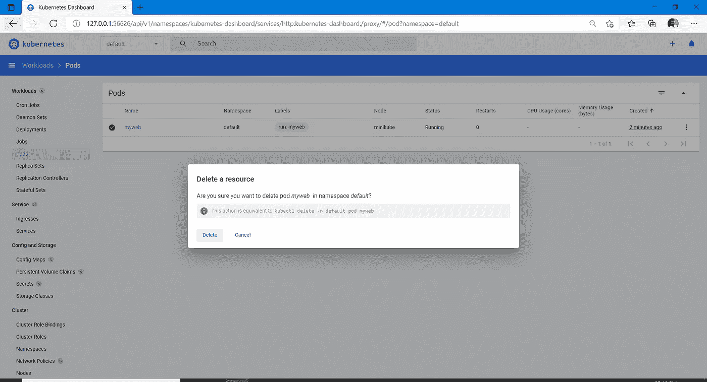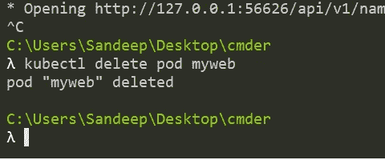

# 感谢您抽出时间……！！！！！