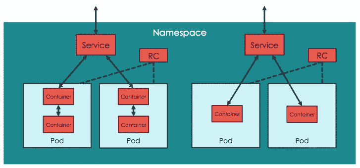

# Kubernetes 名称空间

> 原文：<https://medium.com/nerd-for-tech/kubernetes-namespace-1baea403336c?source=collection_archive---------16----------------------->



## 什么是名称空间？

名称空间适用于许多用户分布在多个团队或项目中的环境。名称空间不能相互嵌套，每个 Kubernetes 资源只能位于一个名称空间中。名称空间是在多个用户之间划分集群资源的一种方式。Kubernetes 使用一个默认的名称空间作为默认名称空间。

## 创建名称空间:

您可以使用命令提示符或 YAML 文件来创建命名空间。

**使用终端**

```
kubectl create namespace dev
```

**使用 yml 文件**

为此，创建一个名为 namespace.yml 的 yml 文件，并将以下命令放入其中。

```
apiVersion: v1
kind: Namespace
metadata:
  name: dev
```

并在终端上运行以下命令

```
kubectl apply -f namespace.yml
```

## 如何在这个命名空间中部署？

创建名称空间后，您可以通过两种方式在其中创建部署，但是您必须提及您将在其中部署的名称空间。

**使用端子**

```
kubectl run dev-nginx --image=nginx -n dev
```

**使用 yml**

这类似于普通的部署，你所要做的就是在你的 yml 文件的元数据下添加以下内容并应用它。

```
metadata:
  namespace: dev
```

通常，您创建的所有部署都将位于默认的**名称空间下。所以您可以使用典型的 kubectl get 命令直接访问它。**

但是在这种情况下，您必须使用一个额外的参数来查看您创建的 pod

```
kubectl get pods -n dev
```

通过使用这个命令，您可以看到您在名称空间 dev 下部署的所有 pod。

## 查看所有名称空间中的所有窗格

```
kubectl get pods --all-namespaces
```