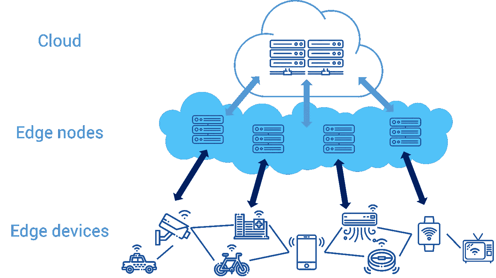
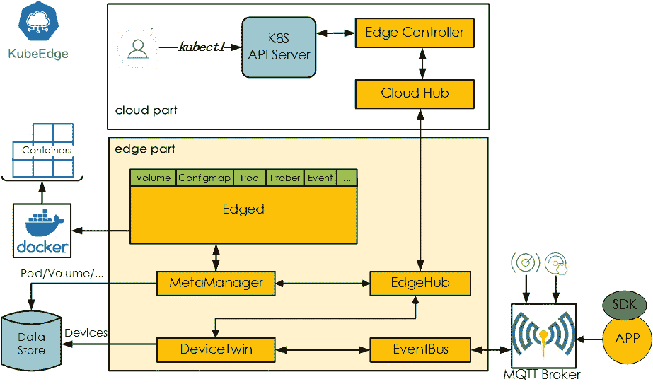

# Kubernetes 本地边缘计算框架

> 原文：<https://medium.com/nerd-for-tech/kubernetes-native-edge-computing-framework-kubeedge-d376eb0c6bab?source=collection_archive---------10----------------------->

## 介绍

我们在这里讨论 Kubernetes 原生边缘计算框架。KubeEdge 是一个开源项目。这是华为向云原生计算基金会(CNCF)贡献的第一个开源项目。它也是世界上第一个基于 Kubernetes 扩展的开放边缘计算平台。该扩展使云端协作成为可能。KubeEdge 的名字来源于 Kube 和 Edge。它依赖于 Kubernetes 容器调度及其能力来实现云端协作、计算浸渍和大型设备访问。

KubeEdge 提供完整的边缘计算解决方案。它基于 Kubernetes，具有独特的云和边缘核心模块。KubeEdge 准备建立边缘计算解决方案来推广云计算。控制平面存在于云中。然而，这是可升级和可扩展的。edge 可以同时在离线模式下工作。同样，它是轻量级和容器化的。它可以帮助边缘的异构硬件。KubeEdge places 通过优化边缘资源利用，为边缘解决方案节省了重要的安排和运营成本。这创造了目前世界上最令人信服的基于 Kubernetes 的边缘计算平台。

## 描述

KubeEdge 的主要目标是将 Kubernetes 生态系统从云扩展到边缘。它从 0.1 版开始提供基本的边缘计算结构。现在，随着最新版本 0.2 的发布，它将云组件连接起来并完成循环。KubeEdge 允许对边缘集群进行编排和组织，就像 Kubernetes 在云中实现的那样。这开启了将云计算能力推向边缘的统一可能性，快速而有力。

## 云端协作的本质

边缘计算和云计算是相对应的，而不是两种同等受限的技术。物联网或 Edge 与云数据中心或多或少有些相似之处，例如:

*   边缘还需要管理节点的计算、存储、网络和其他资源。
*   边缘应用同样需要容器化和微服务。
*   边缘计算希望拥有正常的 API 和工具链。
*   安全、数据或信道加密、认证和授权。

云数据中心到边缘的架构和能力是毋庸置疑的发展问题。目前，以下是一些需要云端协作的场景:

*   人工智能云和边缘实施的准备。AI 模型的训练位于云端，AI 的实现靠近设备端。
*   将微服务和 DevOps 引入边缘将显著加快物联网软件的迭代周期。例如，嵌入式设备和机器人可以提高部署、操作和维护效率。
*   数据备份垃圾场。例如，加密后的大量工业数据被保存在云中。
*   远程控制。云向边缘设备发送控制信号。
*   自动开发。就目前来看，边缘节点还不如自动增长能力好的云。我们可以选择将边缘的负载扩大到顶部的云。

我们已经收集了足够的经验来管理云上的资源。目前的后续挑战是如何建立一个边缘云平台，将云上资源的管理分散到边缘。此外，这使我们能够完美地管理边缘资源和设备。边缘云平台将强调以下事项:

*   大型或异构设备，进入网关和边缘节点的权利。
*   大量的遥测数据被组合和处理，供云应用程序使用。
*   设备安全和 ID 服务。
*   帮助远程命令到设备。
*   边缘节点和设备的自动形成和控制。
*   设备云到边缘应用、部署和配置。
*   为 edge 应用程序开发提供数据存储、场合管理、API 管理和数据检查能力。

## 库比奇建筑

KubeEdge 的核心架构原则是塑造界面。这些接口对 Kubernetes 是可靠的，位于云端或边缘端。KubeEdge 要解决的主要问题是:

*   云端协作
*   资源异质性
*   大量的
*   轻量级选手
*   一致的设备管理和访问体验。

KubeEdge 架构显然分为三层:云、边缘和设备层。这是一个从云到边缘再到设备的完整开源边缘云平台，减少了用户厂商的担心。

KubeEdge 的 Edge 方法包括以下五个模块:

*   Edged 是重新建立的轻量级 Kubelet。它适应 Kubernetes 资源对象的生命周期组织，例如 Pod、卷和节点。
*   元管理器负责本地元数据的解析。这主要是为了边缘节点的自治。
*   Edgehub 是一个多路复用的消息通道。它提供了可靠的、组织良好的云边缘信息同步。
*   Devicetwin 用于无形的物理设备，并在云中映射设备状态。
*   事件总线给出了来自 MQTT 代理的设计数据。

KubeEdge 的云流程包含以下两个组件:

*   Cloudhub 设置在云端，获取信息。信息边缘中心与云同步。
*   边缘控制器安装在云中，用于控制 Kubernetes API 服务器的状态同步。它控制边缘的节点、应用程序和配置。

Kubernetes 微波激射器进入云中。通过 kubectl 命令，用户可以公开管理云中的边缘节点、设备和应用程序。练习习惯与库伯内特人完全一样，不需要重新适应。

## 简单而轻便

只能设置 KubeEdge Edge 和云核心组件。他们可以运行用户应用程序。edge main 的内存为 66MB。它只需要 30MB 的内存就能运行。同理，云核心可以运行在任何云节点上。此外，用户可以通过在笔记本电脑上运行来练习。

安装非常简单，只需几个步骤即可完成:

*   安排先决条件 Docker、Kubernetes、MQTT 和 openssl
*   克隆和构建 KubeEdge 云和 Edge
*   运行云
*   运行边缘

每个步骤的详细步骤可从 [KubeEdge/kubeedge](https://github.com/kubeedge/kubeedge) 获得

## 设备管理

KubeEdge 为设备提供了一个可插拔的联合管理框架。这使得用户能够开发基于不同协议或实际需要的设备访问驱动程序。现在持续的和计划的支持协议有:

*   MQTT
*   蓝牙技术
*   OPC UA，
*   Modbus 等。

随着越来越多的社区合作伙伴的加入，KubeEdge 将在未来支持更多的设备通信协议。KubeEdge 通过设备双胞胎或数字双胞胎更新和同步设备状态。这为 Kubernetes 提供了云中的扩展 API 抽象设备对象。用户可以通过使用 kubectl 操作云中的 Kubernetes 资源对象来实现边缘设备。

更多详情请访问:【https://www.technologiesinindustry4.com】T2