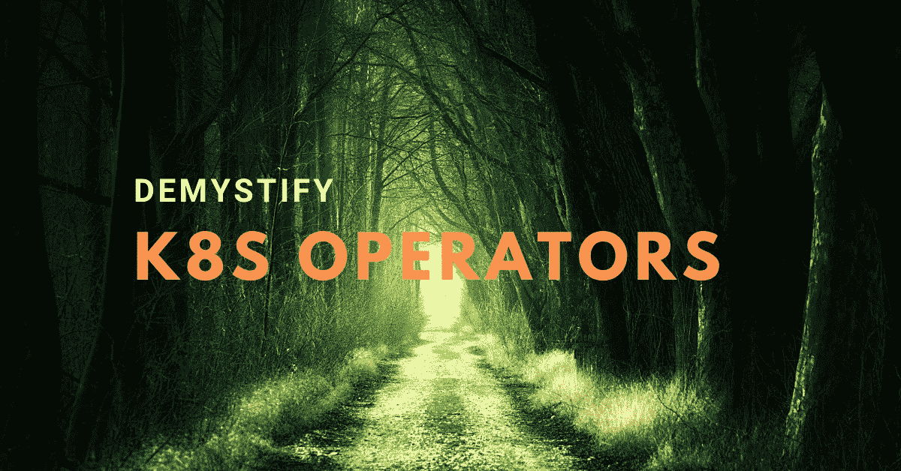

# Kubernetes 运营商揭秘

> 原文：<https://medium.com/nerd-for-tech/kubernetes-operator-demystified-dd8336c056dd?source=collection_archive---------7----------------------->



Kubernetes 运营商背后的奥秘！

让我们去掉一件事— Kubernetes 操作符不是一个对象。这是一种设计模式。说完了，让我们来了解一下什么是 Kubernetes 算子。

# 运算符模式

从[官方文件](https://kubernetes.io/docs/concepts/extend-kubernetes/operator/)来看，

> 操作员是 Kubernetes 的软件扩展，它利用定制资源来管理应用程序及其组件。操作员遵循 Kubernetes 原则，特别是控制回路。

那么，这意味着什么呢？这意味着 Kubernetes 操作符是一种结合了定制资源和定制控制器的设计模式。

再问一遍，这是什么意思？


Kubernetes 操作符是一种设计模式。

# 自定义资源

一个*资源*是 Kubernetes API 中的端点。
这个端点管理特定对象类型的数据——添加、编辑、删除。
例如，Pod 资源是 Kubernetes API 中管理 Pod 对象数据的端点。

同样地，*自定义资源*是 Kubernetes API 中的自定义端点，不是默认安装的一部分。一旦在集群中创建了自定义资源定义(CRD ),就可以使用为管理自定义资源对象的数据而创建的自定义端点来执行所有基本的 REST API 调用——GET、PUT、POST、DELETE、PATCH 等等。

# 控制器或控制回路

*再一次，让我们把这个也去掉——控制器不是 Kubernetes 对象。这是一种设计模式。继续前进…*

自定义资源定义将只创建一个自定义端点来盲目地存储和检索与自定义对象相关的数据。但是，这个自定义资源应该做什么呢？例如，ReplicaSet 资源创建 Pod，Pod 资源创建容器—您的资源将做什么？这就是*定制控制器*发挥作用的地方。

*控制器*是一个控制循环/非终止进程，它不断检查至少一个 Kubernetes 对象(内置或自定义)的状态。这是在添加、删除或修改特定资源类型的对象时通知的脚本。然后，您可以决定您想要对该事件做什么——创建容器、调用外部 URL，无论您喜欢什么。

要创建一个控制循环脚本，您只需要一种方法来检测集群中发生的变化——比如添加、删除或修改特定类型的新对象。Kubernetes 对此有一个内置的特性叫做 ***手表*** 。

# Kubernetes API 手表

文档[很好地解释了这一点，](https://kubernetes.io/docs/reference/using-api/api-concepts/#efficient-detection-of-changes)

> 为了使客户机能够构建一个集群当前状态的模型，所有 Kubernetes 对象资源类型都需要支持一致的列表和一个称为 **watch** 的增量变更通知提要。每个 Kubernetes 对象都有一个`resourceVersion`字段，表示存储在底层数据库中的资源版本。当检索资源集合(命名空间或集群范围)时，来自服务器的响应将包含一个`resourceVersion`值，该值可用于启动对服务器的监视。服务器将返回在提供的`resourceVersion`之后发生的所有更改(创建、删除和更新)。这允许客户端获取当前状态，然后观察变化，而不会错过任何更新。如果客户端观察器断开连接，它们可以从最后返回的`resourceVersion`开始重新启动新的观察器，或者执行新的收集请求并重新开始。

我们试着用一个例子来理解这一点。

这是一个示例 API 调用，用于获取默认名称空间中的窗格列表。
响应返回 3 个 pod。注意每个 Pod 的元数据中的 *resourceVersion* 。 *resourceVersion* 类似于数据库中对象的 ID。

```
*curl --insecure -H "Authorization: Bearer $TOKEN"* [*https://kubernetes/api/v1/namespaces/default/pods*](https://kubernetes/api/v1/namespaces/default/pods){
  "kind": "PodList",
  "apiVersion": "v1",
  "metadata": {
    "resourceVersion": "1291"
  },
  "items": [
    {
      "metadata": {
        "name": "test-ccdc9b768-nxtcw",
        "namespace": "default",
 **"resourceVersion": "918",**
        ...
      },
      "spec": {
      ...  
      },
      "status": {
        ...
      }
    },
    {
      "metadata": {
        "name": "test-ccdc9b768-vwsxn",
        "namespace": "default",
 **"resourceVersion": "953",**
        ...
      },
      "spec": {
        ...
      },
      "status": {
        ...
      }
    },
    {
      "metadata": {
        "name": "test-ccdc9b768-vxhds",
        "namespace": "default",
 **"resourceVersion": "*987*",**
        ...
      },
      "spec": {
        ...
      },
      "status": {
        ...
      }
    }
  ]
}
```

现在，您可以通过在 API 调用中发送`watch=1`和`resourceVersion=<resourceVersion>`来启动对默认名称空间中的 pod 的*监视*。这将会做的是，

*   在此 resourceVersion 之后，返回默认命名空间中对象类型窗格的所有事件。
*   保持连接打开(使用长轮询)，以便您可以继续获取事件。

例如，如果我创建了一个名为“my-new-test-pod”的新 Pod，然后使用上一次调用的最新资源版本(在我们的示例中是 987)启动了一个观察器，那么我将得到如下响应…

```
*curl --insecure -H "Authorization: Bearer $TOKEN"* [*https://kubernetes/api/v1/namespaces/default/pods?****watch=1&resourceVersion=987***](https://kubernetes/api/v1/namespaces/default/pods?watch=1&resourceVersion=987){"type":"ADDED","object":{"kind":"Pod","apiVersion":"v1","metadata":{"name":"my-new-test-pod","resourceVersion":"11046"...},"spec":{...}...}}
{"type":"MODIFIED","object":{"kind":"Pod","apiVersion":"v1","metadata":{"resourceVersion":"11047"...},"spec":{...}...}}
```

每当与默认名称空间中的 Pod 相关联的事件发生时，我将获取事件类型和具有 resourceVersion 和 specs 的对象信息。这个连接不会关闭——因此，我将继续获取事件列表。我现在可以决定如何处理这些事件了！

# 我们用一个例子来理解流程。

Kubernetes 操作符是定制资源定义&定制资源的控制循环脚本(控制器)。就是这样。

这些是我们将遵循的步骤:

1.  创建自定义资源
2.  创建一个将运行我们的控制循环脚本的 Pod
3.  决定我们的脚本将如何处理这些事件

## 步骤 1:创建自定义资源

为了创建一个定制资源，我们需要创建一个*定制资源定义* (CRD)。查看官方文档了解更多关于自定义资源定义的[语法](https://kubernetes.io/docs/tasks/extend-kubernetes/custom-resources/custom-resource-definitions/)

CRD 将描述我们的新资源的模式(模式意味着什么字段可以在我们的新资源中使用，什么是值的数据类型，默认值，验证等)。

```
*mycrd.yaml*apiVersion: apiextensions.k8s.io/v1
kind: CustomResourceDefinition
metadata:
  name: mywebservers.k8sobjects.gsa.com
spec:
  group: k8sobjects.gsa.com
  scope: Namespaced
  names:
    kind: MyWebserver
    singular: mywebserver
    plural: mywebservers
    shortNames:
    - myweb
    - mws
  versions:
    - name: v2
      served: true
      storage: true
      schema:
        openAPIV3Schema:
          type: object
          properties:
            spec:
              type: object
              properties:
                image:
                  type: string
                port:
                  type: integer
                replicas:
                  type: integer
```

上图中，CRD 为一个名为“MyWebserver”的新对象定义了模式。可以用名字 *mywebserver* 、 *mywebservers* 、 *myweb* 、 *mws* 来指代。

```
kubectl apply -f mycrd.yaml
```

这个定制资源定义将在 Kubernetes API 中创建新的端点

```
**# Get the list of API groups available. You should see your custom resource listed here**
*curl --insecure -X GET -H "Authorization: Bearer $TOKEN"* [*https://kubernetes/apis/*](https://kubernetes/apis/){
  "kind": "APIGroupList",
  "apiVersion": "v1",
  "groups": [
    ...
    {
      "name": "apps",
      "versions": [
        {
          "groupVersion": "apps/v1",
          "version": "v1"
        }
      ],
      "preferredVersion": {
        "groupVersion": "apps/v1",
        "version": "v1"
      }
    },
    ...
    {
      "name": "k8sobjects.gsa.com",
      "versions": [
        {
          "groupVersion": "k8sobjects.gsa.com/v2",
          "version": "v2"
        }
      ],
      "preferredVersion": {
        "groupVersion": "k8sobjects.gsa.com/v2",
        "version": "v2"
      }
    }
  ]
}**# Get list of *mywebserver* objects in any namespace**
*curl --insecure -X GET -H "Authorization: Bearer $TOKEN"* [*https://kubernetes/apis/k8sobjects.gsa.com/v2/mywebservers*](https://kubernetes/apis/k8sobjects.gsa.com/v2/mywebservers){
  "apiVersion":"k8sobjects.gsa.com/v2",
  "items":[....],
  "kind":"MyWebserverList",
  "metadata":{"continue":"","resourceVersion":"16800"}
}
```

因此，基于这个自定义资源定义创建我的新对象的 YAML 将如下所示

```
*myobj.yaml*apiVersion: "k8sobjects.gsa.com/v2"
kind: MyWebserver
metadata:
  name: webapp
spec:
  image: nginx
  port: 80
  replicas: 2**kubectl apply -f myobj.yaml**
```

`*apiVersion*`是您的 CRD <组名> / <版本名>
对象有一个属性 *spec* ，它有类型 string 的子属性 *image* 、类型 integer 的 *port* 和类型 integer 的 *replicas* 。
您现在可以使用`kubectl`来管理该对象。

```
**kubectl get mws**
NAME     AGE
webapp   67s**kubectl describe mws webapp**
Name:         webapp
Namespace:    default
Labels:       <none>
Annotations:  <none>
API Version:  k8sobjects.gsa.com/v2
Kind:         MyWebserver
Metadata:
  Creation Timestamp:  2021-08-06T18:57:09Z
  Generation:          1
  Managed Fields:
    API Version:  k8sobjects.gsa.com/v2
    Fields Type:  FieldsV1
    fieldsV1:
      f:metadata:
        f:annotations:
          .:
          f:kubectl.kubernetes.io/last-applied-configuration:
      f:spec:
        .:
        f:image:
        f:port:
        f:replicas:
    Manager:         kubectl-client-side-apply
    Operation:       Update
    Time:            2021-08-06T18:57:09Z
  Resource Version:  17033
  UID:               ce87c872-ad71-4092-a0ec-a10f65a4b132
Spec:
  Image:     nginx
  Port:      80
  Replicas:  2
Events:      <none>**# List mywebserver objects in the default namespace**
*curl --insecure -X GET -H "Authorization: Bearer $TOKEN"* [*https://kubernetes/apis/k8sobjects.gsa.com/v2/namespaces/default/mywebservers*](https://kubernetes/apis/k8sobjects.gsa.com/v2/namespaces/default/mywebservers){
  "apiVersion":"k8sobjects.gsa.com/v2",
  "items":[
    {
      "apiVersion":"k8sobjects.gsa.com/v2",
      "kind":"MyWebserver",
      "metadata":{
        "annotations":{...},
        "creationTimestamp":"2021-08-06T18:57:09Z",
        "generation":1,
        "managedFields":[...],
        "name":"webapp",
        "namespace":"default",
        "resourceVersion":"17033",
        "uid":"ce87c872-ad71-4092-a0ec-a10f65a4b132"
      },
      "spec":{
        "image":"nginx",
        "port":80,"replicas":2
      }
    }
  ],
  "kind":"MyWebserverList",
  "metadata":{
    "continue":"",
    "resourceVersion":"17265"
  }
}
```

## **步骤 2:创建一个 Pod，它将运行我们的控制循环脚本**

既然已经创建了定制资源，我们需要一个控制循环脚本来监视这个定制资源，并在创建、删除或修改这个定制资源类型的对象时获取事件。

为什么我们要在 Pod 中运行这个控制循环脚本？

*   使用服务帐户向我们的脚本授予必要的权限更容易。
*   您可以将 pod 作为守护进程运行，以确保它始终在运行。

为了简单起见，我将使用 PHP 来运行我们的控制循环脚本。你可以随意使用任何你喜欢的编程语言。认为控制循环脚本只能用 Go、Python 或 Java 编写是一种误解！

这里是*服务帐号*来给我们的脚本必要的权限。我们允许自己在任何名称空间中使用自定义资源(MyWebserver)、部署和 pod。

```
*permissions.yaml*---
apiVersion: v1
kind: ServiceAccount
metadata:
  name: mywebservers-sa---
apiVersion: rbac.authorization.k8s.io/v1
kind: ClusterRole
metadata:
  name: mywebservers-cr
rules:
- apiGroups:
  - apiextensions.k8s.io
  resources:
  - customresourcedefinitions
  verbs:
  - list
- apiGroups: ["extensions", "apps"]
  resources: ["deployments"]
  verbs: ['*']
- apiGroups:
  - ""
  resources:
  - pods
  verbs:
   - '*'
- apiGroups:
  - "k8sobjects.gsa.com"
  - "k8sobjects.gsa.com/v2"
  resources:
  - mywebservers
  verbs:
   - '*'---
kind: ClusterRoleBinding
apiVersion: rbac.authorization.k8s.io/v1
metadata:
  name: mywebservers-crb
subjects:
- kind: ServiceAccount
  name: mywebservers-sa
  namespace: default
roleRef:
  kind: ClusterRole
  name: mywebservers-cr
  apiGroup: rbac.authorization.k8s.io
```

这个部署将运行我的控制循环脚本。它当然在自定义 Docker 图像中。

```
apiVersion: apps/v1
kind: Deployment
metadata:
  name: php-client
spec:
  replicas: 1
  selector:
    matchLabels:
      app: php-client
  template:
    metadata:
      labels:
        app: php-client
    spec:
      serviceAccountName: mywebservers-sa
      containers:
        - name: n1
          image: gayatrisa/learn-k8s:client
          ports:
            - containerPort: 80
```

## 第三步:决定你想在你的脚本中做什么

最终，我希望做的是，当创建一个类型为 *mywebserver* 的对象时，必须使用在 *mywebserver* 对象中指定的映像名称和端口号创建一个部署&服务对象。

我的控制循环脚本如下所示。(我隐藏了流等的 PHP 编码复杂性。在 [GitHub](https://github.com/gayatri-sa/k8s-operator) 上有一个工作代码。)

```
<?php
$myop = new K8sClient();$resourceVersion = '';
do {
    $events = $myop->watchObject($resourceVersion);
    if (!empty($events) && is_array($events)) {
       $latestResourceVersion = $events[sizeof($events)-1]['object']['metadata']['resourceVersion'];if ($resourceVersion >= $latestResourceVersion) {
            break;
        }
        $resourceVersion = $latestResourceVersion;
    }
    foreach ($events as $event) {       
        switch ($event['type']) {
            case 'ADDED':
                echo '----- EVENT TYPE: ADDED -----' . "\n";
                ***// Create a deployment and service based on the object data we got from the event***
                break;
            case 'DELETED':
                echo '----- EVENT TYPE: DELETED -----' . "\n";
                ***// Delete the deployment and service we created based on the object data we got from the event***
                break;
        }
    }

} while (!empty($events));
```

因此，对于添加的每个 *mywebserver* 对象，我的控制器(控制循环脚本)会创建 1 个部署和 1 个服务对象。类似地，对于每个 *mywebserver* 对象，您删除相应的 1 个部署和 1 个服务对象将被我的控制器删除。

现在，您拥有全部的权力——您甚至可以选择触发一个外部操作！

# 结论

那么，在一个简单的 Kubernetes 操作符设计中，您需要什么:

*   自定义资源定义，用于创建自定义 API 端点
*   自定义控制器/控制循环脚本，它将获取与您的自定义资源相关的事件
*   一个 Pod，用于运行您的控制循环脚本
*   服务帐户，为您的控制循环脚本提供必要的权限

许多精彩的 SDK 隐藏了这些复杂性和步骤，使所有这些对您来说都很顺利和容易。其中最受欢迎的是 [OperatorSDK](https://sdk.operatorframework.io/) 。一旦这个流程清晰了，我会推荐使用 SDK，而不是自己做所有的事情。