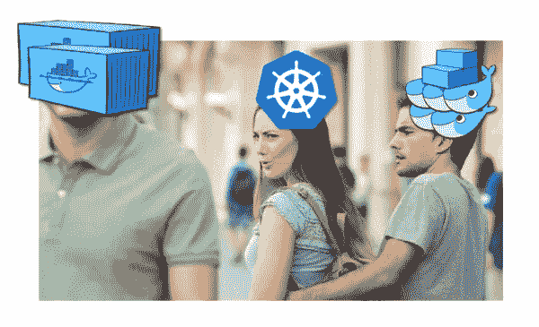
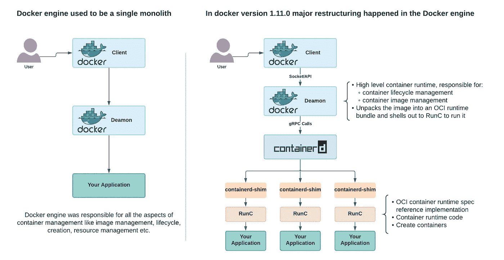
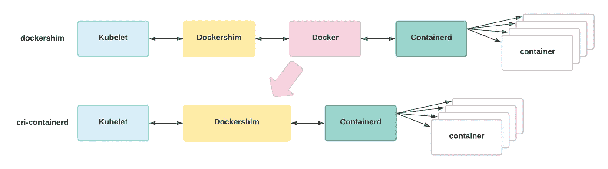
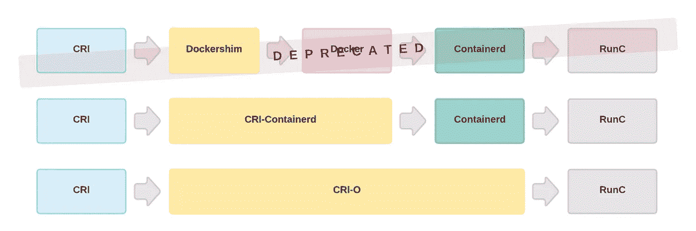

# Kubernetes 说“再见码头工人，你好集装箱”。开发者应该怎么说？

> 原文：<https://medium.com/nerd-for-tech/kubernetes-said-goodbye-docker-hello-containers-what-should-developers-say-ed57e3582992?source=collection_archive---------1----------------------->

由于这个消息已经传播了一段时间，从下一个版本 1.20 [开始，Kubernetes](https://www.itproportal.com/features/kubernetes-explained-are-your-containers-safe/) 将不再像以前一样支持 Docker。我们已经在管理员和开发人员的眼中看到了一些恐慌，但实际上这种变化并不那么引人注目。至少对开发者来说不是。

# **那么这对开发者有什么好处呢？我们已经很困惑了，但是我们应该抓狂吗？**

首先，我们需要理解，对于“Docker”这个名称，我们实际上一直在谈论两种不同的环境:一种(1)用于运行容器(容器运行时)，另一种(2)用于构建容器(开发环境)。这是造成混乱的主要原因。

首先，好消息——这一变化并不意味着你应该停止使用 Docker 作为开发工具。Docker 现在是，而且在可预见的将来很可能会是构建容器的有用工具。我们通过运行 ***docker build*** 创建的容器映像仍将在我们的 Kubernetes 集群中运行。所以，是的，我们仍将编写 Docker 文件，我们仍将使用 Docker 构建容器。

这一变化实际上只与 Docker 容器运行时有关。在我们的 Kubernetes 集群内部，有一个叫做容器运行时的东西，它负责**拉**和**运行**你的容器映像。Docker 一直是该运行时的流行选择，但它并不是为嵌入到 Kubernetes 中而设计的。这就是问题一直隐藏的地方。

事实上，自从 1.11.0 版本以来，Docker 不再是一个单一的整体——它是一个完整的堆栈，其中只有一部分称为 *containerd，*单独负责运行容器。Docker 堆栈中更多的东西与容器构建和用户体验增强相关，这使得我们在进行开发工作时更容易与人交互。

由于这个对人类友好的抽象层，您的 Kubernetes 集群(它毕竟不是人类)必须使用另一个叫做 *Dockershim* 的工具来达到它所需要的东西，这个工具就是 *containerd* 。这并不好，因为我们不喜欢开发中的复杂性——它带来了额外的东西需要维护，并且有可能会中断。现在回到 Kubernetes 的新闻。最近的更新主要与 dockershim 正在从 Kubelet 版本 1.23 中删除有关，kube let 版本 1.23 是负责容器运行时的一部分，它将不再受支持。但是如果 containerd 是 Docker 的一部分，为什么我们还需要 Kubernetes 中的 Dockershim 呢？

这里的问题是 Docker 不符合[容器运行时接口](https://kubernetes.io/blog/2016/12/container-runtime-interface-cri-in-kubernetes/) (CRI)。如果是的话，我们就不需要垫片了。

**简而言之，对于开发人员来说，只有一件事需要注意:**如果您现在依赖底层 docker 套接字(/var/run/docker.sock)作为集群中工作流的一部分，那么迁移到不同的运行时将会破坏您使用它的能力。这种模式通常被称为 Docker 中的 Docker。对于这个特定的用例，有很多选择，包括像 [kaniko](https://github.com/GoogleContainerTools/kaniko) 、 [img](https://github.com/genuinetools/img) 和 [buildah](https://github.com/containers/buildah) 这样的东西。

# **坦率地说，这对开发者来说是个好消息**

如果您没有注意到，我们用 Docker 构建的容器映像实际上并不是 Docker 特有的映像，它们是 OCI ( [开放容器倡议](https://opencontainers.org/))映像，是一个 Linux 基金会项目，旨在设计操作系统级虚拟化的开放标准，最重要的是 Linux 容器。最棒的是，任何符合 OCI 标准的图像，不管我们用什么工具来构建，在 Kubernetes 看来都是一样的。 [containerd](https://containerd.io/) 和 [CRI-O](https://cri-o.io/) 都知道如何提取和运行这些图像。这就是为什么我们对容器的外观有一个标准。

因此，这种变化会给我们中的一些人带来问题，但这不会是灾难性的，通常对大多数人来说是件好事，它会让事情变得更容易。取决于你如何与 Kubernetes 互动，这可能对你毫无意义，也可能意味着一点工作。所以基本上，我们只需要将我们的容器运行时从 Docker 更改为另一个受支持的容器运行时，就这样。

# **容器运行时我们现在需要从**中选择

因此，简而言之，容器运行时执行以下部分或全部任务:

*   集装箱图像管理
*   集装箱生命周期管理
*   容器创建
*   集装箱资源管理

一些最流行的符合 OCI 标准的容器运行时如下:

*   [**containerd**](https://containerd.io/) 是来自云原生计算基金会(CNCF)的项目。它管理整个容器生命周期，包括映像管理、存储和容器生命周期、监督、执行和联网。实际上，Docker 在五大云提供商的支持下将 *containerd* 捐赠给了 CNCF:AWS、谷歌云平台、微软 Azure、IBM Softlayer 和阿里云，其宗旨是成为多个容器平台和编排系统的核心容器运行时。
*   [**LXC**](https://linuxcontainers.org/) 通过拥有自己的进程和网络空间的虚拟环境提供 OS 级虚拟化，它使用 linux cgroups 和命名空间来提供隔离。
*   [**RunC**](https://github.com/opencontainers/runc)**是一个 CLI 工具，用于根据 OCI 规范生成和运行容器。它最初是作为 Docker 的一部分开发的，后来作为一个独立的开源工具和库被提取出来，成为第一个符合 OCI 运行时规范的参考实现。**
*   **[**CRI-O**](https://cri-o.io/) 是 Red Hat 对 Kubernetes CRI 的轻量级实现，支持使用 OCI 兼容的运行时。它是一个轻量级的，也是使用 Docker 作为 Kubernetes 运行时的最受欢迎的选择之一。类似地， *containerd* 也是基于 runc 实现的，但是 cri-o 声明它对于 Kubernetes 来说是“刚好够用”的运行时，仅此而已，只是在基本 runc 二进制之上添加了必要的函数来实现 Kubernetes CRI。可能类似于我们现在在英特尔和 AMD 的竞争中看到的情况。**
*   **[**rkt**](https://coreos.com/rkt/) 是为现代生产云原生环境开发的 CoreOS 应用容器引擎。**

**因此，如果以上所有内容对您来说都是新事物，尤其是如果您是 DevOps，我鼓励您开始熟悉所有这些符合 OCI 的容器运行时。为变化做好准备，只是不要惊慌！**

# ****后续阅读有用链接:****

1.  **揭秘开放容器倡议(OCI)规范**—**[https://www . docker . com/blog/demystifying-Open-Container-Initiative-OCI-Specifications/](https://www.docker.com/blog/demystifying-open-container-initiative-oci-specifications/)**
2.  **开放集装箱倡议—[https://opencontainers.org](https://opencontainers.org/)**
3.  **kubernetes v 1.20:Raddest 发布—[https://kubernetes . io/blog/2020/12/08/kubernetes-1-20-Release-announcement/](https://kubernetes.io/blog/2020/12/08/kubernetes-1-20-release-announcement/)**