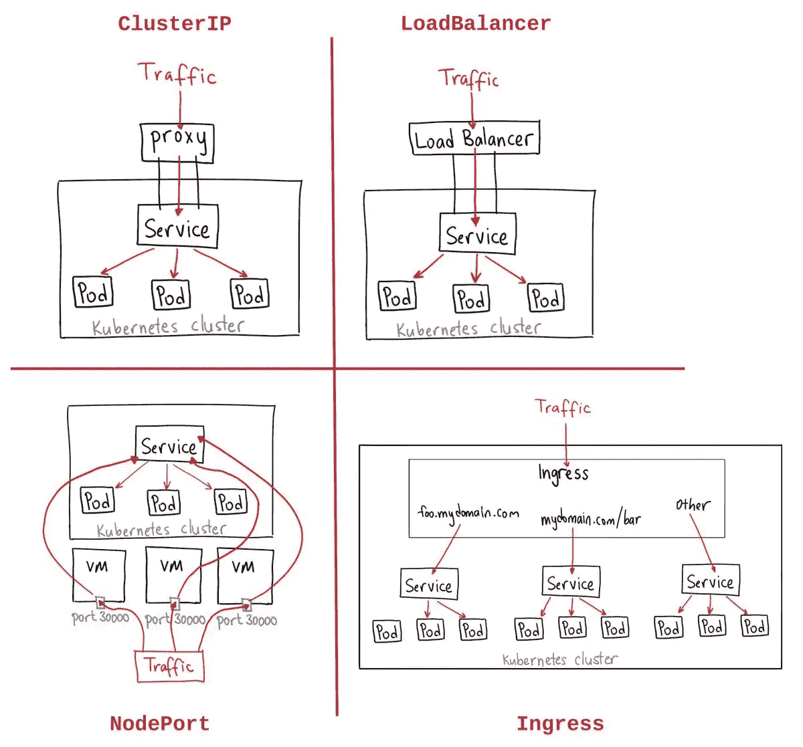

# Kubernetes 服务

> 原文：<https://medium.com/nerd-for-tech/kubernetes-services-f623c53213ed?source=collection_archive---------8----------------------->



## 什么是 Kubernetes 服务？

一个**服务**是一种 **Kubernetes** 资源，它使得一个代理被配置为将请求转发给一组 pods。将接收流量的单元集由选择器决定，选择器匹配创建单元时分配给单元的标签。服务是 Kubernetes 中的一个 REST 对象，它的定义可以发送到 Kubernetes 主服务器上的 Kubernetes apiServer 来创建一个新的实例。

## 服务类型:

**cluster IP**—这有助于限制集群内的服务。它在定义的 Kubernetes 集群中公开服务。

**节点端口**—它将在已部署节点的静态端口上公开服务。自动创建一个 **ClusterIP** 服务，**节点端口**服务将路由到该服务。可以使用 **NodeIP:nodePort** 从集群外部访问该服务。

**负载平衡器**—它使用云提供商的负载平衡器。 **NodePort** 和 **ClusterIP** 服务是自动创建的，外部负载平衡器将路由到这些服务。

**Ingress**-**Kubernetes Ingress**是一个 API 对象，它提供路由规则来管理外部用户对集群中服务的访问，通常是通过 HTTPS/HTTP。**入口**允许您在集群内部配置和管理这些功能。

## 如何创建服务？

您可以为现有部署创建服务。我在之前的故事中提到过如何创建部署→ [链接](https://nandhabalanmarimuthu.medium.com/kubernetes-deployment-a5214f04d800)

使用命令提示符:

```
kubectl expose deployment my-web --port=8080 --target-port=80 --type=LoadBalancer
```

## 使用 yml 文件

创建部署后，让我们在同一个文件夹中创建一个 LoadBaalance 类型的服务，为此，您必须创建一个 **service.yml** 文件并粘贴下面的命令。

```
apiVersion: v1
kind: Service
metadata:
  name: my-service
spec:
  selector:
    app: nginx
  type: LoadBalancer
  ports:
    - protocol: TCP
      port: 8080
      targetPort: 80
```

在选择器中，我们给我们的应用程序命名为 nginx，因为我们已经以该名称进行了部署，端口应该是 8080，正如我上面提到的，我们已经将我们的类型命名为负载平衡器。

之后，在您的终端中运行这个命令

```
kubectl apply -f service.yml
```

运行这个命令后，进入浏览器并键入 localhost:8080，您可以看到 nginx 的欢迎页面。

您可以使用这个命令检查服务

```
kubectl get svc
```

今天到此为止。希望你明白一切，感谢你的阅读。