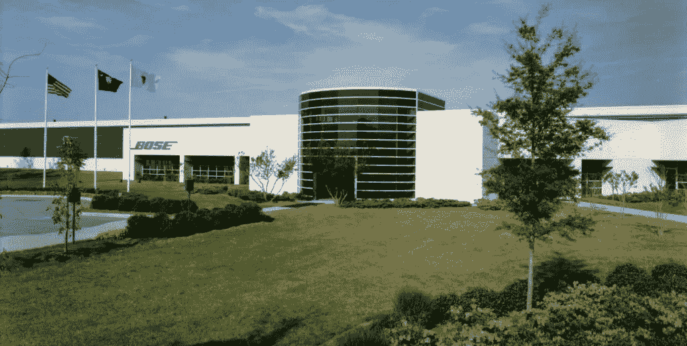

# Kubernetes:支持数百万 BOSE 物联网产品的快速开发

> 原文：<https://medium.com/nerd-for-tech/kubernetes-supporting-rapid-development-for-millions-of-bose-iot-products-3e83081ce0e6?source=collection_archive---------14----------------------->

由 Raktim 创建

## 让我们来分析 BOSE 的案例研究，BOSE 是最大的音频产品公司之一，试着了解 BOSE 是如何利用 Kubernetes 的力量来促进其物联网产品的部署的…

# 为什么选择 Kubernetes:

由 Raktim 创建

2013 年，当 Solomon Hykes 推出 Docker(容器技术)时，全世界见证了十年来最大的技术创新。【2014 年年中，谷歌向全世界推出了 Kubernetes。一年之内， **Kubernetes &集装箱技术成为最强大的&需求工具。每个人都在谈论它，每个公司都试图采用它。**

> 但是为什么呢？这个产品的独特之处是什么？

## 答案是“简单、快速且敏捷”。

*   **日复一日，我们正在走向这样一个未来:如果我们不能把创意变成产品，创意就没有价值。**此外，如果我们的产品不能足够快地到达最终用户手中，那么其他人就会占领市场。
*   **从 2017 年开始，&每家公司开始更加关注如何更快地简化流程，**而不是更加关注创意。公司开始了一个趋势，你不需要制造具有所有功能的整个产品。创建一个基本产品/软件&提供给客户。
*   **现在根据客户的反馈开始工作&让您的部署管道快速运转，几天之内就能满足客户的需求。另外，一旦你占领了市场，开始在你的产品上实现更多的功能。因为如果你在部署、测试等方面浪费时间。如果最终客户没有获得任何价值，那么你就会在竞争中失败。**

这就是为什么业界开始实施 Kubernetes 来加快他们的部署。**在这篇博客中，让我们了解一下 BOSE 在使用 Kubernetes 后能够实现多大的改进。**

# BOSE 公司:

百色公司

BOSE Corporation 是一家美国制造公司，主要销售音频设备。 **BOSE 以其家庭音响系统和扬声器、降噪耳机、专业音响产品和汽车音响系统而闻名。**

> “在 Bose，我们痴迷于最重要的东西——产生影响的小细节和令人震惊的大细节”——Bose Corporation

**从数字时代开始，BOSE 始终专注于现代化和采用最新的工具&技术，以便在这个快速发展的行业中保持一席之地。** BOSE 是首批采用 DevOps 解决方案的公司之一，例如 Container Technology&Kubernetes。**让我们了解他们的挑战、解决方案&结果……**

# 挑战是什么？

由 Raktim 创建

BOSE 出名了几十年&随着他们的用户群迅速增加，他们需要为客户提供强大的支持。出于这个原因，BOSE 的工程师试图用最新的 DevOps 自动化工具来改善他们的旧基础设施。

> 首席云工程师 Josh West 表示:“我们需要为开发人员提供一种机制，让他们能够快速构建原型并部署服务，直至投入生产。“我们希望提供大量云功能来支持我们的音频设备和体验。”

*   2016 年，他们开始为他们的物联网平台构建全新的基础设施& **从一开始，他们就希望微服务架构&平台即服务。**首先他们在**测试&原型 Docker Swarm & Mesos** 编排解决方案，但是**最终他们采用 Kubernetes** 作为他们的平台，运行在 AWS 上。
*   Kubernetes 最好的部分是它的快速可伸缩性 &当他们使用 AWS 时，他们从来没有感到缺乏资源。这使得该公司能够非常轻松地处理任何类型的流量负载。

> 云架构经理 Dylan O'Mahony 说，首要目标是:“领先不同产品组一到两步，这样我们就永远不会争先恐后地追赶它们的规模。“如果他们发布一款新的互联产品，我们希望能够远远领先于他们向我们抛出的任何规模。”

当时 Kubernetes 的版本是 1.5，但它仍然非常成熟，可以做团队现在和未来想要和需要的许多事情。 **O'Mahony 指出了 Kubernetes 的便携性，以防 Bose 决定采用多云技术。**

# 他们如何改进？

来源:谷歌

他们使用 Kubernetes 创建了一个很棒的基础设施&该设置的最佳功能是开发人员在开发代码的过程中从未感觉到任何变化。**运营团队花了大量时间来微调体验，这样开发人员就更容易不必过多考虑他们的代码将如何部署。**

> “我们的开发人员与我们的运营团队提供的工具进行交互，运营团队在 Kubernetes 上运行他们所有的工具，”O'Mahony 说。“我们尽量不把直接访问 Kubernetes 作为唯一途径。事实上，理想情况下，我们的开发人员甚至不需要知道他们正在 Kubernetes 上运行。”

*   **如今，仅 Bose 的一个生产集群就拥有 1，800 个名称空间/离散服务和 340 个节点。**现在大约有 **100 名工程师在**工作，平台基础设施现在每年支持 **30，000 个非生产部署**跨越数十个微服务。
*   **2018 年，有 1250+的生产部署。**与 Bose 以前的一些部署流程相比，这是一个惊人的改进，Bose 以前的部署流程支持的部署和服务要少得多。

> “团队中的每个人都从自动化的角度思考，了解流程，尽可能快地完成工作。当你退后一步，看看这种文化对一家有着 50 多年历史的扬声器公司意味着什么，这真的很不可思议，我认为我们使用的工具和我们与他们一起建立的基础就是其中的一大部分。”— DYLAN O'MAHONY，BOSE 云架构经理

BOSE incorporated**Prometheus**monitoring from the begin&**2017 年，他们成功服务了超过 300 万个联网产品。**

# 影响和成果:

由 Raktim 创建

**现在，BOSE 实施任何类型的新产品都变得非常容易，甚至不用担心可扩展性、安全性&部署。**

> “在不到两周半的时间里，我们部署了一个全新的服务，从概念到编码和部署，一直到生产，包括加固、安全测试等等，”O'Mahony 说。

*   此外，除了 Kubernetes，还有很多技术属于 **CNCF 的范畴，比如 Fluentd、CoreDNS、Jaeger & OpenTracing。BOSE 在现代化的过程中也依赖于这些技术。**

> “CNCF 的情况很快解释了从存储到云提供商到自动化等所有不同领域正在发生的事情，”West 说。“这是我们构建云基础架构的购物车。我们可以从不同的通道去选择。”
> 
> 而且，他补充道，“如果不是 Kubernetes 和 CNCF 的其他项目是免费开源软件，拥有如此强大的社区，我们永远也不会达到规模，甚至不能如期推出。”

**类似的例子有成千上万个，说明开源如何成为许多公司的核心&灵魂。**也因为如此巨大的社区贡献，这些工具正在迅速成熟，可以在任何情况下工作。

# 未来目标:

由 Raktim 创建

**BOSE 已经开始采用无服务器架构&他们希望致力于服务网格。**此外，由于 BOSE 是一个全球品牌，所以他们希望扩大其全球网络。

> O'Mahony 说:“通过跨区域发展来降低我们的延迟将是我们的一大重点。“为了确保我们在日本、澳大利亚和其他地方的客户拥有良好的体验，我们希望在离他们更近的地方设立销售点。这在 Bose 是前所未有的。”

> ***再加上，他们在制造更多设备上势不可挡。创新永远不会止步于 BOSE。他们的用户群也日益增加。***

> “我们希望获得数十亿个互联产品！”韦斯特说。“除了消费电子产品部门，我们还有很多工作要做，以支持我们在 Bose 的更多业务部门。正是由于云的原生环境以及可用的工具和功能，我们才能为所有试图实现一些非常棒的体验的开发人员和部门提供如此出色的云平台。”

> 云架构经理 Dylan O'Mahony 认为:“我认为，除了 Kubernetes，做任何事情都是愚蠢的。”

# 最后的话:

*   **像 BOSE 一样，在今天的行业中有成千上万的公司&他们中的大多数都试图采用 Kubernetes &容器技术，因为它超级快，具有很好的可扩展性&显然它是安全的。**这个新的技术时代为不同公司的工程师在这些领域的工作提供了更多的选择。这意味着学习这种 DevOps 工具可以帮助促进我们的职业生涯。
*   我尽了最大努力来谈论 Kubernetes &它的可能性。我们还看到了一个非常有趣的使用案例。我只想说，最后，如果你喜欢这个博客，请给一些掌声，并在评论中留下你的想法。
*   **我一直在写关于机器学习、DevOps 自动化、云计算、大数据等方面的博客。**所以，如果你想看我以后的博客，请在 Medium 上关注我。您也可以在 LinkedIn 上 ping 我，在下面查看我的 LinkedIn 个人资料…

 [## Raktim Midya -微软学生学习大使(测试版)-微软| LinkedIn

### ★我是一名技术爱好者，致力于更好地理解不同热门技术领域背后的核心概念…

www.linkedin.com](https://www.linkedin.com/in/raktimmidya/) 

**感谢大家的阅读。就这样…结束…😊**

