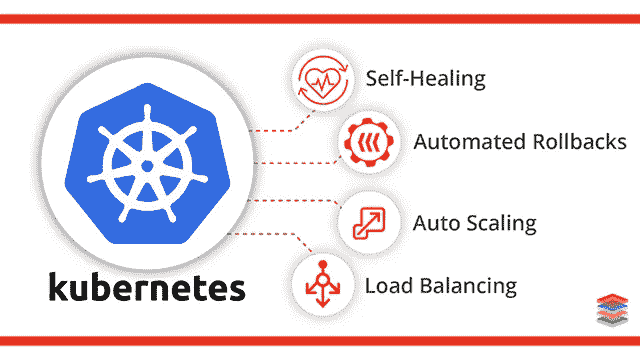
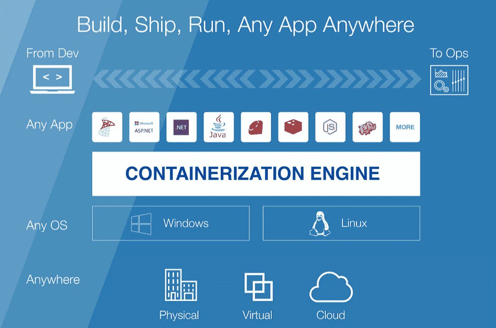
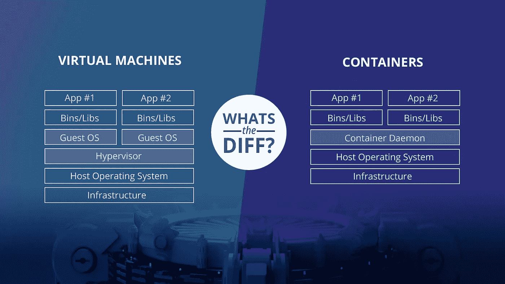
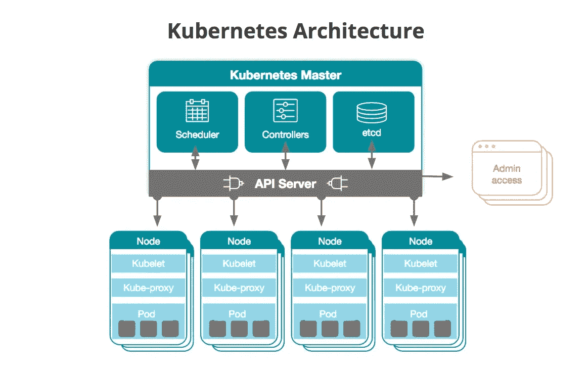
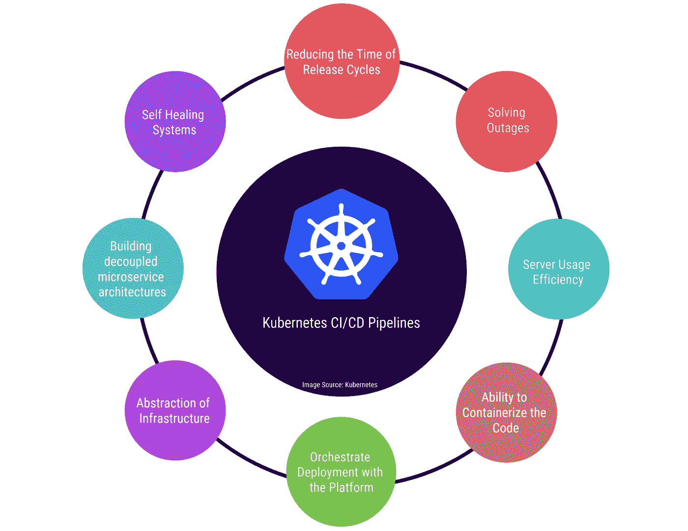
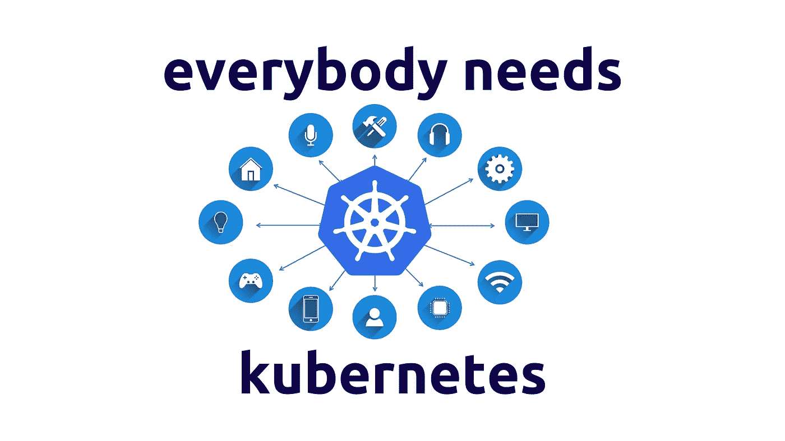

# Kubernetes:容器和微服务的兴起

> 原文：<https://medium.com/nerd-for-tech/kubernetes-the-rise-of-containers-and-microservices-50abff7c2cee?source=collection_archive---------2----------------------->

# **概述**

构建和部署软件/应用程序已经成为当今互联网时代运营业务的关键任务之一，这就是为什么为其业务或初创公司编写代码或软件的公司和个人总是在寻找有效利用硬件资源的方法来构建可以跨平台运行的安全、无错误的应用程序。

最初，软件通常被写成一整块代码，每当需要对整块代码中的单个实体进行更改或更新时，这都是一项艰巨的任务。为了解决这个问题，软件架构发生了变化。单片被微服务所取代，微服务是将软件编写成碎片。微服务过去部署在所谓的虚拟机(VM)中，托管在云中或本地服务器上。所有这些虚拟机基本上都是软件计算机，具有与物理计算机相同的功能(许多虚拟机可以从一台物理计算机创建)，由一个称为虚拟机管理程序的层进行管理。

但是在过去的 5-8 年里，市场发生了巨大的变化，从虚拟化转向了容器化。容器是对这种基础设施管理系统的升级。容器是平台和主机无关的，这意味着用不同语言编写的微服务可以作为最终产品在不同的操作系统上运行，没有任何麻烦。它们比虚拟机快得多。

所以，集装箱是好的，但是到底什么是集装箱化，为什么它的需求增长如此之快，kubernetes 如何适应这一切？让我们找出答案。

# **什么是集装箱化？**

容器化已经成为软件开发的一个主要趋势，作为虚拟化的替代或伴生物。简而言之，它包括封装或打包软件代码及其所有依赖项，以便它可以在任何基础设施上统一一致地运行。

容器化和进程隔离的概念已经有几十年的历史了，但是 2013 年开源 **Docker Engine** 的出现，这是一个具有简单开发工具和通用打包方法的容器行业标准，加速了这项技术的采用。研究公司 Gartner 预计，到 2020 年，超过 50%的公司将使用容器技术。IBM 进行的 2017 年末[调查](https://www.ibm.com/cloud-computing/info/container-development/)的结果表明，采用的速度甚至更快，结果显示 59%的采用者提高了应用质量并减少了缺陷。

简而言之，容器化允许应用程序“编写一次，在任何地方运行”就开发过程和供应商兼容性而言，这种可移植性非常重要。它还提供了其他显著的优势，如故障隔离、易管理性和安全性等。

## 虚拟化与容器化

容器经常被比作虚拟机，因为它们都允许多种类型的软件在被包含的环境中运行。然而，事实证明，容器技术提供了比虚拟化更大的优势，并迅速成为 IT 专业人员青睐的技术。

虚拟化技术允许多个操作系统和软件应用程序同时运行，并共享单台物理计算机的资源。例如，一个 IT 组织可以在同一台服务器上运行 Windows 和 Linux 或多个版本的操作系统，以及多个应用程序。每个应用程序及其相关文件、库和依赖项，包括操作系统(OS)的副本，都打包成一个虚拟机。通过在一台物理机上运行多个虚拟机，可以显著节省资本、运营和能源成本。

另一方面，容器化可以更有效地利用计算资源。容器创建单个可执行软件包，将应用程序代码与运行所需的所有相关配置文件、库和依赖项捆绑在一起。然而，与虚拟机不同，容器不*而*捆绑在操作系统的副本中。相反，容器运行时引擎被安装在主机系统的操作系统上，成为计算系统上的所有容器共享相同 OS 的通道。如上所述，容器通常被称为“轻量级的”，因为它们共享机器的操作系统内核，并且不需要在每个应用程序内关联操作系统的开销(如上图所示的 VM 的情况)。

## 集装箱化的好处

容器化为开发人员和开发团队提供了很多好处。以下是一些例子

*****敏捷性:*** 容器生态系统已经转向由开放容器倡议(OCI)管理的引擎。软件开发人员可以继续使用敏捷或 DevOps 工具和流程来快速开发和增强应用程序。**

*****效率:*** 在容器化环境下运行的软件共享机器的 OS 内核，容器内的应用层可以跨容器共享。因此，容器在容量上本来就比 VM 小，并且需要的启动时间也更少。**

*****安全性:*** 应用程序作为容器的隔离性本质上防止了恶意代码的入侵影响其他容器或主机系统。此外，可以定义安全权限，以自动阻止不需要的组件进入容器或限制与不必要资源的通信。**

# ****什么是 Kubernetes？****

**好了，现在我们知道了什么是容器化，它是如何工作的，以及它与以前使用的虚拟化技术相比有什么优势。但是 Kubernetes 是如何融入这一切的呢？**

****

**Kubernetes 最初由 Google 开发，是一个可移植、可扩展的开源平台，用于管理容器化的工作负载和服务，促进了声明式配置和自动化。它有一个庞大的、快速增长的生态系统。Kubernetes 的服务、支持和工具随处可见。**

**这就是 kubernetes 的定义，它是一个**容器编排**工具，但是我们为什么需要它呢？我们为什么不能使用 Docker 或 CRI-O 等标准引擎来手动管理容器呢？这有两个主要原因**

1.  **软件公司现在每天部署数千个容器实例，这是他们必须管理的复杂规模。**
2.  **在生产环境中，您需要管理运行应用程序的容器，并确保没有停机。例如，如果一个容器关闭，另一个容器需要启动。**

**这就是 Kubernetes 的用武之地，现在我们可以讨论容器编排的含义了。**

**一个**容器编排**平台自动化了容器化工作负载和服务的安装、扩展和管理。容器编排平台可以简化管理任务，如扩展容器化的应用程序，推出新版本的应用程序，以及提供监控、日志记录和调试等功能。**

**Kubernetes 已经成为容器编排的事实上的标准(最初由 Google 开源，基于他们的内部项目 Borg ),它最初自动化了 Linux 容器功能。Kubernetes 支持许多容器引擎，比如 Docker(现在 1.20 版本中已弃用)，但它也支持任何符合开放容器倡议(Open Container Initiative，OCI)容器图像格式和运行时标准的容器系统。**

## **关键特征**

**Kubernetes 为您提供主要功能，例如:**

*   ****服务发现和负载平衡** Kubernetes 可以使用 DNS 名称或自己的 IP 地址公开容器。如果容器的流量很高，Kubernetes 能够对网络流量进行负载平衡和分配，从而使部署稳定。**
*   ****存储协调** Kubernetes 允许您自动挂载自己选择的存储系统，例如本地存储、公共云提供商等等。**
*   ****自动化部署和回滚**您可以使用 Kubernetes 描述您部署的容器的期望状态，它可以以可控的速度将实际状态更改为期望状态。例如，您可以自动化 Kubernetes 来为您的部署创建新的容器，删除现有的容器，并将它们的所有资源应用到新的容器中。**
*   **你为 Kubernetes 提供了一个节点集群，它可以使用这个集群来运行容器化的任务。您告诉 Kubernetes 每个容器需要多少 CPU 和内存(RAM)。Kubernetes 可以在节点上安装容器，以充分利用资源。**
*   ****自我修复** Kubernetes 重新启动失败的容器，替换容器，终止对用户定义的健康检查没有响应的容器，并且在它们准备好服务之前不向客户端通告它们。**
*   ****秘密和配置管理** Kubernetes 允许您存储和管理敏感信息，比如密码、OAuth 令牌和 SSH 密钥。您可以部署和更新机密和应用程序配置，而无需重新构建容器映像，也无需在堆栈配置中暴露机密**

## ****架构****

**好了，现在我们了解了 kubernetes 是什么，以及它如何帮助在生产级别部署和管理容器化应用程序或微服务，让我们来看看它的内部工作原理。**

****

**当您部署 Kubernetes 时，您会得到一个集群，它是 Kubernetes 的核心组件。集群由许多虚拟机或物理机组成，每个虚拟机或物理机都作为主节点或节点提供特定的功能。每个节点托管一个或多个容器(包含您的应用程序)的组，主节点与节点就何时创建或销毁容器进行通信。同时，它告诉节点如何根据新的容器排列重新路由流量。(我们可以在上图中看到一般的 Kubernetes 集群架构。)现在让我们看看集群的各个组件。**

****主*主*主****

**Kubernetes master 是一个访问点(或控制平面)，管理员和其他用户通过它与集群进行交互，以管理容器的调度和部署。一个群集始终至少有一个主服务器，但根据群集的复制模式，可能有多个主服务器。主服务器将整个集群的状态和配置数据存储在 **ectd** 中，这是一个持久的分布式键值数据存储。**

**主设备通过 **kube-apiserver** 与集群的其他设备通信，这是控制平面的主要接入点。例如，kube-apiserver 确保 etcd 中的配置与集群中部署的容器的配置相匹配。**

*****节点*****

**Kubernetes 通过将容器放入 Pods 中在*节点*上运行来运行您的工作负载。根据群集的不同，节点可以是虚拟机或物理机。每个节点都包含运行 pod 所需的服务，由控制平面管理。**

**Kubernetes 集群中的所有节点都必须配置一个容器运行时，比如 [**Docker**](https://www.docker.com/) 。当 Kubernetes 将容器部署到集群中的节点时，容器运行时启动并管理容器。您的应用程序(web 服务器、数据库、API 服务器等。)在容器内部运行。**

**每个 Kubernetes 节点运行一个名为 **kubelet** 的代理进程，负责管理节点的状态:根据来自控制平面的指令启动、停止和维护应用程序容器。**

**kube-proxy 是一个运行在集群节点上的网络代理。它还充当节点上运行的服务的负载平衡器。**

**最后，一个 **pod** 是基本的调度单元**，**，它由一个或多个容器组成，保证这些容器共同位于主机上，并且可以共享资源。在集群中，每个 pod 都分配有一个唯一的 IP 地址，允许应用程序无冲突地使用端口。**

*****部署和副本:*****

**一个 [**部署**](https://kubernetes.io/docs/concepts/workloads/controllers/deployment/) 是一个 YAML 对象，它为每个 pod 定义了容器实例的数量，称为**副本**。您可以通过 **ReplicaSet** 定义您希望在集群中运行的副本数量，它是部署对象的一部分。因此，例如，如果运行 pod 的节点死亡，副本集将确保在另一个可用节点上调度另一个 pod。**

**一个**守护进程集**在您指定的节点上部署并运行一个特定的守护进程(在一个 pod 中)。它们通常用于为吊舱提供服务或维护。例如，守护进程集就是 New Relic Infrastructure 如何在集群中的所有节点上部署基础结构代理。**

# **用例**

**虽然 Kubernetes 使企业 IT 管理员能够更好地控制他们的基础设施，并最终控制应用程序的性能，但要充分利用这项技术，还有很多需要学习的地方，下面是一些常见的使用案例，展示了 Kubernetes 的强大功能**

****

## **无状态应用程序的部署**

**在 Kubernetes 上运行的一个非常流行的无状态应用是 [nginx](https://nginx.com/) ，一个开源的网络服务器。在 Kubernetes 上运行 nginx 需要一个描述 pod 和底层容器的部署 YAML 文件。部署这样的应用程序很容易**

## **自我修复和扩展服务**

**Kubernetes 的流程单元可以细分为 pod 和服务。吊舱是 Kubernetes 上可用的较小的部署单元。一个 pod 可以包含几个容器，这些容器将进行一些相关的通信，例如网络和存储。服务是提供对一组容器的可访问性的接口。这些服务可以供内部或公共访问，并且可以对几个容器实例进行负载平衡。**

**豆荚是凡人:一旦完成，他们从集群中消失。Pod 终止可能是自然的，也可能是由于错误。部署是创建和维护 pod 的最现代的 Kubernetes 模块。使用单个描述文件，开发人员可以指定部署、保持运行、扩展和升级 pod 所需的一切。**

## **无服务器架构(没有供应商限制)**

**自从 AWS 推出 Lambda 以来，无服务器架构已经风靡全球。原理很简单:开发代码就好，其他的不用管。服务器和可伸缩性由云提供商处理，代码只需开发为处理特定事件的功能:从 HTTP 请求到队列消息。**

**供应商锁定是这种解决方案的主要缺点。如果不重构大部分代码，几乎不可能改变云提供商。有一些像 Serverless 这样的解决方案寻求跨云的标准化功能代码。另一个解决方案是使用 Kubernetes 集群来创建一个无供应商的无服务器平台。如上所述，K8S 抽象出了云服务器之间的区别。目前，两个流行的框架将集群虚拟化为无服务器平台:Kubeless 和裂变。**

## **混合和多云**

**混合云利用来自本地传统数据中心和云提供商的计算资源。当公司在内部数据中心拥有一些服务器，并且希望使用云的无限计算资源来扩展或替代公司资源时，通常会使用混合云。另一方面，多云指的是使用多个云提供商来处理计算资源的云。多云通常用于避免供应商锁定，并降低云提供商在执行任务关键型运营时停机的风险。**

**这两种解决方案都是由 Kubernetes 联合会提出的。创建多个集群，每个云或本地数据中心一个集群，由联盟管理。该联盟同步计算资源，甚至允许跨集群发现**

## **Kubernetes 的 CI/CD**

**Kubernetes 的开放 API 给开发者带来了很多好处。这种控制水平意味着开发人员可以毫不费力地将 Kubernetes 集成到他们的自动化 CI/CD 工作流程中。因此，即使 Kubernetes 没有提供任何现成的 CI/CD 特性，也可以很容易地将 Kubernetes 添加到 CI/CD 管道中。例如，使用 Kubernetes 包管理器 Helm 将 Jenkins 作为 pod 运行**

# **Spotify 和 Kubernetes(快速案例研究)**

****

## **挑战**

**该音频流媒体平台于 2008 年推出，全球月活跃用户已超过 2 亿。工程、基础设施和运营总监 Jai Chakrabarti 表示:“我们的目标是为创作者赋能，并为我们今天的所有消费者以及未来的消费者提供真正身临其境的聆听体验。Spotify 是微服务和 Docker 的早期采用者，它通过一个名为 [**Helios**](https://github.com/spotify/helios) **的本土容器编排系统，将跨其虚拟机群运行的微服务容器化。**到 2017 年底，情况变得很清楚，“让一个小团队来开发这些功能，不如采用一个更大的社区支持的东西更有效率，”他说。**

## **Kubernetes 作为救援**

**“我们看到了在 Kubernetes 周围成长起来的令人惊叹的社区，我们希望成为其中的一员，”Chakrabarti 说。Kubernetes 比 Helios 功能更丰富。此外，“我们希望从更高的速度和更低的成本中获益，并在最佳实践和工具方面与行业内的其他公司保持一致。”同时，该团队希望在繁荣的 Kubernetes 社区贡献自己的专业知识和影响力。这一迁移将与太阳神的运行同时进行，可能会顺利进行，因为“Kubernetes 非常适合作为太阳神的补充和替代，”Chakrabarti 说。**

## **影响**

**该团队在 2018 年花了大部分时间解决迁移所需的核心技术问题，这一工作于当年晚些时候开始，是 2019 年的一大重点。Chakrabarti 说:“我们的车队中有一小部分已经迁移到 Kubernetes，我们从我们的内部团队那里听到的一些事情是，他们不太需要专注于手动容量供应，而是有更多时间专注于为 Spotify 提供功能。”网站可靠性工程师温升豪说，目前在 Kubernetes 上运行的最大服务每秒处理大约 1000 万次请求，并从自动伸缩中受益匪浅。此外，他补充说，“以前，团队必须等待一个小时才能创建一个新服务，并获得一个运行主机来运行它，但有了 Kubernetes，他们可以在几秒钟内完成。”此外，借助 Kubernetes 的装箱和多租户功能，CPU 利用率平均提高了两到三倍**

# **从博格到库伯内特(库伯内特越来越多的宣传)**

**如果你已经走了这么远，你就会知道 Kubernetes 的重要性，以及公司如何利用它的力量以经济高效的方式运营他们的业务。**

**Kubernetes 最初由 Google 创建(从一个名为 **Borg** 的内部项目中获得灵感)，然后捐赠给 Cloud Native Computing Foundation，在生产环境中广泛用于以容错方式处理 Docker 容器和其他容器工具。作为一个开源产品，它可以在各种平台和系统上使用。谷歌云、微软 Azure 和亚马逊 AWS 为 Kubernetes 提供官方支持**

**但它值这么多钱还是被过度炒作了？对 kubernetes 和对该工具非常了解的员工的需求有了巨大的增长。Kubernetes 的受欢迎程度稳步上升，2017 年发布了超过 4 个主要版本。K8s 也是 2017 年 GitHub 中 [**讨论最多的项目，也是评论第二多的项目。让我们找出原因**](https://octoverse.github.com/)**

****

**业内对 kubernetes 需求增加的主要原因是**

## **弥合差距**

**Kubernetes 通过弥合开发和应用程序部署之间的差距获得了主导地位。几乎在一夜之间，它已经成为运行和测试应用程序的标准方式。该技术的发展如此普遍，以至于它已经成为 DevOps 团队的标准，它可以用来(通过添加其他工具)完全自动化容器化应用程序的编排。**

## ****声明式方法****

**Kubernetes 提供了一种使用容器部署应用程序的新方法。它创建了一个抽象层，可以用声明式编程而不是命令式编程来操作。这样，随着时间的推移，部署和升级服务就简单多了。**

## **展开性**

**Kubernetes 非常具有可扩展性，开发人员很喜欢这一点。有一组现有的资源，如 pod、部署、`StatefulSets`、秘密、`ConfigMaps`等。但是，用户和开发者可以以**自定义资源定义的形式添加更多的资源。****

## **模块化管理**

**容器允许将应用程序分解成更小的部分，并清晰地分离关注点。为单个容器映像提供的抽象层允许我们从根本上重新思考分布式应用程序是如何构建的。这种模块化的方法使得每个负责特定容器的更小、更专注的团队能够更快地进行开发。它还允许我们隔离依赖性，并更广泛地使用调优的、更小的组件。**

**但这不是单靠容器就能实现的；它需要一个系统来整合和编排这些模块化的部分。Kubernetes 使用吊舱部分实现了这一点**

## **基础设施管理和无服务器架构**

**开发人员未来面临的主要挑战之一是如何更多地关注代码的细节，而不是代码运行的基础设施。为此，无服务器正成为应对这一挑战的领先架构范例之一。已经有非常先进的框架如 [**Knative**](https://github.com/knative) 和 [**OpenFaas**](https://github.com/openfaas/faas) 使用 Kubernetes 从开发者那里抽象出基础设施。**

## **社区**

**Kubernetes 受欢迎的另一个重要方面是它强大的社区。Kubernetes 在 2015 年推出 1.0 版本时捐赠给了一个供应商中立的家庭:云原生计算基金会。**

**随着项目的推进，在库伯内特的不同地区也有各种各样的社区(特殊利益团体)。他们不断增加新的功能，使其更加用户友好。**

**Cloud Native Foundation 还组织了 CloudNativeCon/KubeCon，这是世界上有史以来最大的开源活动。该活动通常每年举行三次，聚集了数千名技术专家和专业人士，他们希望改善 Kubernetes 及其生态系统，并利用每三个月发布的一些新功能。**

## **结论**

**因此，kubernetes 的力量不言而喻，它现在是，将来也会是使用最多的容器编排工具，因为它使应用程序管理和部署无缝，感谢阅读。**

****