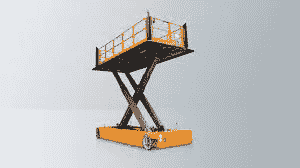

# 库卡 Omni Move 灵活平台

> 原文：<https://medium.com/nerd-for-tech/kuka-omni-move-flexible-platforms-10f81e041a50?source=collection_archive---------9----------------------->

# 描述

KUKA omniMove 是重型负载的运输平台，也是工业制造工厂的灵活平台。凭借超高精度，在最狭小的空间内，我们可以轻松地将其移动到正确的位置。它还具有出色的机动性，易于遥控操作。

# 独立且极其灵活

KUKA omniMove 移动重型平台可以舒适地移动 XXL 负载。它们可以手动控制或单独移动。尽管它们的体积和有效载荷都很大，但它们可以安全航行，几乎可以自给自足。我们也可以选择用独立的能源来扩展它。特别开发的车轮允许移动重型平台向任何方向移动。它甚至可以从静止的起点移动。改进的导航系统 KUKA 导航解决方案保护自主方向，没有碰撞的危险，也不需要人工地面标记。这可以很容易地在模块化系统中调整尺寸、宽度和长度。

# 麦克纳姆轮

基于麦克纳姆轮的特别先进的 KUKA omniMove 驱动技术证实了 KUKA omniMove 可以全方位移动。通过独立的桶形滚轮，车轮可以彼此独立移动。这使得 KUKA omniMove 可以从站立位置开始改变，并在最狭小的空间内进行平移和旋转运动。因此，这可以在所有方向上快速有效地改变。

# KUKA omniMove 的优势

**强大的**

KUKA omniMove 可以安全、适当地移动 XXL 车型中最重的部件。它的载货量可达 90 吨。该容量在最大版本中达到长达 30 米的长度。

**准确**

KUKA omniMove 无需接触高达+/- 3 毫米的物体，就可以移动最厚的负载。

**联动**

KUKA omniMove 设计是满足客户需求和愿望的理想解决方案。他们的模块化系统处理广泛的部署选项。

**超长和加大码**

移动重型平台可以选择连接多辆车，形成一个单一的 omniMove。[超过 30 米长的部件运输起来没有问题。](https://www.technologiesinindustry4.com/)我们可以简单地安装额外的弹簧行程和 LED 大灯。

**带升降主轴**

重型平台可选配电动升降主轴或剪式升降台。这使得 KUKA omniMove 能够单独提升负载。

**电源**

独立电源使用高性能电池。它还利用最先进的无线技术，使 KUKA omniMove 免于预防性连接。

**KMP 1500**

这是一个灵活生产流程的解决方案，以满足生产部门对更短响应时间的不断增长的需求。KMP 1500 创造了前所未有的灵活生产规模。KMP 1500 是一个独立控制的平台，无缝集成到生产过程中。

# 工业 4.0 —视频 2 分钟

我在下面分享了 YouTube 视频的链接，这是关于工业 4.0 技术的非常精彩和惊人的视频。[工业 4.0 制造工厂需要这样的技术](https://www.technologiesinindustry4.com/)。这是优化人力资源和进行必要的工厂维护的当务之急。这也是非常有用的，有助于以最佳方式进行工厂管理活动。

更多详情请访问:[https://www . technologiesinindustry 4 . com/2021/02/kuka-omni-move-flexible-platforms . html](https://www.technologiesinindustry4.com/2021/02/kuka-omni-move-flexible-platforms.html)