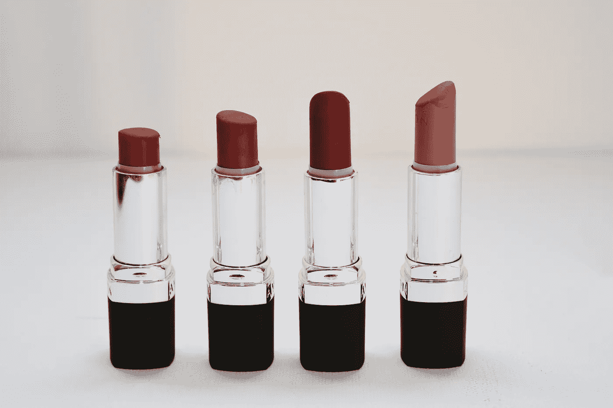

# 数据标签案例研究——化妆品品牌分类和标签

> 原文：<https://medium.com/nerd-for-tech/labeling-case-study-cosmetics-brand-classification-and-labeling-50cdf0f60928?source=collection_archive---------12----------------------->

## 图像分类案例

## 口红效应

经济学理论中有一个著名的“口红效应”，指的是口红因经济萧条而热销的一种有趣的经济现象，又称“小奢侈品偏好”。例如，在 2008 年全球金融危机期间，化妆品行业继续上涨。

尽管 2020 年的新冠肺炎疫情扰乱了我们的日常生活，但它不能扰乱我们对美的崇拜。由于物理条件的限制，化妆品行业不断利用人工智能在线上发展业务。

## 图像识别案例

品牌搜索准确率是 AI 技术在化妆品领域的主要方向之一，需要 AI 图形图像识别，以及机器学习。最近我们有一个案例，要求 10000+化妆品品牌分类标注。

# 结束

将您的数据标注任务外包给 [ByteBridge，](https://tinyurl.com/2p9dw4j2)您可以更便宜、更快地获得高质量的 ML 训练数据集！

*   无需信用卡的免费试用:您可以快速获得样品结果，检查输出，并直接向我们的项目经理反馈。
*   100%人工验证
*   透明标准定价:[有明确的定价](https://www.bytebridge.io/#/?module=price)(含人工成本)

**为什么不试一试？**

## **相关文章:**

1 [无偏向训练数据——机器学习的新瓶颈](https://tinyurl.com/3wv9knbw)

2 [数据标注服务:机器学习和 AI 项目如何保证数据质量？](https://tinyurl.com/1ae8xslj)

3 [客户对数据标注服务的需求](https://tinyurl.com/hlyth6gh)

4 [数据标注——如何选择数据标注公司](https://tinyurl.com/u32bv8jk)

5 [数据标注服务及其关键优势——灵活性](http://tinyurl.com/tys3gcfd)