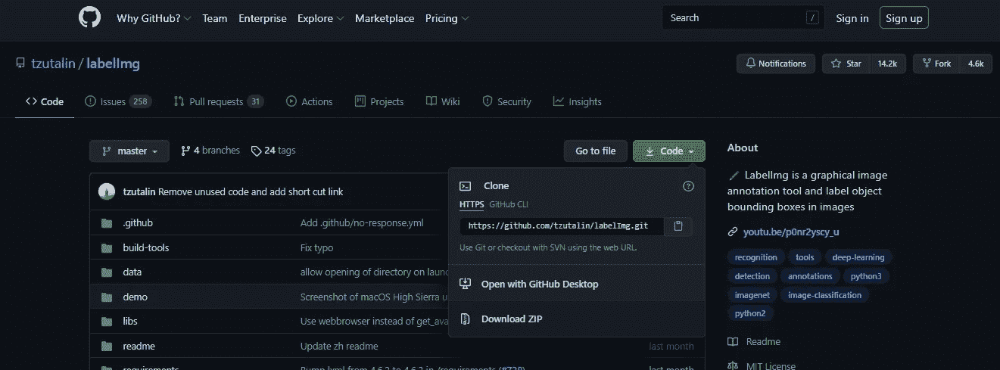
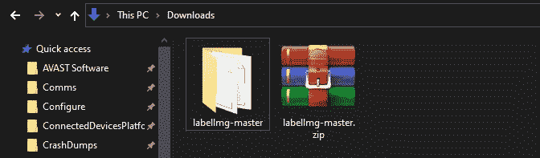
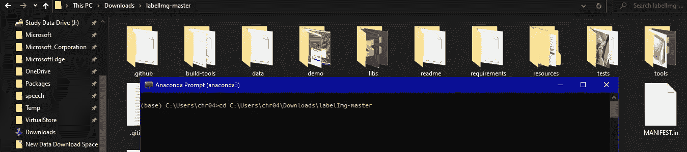
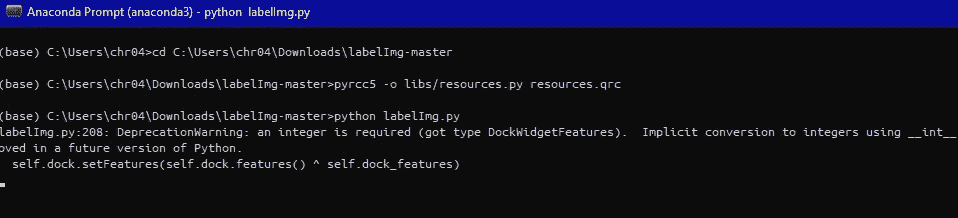
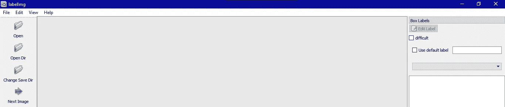
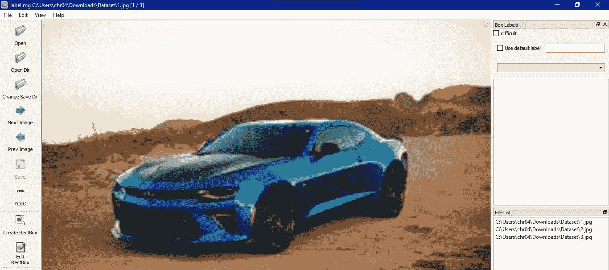
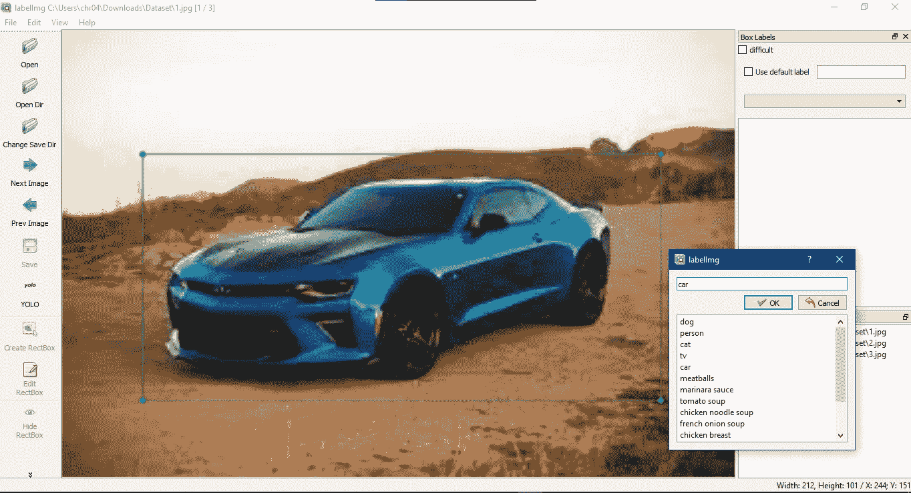
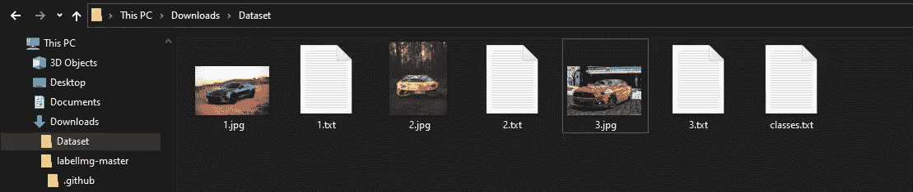
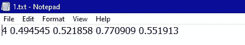

# 物体检测的标签数据(YOLO)？

> 原文：<https://medium.com/nerd-for-tech/labeling-data-for-object-detection-yolo-5a4fa4f05844?source=collection_archive---------1----------------------->

如今，目标检测是一项非常著名的任务。此外，它还是许多计算机视觉任务的基础，包括对象分割、对象跟踪、对象分类、对象计数等。

如果我们想训练我们的算法来检测一些物体(例如汽车)，我们需要首先以标签文件的形式告诉算法训练数据中存在的每辆汽车。

有许多目标检测算法，但最常用的算法包括:

*   单次触发探测器
*   YOLO(你只看一眼)
*   快速 RCNN

> 在本文中，我们将关注 Yolo 标签，它接受 txt 文件中的标签。其他对象检测器需要标签文件，但它们的标签文件格式不同。
> 
> 我们将使用标注工具来标注数据。你需要从 [**链接**](https://github.com/tzutalin/labelImg) 下载完整的 GitHub 库。



**贴标工具下载**

下载完成后，将其解压缩到同一个文件夹中。



**标签工具提取成功**

***注意:*** 如果你已经安装了一个 anaconda 那么你可以继续，否则，你首先需要从 [***链接***](https://www.anaconda.com/products/individual#Downloads) *安装一个 anaconda。*

现在，打开提取的文件夹。打开 anaconda 命令提示符，然后使用(cd 命令)移动到提取的文件夹。



**打开解压文件夹中的 anaconda 提示**

***窗口用户(命令建立标注工具)***

```
For pyrcc4 use this command,
pyrcc4 -o libs/resources.py resources.qrcFor pyrcc5 use this command,
pyrcc5 -o libs/resources.py resources.qrcpython labelImg.py
```

如果以上所有命令都成功运行，您将能够看到标注工具的 GUI。



**命令执行**



**贴标工具 GUI**

***Linux 用户(命令构建标注工具)***

```
sudo apt-get install pyqt5-dev-tools
sudo pip3 install -r requirements/requirements-linux-python3.txt
make qt5py3
python3 labelImg.py
```

如果以上所有命令都成功运行，您将能够看到标注工具的 GUI。


***Mac 用户(命令建立标注工具)***

```
brew install qt  # Install qt-5.x.x by Homebrew
brew install libxml2

or using pip

pip3 install pyqt5 lxml # Install qt and lxml by pip

make qt5py3
python3 labelImg.py
```

如果以上所有命令都成功运行，您将能够看到标注工具的 GUI。


> 我们的标签工具已成功安装，让我们开始在图像上添加标签。

**第一步:**从谷歌上下载一些图片，并将它们存储在某个文件夹中。


数据集可视化

**步骤 2:** 现在，打开标签工具中的存储图像文件夹。为此，你需要打开贴标工具的 GUI，然后选择**打开方向**选项。



标注工具中的数据集

**步骤-3:** 现在，我们需要通过选择**创建矩形框**选项，然后在汽车区域拖动，然后选择标签汽车来给图像加标签。



标签图像

**步骤 4:** 现在，我们成功地标记了我们的图像，现在我们可以用(CTRL+S)保存它。它将在同一文件夹中创建一个与图像同名的文本文件。



标签文件

现在，我们可以检查任何文本文件进行验证。

***Yolo 格式:***

```
<object-class> <x> <y> <width> <height>
```



Txt 文件

在上图中，

*   4 是 class_id
*   0.494545 是 x 轴值
*   0.521858 是 y 轴值
*   0.770909 是对象的宽度
*   0.551913 是物体的高度。

> 这都是关于 Yolo 格式的标签数据。可以用自己的数据试试。
> 
> 从视频创建数据集:[**文章链接**](/nerd-for-tech/extraction-of-frames-from-a-single-video-2b9fdd901208)

**关于我:**

我有超过 1 年半的软件开发工作经验。目前，我是一名软件工程师，通过使用零售分析、建立大数据分析工具、创建和维护模型以及加入引人注目的新数据集，为我们的客户改进产品和服务。

以前，我是 Spark 基金会的计算机视觉实习生，在那里我获得了分析来自不同开源平台的视觉数据的经验，包括 Kaggle、Google Images、Open Images 等。，并在这些数据上训练不同的深度学习模型。

*   [*在 LinkedIn 上联系我*](https://www.linkedin.com/in/muhammadrizwanmunawar/)
*   [*与我协商*](https://www.upwork.com/services/product/consultation-1477666319161577472?ref=project_share)
*   [*我的 yolov5 服务*](https://www.upwork.com/services/product/you-will-get-image-classification-projects-using-machine-learning-with-python-1323963101029052416?ref=project_share)

***如有疑问请在下方随意评论***