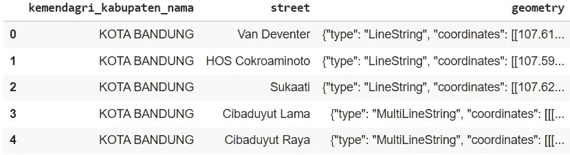
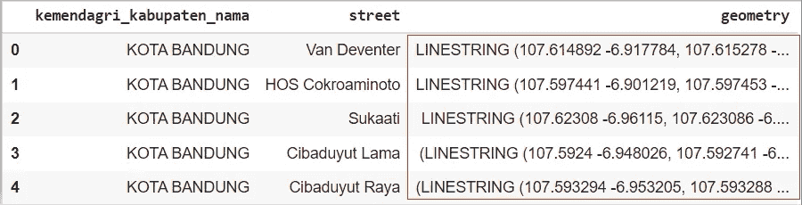
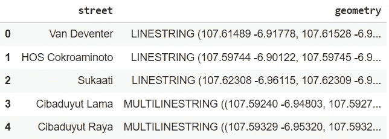
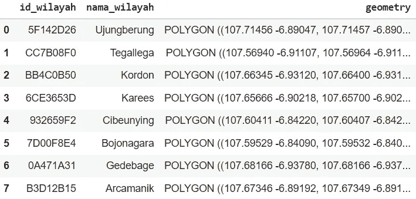
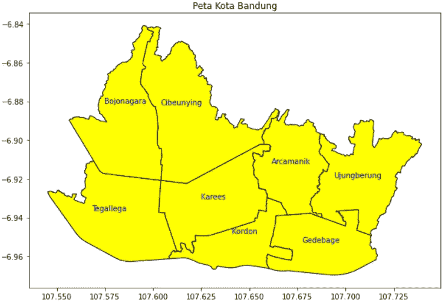
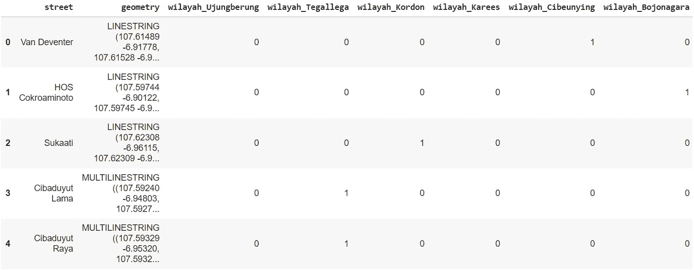
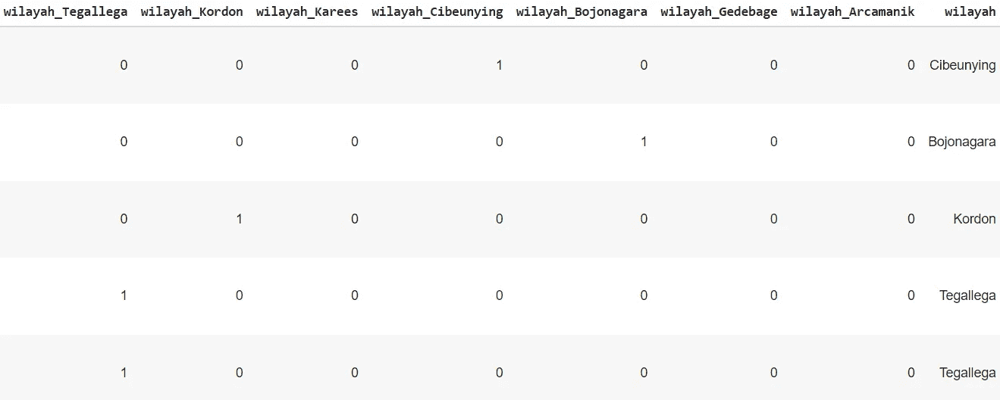
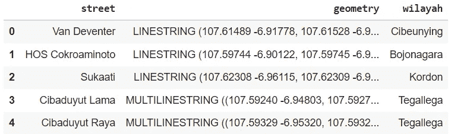

# 用 GeoPandas 标记坐标区域

> 原文：<https://medium.com/nerd-for-tech/labelling-areas-of-coordinates-with-geopandas-74d25c8aada6?source=collection_archive---------1----------------------->

在空间分析中处理空间数据可能很麻烦。空间数据通常以可在地图中表示的点、线或多边形坐标的形式存储。值得庆幸的是，有一个名为 GeoPandas 的 python 包，旨在更容易地使用 python 处理地理空间数据。

我最近从事空间数据分析。在那个项目中，GeoPandas 帮我标注了坐标和它们对应的区域。标注区域对于识别数据中是否存在空间模式确实很重要。在这篇文章中，我将特别讨论如何在给定的坐标上放置区域标签。


蒂莫·维林克在 [Unsplash](https://unsplash.com?utm_source=medium&utm_medium=referral) 上的照片

# **什么是 Geopandas？**

GeoPandas 是一个开源项目，旨在帮助使用 python 处理地理空间数据。它结合了 pandas 和 shapely 的功能，在 pandas 中提供地理空间操作，并为 shapely 提供多种几何图形的高级接口。该包可以读取几乎任何基于矢量的空间数据格式、GeoJSON 文件等，然后返回地理数据框架对象。当你在做你的项目时，你可以查看这个文档，因为它提供了关于如何使用 GeoPandas 的全面解释。

# 识别区域

在本文中，我将以我最新的空间数据分析项目为例。该数据集提供印度尼西亚大城市万隆的街道坐标。这是数据集的预览:

```
df.head(5)
```



数据集。作者图片

**转换成合适的几何数据**

坐标位于几何区域。该列的值应该形成为*形状良好的*对象，例如点/多点、线/多线和多边形/多多边形。我们需要*形状优美的*对象的原因是我们需要创建一个地理数据框架对象。GeoDataFrame 类实现了 *shapely* 对象的几乎所有属性和方法，包括检查坐标是否位于某个区域内。

此数据集只有一行/多行，因此我们需要转换，因为值仍然是字典格式。使用这段代码来转换它们。

```
from shapely.geometry import LineString, MultiLineStringdf[‘geometry’] = df[‘geometry’].apply(lambda x : (json.loads(x)[‘type’] == ‘LineString’ and LineString(json.loads(x)[‘coordinates’]) or json.loads(x)[‘type’] == ‘MultiLineString’ and MultiLineString(json.loads(x)[‘coordinates’])))df.head(5)
```



变形几何。作者图片

**创建地理数据框架对象**

现在我们已经将我们的几何值转换成了*形状优美的*物体。下一步是创建地理数据框架对象。地理数据框架对象是熊猫。具有带几何图形的列的数据帧。我们可以指定将哪一列用作几何对象的几何和坐标参考系统(CRS ),如“EPSG:4326”或 WKT 字符串。

```
d = {‘street’: list(df[‘street’]), ‘geometry’: list(df[‘geometry’])}gdf = geopandas.GeoDataFrame(d, crs=”EPSG:3395")gdf.head(5)
```



地理数据框架对象。作者图片

尽管普通数据框和地理数据框之间似乎没有区别，但区别在于适用于地理数据框的方法，因为它几乎实现了 *shapely* 对象的所有属性和方法。

**获取万隆市地图的子区域**

既然我们已经将数据框转换为地理数据框，我们可以暂时保留它，因为我们将获得区域标签数据。由于数据边界在一个城市内，那么我们可以根据子区域、地区、子地区或城市内的任何相关事物来标记观察值。在我的上一个项目中，我使用了亚维利亚科塔(等同于亚区，缩写为 SWK)来标记观察结果。

万隆市政府在其网页上提供了这些数据。数据存储在 JSON 类型的文件中，但它通常被称为 GeoJSON 类型，因为它包含地理属性。我们可以在[这个链接](http://data.bandung.go.id/dataset/fbec5a0e-2efe-4d37-99ee-7a55d32beb20/resource/0a9aefc2-c849-4fb5-b393-b1687dbe8d70/download/3273-kota-bandung-level-kewilayahan.json)找到 GeoJSON 数据。

```
url = “http://data.bandung.go.id/dataset/fbec5a0e-2efe-4d37-99ee-7a55d32beb20/resource/0a9aefc2-c849-4fb5-b393-b1687dbe8d70/download/3273-kota-bandung-level-kewilayahan.json"gdf_swk = geopandas.read_file(url)gdf_swk
```



SWK 数据。作者图片

我们可以看到，SWK 数据的几何类型为多边形，这意味着这些值表示面积。我们可以通过这个映射看到:

```
import matplotlib.pyplot as pltgdf_swk[‘coords’] = gdf_swk[‘geometry’].apply(lambda x: x.representative_point().coords[:])gdf_swk[‘coords’] = [coords[0] for coords in gdf_swk[‘coords’]]fig, ax = plt.subplots(figsize = (10,10))gdf_swk.plot(ax=ax, color=’yellow’, edgecolor=’black’)for idx, row in gdf_swk.iterrows(): plt.annotate(s=row[‘nama_wilayah’], xy=row[‘coords’], horizontalalignment=’center’, color=’blue’)
```



万隆市地图按亚省(SWK)划分。作者图片

**标签区**

现在让我们吃主菜:标记区域！现在我们有了一个区域标签地图，我们可以使用`gdf.within`。

该方法将检查点/多点或线/多线是否位于所选区域内。检查区域要花很长时间，因为我们要检查每一行和每一个可用的区域。这将为每个被检查的区域返回一个二进制响应。

```
swk_list = list(gdf_swk[‘nama_wilayah’])for i in range(len(swk_list)): gdf[“wilayah_”+swk_list[i]] = gdf[“geometry”].within(gdf_swk[‘geometry’][i]).astype(‘int’)gdf.head(5)
```



每个检查区域的二进制响应。作者图片

然后我们可以把所有的信息放入一个单独的列中表示区域。

```
def get_wilayah(row): for c in gdf.iloc[:, 3:].columns: if row[c]==1: return c[8:]gdf[“wilayah”] = gdf.iloc[:, 3:].apply(get_wilayah, axis=1)gdf.head(5)
```



作者图片

我们可以删除二进制响应列以获得更清晰的结果。

```
gdf = gdf[[‘street’, ‘geometry’, ‘wilayah’]]gdf.head(5)
```



最终结果。作者图片

# 结论

GeoPandas 软件包是一个方便的空间数据分析工具。它使我们能够根据特定区域标记坐标。我希望这篇文章能帮助那些正在或将要从事空间数据分析的人。如果你发现它令人困惑，不要犹豫，在评论区问我。