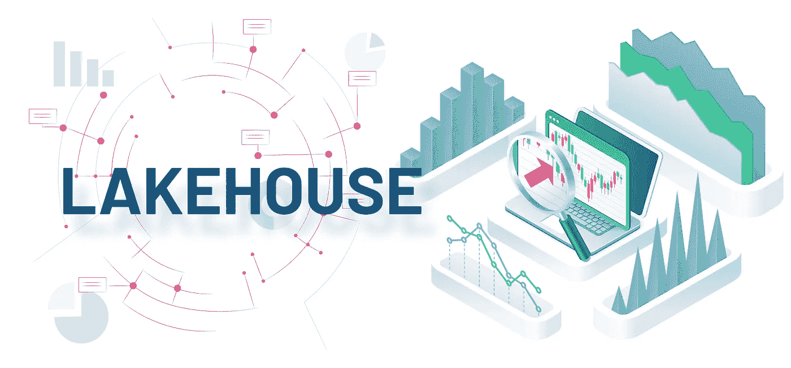
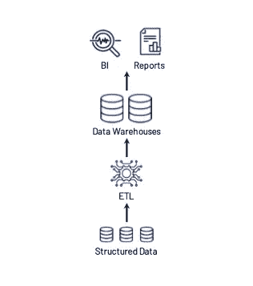
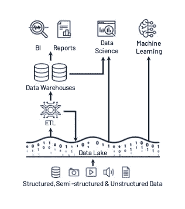
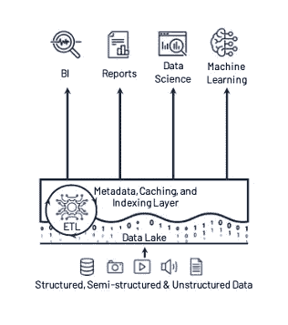
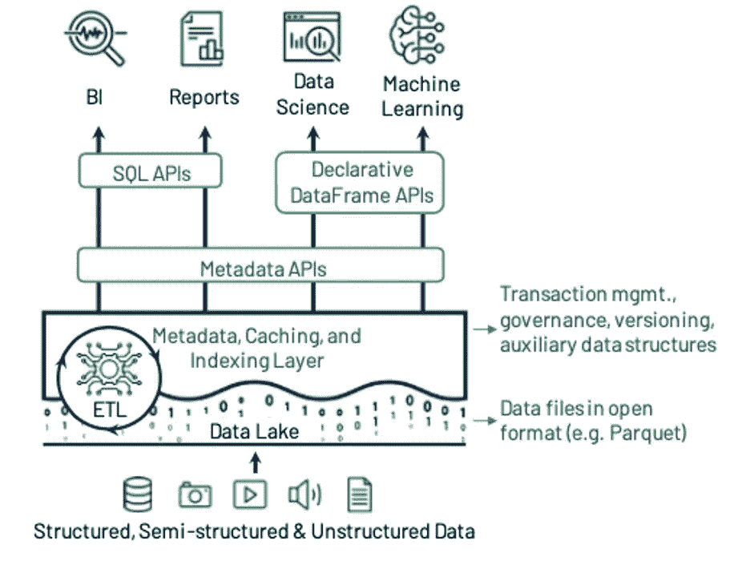

# 莱克豪斯，它的发展和实施

> 原文：<https://medium.com/nerd-for-tech/lakehouse-its-evolution-and-implementation-4e9ef4b912da?source=collection_archive---------8----------------------->

湖畔小屋——简介

我们今天所知的数据仓库架构将在未来几年消亡，取而代之的是一种新的架构模式，即 **Lakehouse** ，它将基于开放的直接访问数据格式，如 Apache Parquet，为机器学习和数据科学提供一流的支持，并提供一流的性能。

数据仓库的历史始于通过将运营数据库中的数据收集到集中式仓库中来帮助企业领导者获得分析见解，然后这些数据可用于决策支持和商业智能(BI)。这些仓库中的数据将使用写时模式写入，这确保了数据模型针对下游 BI 消费进行了优化。

# **第一代**

十年前，第一代系统开始面临一些挑战。首先，他们通常将计算和存储整合到一个本地设备中。这迫使企业为峰值用户负载和受管理的数据进行调配和付费，随着数据集的增长，这变得非常昂贵。其次，不仅数据集在快速增长，而且越来越多的数据集完全是非结构化的，例如视频、音频和文本文档，这些数据仓库根本无法存储和查询。

第一代

# **第二代**

为了解决这些问题， ***第二代*** 数据分析平台开始将所有原始数据卸载到数据湖中:具有文件 API 的低成本存储系统，以通用且通常开放的文件格式保存数据，如 Apache Parquet 和 ORC。这种方法始于 Apache Hadoop 运动，使用 Hadoop 文件系统(HDFS)实现廉价存储。在这种架构中，湖中的一小部分数据稍后将被 ETL 到下游数据仓库(如 Teradata ),用于最重要的决策支持和 BI 应用程序。

第二代

从 2015 年开始，云数据湖，如 S3、ADLS 和 GCS，开始取代 HDFS。它们具有卓越的耐用性(通常大于 10 个 9)、地理复制性，最重要的是，成本极低，可以自动进行甚至更便宜的存档存储，例如 AWS Glacier。该架构的其余部分在云中与第二代系统基本相同，有一个下游数据仓库，如 Redshift 或 Snowflake。

根据我们的经验，这种**双层数据湖+仓库架构**现在在行业中占主导地位。

*这种混合架构通常会遇到 4 大问题。*

可靠性:-保持数据湖和数据仓库的一致性既困难又昂贵。

数据陈旧性:-与数据湖中的数据相比，仓库中的数据是陈旧的。

对高级分析的支持有限:-无法对仓库数据提出预测性问题。

冗余存储的额外成本:-数据湖和仓库中的冗余数据。

# **介绍湖边小屋建筑**

湖屋建筑将解决所有这些问题。*我们将 Lakehouse 定义为基于低成本且可直接访问的存储的数据管理系统，该系统还提供传统的分析 DBMS 管理和性能特性，如 ACID 事务、数据版本控制、审计、索引、缓存和查询优化*。因此，Lakehouse 结合了数据湖和数据仓库的主要优点:前者是一种开放格式的低成本存储，可供各种系统访问，而后者具有强大的管理和优化功能。

# **实施湖边小屋系统**

实现 Lakehouse 的第一个关键思想是让系统使用标准文件格式(如 Apache Parquet)将数据存储在低成本的对象存储中(如亚马逊 S3 ),但在对象存储之上实现事务性元数据层，该层定义哪些对象是表版本的一部分。最近的几个系统，包括 Delta Lake、Apache Iceberg 和 Apache 胡迪，都以这种方式成功地为数据湖添加了事务性特性。

尽管元数据层增加了管理功能，但不足以实现良好的 SQL 性能。数据仓库使用多种技术来获得一流的性能，例如将热数据存储在 SSD 等快速设备上，维护统计数据，构建索引等高效的访问方法，以及共同优化数据格式和计算引擎。在基于现有存储格式的 Lakehouse 中，不可能更改格式，但可以实现其他优化，使数据文件保持不变，包括缓存、辅助数据结构(如索引和统计数据)以及数据布局优化。

*[Databricks](http://www.databricks.com) 使用 Delta Lake、Delta Engine 和 Databricks ML 运行时项目，基于这一设计构建了一个 lake house 平台。*

*具有查询优化器、本机执行引擎(Photon)和缓存层的多集群负载平衡 SQL 端点加速了 lake house 上的所有工作负载。*

**

*湖边小屋建筑*

# ***结论***

*你的数据分析实践还停留在老一代吗？为了充分利用您的数据，现在是您转变观念，迎接数据处理和管理的未来的时候了。*

*我们提供关于使用 Databricks 实现 Lakehouse 架构的高级咨询。*

*[***关于 HiFX***](https://www.hifx.in)*

**成立于 2001 年，我们是一群充满激情的技术专家，专注于追求卓越，致力于为客户提供高质量、高性价比的解决方案。**

**在 HiFX，我们理解拥有大量不同的数据而没有任何可操作的见解的痛苦。**

**通过各种来源以结构化和非结构化形式积累的庞大而复杂的数据，蕴含着与各种规模的组织的成功发展相关的重要业务洞察力。借助 HiFX 战略顾问团队，将这些 Pb 级数据转化为实时见解，以增强您的业务策略并提高您组织的收入。我们提供的解决方案将把您的组织转变为数据驱动的发电站。**