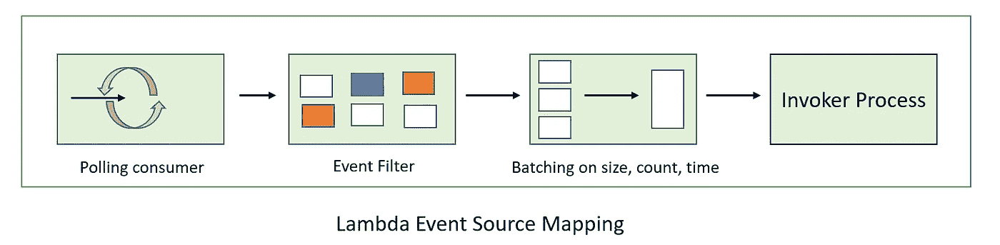
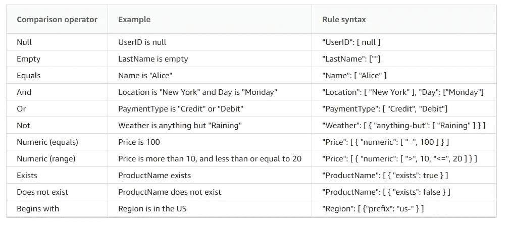

# λ事件过滤

> 原文：<https://medium.com/nerd-for-tech/lambda-event-filtering-397f98df2370?source=collection_archive---------1----------------------->


由 [Unsplash](https://unsplash.com/s/photos/filter-net?utm_source=unsplash&utm_medium=referral&utm_content=creditCopyText) 上 [Raghavendra Saralaya](https://unsplash.com/@numoonchld?utm_source=unsplash&utm_medium=referral&utm_content=creditCopyText) 拍摄的照片

选择你真正感兴趣的。

如果没有事件过滤，每个事件/消息都会被发送给 lambda 使用。这导致 lambda 代码的实现效率低下且复杂，只能处理特定的事件(如插入和删除)。在 2021 re:Invent 上，AWS 宣布我们可以在为 SQS、Kinesis & Dynmaodb 流创建事件源映射时过滤事件。发布后，事件源映射对象的架构图如下。



作者图片

*在上图中，源系统(SQS、Kinesis 或 Dynamodb) &目标 lambda 函数已被移除，仅聚焦于贴图对象。*

从上图中，我们看到过滤器在批处理之前和轮询服务之后被应用。这有两个直接的意义:

1.  过滤器减少了将被批处理的事件数量。这意味着计入批处理的过滤事件减少了。
2.  过滤器位于轮询服务之后，这意味着所有事件都是从源中读取的。在 SQS 的情况下，不匹配的事件/消息将被标记为已处理和已删除。所以他们迷路了。在 Kinesis 和 Dynamo 中，我们有持久的流，所以我们可以重放事件，或者可以有多个消费者和处理不匹配的事件。这意味着在 SQS 中使用事件过滤时，我们应该使用扇出模式，并且能够处理不匹配的事件。
3.  因为过滤器是在轮询之后，这意味着我们为所有 get messages API 调用付费。所以这个成本没有减少。
4.  由于发送给 lambda 的消息较少，处理时间会减少，因为我们不必实现过滤逻辑。
5.  对复杂过滤器类型或更多过滤器规则应用过滤器会增加一些延迟。虽然 AWS 没有记录，但在大多数情况下，这是非常少的，但对于延迟敏感的应用程序，这需要在生产前进行基准测试。

## 过滤规则

在一个事件源映射上，我们最多可以有 5 个不同的规则。过滤器规则与事件桥规则相同。语法如下所示:

```
{
  "Filters": [
    {
      "Pattern": 
        "<STRING REPRESENTATION OF JSON>"
    }
  ]
}# EVENT PATTERN IN JOSN
{ 
  "Metadata1": [ rule1 ], 
  "data": {
    "Data1": [ rule2 ] 
    }
  }
}
```

注意:为了可读性，我设置了过滤器的格式。如果使用 CDK，我们可以使用 JSON.dumps()方法。

## 完整规则语法



源 AWS 文档

**注意:** Lambda 评估传入消息`body`的格式以及我们针对`body`的过滤模式的格式。如果不匹配，Lambda 会丢弃消息。所以我们需要确保您的`FilterCriteria`中的`body`的格式与我们从您的 SQS 收到的消息中的`body`的预期格式相匹配。对于 Kinesis & Dynamodb，我们需要确保过滤标准中的数据字段&数据字段(data，Dynamodb)都是 JSON 格式

## 配料复习

通过批处理，我们可以增加每次调用传递给函数的平均记录数。这有助于减少调用次数和优化成本。如果应用批处理，当满足以下任一条件时，将调用 Lambda 函数:

*   有效负载大小达到 6MB(Lambda 的最大有效负载)
*   批处理窗口达到其最大值
*   批次大小达到其最大值。

对于 SQS 源代码，由于事件是作为一个整体批处理的，所以单个消息中的失败会将所有内容都视为失败。为了避免这种情况，我们可以报告哪个消息 id 失败了。为此，我们在 FunctionResponseTypes 中使用 ReportBatchItemFailures。然后在响应中，我们添加了以下内容:

```
{
    "batchItemFailures": [          
        {             
          "itemIdentifier": "id2"
        },         
        { 
          "itemIdentifier": "id4"
        }     
    ] 
}
```

批中的消息数量还取决于以下配置:

> 接收消息等待时间
> 传递延迟(SQS)
> 可见性超时
> Lambda 并发

享受无服务器！！