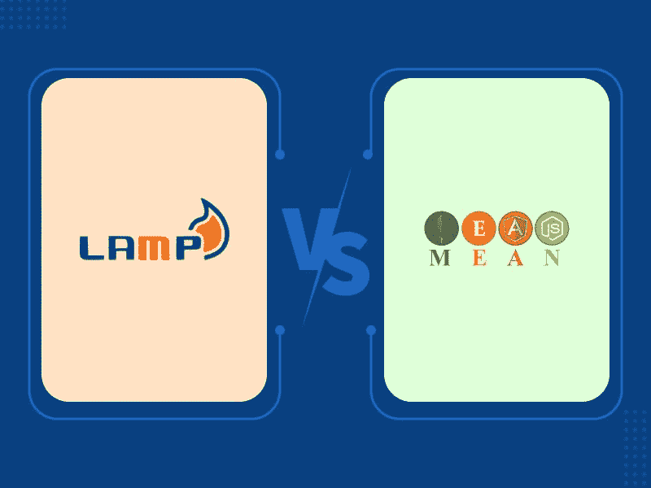
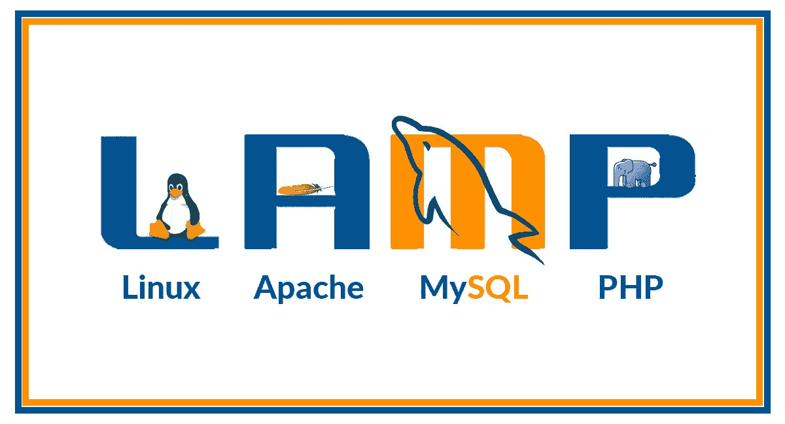
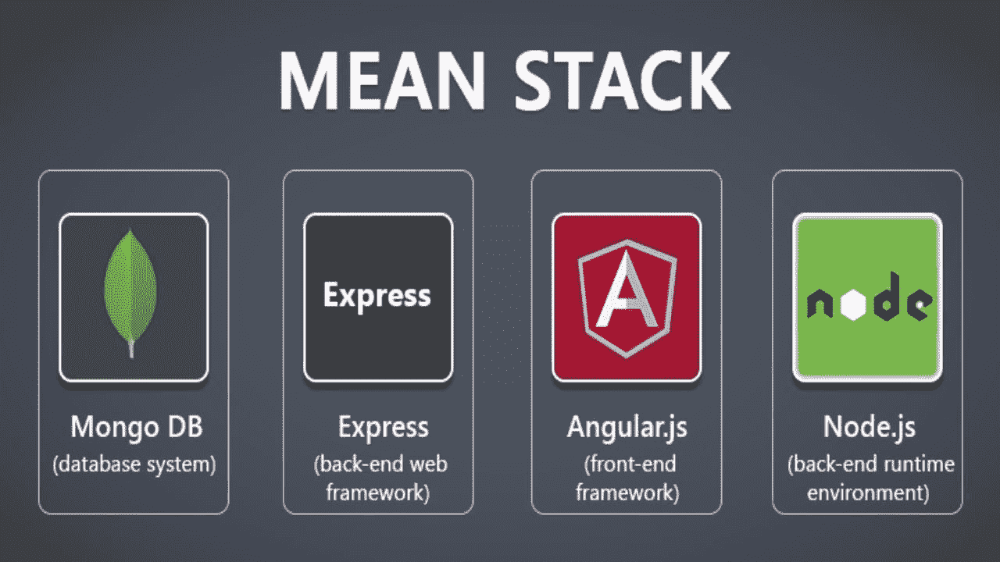
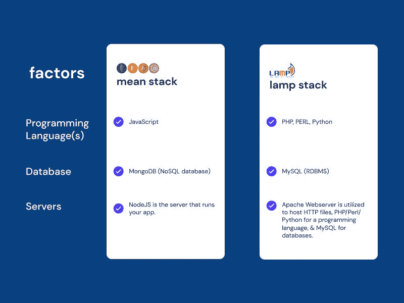

# LAMP 堆栈与 MEAN 堆栈:哪个 Web 开发堆栈适合您？

> 原文：<https://medium.com/nerd-for-tech/lamp-stack-vs-mean-stack-which-web-development-stack-is-right-for-you-ce8cfc22e282?source=collection_archive---------1----------------------->

如果你想构建下一个 web 应用程序或网站，确定哪个框架最有效是一个挑战。

LAMP Stack 开发和 MEAN Stack 开发是流行的 web 开发方法，它们允许 web 开发人员快速、高效、经济地构建项目，但是它们的效果一样好吗？他们有什么不同？你应该选择哪一个？

为了帮助您在 LAMP 堆栈和 MEAN 堆栈之间做出公平的决定，我们将介绍这两种堆栈是什么以及它们之间的区别，以便您可以做出明智的决定，为您的下一个项目选择堆栈！

所以让我们开始吧！

# 灯组概述

图片来源:Geekboots

LAMP Stack 是一组开源软件技术，它们共同运行动态网站和应用程序。LAMP 代表 Linux、Apache、MySQL 和 PHP，它允许您快速、轻松地构建网站，而无需购买昂贵的第三方软件许可证。

LAMP Stacks 传统上用于 Linux 服务器，但也可以安装在使用 VirtualBox 或 Parallels Desktop(仅举两个例子)的 Windows 机器上。由于 VirtualBox 和 Parallels Desktop 都在 Mac OS X 下运行，如果您喜欢在 GUI 环境下工作而不是直接在终端提示符下工作，那么您可以在 Mac 上托管 LAMP Stack 网站。

如果您不习惯使用终端命令，在 Mac 上安装 LAMP 服务器将节省您的时间，因为您不需要单独查找和安装所有组件。

也就是说，许多开发人员仍然发现安装他们的 Ubuntu Linux 版本对他们 web 开发过程的每个方面都更有吸引力。

# 使用灯组的优点

以下是使用灯组的一些‌benefits:

*   LAMP 栈支持多种 web 编程语言，包括 PHP、Python、Perl 以及 MySQL、PostgreSQL 和 Oracle 等数据库。
*   LAMP 栈包括开源的轻量级框架和库，很容易安装在任何操作系统上。运行它不需要那么多的处理能力和内存。
*   使用灯组也更容易，因为它是预先配置的，所以你不需要花太多时间自己调整。
*   LAMP Stack 也能很好地与大多数内容管理系统兼容，所以你可以毫不费力地用 WordPress 或 Drupal 建立一个网站。

如果你想使用 LAMP Stack 构建一个多功能的 web 应用程序，**从最好的 [**软件产品开发公司**](https://www.valuecoders.com/software-quality-assurance-testing-services-company#utm_source=soft_prod_deve&utm_medium=Guest_Blog&utm_campaign=Medium&utm_id=NKY) 雇佣 LAMP Stack 开发人员**。它将帮助您的企业在更短的时间内设计出优秀的 web 应用程序。

# 使用灯组的缺点

以下是使用 LAMP 堆栈开发 web 项目的缺点:

*   在开始之前，你需要花更多的时间和精力来学习这个系统是如何工作的。
*   您的大部分开发知识将集中在 Linux、Apache、MySQL 和 PHP 上，这限制了您在其他平台或编程语言方面的能力。
*   一些开发人员抱怨在 LAMP Stack 平台之间切换很耗时，而其他人则报告了偶尔的平台兼容性问题(主要是在使用 WordPress 时)。

# 平均堆栈概述

图片来源:NewGenApps

MEAN Stack (MongoDB、ExpressJS、AngularJS 和 Node.js)由于其灵活性、易用性和可伸缩性，已经成为当今 web 应用程序开发中最常用的堆栈之一。

这个堆栈提供了一个完整的包，只需几行代码(如果您知道如何编写的话)，就可以轻松地在您的项目中实现高级功能，如聊天、直播和社交共享！

除了简单易学之外，有经验的程序员会发现通过选择 HTML/CSS/Javascript 和 NoSQL 开发工具来扩展他们现有的技能集是很简单的。如果您正在寻找一个能够以最少的努力创建强大应用程序的现代堆栈，那么 MEAN 是一个极好的选择！

*亦读:* [*意思是 Vs MERN 栈:谁会赢得这场战争？*](https://www.valuecoders.com/blog/technology-and-apps/mean-vs-mern-stack-who-will-win-the-war/)

# 使用均值堆栈的优点

以下是使用均值叠加的一些‌pros:

*   MEAN Stack 使用 JavaScript，它有许多库可以处理数据库、AJAX 等等。
*   用 NodeJS 和 Express 搭建 API 比 PHP 简单；我们可以使用 AngularJS 作为前端框架，使得创建快速响应用户输入的复杂应用程序变得容易。
*   MEAN Stack 比 LAMP 更具可伸缩性，因为您不需要担心请求会使 web 服务器过载。
*   与 LAMP 相比，使用 MEAN 可以更容易地处理远程数据源，比如数据库和 API。

你期待创建一个面向业务的 web 应用程序吗？[**雇佣卑鄙的栈开发者**](https://www.valuecoders.com/hire-developers/hire-mean-stack-developers#utm_source=hire_mean_stack&utm_medium=Guest_Blog&utm_campaign=Medium&utm_id=NKY) 。它将帮助您形成符合您业务标准的领先 web 应用程序。

*相关博客:* [*为什么说 MEAN Stack 最适合 Web 开发？*](https://enlear.academy/why-mean-stack-is-best-for-web-development-55b7e4a00d72)

# 使用平均堆栈的缺点

以下是使用均值堆栈的一些缺点:

*   出于与上面相同的原因，NodeJS 和 Angular 与 MongoDB 成对出现(MongoDB 不是对象关系映射(ORM)数据库)。
*   开发人员需要学习多种框架来使用 MEAN Stack (Express，Koa，哈比神)，每个框架都有自己的怪癖和特质，这可能会让新手感到困难。
*   在传统的 LAMP 堆栈中，数据库无法与 web 服务器分离，因此开发人员不得不使用更高级的工具，如 PostgreSQL 和 MariaDB，而不是 SQLite，限制了不熟悉这些工具的新手。

*你可能会觉得有意思:* [*全栈 vs 均值 vs MERN:你应该选择哪个开发栈？*](https://www.valuecoders.com/blog/web-full-stack/full-stack-vs-mean-vs-mern-which-development-stack-should-you-choose/)

# 灯堆叠和平均堆叠之间的差异

LAMP Stack 和 MEAN Stack 已经成为现代 web 开发的代名词；他们之间有一个显著的区别。首字母缩写 LAMP 指的是 Linux、Apache、MySQL 和 PHP，而 MEAN 代表 MongoDB、ExpressJS、AngularJS 和 NodeJS。

LAMP Stack 开发了在服务器上运行的应用程序，而 MEAN 则被明确设计为使用 JavaScript 技术构建网站。

假设您希望在不同的环境中部署您的站点，包括测试环境或生产环境。在这种情况下，LAMP 堆栈将是最好的选择，因为它不需要 MySQL 或 PHP 也可以工作，而 MEAN 堆栈则不可能。

LAMP Stack 的一个常见用例涉及到创建没有服务器端编程的简单网站，而使用 MEAN 创建的网站需要 JavaScript 的高级学位。随着你离开 LAMP，找到精通构成一个平台的每项技术的 web 开发人员会变得更加复杂。

*也可阅读:* [*MEAN Stack 开发|企业为什么要为自己的业务挑选 MEAN？*](https://blog.devgenius.io/mean-stack-development-why-should-businesses-pick-mean-for-their-business-8355ad7c8e93)

# LAMP 堆栈与 MEAN 堆栈:哪个更适合开发？

在这里，我陈述了几个因素，它们将帮助你决定 LAMP Stack 和 MEAN Stack 哪个更适合 web 开发。

## 1.高性能

高性能是决定灯组和平均灯组的首要因素。由于所使用的数据库，LAMP Stack 在性能方面通常优于 MEAN Stack。

MySQL 比 MongoDB 更‌faster，MongoDB 更适合小型项目。但是，假设您的项目需要更多的计算能力或数据库密集型操作。在这种情况下，‌go 与灯堆栈，因为它有更多的计算能力比平均堆栈。

## 2.灵活性

灯堆和平均堆之间的另一个关键区别是灵活性。如果您正在寻找一个易于定制的平台，那么 LAMP Stack 是最佳选择。

我们也可以根据需要毫无困难地将其放大或缩小，而我们不能缩小平均堆栈，只能放大(有点困难)。由于这个原因，许多公司更喜欢使用灯堆栈而不是平均堆栈。

## 3.成本效益

这不仅仅是灯堆栈和平均堆栈之间的技术差异；也有一些与成本相关的差异。LAMP 堆栈的开发成本远低于平均堆栈，因为它更容易定制，并且具有更多内置功能。

甚至 LAMP Stack 上的云托管也比 AWS 上的单个节点便宜。另一件值得注意的事情是 LAMP Stack 提供了模块化，这意味着各种工具是分离的，所以它们不会冲突。这就是为什么从一种工具到另一种工具管理数据安全很容易。

## 4.社区支持

当考虑社区支持时，LAMP Stack 轻而易举地胜出，因为它是开源的。MEAN Stack 是封闭源码，归微软所有；因此，外人无法就如何改进均值漂移给出反馈或建议。

## 5.安全性和数据加密

如果您正在寻找一个提供安全性和数据加密的 web 解决方案，那么 LAMP Stack 应该是您的首选。它使用 SSL/TLS (HTTPS)加密，确保通过网络传输的数据得到加密，不能被任何人黑客攻击！

除了数据保护，它还可以通过在执行操作之前验证任何输入来防止 XSS 攻击和 SQL 注入。

意味着堆栈不提供加密或安全功能！因此，如果这些因素对您很重要，那么您应该选择 LAMP 堆栈而不是 MEAN 堆栈，因为它可以保护您的关键数据免受第三方黑客攻击或窃取！

*也可阅读:*[*MEAN Stack vs . PHP vs . Net:你的最佳选择是什么？*](https://www.valuecoders.com/blog/outsourcing-and-off-shoring/php-vs-mean-stack-vs-net/)

# 结论

MEAN 是中小型项目的绝佳选择，因为在大多数情况下，它比 LAMP 需要更少的服务器和更少的带宽。但是如果你有大量的数据集或者需要快速扩展，你会想要使用 LAMP，使用 Amazon CloudFront 作为你的 CDN 选择。

简而言之，两者都是很棒的解决方案，选择哪一个取决于你的具体需求和预算。

如果你想开发一个优秀的 web app， [**雇佣与最好的 **web app 开发公司**有关联的开发者**](https://www.valuecoders.com/hire-developers#utm_source=hire_dev&utm_medium=Guest_Blog&utm_campaign=Medium&utm_id=NKY) 。它将帮助你建立一个与你的业务目标相匹配的网站。