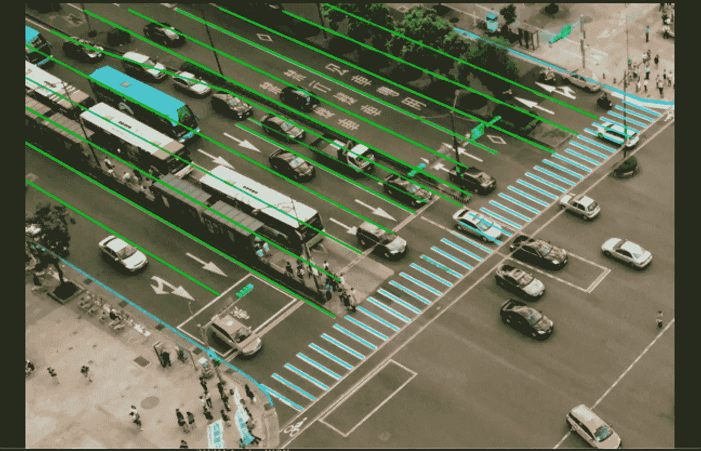

# 车道标注案例研究

> 原文：<https://medium.com/nerd-for-tech/lane-annotation-case-study-a289b9107987?source=collection_archive---------0----------------------->

随着自动驾驶时代的到来，需要车道识别的应用场景越来越广泛，相应的车道识别技术也越来越重要。

具体原因如下:一是覆盖场景广泛，车道识别存在于自动驾驶的大部分应用场景中，是不可或缺的基础算法；第二，行车安全。车道识别可以准确识别道路，最终帮助机器做出决策，这也是行车安全的重要保障。

让我们看一个车道标注的例子。

## 颜色的属性

白色、黄色、绿色、蓝色、红色和其他颜色。

## 车道属性**定义**

1.主车道的左车道线

2.主车道的右车道线

3.相邻车道的左侧车道

4.相邻车道的右车道线

5.其他车道的左车道线

6.其他车道的右车道线

7.网格线

8.网格线的右侧

9.十字路口的左侧

10.十字路口的右侧

11.其他人

## 车道线遮挡的属性

1.没有遮挡

2.轻微遮挡(小于 30%)

3.一般遮挡(30%-70%)

4.严重咬合(70%以上)

5.其他人

## **总体要求**

1.用多边形标记车道线。

2.标记行驶区域内的车道线，并标记转弯中的更多点。

3.虚线应该用一条线连接在一起。

4.需要标注双线(如双实线、双虚线、实虚或虚实线)的中心。

5.十字路口标记:标记十字路口的封闭区域和相交线。

6.车道线看不见的部分需要用想象来标注。

7.车道的起点应从图像的边缘开始标记。

8.遇到停车线时，车道线只标注到停车线。

10.注意损坏的裂缝，不要贴标签。

11.标注时，需要连接交叉点。

12.当两个车道类型在一起时(实线-虚线/低路缘-高路缘)，请将它们分开并紧密贴上标签。

## **特例**

1.将车道的终点标记为图像的终点

2.标记/想象城市道路或护栏下的车道线，并标记为实线。

3.如果车道线的扭曲是由镜头扭曲引起的，贴标机应根据实际情况对扭曲的车道进行标记(即贴直)。

4.如果收费站车道线不清晰，只标注相邻车道。

5.当高速公路上的物理隔离导致其他车道部分遮挡时，只标注可见部分。

6.不要在市区标注网格线。(网格线主要在高速公路上可见)。

7.城市道路下面的线要贴上标签，想象出来。

8.在隔离栅下标注/想象一条实线。

9.不要标注水平线。

## 结束

把你的数据标注任务外包给 [ByteBridge](https://tinyurl.com/bdhr9j2a) ，你可以更便宜更快的获得高质量的 ML 训练数据集！

*   无需信用卡的免费试用:您可以快速获得样品结果，检查输出，并直接向我们的项目经理反馈。
*   100%人工验证
*   透明标准定价:[有明确的定价](https://www.bytebridge.io/#/?module=price)(含人工成本)

## 为什么不试一试？