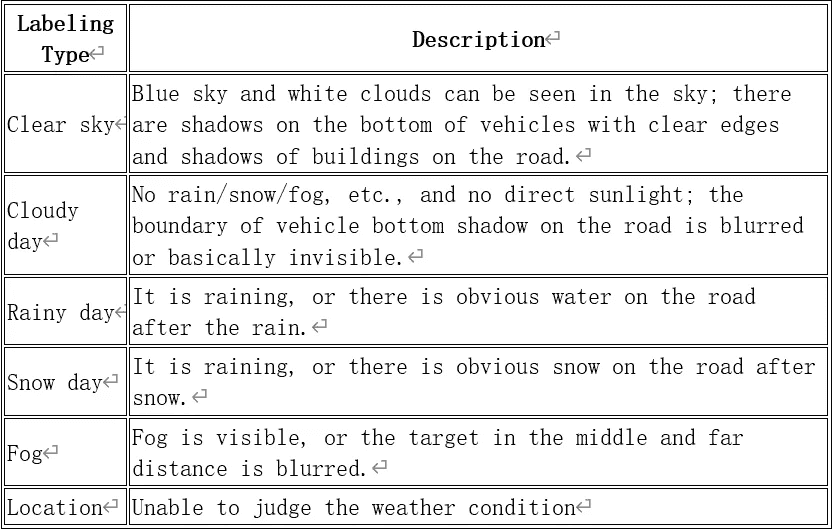
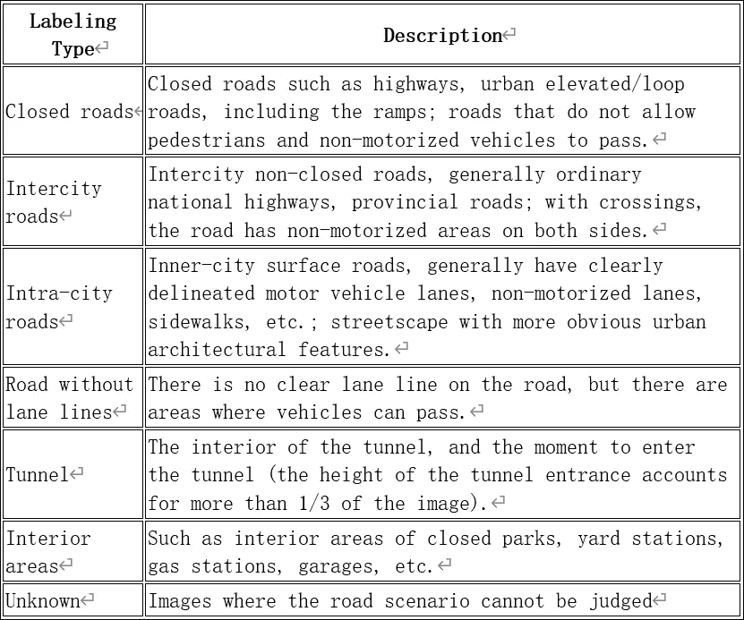
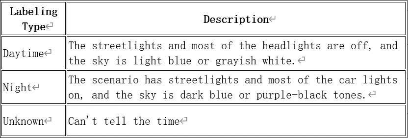
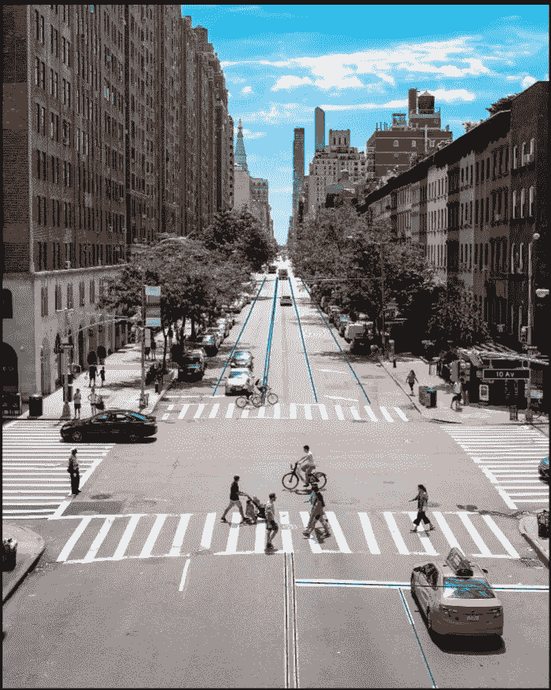
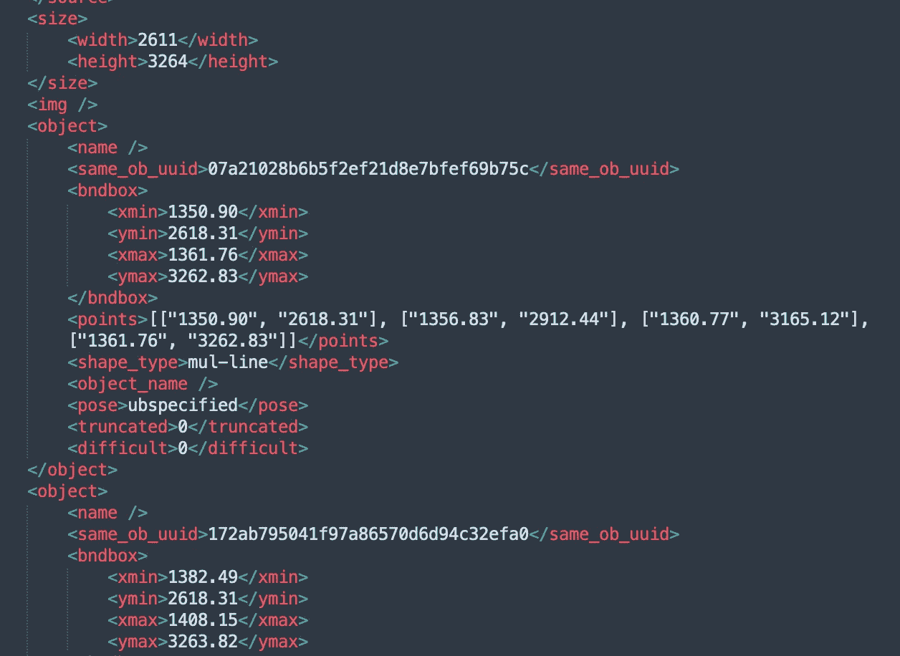

# 折线注释案例研究

> 原文：<https://medium.com/nerd-for-tech/lane-annotation-case-study-ea49fa09eea0?source=collection_archive---------1----------------------->

在驾驶区域的道路表面上有使用线、箭头、文本、立面标志、凹凸标志和等高线标志来传达引导、限制、警告和其他交通信息的标志。他们的作用是控制和指挥交通。

接下来，我们将分享一个车道标注案例研究。

实际上，车道是用点集标注的，也就是说，车道线的每个例子都表示为一组点。注释图像的像素和精度要求相对较高。

## 注释内容

1.  每条车道线

(1)外部轮廓

封闭形式。如果中间有被遮挡的部分，就要想象并完成。

(2)类别

a)车道线类型

b)颜色

c)是否被遮挡

d)是否可以跨越

## **目标对象的类别**

(1)车道线型:

根据类型是实线还是虚线进行分类，例如:

*   实线
*   短划线
*   实线-实线
*   点划线
*   实线-虚线
*   虚实线
*   虚线-虚线-虚线
*   其他人

(2)颜色:

按颜色命名，如:

*   怀特（姓氏）
*   黄色
*   白色-黄色
*   白色-白色
*   其他人

(3)咬合 **:**

*   真:外部轮廓被遮挡
*   错误:外部轮廓没有被遮挡

(4)跨越 **:**

*   左侧:可以从左侧通过
*   右:可以从右边穿过
*   两者:可以从两边交叉
*   假:不能被跨越

## **标签示例和特殊情况描述**

(1)双线或三线标注在一起

(2) Y 或 V 形分成三或两个

(3)起点是自车辆的位置或图像的底部边界

(4)端点延伸到可以看到的最远车道。

(5)标记两条不同形状的线

## 属性

(1)天气

(2)道路状况

(3)时间

注意:

(1)图像标准

没有遗漏的行，没有错误标记的行，没有多余的行。

(2)线路标准

线要画在中间，像素误差在 2px 以内。

(3)所有属性都要选择正确。

## 您可以手动配置和 ByteBridge 注释

**只差三步**

*   使用您的电子邮件登录
*   上传样本
*   告诉我们要贴什么标签:告诉我们最小标签尺寸和您需要的精度。

您可以将需求发送给我们，我们将处理配置工作。

那就轮到我们了。

演示和报价将在工作日不到 24 小时内准备就绪。

**输出**

字节桥巷注释

**JSON 输出**

ByteBridge Lane 注释 JSON

## 结束

把你的数据标注任务外包给 [ByteBridge](https://tinyurl.com/kv589rat) ，你可以更便宜更快的获得高质量的 ML 训练数据集！

*   无需信用卡的免费试用:您可以快速获得样品结果，检查输出，并直接向我们的项目经理反馈。
*   100%人工验证
*   透明和标准定价:[有明确的定价](https://www.bytebridge.io/#/?module=price)(包括人工成本)

## 为什么不试一试？