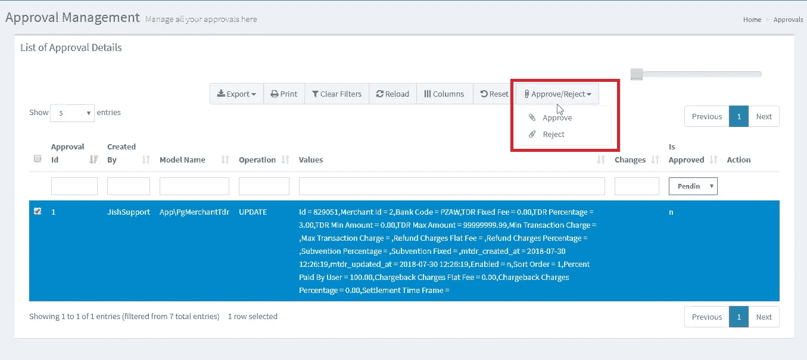

# 拉勒维尔雄辩的赞同

> 原文：<https://medium.com/nerd-for-tech/laravel-eloquent-approval-498a414cc305?source=collection_archive---------0----------------------->


这就是我们如何构建 laravel 雄辩认证包的故事。让我介绍一下这个故事的背景，并解释一下这个 laravel 包是如何构建的。

我是一名 Laravel/PHP 开发人员，在 Traknpay 工作。在我们的团队中，我们创建了一个商家门户，商家可以在其中阅读报告、跟踪日常交易和查看结算细节。在这个门户中，我们使用基于角色的登录，每个用户被赋予不同的角色，这将由组织的根商家提供。有点类似于 AWS IAM，但没有那么复杂。

其中一个需求是创建 maker-checker，其中属于特定组织的角色为“执行”的用户将进行一些更改，而同一组织中角色为“经理”的另一个用户将批准或拒绝这些更改。如果更改被批准，那么只有数据应该被持久化到数据库中，否则不应该。

我们想到的一个解决方案是在每个数据库表中有一列，比如“is_approved ”,并从“is_approved”设置为“yes”的表中选取数据。但是这个解决方案会对我们现有的应用程序产生巨大的影响。我们不知道哪里和所有的代码可以打破系统，并作出这些改变是繁琐的。

因此，我们想让我们有一个单一的表，并将保存模型以待批准。为了做到这一点，在谷歌搜索了一个小时并查看了不同的解决方案后，我们想到了创建自己的审批包。

这催生了[拉勒维尔振振有词的赞许](https://github.com/TraknPay/laravel-eloquent-approval)。


它是如何工作的，这个包有一个称为**批准特征**的特征，它应该被用在你想要有创建者-检查者/批准功能的模型中。这个**批准特征**有一个静态内置函数' **isApprover()** '，默认情况下返回 true。

```
 /**  
     * check whether user has permission to approve
     * 
     * @return bool  
     */
    public static function isApprover(): bool
    {
          return true;
    }
```

现在，我们可以在使用这个特征的模型中覆盖上面的方法，并在' **isApprover()** '方法中编写我们自己的定制逻辑。下面是覆盖' **isApprover()** '方法的示例代码。

```
**namespace** App;

**use** Illuminate\Database\Eloquent\Model;
**use** Laratrust;
**use** TraknPay\EloquentApproval\ApprovalTrait;*/**
 * Class Post
 */* **class Post extends** Model {*/**
 * check whether the user has permission to approve
 *
 ** ***@return*** *bool
 */* **public static function** isApprover(): bool
{
   **return** Laratrust::*can*(**'merchanttdr-approve'**);
}}
```

此外，该包附带有自己的'**批准**'表。如果方法' **isApprover()** '返回 false，那么数据将存储在 **approvals** 表中，而不是在模型中提到的用于批准的表中。

**创建/更新模型被序列化，并与批准所需的元数据一起存储在批准表中**。

现在最大的问题是如何批准数据并将内容保存到实际的数据库表中。嗯，我们围绕 approvals 表构建了一个 UI，如下所示。您可以根据自己的目的使用 **approvals** 表构建自己的 UI。



审批管理界面

批准表存储型号名称和序列化值。一旦用户批准了模型，我们就对数据进行解序列化，以创建相应的模型并保存它。

```
$model = unserialize($approval->values); 
$model->save();
```

找到了。！！。

这个软件包帮助我们完成了我们的商家门户网站的制造商检查功能。在它变得有用之后，我们将这个包发布给[的包装商](https://packagist.org/)，这样其他人也能从中受益。

这是这个包的链接(【https://github.com/TraknPay/laravel-eloquent-approval】T4)，如果你觉得这个包有帮助，请在评论区告诉我。

*谢谢，编码快乐！。*