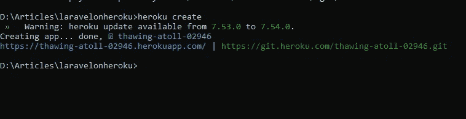

# Heroku 上的 Laravel 项目部署

> 原文：<https://medium.com/nerd-for-tech/laravel-project-deployment-on-heroku-71fbecb491da?source=collection_archive---------10----------------------->


由 vectorjuice / Freepik 设计

Heroku 是一个云计算应用，提供平台即服务(PaaS)。该平台允许开发人员部署、管理和扩展他们的应用程序。在本文中，我将向您展示如何在 Heroku 平台上部署一个 laravel 项目。

让我们开始吧。

> 安装 heroku CLI

首先，你应该在你的电脑上安装 heroku CLI。检查此[链接](https://devcenter.heroku.com/articles/heroku-cli#download-and-install)并根据您的操作系统安装 Heroku CLI。

> **创建一个 laravel 项目**

通过运行以下命令，在本地创建一个新的 laravel 项目。

```
composer create-project --prefer-dist laravel/laravel laravelonheroku
```

> **初始化一个 Git 库**

使用以下命令初始化 laravel 项目文件夹中的 git 存储库。

```
git init
```

> **创建一个过程文件**

在 laravel 项目中创建一个名为 Procfile 的文件，并在 Procfile 中添加以下代码。

```
web: vendor/bin/heroku-php-apache2 public/
```

> **创建 Heroku App**

通过运行以下命令创建一个 Heroku 应用程序。请注意，您应该有一个 Heroku 帐户，如果您没有帐户，请在运行以下命令之前创建一个帐户。

[在 Heroku 上创建一个账户](https://signup.heroku.com/login)

```
heroku create
```

将使用随机名称创建一个应用程序。在我的例子中，应用程序的名称是“解冻-环礁-02946”



作者截图

您可以使用下面给出的命令重命名它。

```
heroku apps:rename <newname>
```

> **设置 Laravel 加密密钥**

要设置并运行 laravel 加密密钥:

```
php artisan key:generate --show
```

一旦你运行上面的命令，你将得到密钥。复制密钥并运行下面给出的命令。

```
heroku config:set APP_KEY=<copied key>
```

> **推送变更**

您必须将您在本地进行的所有更改推送到 git 存储库。

逐一运行以下命令，将更改推送到 Heroku 服务器。

```
git add .
git commit -m"<message>"
git push heroku master
```

> **配置数据库**

要实现登录和注册，您应该在 heroku 服务器中设置数据库。在我的项目中，我将使用 Postgres 数据库，因为它在 Heroku 上是免费的。

运行以下命令为您的应用程序创建 Postgres SQL。

```
heroku addons:create heroku-postgresql:hobby-dev
```

现在转到 database.php 文件(在项目的 config 文件夹中)，将 mysql 改为 pgsql 作为默认数据库。

您的 database.php 文件应该如下所示。

由于您已经在 database.php 文件中进行了更改，您必须通过逐个运行以下命令将上述更改推送到 git repo。

```
git add .
git commit -m"<message>"
git push heroku master
```

现在您可以运行迁移了。运行以下命令来迁移您的数据库。

```
heroku run php artisan migrate
```

> **设置认证**

由于 laravel 提供了认证工具，您可以通过运行以下命令来设置登录和注册系统。

```
composer require laravel/ui
php artisan ui:auth
```

将更改推送到 heroku 服务器

```
git add .
git commit -m"<message>"
git push heroku master
```

现在，您可以成功注册并登录到您部署的 laravel 应用程序。

希望这篇文章对你有所帮助。感谢您的阅读！