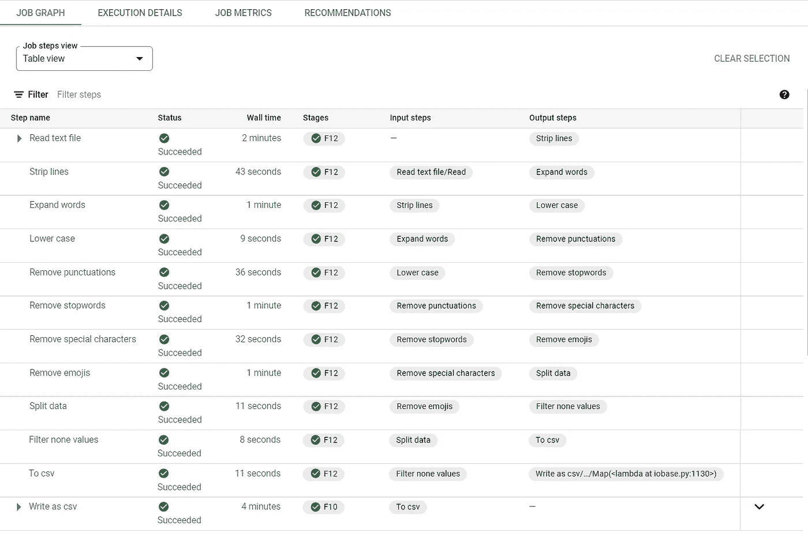

# 基于 Apache Beam 和云数据流的大规模文本处理

> 原文：<https://medium.com/nerd-for-tech/large-scale-text-processing-with-google-cloud-dataflow-740e275eb93?source=collection_archive---------1----------------------->

[娜塔莉亚 Y](https://unsplash.com/@foxfox) 在 [Unsplash](https://unsplash.com/) 上的照片

数据预处理是机器学习中最重要的步骤之一。机器学习模型的好坏取决于它们接受训练的数据。模型复杂性/架构也很重要，但是如果数据本身不好，什么都不会起作用。

互联网上的大多数数据都是不干净的。大多数机器学习应用程序在将数据输入模型进行训练之前，必须对数据进行某种预处理。数据预处理方法会对模型准确性和训练时间产生显著影响。

文本数据也不例外。它们通常比数值数据需要更多的预处理。大多数文本数据集包含特殊字符、额外的空格、表情符号、标点符号和许多其他会影响模型性能并需要删除的东西。

Google Cloud dataflow 是用于大规模数据处理的 Google Cloud 托管服务。当数据集较小时，使用普通 python 函数进行数据处理是可行的。但是当数据集包含数百万个示例时，使用普通的 python 函数就变得不可行了。相反，可以使用 apache beam 构建数据管道，然后作为数据流作业运行。数据流得到全面管理，并具有自动扩展功能，因此无需担心资源耗尽。一些流水线操作也是并行运行的，因此流水线会运行得更快。

需要一个大数据集来比较手动运行数据管道和数据流作业的性能。我们将使用 Kaggle [中的亚马逊评论数据集。train zip 文件包含一个文本文件，其中有 360 万条评论及其标签。文本文件本身的大小是 1.5 GB。这是同一文件中的一行:](https://www.kaggle.com/bittlingmayer/amazonreviews?select=train.ft.txt.bz2)

即使对非游戏玩家来说也是令人震惊的:这个音轨太美了！它很好地描绘了你心中的记忆，我甚至会推荐给那些讨厌视频的人。游戏音乐！我玩过 Chrono Cross 游戏，但在我玩过的所有游戏中，它的音乐是最好的！它摒弃了粗糙的键盘，用吉他和深情的管弦乐迈出了新的一步。它会打动任何想听的人！^_^\n"

第一个单词指定了标签。“__label__1”对应 1 星和 2 星评价(差)，“__label__2”对应 4 星和 5 星评价(好)。

## **使用的预处理技术列表:**

1.  删除句尾、句首或句中多余的空格。
2.  扩展单词，如“不是”、“不是”等。
3.  将句子中的所有字母转换成小写。
4.  删除标点符号。
5.  删除停用词。
6.  删除特殊字符。例如:+，-，:，等等。
7.  移除表情符号。
8.  将标签转换为数字形式。即“__label__1”为 0，而“__label__2”为 1

下面是列出的实施步骤:

加载文本文件并在本地运行这些步骤(一个接一个地运行函数)由于数据量太大(360 万条评论)而花费了很长时间。我无法测量处理时间，因为它一直在运行，我不得不在一段时间后停止它。

下面是在数据流上运行与 apache beam 管道相同的步骤的实现:

上面脚本中创建的 Apache beam 管道可以在本地运行，也可以作为一个成熟的数据流作业运行。通常，管道在较小版本的数据集上本地运行，以确保管道是正确的，并且运行时没有任何错误或权限问题。一旦本地运行成功，就可以将作业提交给数据流。

从 google cloud storage (GCS)中读取原始文本文件，并将最终的预处理文本和标签写回到 GCS 的不同目录中。Apache beam 有各种不同的预建 IO 连接器。预处理后的数据也可以写入 Bigquery 表，因为它现在是结构化数据。

当我将上述管道作为数据流作业运行时，整个管道在 13 分钟内完成。它能够在 13 分钟内处理所有 360 万篇综述文本并将结果以 CSV 文件形式写入 GCS！

以下是数据流作业仪表板的屏幕截图，包含每个管道步骤的执行细节:

图片作者[作者](/@subrahmanyajoshi123)

# **尾注:**

还有很多文本预处理技术，比如删除 URL、词汇化、词干化等。必须根据数据集选择适当的技术。

预处理完成后，下一步是使用 tensorflow.keras 的“Tokenizer”模块将文本数据转换为数字形式，该模块将可变长度的文本转换为固定长度的整数序列。深入探讨这个问题超出了本文的范围。

谢谢