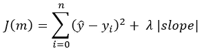
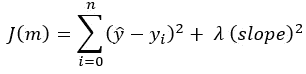

# 套索和脊正则化..简单解释

> 原文：<https://medium.com/nerd-for-tech/lasso-and-ridge-regularization-simply-explained-d551ee1e47b7?source=collection_archive---------4----------------------->

在了解了[线性回归](https://bassemessam-10257.medium.com/linear-regression-9c91172239b1)和[梯度下降](/nerd-for-tech/mathematics-behind-gradient-descent-simply-explained-c9a17698fd6)的基本原理之后，是时候向前推进一点，回顾一下提高普通线性回归模型性能的一些技巧了。最常见的技术是套索正则化(L1 正则化)和岭正则化(L2 正则化)。首先，我们需要知道“正规化”是什么意思。简单来说，正则化就是添加信息以防止过度拟合的过程。

在训练阶段，当模型的误差最小时，会出现过拟合问题，但使用测试数据点的模型性能较差。这意味着该模型不是通用的，不能用于生产。

# **套索正规化:**

LASSO 代表最小绝对收缩和选择运算符。正如正则化定义中提到的，它是添加信息以防止过拟合问题的过程，所以将对普通最小二乘法的代价函数做一个小的修改，如下图所示。

LASSO 回归模型的成本函数

为了理解这个附加项“惩罚项”的影响，让我们假设最佳拟合线穿过所有数据点，因此误差平方和为零。附加项(λ |slope|)应最小化，以最小化成本函数。最小化斜率意味着它使线不太陡，这将不会使线通过所有的数据点，这将有助于防止过度拟合。
我们应该问的下一个问题是“λ是什么？”。正则化参数是正整数。如果λ太高，这将使斜率最小化或“缩小”到零。这是 LASSO 的主要附加值。它可以抑制无用特征(高度相关的特征)的系数，因此，它为我们的线性回归模型进行特征选择。另一方面，如果λ等于零，损失函数将变成“普通最小二乘”模型。正则化参数(λ)可以通过交叉验证以避免欠拟合(当λ太高时)和过拟合(当λ太低时)的方式来确定。

# **岭正则化(L2 正则化):**

岭正则化是 LASSO 的另一种变体，因为添加到成本函数中的项如下所示。

岭回归模型的成本函数

在岭正则化中，罚项可以接近零，但当它与系数(斜率)平方时将不会为零。脊正则化不能用于特征选择，那么什么时候使用套索和脊呢？如果您有许多高度相关的特征，并且您需要去掉无用的特征，那么 LASSO 是更好的解决方案。
如果特征的数量大于观测值的数量，并且许多特征具有多重共线性，则岭正则化是更好的解决方案。

*   弹性网回归是 LASSO 和 Ridge 的混合，通过添加两个术语(L1 正则化和 L2 正则化)来计算成本函数，从而计算模型系数。

参考资料:

 [## L2 L1 正规化-为什么需要/它做什么/它如何帮助？

### 简单的更好！这就是正规化背后的整个概念。我最近写了关于线性回归和偏差…

www.linkedin.com](https://www.linkedin.com/pulse/l1-l2-regularization-why-neededwhat-doeshow-helps-ravi-shankar/)