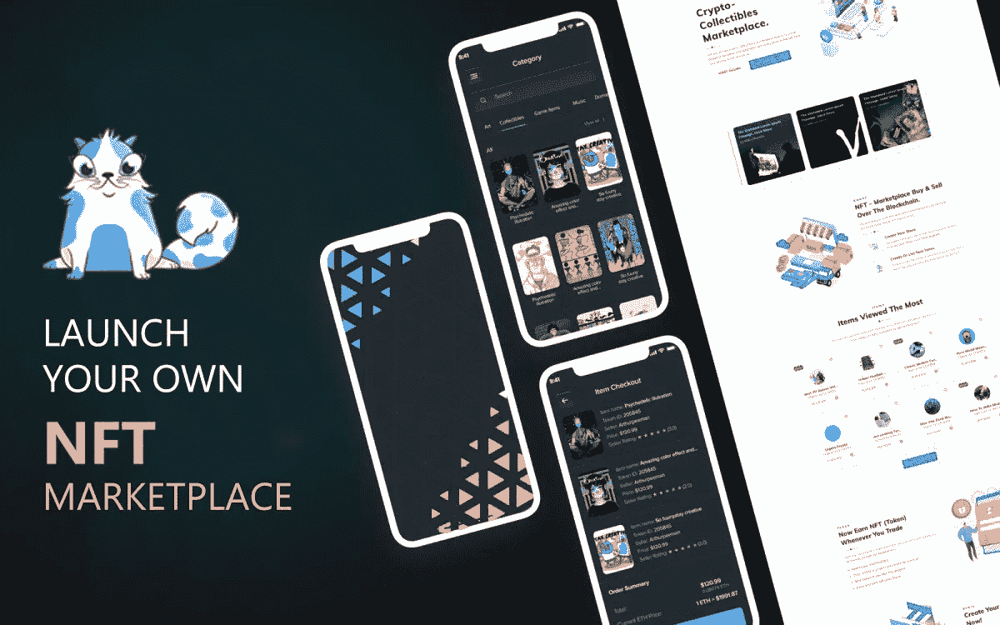
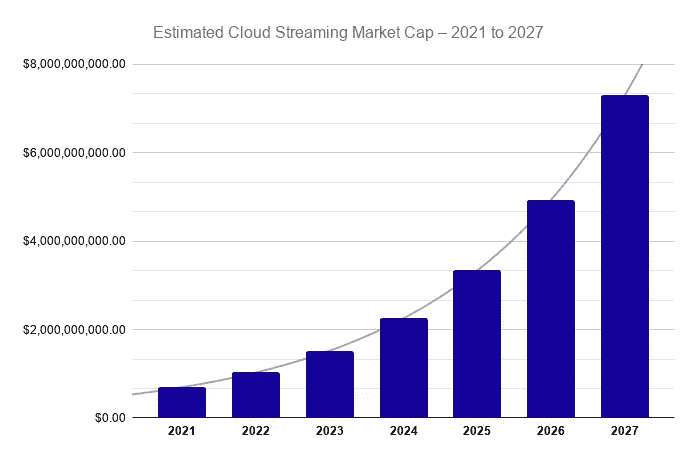
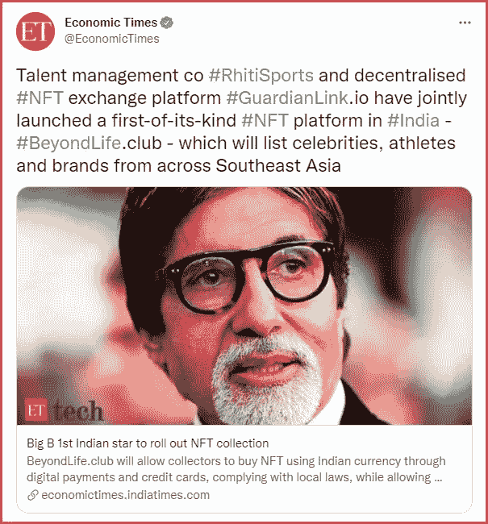
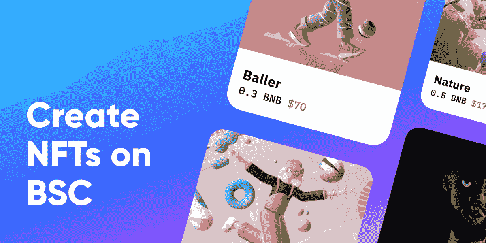

# 推出您自己的 NFT 市场

> 原文：<https://medium.com/nerd-for-tech/launch-your-own-nft-marketplace-ca002272148d?source=collection_archive---------2----------------------->

## **引入不可替换的令牌**

不可替代的代币或 NFT，正如它们通常被缩写的那样，代表了像区块链这样的新技术和像收藏品这样的经典概念的最佳融合。简单来说，就是不可替代的代币，或者代表区块链上某个独特事物所有权的可收集代币。代币可以代表完全数字化的东西，甚至是现实世界的收藏品。

> [为了理解 NFTs，我们需要理解可替代性的概念](https://www.blockchainappfactory.com/nft-marketplace-development?utm_source=Medium+Publication+-+Nerd&utm_medium=Guest+Post+-+03%2F09%2F2021+&utm_campaign=vignesh)。

## **什么是可替代性？**

如果一项资产或一项资产的代表可以很容易地被交换而没有任何价值损失，该资产可以被认为是可替代的。最好的例子就是美钞。如果你有一张 10 美元的钞票，你可以很容易地把它换成另一张 10 美元的钞票，而不会有任何价值损失。尽管你的版本有一些独特之处，但它的价值不会改变。这张钞票也可以分解成 10 张一美元的钞票，这也不会改变它的价值！

正如你可能已经猜到的，不可替代性与此完全相反！不可替换的令牌是唯一且稀缺的。考虑到区块链技术是不可变且安全的，NFT 为该技术提供了有趣的用例。

虽然每个区块链都拥有这些属性，但在处理非功能性测试时，有些区块链比其他人更有资格。

## **NFT 市场**

[NFT 正在热销](https://nonfungible.com/market/history)，很难错过关于 NFT 销售**视频迷因**、**数字艺术**和**歌曲**的新闻。曾经有过这样的例子，人们甚至把 NBA 的收藏品当作 NFT 出售。

一些区块链甚至为购买 NFT 的人提供增强现实和虚拟现实设施，这样他们可以在承诺购买之前体验艺术或收藏品。由于 NFTs 的引入，crypto art 以 466%的速度增长，NFT 市场出现了前所未有的 37，000%的增长。

使非功能性测试更有吸引力的是获得它并不复杂。有 NFT 市场，通过它你可以很容易地购买不可替换代币作为加密货币或法定货币。他们也作出惊人的商业前景，因为你可以在每笔交易的利润！

[**大 b 第一印度明星推出 NFT 系列**](https://twitter.com/EconomicTimes/status/1432565058110836736)

## **介绍币安智能链**

[币安智能链](https://www.blockchainappfactory.com/binance-smart-chain-development-services?utm_source=Medium+Publication+-+Nerd&utm_medium=Guest+Post+-+03%2F09%2F2021+&utm_campaign=vignesh)是由币安创建的新时代区块链，他是加密货币交易所最著名的名字之一。当谈到 NFT 市场的最佳区块链时，它有所有的资格废黜 NFTs 的第一个领导者以太坊。

## **币安智能连锁的优势**

币安智能链，通常缩写为 BSC，具有很多优点。

*   BSC 与以太坊虚拟机兼容，使得以太坊开发者在这个新的区块链上创建应用变得更加容易。
*   在处理交易时，BSC 具有更高的效率和速度。一次可以添加三个块，并且它还使用一种简单的共识机制，而不会损害完整性和安全性。
*   BSC 可以与多个加密货币钱包无缝集成，是去中心化金融的理想选择。
*   就像以太坊一样，即使是 BSC 也有不同的令牌标准，并且有专门为 NFTs 设计的特定令牌标准。事实上，NFT 有一个名为 BakerySwap 的市场完全基于 BSC。

在像 BakerySwap 这样的市场上创建你的艺术品令牌是一个简单直接的过程。事实上，正是这一过程的简单性使得 NFT 市场成为一个有利可图的商业理念。

## **在市场上创建你的 NFT**

在你着手创建你的 NFT 之前，你需要知道你必须选择一个能给你的 NFT 供电的区块链和一个能接收你为你的 NFT 得到的钱的钱包。为了简单起见，让我们以 BakerySwap 为例，它也将证明使用像 BSC 这样的区块链是多么简单。

*   你需要找到你的钱包和一些加密硬币。在今天的转换率，你将需要低至 11 美元的东西开始。
*   你会发现一个明确提到“薄荷艺术品”的部分
*   您可以通过点击+上传您的数字艺术、视频或音乐。
*   在完成交易之前，您需要同意条款和条件以批准交易。
*   你可以上传多件艺术品和作品，并且可以全部观看。
*   您可以在作品获得批准后设定价格。如果一位收藏家发现你的艺术品很吸引人，他们会以你所陈述的价格购买你的艺术品。

 [## 音乐 NFT 市场震撼音乐世界——区块链应用工厂

### 在过去的几年里，互联网已经显示出指数增长，并发现自己在一个情况下超过…

www.blockchainappfactory.com](https://www.blockchainappfactory.com/blog/music-nft-marketplace-rocks-the-world-of-music/?utm_source=Medium+Publication+-+Nerd&utm_medium=Guest+Post+-+03%2F09%2F2021+&utm_campaign=vignesh) 

## **基于平衡计分卡的 NFT 市场发展**

如果铸造 NFT 的过程如此简单，那么[创建市场](https://www.blockchainappfactory.com/nft-marketplace-on-binance-smart-chain?utm_source=Medium+Publication+-+Nerd&utm_medium=Guest+Post+-+03%2F09%2F2021+&utm_campaign=vignesh)的过程也必须相应地简单，BSC 区块链公司不会让人失望。

*   BSC 区块链的架构远没有它的同行复杂，这使它成为 NFT 市场发展的最佳选择之一。
*   您可以有选择地对市场上列出的不可替换令牌进行分类。
*   区块链也支持非商品合成品，并且也有 DAO 创造和操作的设施。
*   区块链可以与其他区块链和钱包无缝集成，使您的市场范围更加普遍。

## **结论**

像杰克·多西和琳赛·罗韩这样属于不同垂直行业的一些大牌明星与非功能性测试相关联，这足以证明非功能性测试是多么有前途，任何涉及非功能性测试的业务都将是多么有利可图。BSC 区块链是一个完美的例子，说明正确的产品如何在正确的时间创造奇迹。当人们被以太坊的标准所束缚时，BSC 为他们提供了一个完美的选择，在以太坊被认为是有限的方面更好。

考虑到 NFTs 的概念是多么的新生，BSC 区块链是多么的新鲜，现在是你作为一个加密企业家在币安智能链上建立你的 NFT 市场的理想时机。如果你与合适的区块链发展公司合作，在 BSC 上建立你的 NFT 市场并不困难。