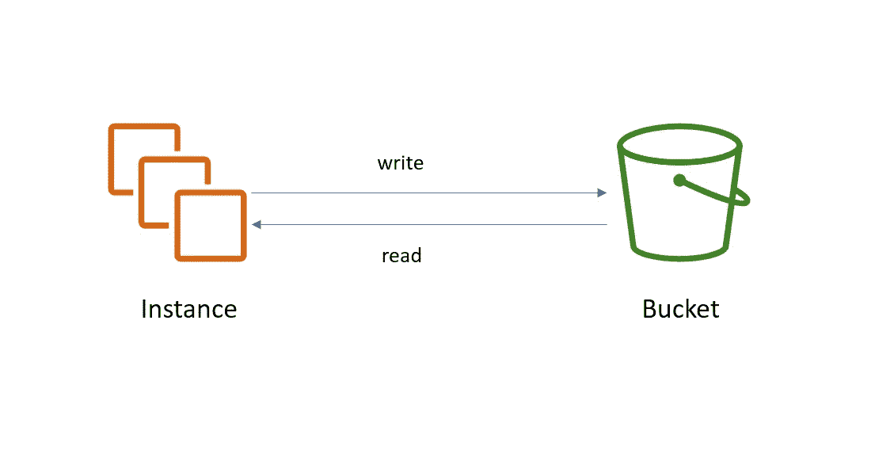
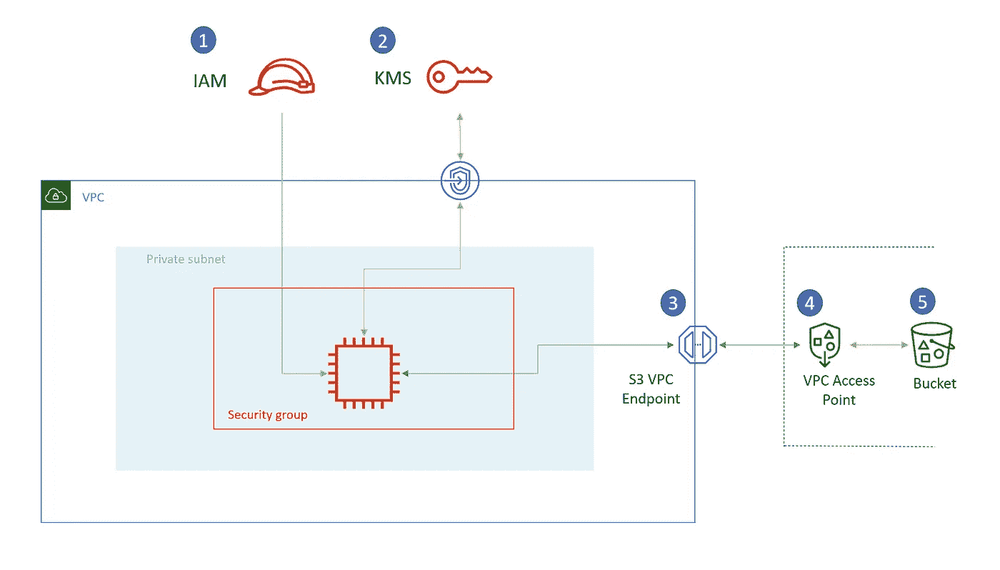

# AWS 中的分层安全性—简介

> 原文：<https://medium.com/nerd-for-tech/layered-security-in-aws-introduction-a27641af198d?source=collection_archive---------1----------------------->

在 [Unsplash](https://unsplash.com/s/photos/jail-security?utm_source=unsplash&utm_medium=referral&utm_content=creditCopyText) 上由 [Deleece Cook](https://unsplash.com/@deleece?utm_source=unsplash&utm_medium=referral&utm_content=creditCopyText) 拍摄的照片

一个好的云平台的成功建立在坚实的安全基础之上。保护云环境是一个广阔的领域。大体上，我们可以在四个方面打破 AWS 的安全状态。

**账户级安全** — SCP，将 AWS 服务是否可以在账户中消费列入白名单。

**服务级别安全性**—BAU 主体可以使用的白名单服务 API。服务如何相互作用，即服务关联角色。

**资源级安全** —白名单服务的什么资源可以使用。资源/桶/队列策略等。

**应用程序级安全性** —授予资源内应用程序的特权可以是在 EC2 或容器内运行的一些代码，或者是 Beanstalk 或 EMR 内的应用程序。

让我们通过一个简单的例子来演示如何构建一个分层的安全架构。在我们的示例中，我们有一个 EC2，它将读写一个 S3 存储桶。

一开始，它看起来非常简单明了。以免从 AWS 安全结构的角度看起来相同。

在上面的图片中，我给安全相关的对象添加了标签。我们将逐一讨论。

1.  **实例角色(IAM)** —该角色被分配给 EC2 实例。该角色包含实例所需的所有访问权限。这里有通往 S3 和 KMS 的通道。现在需要强调的重要一点是，由于该角色是针对 EC2 的，因此我们应该将其使用限制在 VPC 内部或通过端点。这确保了如果任何人从实例元数据获得 EC2 凭证，并试图在 VPC 之外使用它，那么这将被拒绝。为此，我们向角色添加以下策略。

> 注意:我已经在 KMS 策略声明中添加了 viaService 条件，这是为了确保 s3 能够呼叫 KMS。如果 KMS 被 S3 服务本身调用，那么请求不会通过端点(它是一个调用 KMS 的 S3 服务，两者在 VPC 都没有边界)。

**2。KMS 策略(资源策略)** —通过将 KMS 密钥创建移动到一个单独的帐户，然后将对目标帐户的访问授权给消费，来分离责任是一个好的做法。KMS 密钥策略将密钥使用委托给帐户，并依次委托给实例正在使用的 IAM 角色。这样，密钥具有不同的生命周期控制(创建和删除权限在 KMS 关键帐户中),并且可以由单独管理。使用是授权的，并且是基于需求的。

**3。S3 VPC 端点&端点策略** —这正由专用子网中的 EC2 实例使用。这确保流量永远不会离开 AWS 网络。端点上的策略确保 EC2 只能使用相同的帐户访问点从 S3 存储桶读取和写入。

**4。VPC 接入点** —这确保只有当请求来自 VPC 时才访问存储桶，因为我们已经创建了网络访问类型设置为 VPC 的接入点。**有趣的是，接入点包含地区和账户 id** 。这是很有用的，因为在 S3 ARN，我们没有帐户 Id，所以限制特定帐户的访问有点困难。

**5。存储桶策略** —该策略锁定对特定 VPC 的存储桶访问。这确保了 VPC 之外的任何资源都不能访问该桶的内容。

**0。SCP** —是的，你没看错，我提到的是零。这是因为 SCP 允许我们控制边界或上下文，在该边界或上下文下创建诸如接入点、S3 桶和其他资源的资源。

这是一个非常基本的例子，我们在资源、服务和帐户级别设置了安全机制。此外，我们只讨论了策略级控制，网络级安全将在另一篇文章中讨论。

安全快乐！！