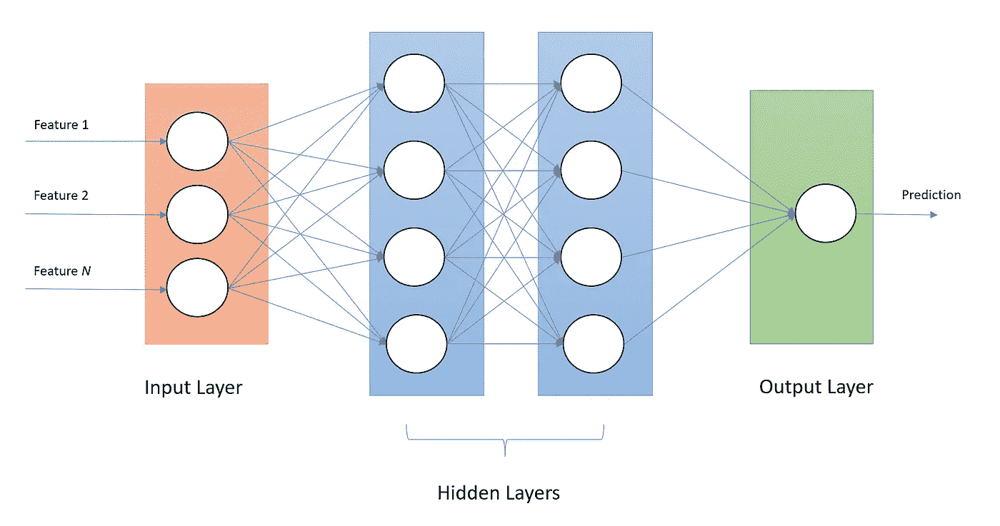
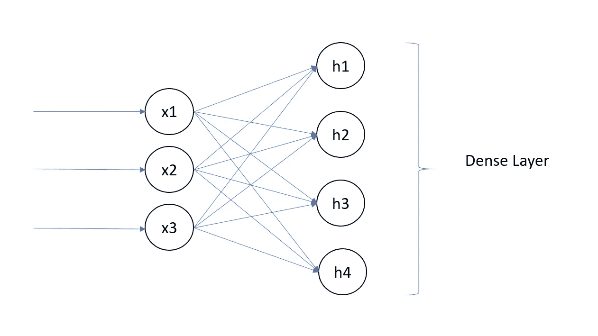
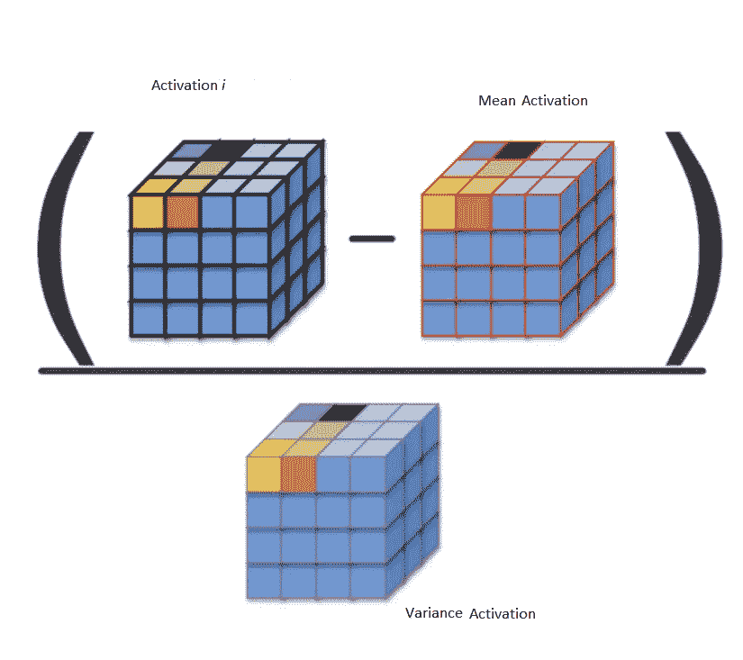
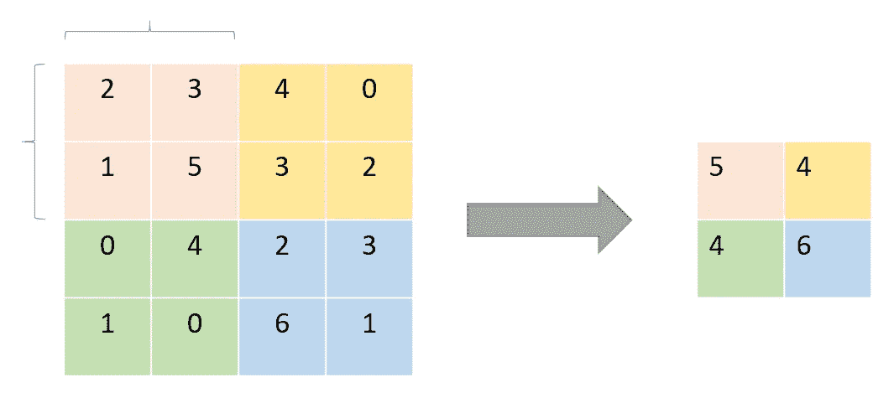
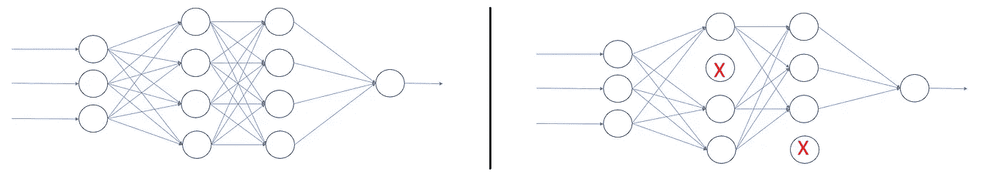
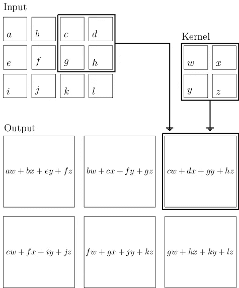

# 神经网络中的层

> 原文：<https://medium.com/nerd-for-tech/layers-in-neural-network-90d48a5a42fb?source=collection_archive---------7----------------------->

罗布·谢汉在 [Unsplash](https://unsplash.com/s/photos/stacks?utm_source=unsplash&utm_medium=referral&utm_content=creditCopyText) 上的照片

层是节点/神经元的逻辑集合。在最高级别，每个人工神经网络中有三种类型的层:

不同的层对它们的输入执行不同的转换，有些层比其他层更适合某些任务。

> CNN —图片
> RNN —时间序列
> 密集—多分类
> 线性—回归

在隐藏段中，每一层学习数据的不同方面，同时最小化成本函数。在这个博客中，我们将讨论一些常见的层类型及其用法。

## 致密层或完全连接层

> **机器学习模型的蛮力层**

神经网络中的全连接层是来自一层的所有输入都连接到下一层的每个激活单元的那些层。这一层用于将数据放在不同的维度中。在大多数流行的机器学习模型中，最后几层是完全连接的层(密集的),它编译由前面的层提取的数据以形成最终的输出。此外，它还用于多类分类问题。

## 批量标准化层

批次标准化通过减少每个批次内的内部协变量变化来加速收敛。批次范数层对传入的激活进行归一化，并输出新的批次，其中平均值等于 0，标准偏差等于 1。它减去平均值，然后除以批次的标准偏差。

## 联营

池层是降低高维度的方法。池图层通过汇总要素地图的图片中要素的存在情况，提供了一种对要素地图进行缩减采样的方法。

> **最大池
> 平均池**

## 退出

丢弃层获取前一层激活的输出，并随机将激活的某一部分(丢弃率)设置为 0，从而取消或“丢弃”它们。这是一种常用的正则化技术，用于防止神经网络中的过拟合。

## 美国有线新闻网；卷积神经网络

卷积是将过滤器简单应用于输入，从而导致激活。对输入重复应用相同的滤波器会产生称为特征图的激活图，指示输入(如图像)中检测到的特征的位置和强度。

[来源](https://slugnet.jarrodkahn.com/layers.html)