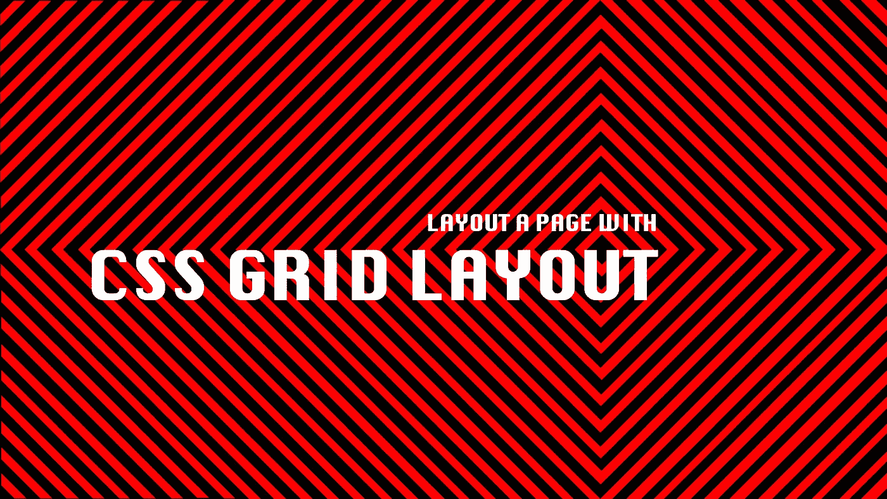
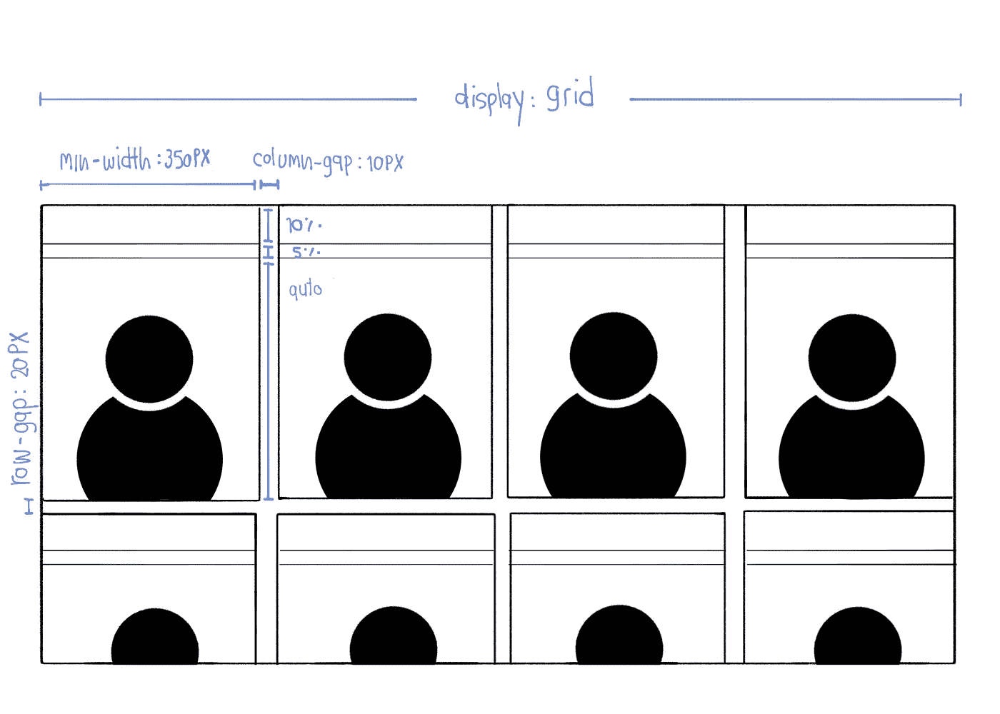
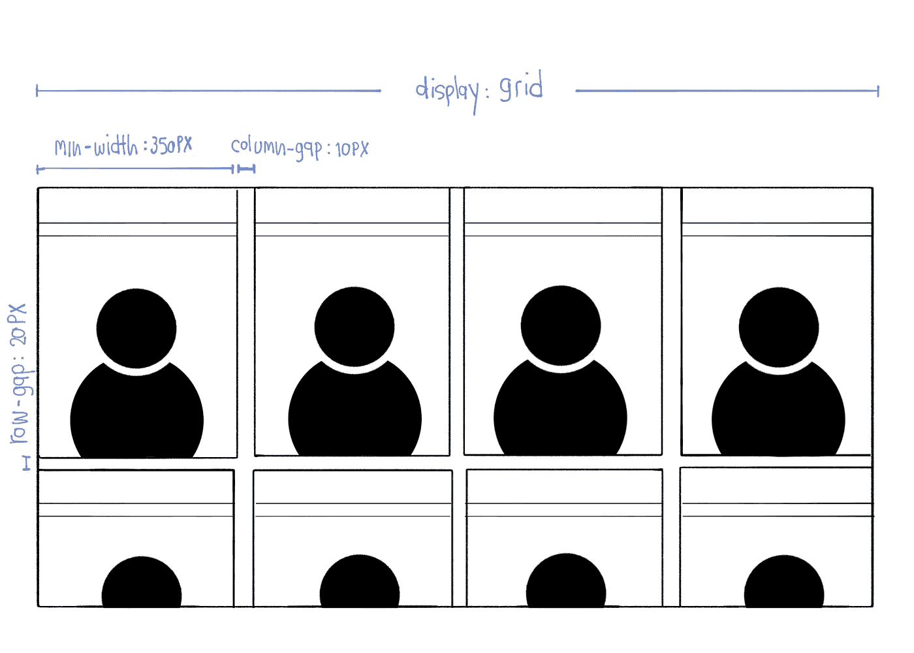
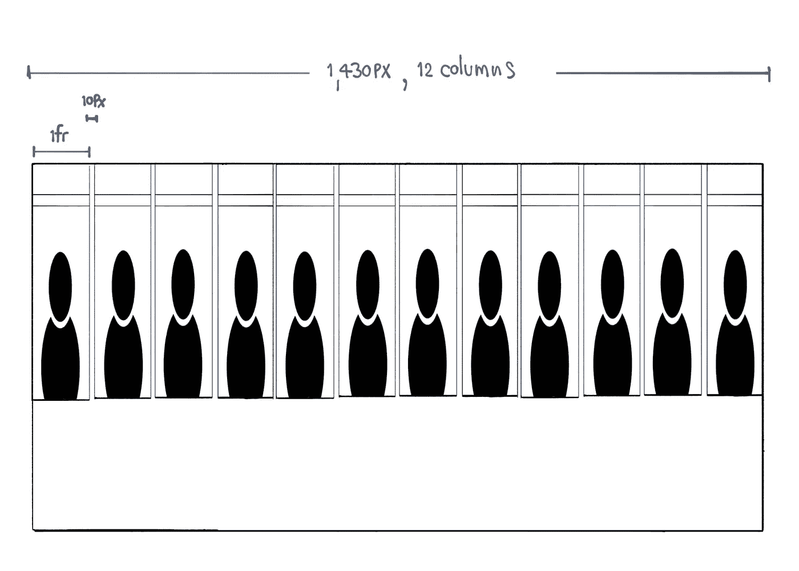
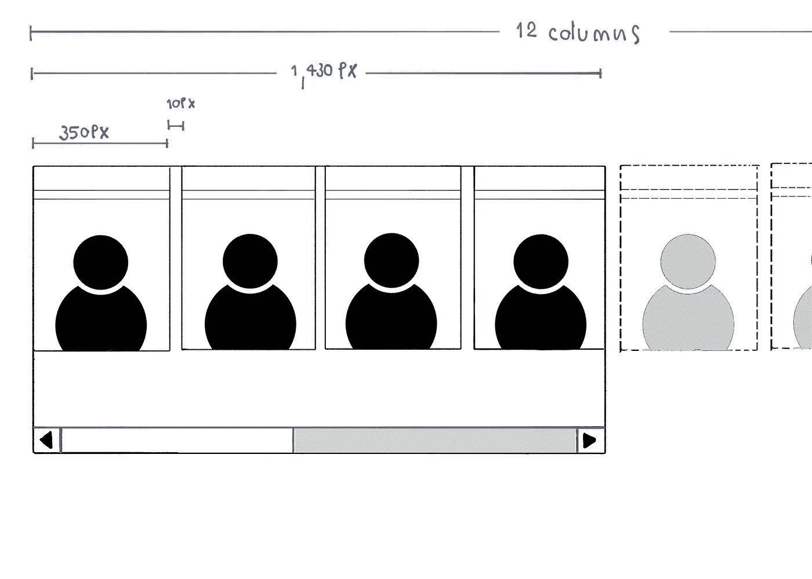
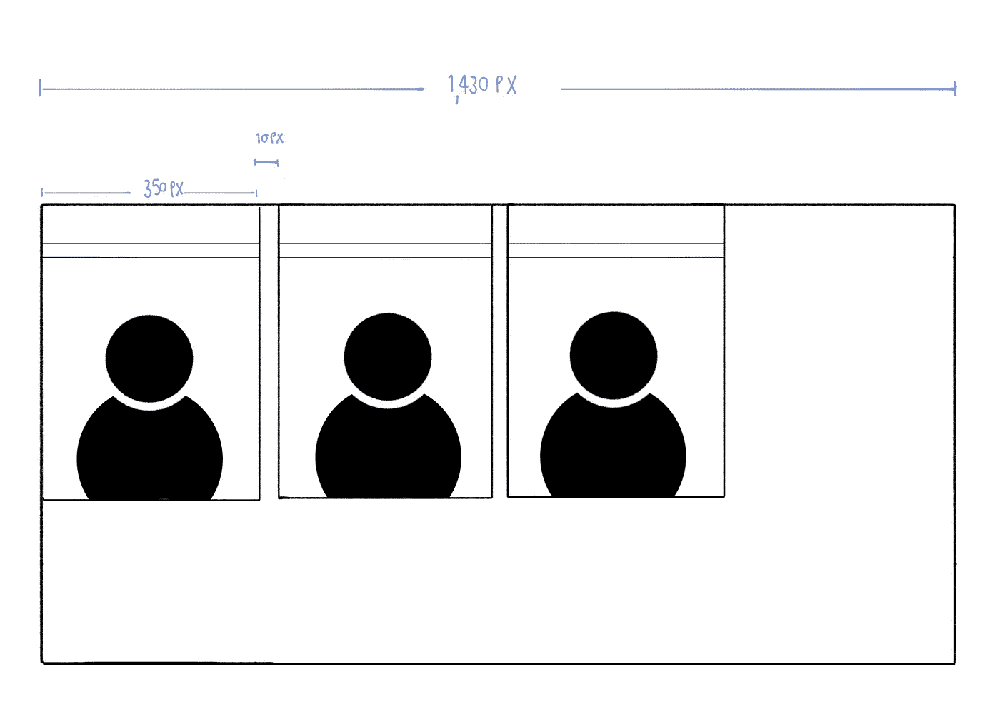
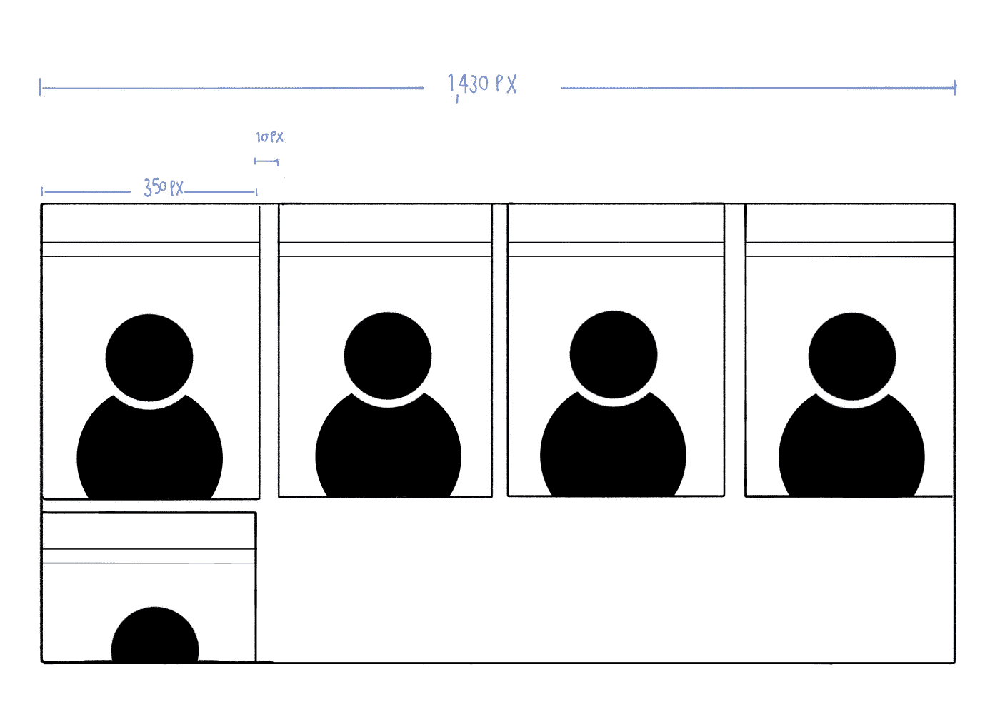
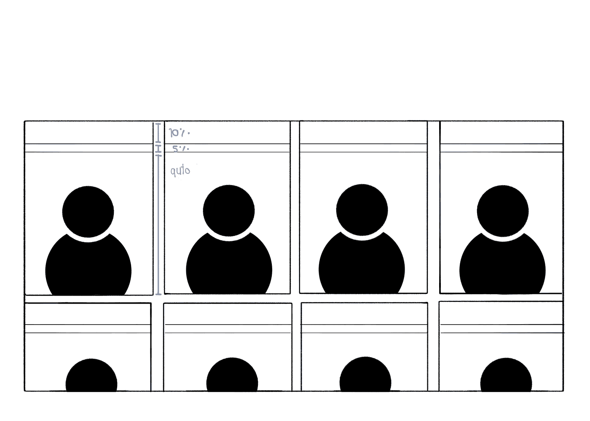

# 使用 CSS 网格布局布局页面

> 原文：<https://medium.com/nerd-for-tech/layout-a-page-with-css-grid-layout-a30d82c63e74?source=collection_archive---------19----------------------->

有了这几行，我们可以前所未有地简单地在二维空间布局页面



在这篇博客中，我将向您展示如何将页面布局成列和行，并让网格项自动流入列中(如果溢出)并换行。

这可以通过几行代码和 CSS 网格布局简单地实现。

> CSS 网格布局(又名“网格”)，是一个二维的基于网格的布局系统，旨在完全改变我们设计基于网格的用户界面的方式。(克里斯豪斯出版社，2021 年)

# 要求

根据下面的内容，我创建了泰国民主积极分子简介卡，根据屏幕大小，显示在一行中的卡片数量和每张卡片的宽度应自动适应可用空间。当屏幕宽度不足以容纳所有卡片时，剩余的卡片将自动流动，从而创建新的行。

在每张卡片内，有 2 条水平线将卡片分成 3 个部分——名称、标题和指定高度的图像。



应用 css 网格将页面布局到所需的外观

# 集装箱水平

首先，看一下容器层，它在需求中规定了项目。

```
<script>...<main **class="people"**>
{#each people as person}
  <div class="individual">
    <div class="individual__name">
      { person.name }
    </div>
    <div class="individual__caption">
      <span>
        {getNumberOfDaysUnderDetained(person.detainedDate, person.releasedDate)} Days Held Under Pre-Trial Detention
      </span>
    </div>
    <div class="individual__image">
      
    </div>
  </div>
{/each}
</main><style>
...
**.people {
  ...
  display: grid;
  grid-template-columns: repeat(auto-fit, minmax(350px, 1fr));
  column-gap: 10px;
  row-gap: 20px;
}**
...
</style>
```



容器级别的 css 网格

`display: grid`将具有`class="people"`的元素定义为网格容器，并为其内容建立新的网格格式上下文。

`column-gap: 10px`定义每列之间网格线的宽度

`row-gap: 20px`定义每行之间网格线的宽度

`grid-template-columns`定义了这个网格容器中的列是如何布局的。

`repeat()`功能允许根据需要多次重复列。要了解更多，请参见下面的例子。

**示例 1:** 从最简单的示例开始——使用`repeat()`函数创建 12 列网格，每列的宽度为`1fr`*(*`*1fr*`*是告诉浏览器分配各列之间的空间，以便每列平均获得该空间的一部分)*。

```
.grid {
  display: grid;
  grid-template-columns: repeat(12, 1fr);
  column-gap: 10px;
}
```



`css grid with grid-template-columns: repeat(12, 1fr)`

缺点是每列可能会变得非常窄，以便适合较小的视窗。

**示例 2:** 为了处理较小视窗中过窄的列，我希望能够设置列的最小宽度— `minmax()`功能可用于指定列的最小、`350px`和最大、`1fr`宽度。

```
.grid {
  display: grid;
  grid-template-columns: repeat(12, minmax(350px, 1fr));
  column-gap: 10px;
}
```



`css grid with grid-template-columns: repeat(12, minmax(350px, 1fr))`

缺点是这将导致行溢出。这些列不会换行到新的行中(即使视口宽度太窄而无法满足新的最小宽度要求)，因为我们明确地告诉浏览器每行重复列 12 次。

为了实现行内自动换行，可以使用`auto-fit`或`auto-fill`关键字。这些关键字告诉浏览器如何处理列大小调整和元素换行，以便当视窗宽度不足以容纳元素时，元素可以换行到新行中而不会溢出。`auto-fit`和`auto-fill`之间的区别非常微妙——只有在可以创建额外的空列并将其放入一行的情况下。为了更清楚，让我们看看这些例子:

**示例 3:** `auto-fill` **用尽可能多的列** **来填充行，因为它试图用尽可能多的列来填充行，所以每当新列能够容纳时，它就创建隐式列。新添加的列可以是空的，也可能是空的，但是它们仍然会占据行中指定的空间。**

```
.grid {
  display: grid;
  grid-template-columns: repeat(auto-fill, minmax(350px, 1fr));
  column-gap: 10px;
}
```



`css grid with grid-template-columns: repeat(auto-fill, minmax(350px, 1fr))`

在此示例中，有 3 个网格项目(每个项目的宽度为 350px，以分数为单位指定),屏幕大小的宽度为 1430px，在该行中实际创建了 4 列，其中 3 列填充有网格项目，而最后一列填充为空。
各列分布如下:

```
350px + 10px + 350px + 10px + 350px + 10px + 350px = 1430px
```

`350px` = *网格项宽度* `10px` = *间隙宽度* `1430px` = *视口宽度*

**示例 4:** `auto-fit` **通过扩展当前可用的列，使其适合空间**，从而占据所有可用空间。

```
.grid {
  display: grid;
  grid-template-columns: repeat(auto-fit, minmax(350px, 1fr));
  column-gap: 10px;
}
```


`css grid with grid-template-columns: repeat(auto-fit, minmax(350px, 1fr))`

在本例中，有 3 个网格项目(每个项目的宽度为 350 像素，以分数为单位指定),屏幕尺寸的宽度为 1430 像素，这 3 个网格项目被扩展，以便它们占用任何可用空间，即每个网格项目的宽度为 470 像素。
各列分布如下:

```
470px + 10px + 470px + 10px + 470px = 1430px
```

`470px` = *网格项宽度* `10px` = *间隙宽度* `1430px` = *视口宽度*

**例 5:** `auto-fill`和`auto-fit`当有足够的网格项填充行中的所有列时，产生相同的外观；例如，屏幕大小最多可以在一行中包含 4 列，并且网格容器中有 4 个或更多的网格项目——这将产生相同的外观，无论是用`auto-fill`还是`auto-fit`设置。



任一`auto-fill or auto-fit`上的外观相同

# 个人水平

放大单个网格项目，我想把这个项目分成堆栈(3 行)，分别显示名称、标题和图像。

```
<script>...<main class="people">
{#each people as person}
  <div **class="individual"**>
    <div class="individual__name">
      { person.name }
    </div>
    <div class="individual__caption">
      <span>
        {getNumberOfDaysUnderDetained(person.detainedDate, person.releasedDate)} Days Held Under Pre-Trial Detention
      </span>
    </div>
    <div class="individual__image">
      
    </div>
  </div>
{/each}
</main><style>
...**.individual {
  display: grid;
  grid-template-rows: 10% 5% auto;
}**
...
</style>
```



项目级别的 css 网格

`display: grid`将具有`class="individual"`的元素定义为网格容器，并为其内容建立新的网格格式上下文。

`grid-template-rows`定义如何在这个网格容器中布置行。`grid-template-rows: 10% 5% auto`表示`title`区域，`caption`区域和`image`区域分别分布为`10%`、`5%`和`auto`。

# 参考

CSS-TRICKS: [网格完全指南](https://css-tricks.com/snippets/css/complete-guide-grid/)

CSS-技巧:[在 CSS 网格中自动调整列的大小:`自动填充'与`自动适应`](https://css-tricks.com/auto-sizing-columns-css-grid-auto-fill-vs-auto-fit/)

MDN Web 文档: [CSS 网格布局](https://developer.mozilla.org/en-US/docs/Web/CSS/CSS_Grid_Layout)