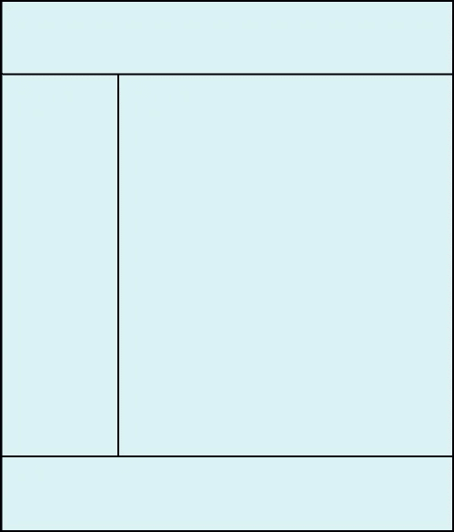
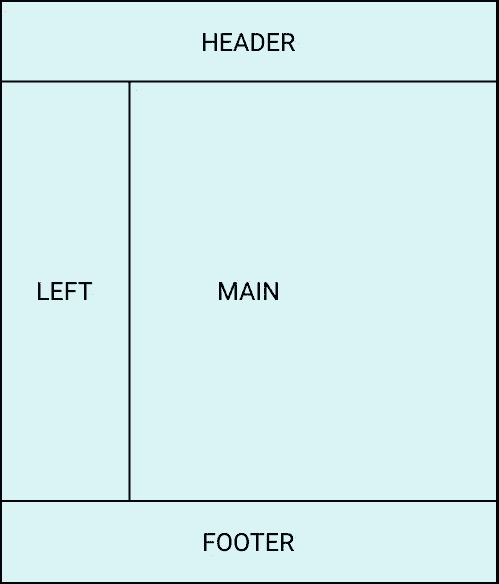
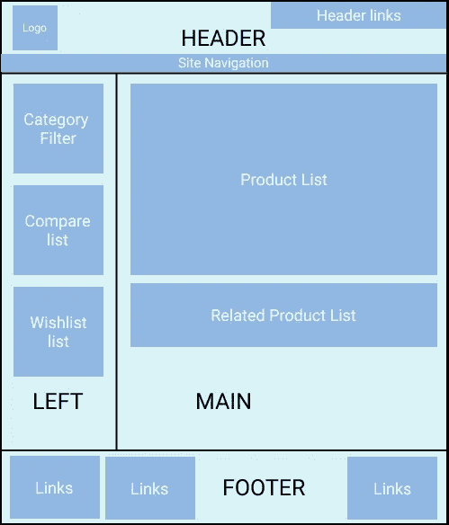

# Magento 2 中的布局概述

> 原文：<https://medium.com/nerd-for-tech/layout-overview-in-magento-2-9d4739ee4254?source=collection_archive---------7----------------------->


欢迎回到 Magento 2 教程系列。在上一篇文章中，我们已经讨论了 Magento 2 中基本的[主题概念。今天的主题是 Magento 中的布局概述。](/nerd-for-tech/theme-concept-magento-2-b9a1fafc3590)

在 Magento 中，页面构建的基本概念是布局、容器和块。在创建页面结构之前，我们应该知道布局、容器和块。

让我们继续…

# 什么是布局？



布局使用 XML 文件负责任何网页的结构，该文件标识组成页面的所有容器和块。

让我用其他简单的方式解释一下。在图像中，有一个页面，只有一些线条将它分成不同的部分，这些部分描述了一个网页的结构。

Magento 默认为前端提供了 5 种页面布局，即*空*、【T11 栏、*2 栏左*、*2 栏右*和*3 栏*。

后端/管理的 3 个页面布局，即*管理-空*、*管理-1 栏*和*管理-2 栏-左*。

# 什么是容器？



容器基本上是一个包装器。它包含<block>和<container>的或组。让我解释一下，上图中有不同的部分，如页眉、页脚、左侧和主要部分。基本上，这些部分是容器，每个部分可以有许多项目。</container></block>

举个例子，

标题(容器)可以有标志，导航链接，迷你卡等。

**集装箱属性:**

1.  **名称**:可以用来在布局中对容器进行寻址。对于每个生成的页面，该名称必须是唯一的。例如，<容器名="custom.container" / >
2.  **htmlTag :** 指定包装输出的 HTML 标签。可以是 side，dd，div，dl，fieldset，main，nav，header，footer，ol，p，section，table，tfoot，ul。例如，<容器名= " custom . container " html tag = " div "/>。
3.  **htmlClass :** 指定应用于包装器 HTML 标签的类。例如，<container name = " custom . container " html tag = " div " html class = " custom-container "/>
4.  **htmlId :** 指定应用于包装器 HTML 标签的 Id。例如，<container name = " custom . container " html tag = " div " html class = " custom-container " html id = " custom-container "/>

布局中的容器示例:

```
<container name="custom.container" htmlTag="div" htmlClass="custom-container" htmlId="custom-container" >
    your code goes here...
</container>
```

# 什么是 block？



在 Magento 中，方块是布局的基本构建单位。块可以有子代和孙代(等等)。信息可通过从布局 XML 传入模块。

换句话说，在上面的图片中，容器下面有许多用深色突出显示的方块。

举个例子，

徽标、标题链接、类别过滤器、比较列表等都是块，分别包装在相应的容器中，即页眉、页脚、主页面等。

**块的属性:**

1.  **名称**:可以用来在布局中对区块进行寻址。对于每个生成的页面，该名称必须是唯一的。例如，<block name = " custom . block "/>
2.  **类:**实现特定块渲染的类的名字。这个类的一个对象负责块输出的实际渲染。例如，<Block Class = " Vendor \ Module \ Block \ Class "/>
3.  **模板:**指定特定块的模板路径。指定路径 Tutorial _ Simple::template.phtml 的表示法，这里 Tutorial 是厂商名称，Simple 是模块名称，template . phtml 是模板文件的名称。例如<block template = " Vendor _ Module::tempate . phtml "/>
4.  **可缓存:**这指定了特定块的缓存属性。默认情况下，该值为 true，如果为 false，则整个页面将不会使用整页缓存进行缓存。例如<block cache able = " false "/>
5.  **ifconfig :** 使块的可见性依赖于系统配置字段。例如<block ifconfig = " contact/contact/enabled "/>

布局中的块示例:

```
<block class=“Vendor\Module\Block\Class” name="custom.block" cacheable=“false” ifconfig=“contact/contact/enabled” template="Vendor_Module::tempate.phtml" />
```

**容器和块中使用的公共属性:**

1.  **之后/之前:**用于将程序块置于另一个元素之前或之后，如其名称所示。
2.  **移除:**用于将元素从渲染中移除到前端。默认情况下，它是假的。
3.  **移动:**用于移动布局中的元素。

## 布局文件示例:

让我们创建一个名为 **new_layout_index.xml.** 的新布局文件

在上面的文件名中，

*新*是模块的前名

*布局*是控制器的名称

*索引*是控制器类的名称。

实际上这是模块开发的一部分。我们将详细了解它。

在 *new_layout_index.xml 下*让我们创建一个网页结构:

```
<?xml version="1.0"?>
<page xmlns:xsi="[http://www.w3.org/2001/XMLSchema-instance](http://www.w3.org/2001/XMLSchema-instance)" layout="1column" xsi:noNamespaceSchemaLocation="urn:magento:framework:View/Layout/etc/page_configuration.xsd">
    <body>
     <container name="new.container" htmlTag="div" htmlClass="new-container" htmlId="custom-container">
      <block class="Magento\Framework\View\Element\Template" name="custom.block" template="Vendor_Module::newtemplate.phtml" cacheable="false" /> 
     </container>
    </body>
</page>
```

上述布局在浏览器上的输出:

```
<div class="new-container" id="custom-container">
    Content of block goes here...
</div>
```

**布局中使用的附加点:**

1.  **referenceContainer :** 用于引用整个布局文件中的任何现有容器。在< referenceContainer / >中，我们可以通过现有容器的名称在布局中使用它。

例如，如果我们需要在页面的主要部分添加任何内容

```
<?xml version="1.0"?>
<page xmlns:xsi="[http://www.w3.org/2001/XMLSchema-instance](http://www.w3.org/2001/XMLSchema-instance)" layout="1column" xsi:noNamespaceSchemaLocation="urn:magento:framework:View/Layout/etc/page_configuration.xsd">
 <body>
  <referenceContainer name="content">
   <container name="new.container" htmlTag="div" htmlClass="new-container" htmlId="custom-container">
    <block class="Magento\Framework\View\Element\Template" name="custom.block" template="Vendor_Module::newtemplate.phtml" cacheable="false" /> 
   </container>
  </referenceContainer>
 </body>
</page>
```

2. **referenceBlock :** 用于引用整个布局文件中的任何现有块。我们可以在< referenceBlock / >中通过块名来使用现有的块。

例如，如果我们想从产品详细信息页面中删除产品 sku

```
<?xml version="1.0"?>
<page xmlns:xsi="[http://www.w3.org/2001/XMLSchema-instance](http://www.w3.org/2001/XMLSchema-instance)" layout="1column" xsi:noNamespaceSchemaLocation="urn:magento:framework:View/Layout/etc/page_configuration.xsd">
 <body>
  <referenceBlock name="product.info.sku" remove="true"/>
 </body>
</page>
```

我们可以在布局文件下看到两种类型的页面布局，第一种是 *default.xml* ，另一种是特定的页面布局，如 *cms_index_index.xml.*

让我们来了解一下 default.xml 和特定页面 xml 文件的区别:

## default.xml 和特定的页面 xml 文件有什么区别？

要使更改在每个页面上都可用，请修改 default.xml 文件。例如，如果我们需要添加自定义的页眉和页脚，我们将在 default.xml 中修改它，因为页眉和页脚将出现在所有页面上。

主题中 default.xml 文件的位置

```
app/design/frontend/
 ├── Vendor/
 │   │   ├──Theme/
 │   │   │   ├── Magento_Theme
 │   │   │   |   ├── layout
 |   |   |   |   |   |── default.xml
```

*/app/design/frontend/Vendor/Theme/Magento _ Theme/layout/default . XML*

若要将布局更改添加到特定页面，请使用与页面路径对应的布局文件。

例如，如果我们想只对主页进行任何更改，那么我们必须更改 *cms_index_index.xml* 文件。

主题中 *cms_index_index.xml* 文件的位置:

```
app/design/frontend/
 ├── Vendor/
 │   │   ├──Theme/
 │   │   │   ├── Magento_Theme
 │   │   │   |   ├── layout
 |   |   |   |   |   |── cms_index_index.xml
```

*/app/design/frontend/Vendor/Theme/Magento _ Theme/layout/CMS _ index _ index . XML .*

## 以下是一些特定页面示例:

主页- cms_index_index.xml

类别页面- catalog_category_view.xml

产品页面- catalog_product_view.xml

购物车页面- checkout_cart_index.xml

结帐页面- checkout_index_index.xml

登录页面-客户帐户登录. xml

注册页面- customer_account_create.xml

诸如此类…

布局文件每次更改后都刷新缓存

```
$ php bin/magento cache:flush
```

下一个教程主题是 [**在 Magento 2 中配置主题属性**](https://aryansrivastavadesssigner.medium.com/configure-theme-properties-in-magento-2-cf668d762654)

希望你理解 Magento 中布局、容器和块的基本概念。现在我想你能够创建一个网页结构。如果您有任何疑问，您可以直接通过电子邮件[**aryansrivastavadesssigner@gmail.com**](mailto:aryansrivastavadesssigner@gmail.com)向我提问

如果你喜欢这篇文章，你可以给我买杯咖啡[https://www.buymeacoffee.com/aryansrivastava](https://www.buymeacoffee.com/aryansrivastava)

## 跟我来:

[领英](https://www.linkedin.com/in/er-aryan-srivastava-0b9576170/) [推特](https://twitter.com/AryanSr11861551)

**参考链接:**

1.  [https://devdocs.magento.com](https://devdocs.magento.com/)