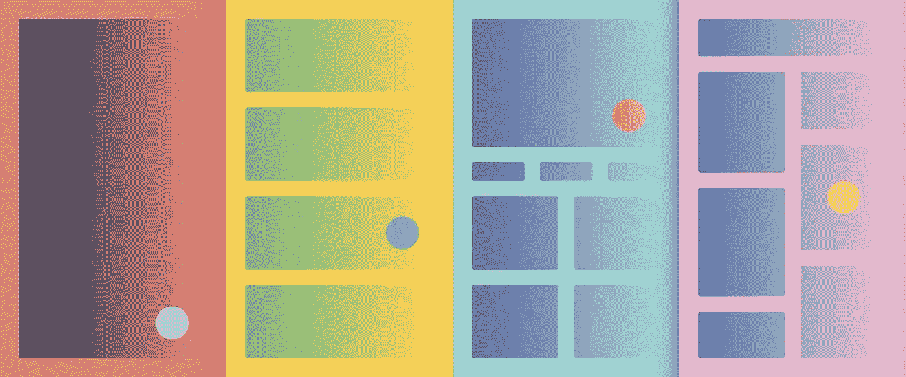
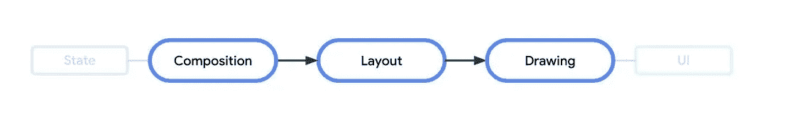
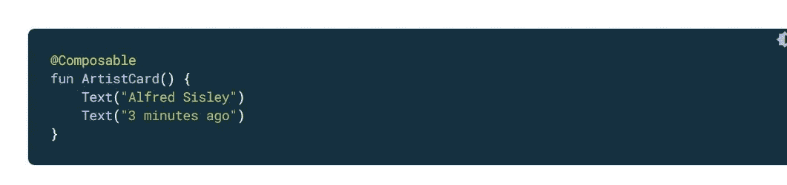

# Jetpack Compose 中的布局基础。

> 原文：<https://medium.com/nerd-for-tech/layouts-basics-in-jetpack-compose-aa0321fb3131?source=collection_archive---------3----------------------->

图片来自谷歌

大家好，😀

请进行第一天的 [**简介撰写&设置**](https://gondhalesatyam-28082.medium.com/1st-day-of-learning-jetpack-compose-db3865bc5ca4) [🏗️](https://emojipedia.org/building-construction/) 如果你还没有设置一个基本的合成项目。

我们已经知道， **Jetpack Compose** 现在被认为是 Android 的未来，是构建原生 UI 的现代工具包。主要的特点是，它用更少的代码、更强大的工具和更多的东西使你的应用变得生动。许多公司已经开始采用它或在 Compose 中迁移他们的旧东西。

与用 XML 设计布局相比，设计和构建应用程序 UI 元素并不容易。基于可组合的状态，UI 被转换。这发生在构图、布局、绘图的顺序中。

图片来自谷歌资源

> **好消息** [**📰**](https://emojipedia.org/newspaper/) **。**
> 当嵌套一些视图时，比如 RelativeLayout，你可以看到 Android View 系统的一些性能问题。Compose 不使用多个度量，因此您可以随意嵌套，而不会影响性能。

**布局是如何构建的？**
构成的基本成分是可组合函数。描述用户界面特定区域的功能发射单元(无)被称为可组合功能。该函数接收一些输入并产生屏幕上显示的内容。可以使用一个可组合的函数产生多个/嵌套的 UI 元素。但是显示元素的全部控制是由我们完成的。

Accha 那可以，但是可组合函数是怎么写的呢？💻

图片来自谷歌资源

Compose 使定义你自己的更具体的布局变得简单，同时也提供了各种各样的布局来帮助你组织你的 UI 元素。

**日常用例中最常用的标准布局组件**

1.  想要在屏幕上垂直放置 UI 元素吗？
    使用**柱**将项目垂直放置在屏幕上

2.想要在屏幕上水平放置 UI 元素吗？
使用**行**将项目水平放置在屏幕上

3.想要在屏幕上重叠 UI 元素吗？
使用**框**重叠屏幕上的项目

4.想要自定义布局吗？
使用**修改器**进行定制

这就是 Compose 中**基本布局的全部内容。本文可能不会涵盖基于您的复杂实现&用例的所有内容，但是您可以从这里开始。万事如意。[😃](https://emojipedia.org/grinning-face-with-big-eyes/)
您可以克隆这个库进行基本设置。此外，源代码中所有概念都可以根据相同内容进行更新。(切换到分支 **LayoutBasicsInCompose** )来实现。
[**https://github.com/SatyamGondhale/LearnCompose**](https://github.com/SatyamGondhale/LearnCompose)**

如果你认为这对你有帮助，请随意[👏🏻](https://emojipedia.org/clapping-hands-light-skin-tone/)(鼓掌)&分享。谢了。😄