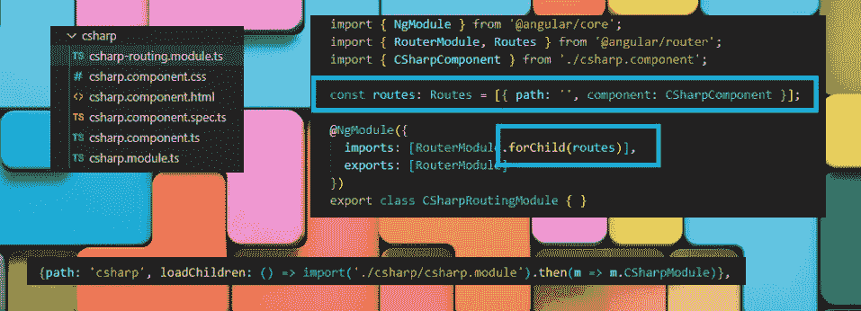
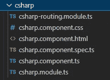
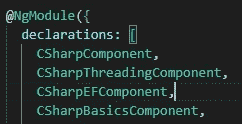

# Angular 中的延迟加载模块

> 原文：<https://medium.com/nerd-for-tech/lazy-loading-modules-in-angular-c3cfca72d21e?source=collection_archive---------1----------------------->



还有其他关于这方面的文章，Angular docs 上的信息也很不错，但是，为什么我不在这里添加我自己的总结呢？

# 什么是懒装，为什么要装？

当你打开你的 angular 应用程序时，一堆模块将被加载，模块及其组件，共享模块等。你要装的越多，用的时间就越长。哇，难以置信我知道。

无论如何，为了让你的应用程序更快，你可能不想加载那些你不会马上需要的东西。进行延迟加载需要更多的编码工作，所以你必须为你的应用程序决定正确的平衡。

因此，如果你已经决定你想要的东西是懒惰加载，然后呢？

# 为延迟加载代码创建文件

如果你想创建一个 csharp 惰性加载模块(我称我的为 csharp，你的可以是客户、汽车或其他什么)，你可以在你的项目的终端中这样做，Angular 会为你创建文件:

`ng generate module csharp --route csharp --module app.module`

这将生成以下文件:



ts、css 和 html 文件的使用方式与常规组件相同。spec.ts 为您生成了代码。您可能需要修改的是 charp.module.ts 和 csharp-routing.module.ts(或者您在创建它们时给出的任何名称)。

# cSharp.module.ts

除了已经为您自动创建的导入之外，您还需要导入您将在这个 csharp 模块中使用的任何组件以及您正在创建的组件(CSharpComponent)。

无论您在这里导入什么以便在这个模块中使用，您都必须放在声明下面。



当你这样做的时候，你需要确保它们没有被包含在任何其他模块的声明中，包括 app.module。如果你正在重构代码，确保你从 app.module 中移除它们。

然后在 app.module 或任何其他模块中，您可以导入 csharp.module，然后将其添加到导入中。例如，在 app.module 中，您可以:

`import {CSharpModule} from ‘./csharp/csharp.module’;`

然后导入数组下的 CSharpModule **。**

但是，如果您不需要该模块可用，您不必这样做。我只是注意到您可以这样做，但是您通常会对共享模块这样做。

# csharp-routing.module.ts

在这个文件中，生成的代码在大多数情况下已经足够了。你会有这样一条路线:

`const routes: Routes = [{ **path: ‘’**, component: CSharpComponent }];`

请注意，路径是“”，组件是您从 Angular CLI 中创建的主组件。我们将其设置为“”的原因是，它已经来自主路由文件(app-routing.module.ts)中的“csharp”路由。

**在 app-routing.module.ts** 中，删除任何已有的路径，该路径指向现在将由这个延迟加载处理的组件，取而代之。

`import { CSharpModule } from ‘./csharp/csharp.module’; //in app-routing.module.ts`

`{path: ‘**csharp**’, **loadChildren**: () => import(‘./csharp/csharp.module’).then(m => m.CSharpModule)},//in app-routing.module.ts`

注意我们导入的是模块，而不是组件。还要注意，我们将路径设置为 csharp，因此在 csharp-routing.module.ts 中只有""

另一件需要注意的重要事情是。在 csharp-routing.module.ts 中，我们没有对路由使用 forRoot，而是使用 forChild(否则我们会得到一个错误)。还要注意，这是我们导入要为该路线显示的组件的地方。这是 csharp-routing.module.ts 的全部代码:

```
import { NgModule } from '@angular/core';
import { RouterModule, Routes } from '@angular/router';
import { CSharpComponent } from './csharp.component';

const routes: Routes = [{ path: '', component: CSharpComponent }];

@NgModule({
  imports: [RouterModule.forChild(routes)],
  exports: [RouterModule]
})
export class CSharpRoutingModule { }
```

# 它的路线。

对于路线，你可以在你的链接或者按钮或者其他什么地方做这样的事情:

`[routerLink]=’[“/csharp”]’`

# 相同延迟加载元素中的多条路线

我在一些地方看到他们解释了在同一个惰性加载模块上处理多条路径的方法，但是没有一个代码看起来非常“干净”,所以我在这里不包括它。如果我找到一个好的方法，我会把它加到这篇文章里。

# 检查一下

您可以使用 F12 来获取您的开发工具，并检查 network 选项卡，以查看在您的延迟加载更改之前和之后加载了哪些文件，并且您还可以在您使用或不使用延迟加载构建主文件时检查它的大小。

就这些，非常短，但是我发现没有把所有的东西都放在一起有点混乱。