# 在一个博客中学习 Golang

> 原文：<https://medium.com/nerd-for-tech/learn-golang-in-one-blog-fdd568e6f631?source=collection_archive---------0----------------------->

Go 是一种简单、快速、并发的编程语言。它在设计上的简单性使它成为一种令人惊叹的编程语言。 *Go* 目前越来越受欢迎，许多组织现在更喜欢在 *Go* 中编写他们的后端。更重要的是，所有的云原生和一些区块链项目都是在 *Go* 中编写或正在编写的，一些流行的工具有 Kubernetes、Prometheus 和 Docker。

我想尽可能快地学习围棋，但是找不到快速总结的学习资源，尽管这个博客是介绍性的，它将涵盖你需要尽快开始编写围棋的所有基础知识，假设你已经有编程经验。

# 设置您的环境

前往[golang.org](https://golang.org/dl/)并获取 *Go* 的最新副本。最简单的方法是下载二进制文件并安装在您喜欢的操作系统上。如果你在 macOS 上，你可以自由地从源代码构建或者使用 **brew install go** 。一旦你这样做了，你必须在你的命令行中 *Go* 可用。键入 go 将显示可用的命令。

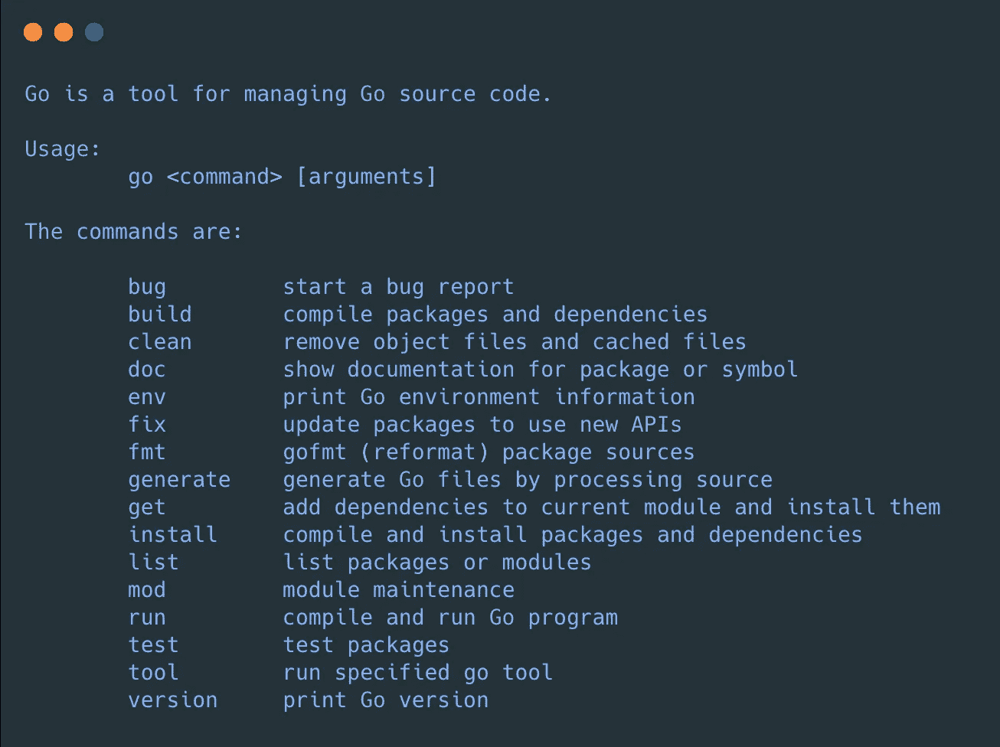

*Go* 对你的项目实施一个结构，这个想法是你的所有项目应该在一个屋檐下，以访问所有 *Go 的*特性。默认情况下，这是在`$HOME/go`下，你可以使用`go env GOPATH`打印到控制台。您可以将此位置设置为电脑上的任何位置。目录的默认结构将是，

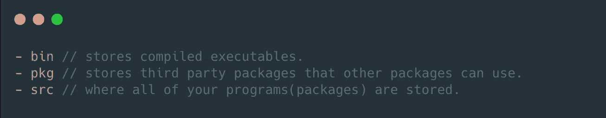

在`src/`文件夹中创建你的第一个项目，你就可以开始了！

# 包装和进口

*Go* 不支持像 Java 等 OOPs 编程语言中的类，而是使用**包**系统。每个包都是工作空间中的一个目录，每个 go 文件都必须属于某个包。因此，每个文件都应该以关键字 *package* 开头，后跟包名。一个 go 可执行文件必须包含 ***包 main。***

*Go* 使用相对导入将包导入当前文件。相对路径通常是`$GOPATH/src`，因为大多数包都存储在`pkg`目录中。使用 *import* 关键字，后跟括号内的包列表，可以导入一个包。

标准库是预装的，带有 *Go、*并包含*最基本和最有用的包。`"fmt"`用于导出 *Println* ，打印到控制台。 *Go* 不允许未使用的进口。*

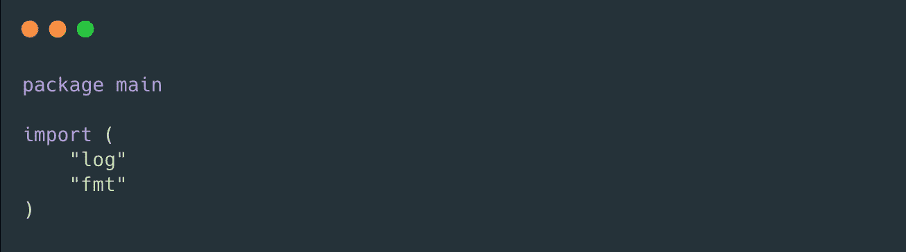

# 变量

*Go 的*基本原语类型有 *bool* 、 *string* 、 *int* 、uint、 *float* 和 *complex* ，类型的大小可以在类型旁边指定， *uint32。*变量由 *var* 关键字声明，后跟变量名和类型。

变量也可以用简写符号`:=`初始化，因为 *Go* 可以推断出类型。就像导入一样，不允许使用未使用的变量。

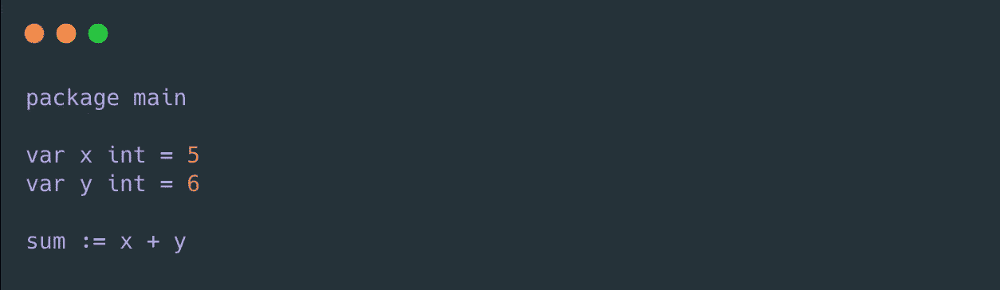

此外， *Go* 不使用分号来结束语句。

需要注意的重要一点是 *Go* 如何用一个包来限定变量的范围，如果一个变量的第一个字母是大写的，那么这个变量就是公共的，否则就是私有的，函数也一样。

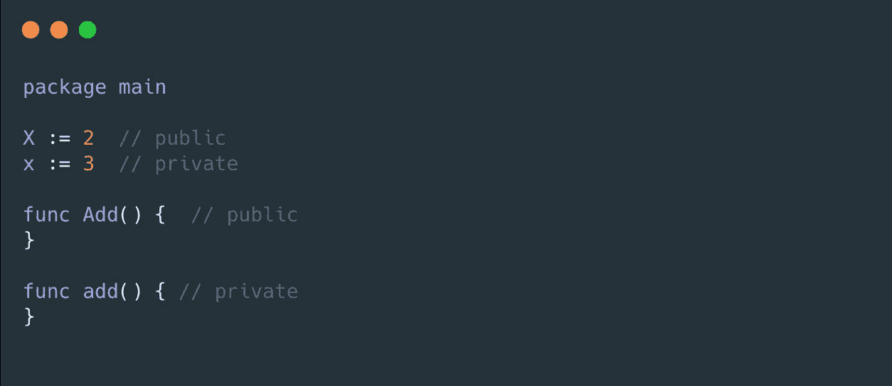

# 功能

函数是 *Go、*的重要组成部分，当然，上面的方法行不通，因为执行必须在函数体中进行。函数用关键字`func`声明，后跟函数名、参数和返回类型。Go 应用程序必须包含 *main* 函数，它是应用程序的入口点。它不接受任何参数，也不返回任何内容。函数的左大括号必须从与函数相同的级别开始，并且不能移动到新行。

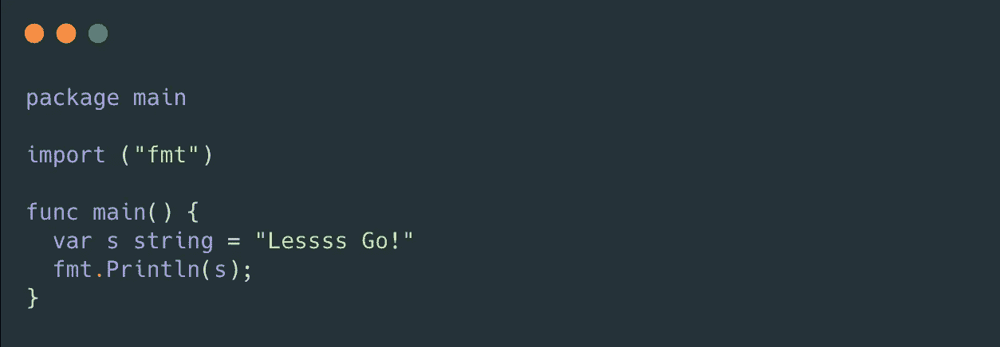

函数参数以其名称后跟*类型*声明，并用逗号分隔。如果函数返回，则必须提供返回类型，作为一种快捷方式，也可以声明返回变量，以避免在函数中声明另一个变量，下面是一个示例。

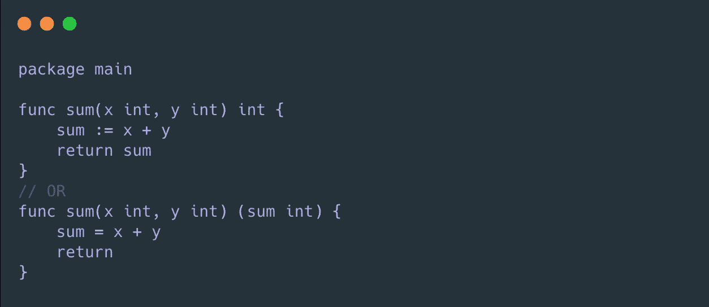

# 数组、切片和图

***数组*** 可以通过简单地指定括号旁边的数据类型来声明，括号中的整数表示数组的大小。然后，数组可以通过它们的索引来赋值，更方便的初始化方法是使用简写语法和括号中的数据。

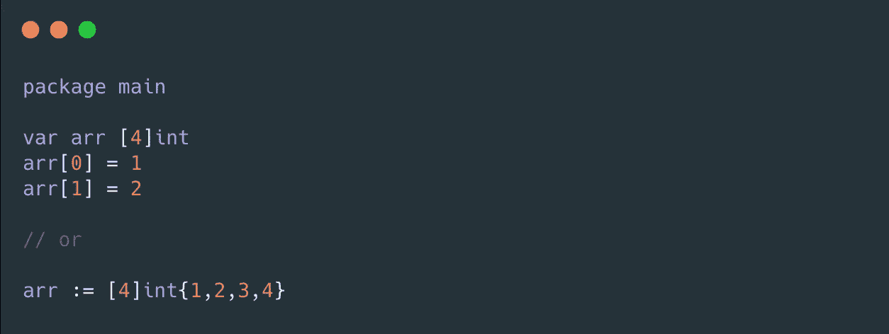

但是这里有一个问题。你不能修改数组的长度，在你还不知道大小的时候，不是更方便吗？这就是 ***切片*** 的用武之地，切片就是简单的动态数组。您可以像声明数组一样声明切片，而无需指定大小。

切片在执行许多操作时非常有用。可以使用*复制*或*追加*功能来操作切片。也可以使用带有*扩展操作符* (…)的*追加*来连接切片。可以使用括号中的索引对切片进行切片。下面是一些例子。

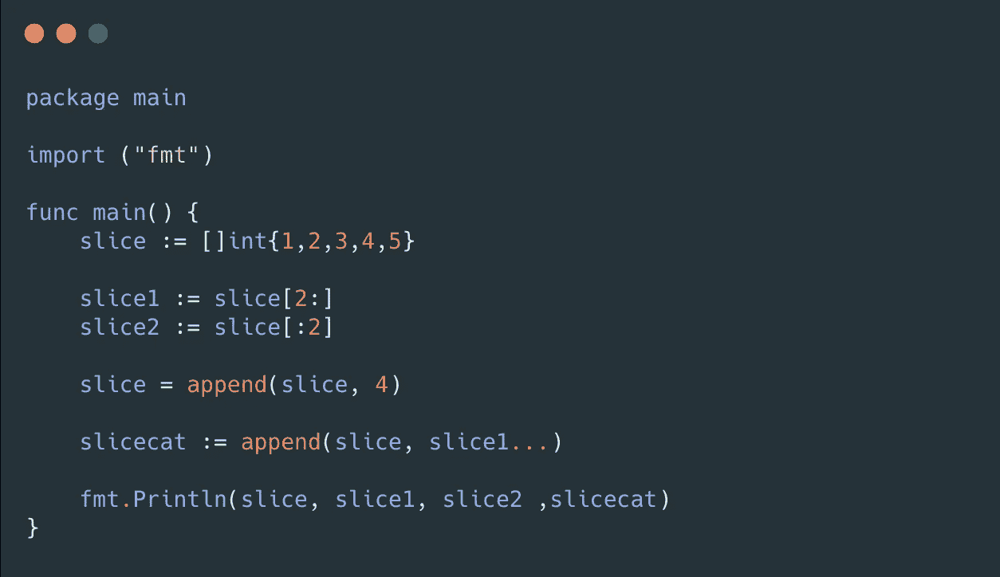

append 函数不会修改切片，但会从给定的切片中返回一个新切片。这是输出。

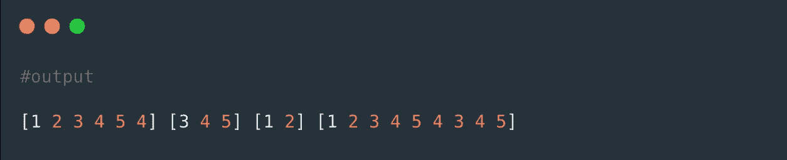

***map***相当于 Java 中的 *HasMap* 或者 python 中的 *Dictionary* 。它们存储键值对。可以使用 *make* 关键字创建*映射*，后跟关键字映射和括号中关键字的数据类型及其旁边的值。

地图操作简单，可以通过使用 *[ ]* 操作符指定键和值来分配值，并且可以通过使用*删除*功能来删除键。

# 环

循环在 *Go* 中以最简单的形式存在，只有一种循环语法，即 ***为*** 循环。for 循环可以用多种方式编写，以满足您的循环需求。第一种语法是熟悉的，以指针变量 ***i*** 开始，后面是条件和增量。下面的例子将打印 1 到 5。

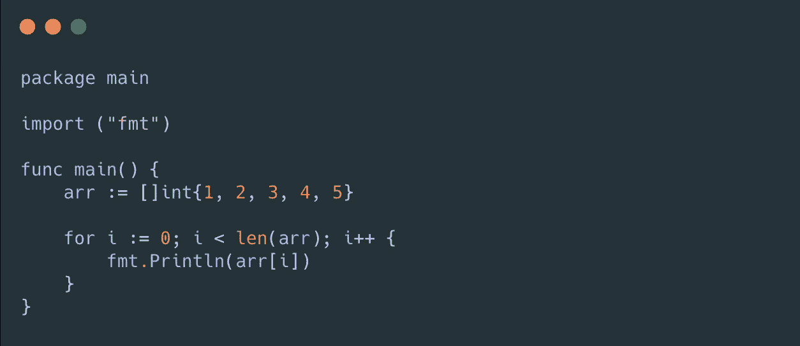

哦！你非常想念 while 循环？不要担心， *Go* 已经覆盖了你，你所要做的就是提及 for 循环的条件，并使用在循环外声明的指针，就像你在使用 *while* 循环时一样。

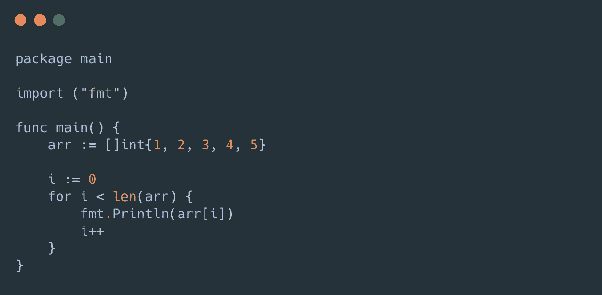

***范围*** 功能提供了一种访问索引和值的简单方法。

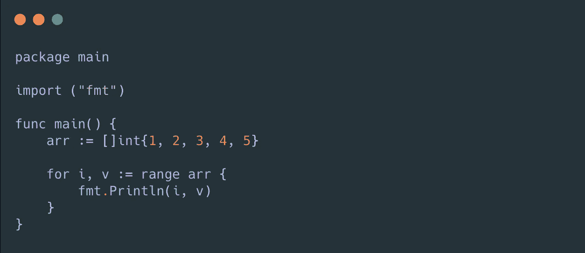

# 结构体

***struct*** 关键字是给你的数据定义一个形状。由于 *Go* 不支持类，某种形状要求的数据可以存储在该结构类型的变量中。使用关键字 ***type*** 创建结构，并且可以通过 ***点(.)*** 运算符。

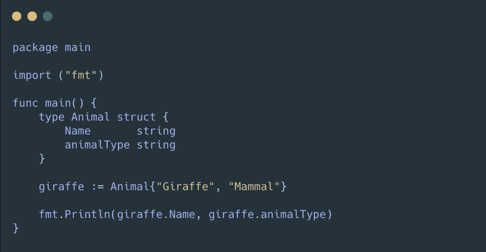

# 零、错误和多个返回值

*Go* 提供了一些平滑的方法来处理错误和零值。 ***error*** 和 *nil* 都是本机内置类型，可以用来在执行某些操作之前进行验证。 *Go* 也支持从一个函数返回多个类型，这可以通过在括号中指定类型来代替返回类型来实现。

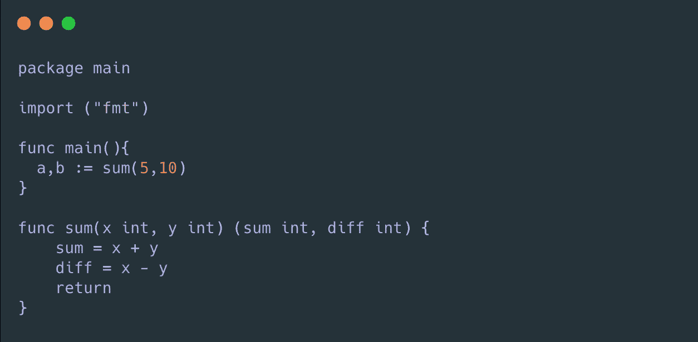

根据使用 if 检查执行的操作，可以返回 ***错误*** 或 ***零*** 。下面的例子展示了如何通过检查平方根函数的输入来处理错误。

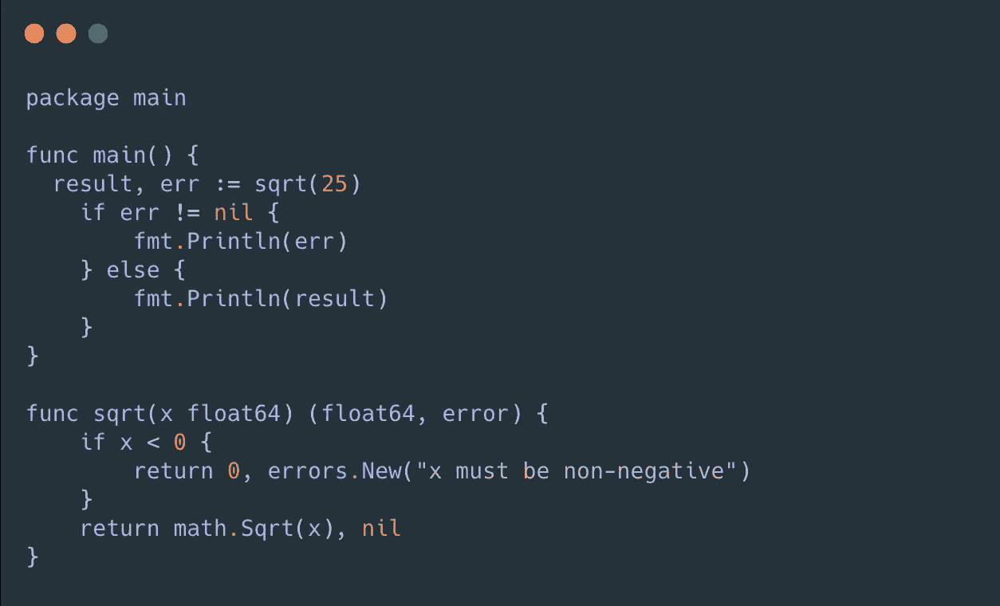

# 两颗北极指极星

*Go* 中的指针类似于其他语言中的指针，你可以通过在变量前加一个 ***【与】(& )*** 符号来引用变量的内存地址，并使用 ***星号(*)，*** 取消引用。默认情况下，Go 通过值而不是引用来传递参数，你可以通过在函数中的参数类型前加一个 ***星号(*)来实现这一点***

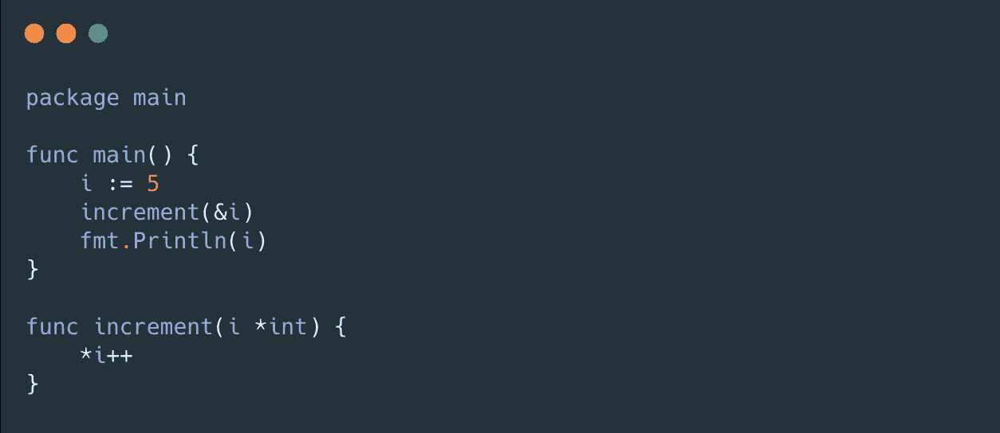

如果没有 ***&*** 它会打印出 5 作为变量的副本，而一旦我们有了引用，我们就需要遵从内存通过再次对变量使用 ******* 来获取值。

就是这样！你应该还没有准备好在 *Go* 中编写你的第一个程序，试着练习一下代码片段，如果你想挑战自己，试着用“net”包编写一个基本的 HTTP 服务器。这应该会给你足够的实践来编写一些很棒的包或者贡献给你最喜欢的 *Go* 库。

如果您想深入了解，这里有一些额外的资源。

*   [按示例进行](https://gobyexample.com/variables)
*   [学习 Go — FreeCodeCamp](https://www.youtube.com/watch?v=YS4e4q9oBaU)
*   [Golang 速成班—旅行媒体](https://www.youtube.com/watch?v=SqrbIlUwR0U&t=1317s)
*   [Go Talks —编码技术](https://www.youtube.com/watch?v=SmtDEhuDQy4&list=PLFjq8z-aGyQ7elzRbDAaW49gyYSwKwEEp)

请关注我以获取更多更新，因为我计划在*中介绍并发性和其他特殊特性。我也在这里记录我的样本项目，如果你喜欢，可以随意查看，给它一颗星并留下一些掌声😁*

和我联系！我想和你聊聊。

 [## Sameer Kashyap

@celoOrg fellow，之前，@MLHhacks Fellow @Google DSC Lead](https://twitter.com/sameeerkashyap)  [## Sameerkash -概述

### 我是 Sameer，Celo India Fellow，由 Devfolio MLH 探险家 Fellow(春季 21 ')导师，GSSoC '21 Google Developer 学生…

github.com](https://github.com/Sameerkash)  [## Sameer Kashyap -区块链开发研究员- Celo | LinkedIn

### 我是一名热情的计算机科学专业的最后一年学生，渴望成为一名软件开发人员。在过去的两年里，我的…

www.linkedin.com](https://www.linkedin.com/in/sameer-kashyap-083a89184/)