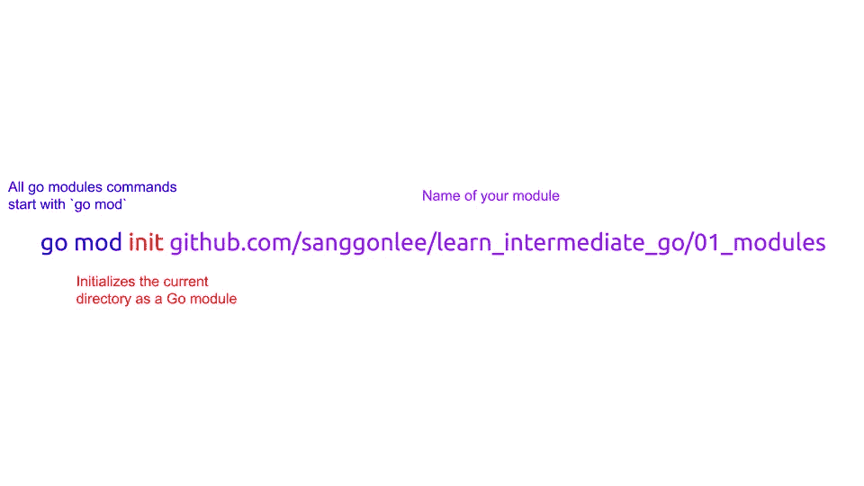
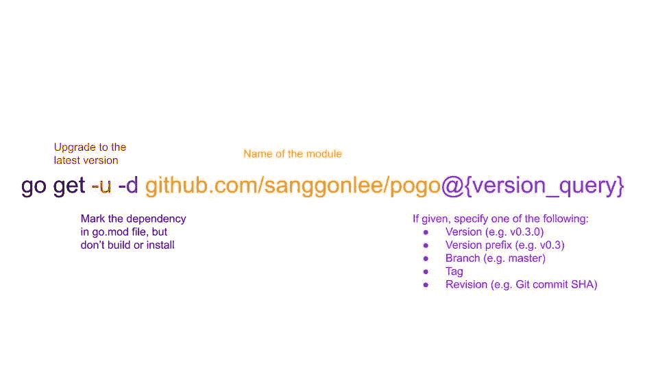
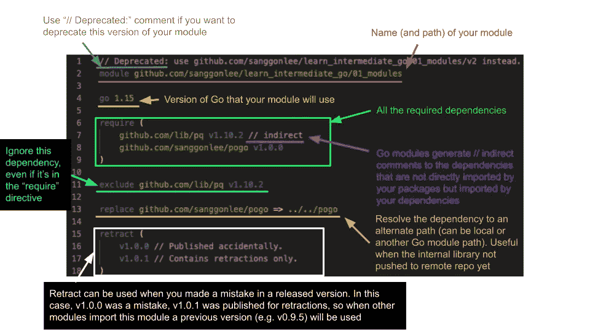
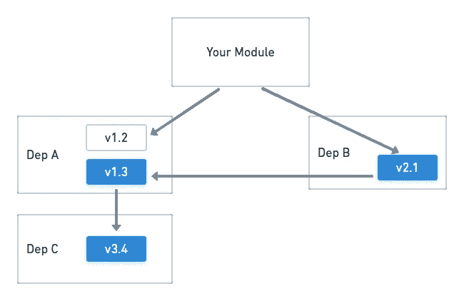

# [学习中级围棋]围棋模块

> 原文：<https://medium.com/nerd-for-tech/learn-intermediate-go-go-modules-c2f88f176fa6?source=collection_archive---------7----------------------->

像其他语言一样，Go 的依赖管理也随着时间的推移而发展。但是自从 v1.11 中引入了 **Go 模块**之后，社区很快将其作为主要的依赖管理系统。

如果您相对来说是新手，您可能已经使用了一些模块，但对它们的实际工作方式还存在一些差距。我会尽我所能来填补这些空白。

一般来说，Go 模块跟踪名为`go.mod`和`go.sum`的文件中的依赖关系。`go.sum`是自动生成的，并从`go.mod`派生而来，所以您通常不需要直接对该文件做任何事情。如果你熟悉 Node.js，`go.mod`堪比`package.json`，`go.sum`堪比`package-lock.json`。

# 创建模块

为了有一个我们想玩的例子，让我们从创建一个模块开始。要创建一个模块，您可以使用`go mod init`:



让我们暂停一下，理解一下这到底是干什么的。

part 应该是不言自明的——它将当前目录初始化为 Go 模块目录。事实上，它所做的只是在当前目录中创建一个名为`go.mod`的文件，其内容如下:

```
module github.com/sanggonlee/learn_intermediate_go/01_modulesgo 1.15
```

也就是你的模块名和 Go 版本。

现在我们来看后面的部分:`[github.com/sanggonlee/learn_intermediate_go/01_modules](http://github.com/sanggonlee/learn_intermediate_go/01_modules)`

您最初的猜测可能是它是一个路径或 URL。答案是肯定的，也是否定的。

*   不，因为它只是模块的名字。你想叫它什么都可以。并且
*   是的，你应该总是把它命名为你上传代码的存储库路径。这是因为当其他 Go 项目需要导入你的模块时，他们会用这个名字来查找你的模块。

# 添加依赖关系

要安装特定的依赖项，请使用`go get`:



对于版本查询，除了五个选项之外，还有特殊的字符串:`latest`、`upgrade`、`patch`和`none`。

`none`的特别之处在于，运行它将消除依赖性。

# 当有什么不对劲的时候

`go mod tidy`命令是你的朋友。它修复了`go.mod`和`go.sum`文件中的大部分不一致，并以规范的形式更新它们。

一个常见的场景是您修改了`go.mod`文件(可能是因为您添加了一个新的依赖项),您的队友也修改了它，因此您处于必须解决合并冲突的情况。只需解决`go.mod`文件中的冲突，删除`go.sum`文件，运行`go mod tidy`。

# 仔细查看 go.mod 文件

现在让我们看看`go.mod`文件的内部。在`go.mod`文件中实际上只有 5 条指令可以使用，所以非常简单！



注:`retract`是 Go 1.16 中引入的新特性。

# 最小版本选择(MVS)

依赖关系树很容易理解，但是当考虑到依赖关系的所有版本时就不那么简单了。

Go 使用最小版本选择(MVS)来准确选择要使用的依赖版本。

首先，递归地找到模块导入的所有依赖项(即那些依赖项的依赖项，以及它们的依赖项，等等)。

然后使用每个依赖关系的最新版本来构建最终的图。



在上面的例子中，你的模块导入了依赖项 A v1.2 和 B v2.1。但是 B v2.1 导入了 v1.3，而 A v1.3 导入了 C v3.4。所以即使你的模块导入了 v1.2 和 B v2.1，在最终的构建列表中也会用到它们(用蓝色突出显示):

*   1.3 版
*   B v2.1
*   C v3.4

# Vendoring

Vendoring 基本上是将所有依赖项的源代码下载到您的(或任何构建环境的)文件系统中。类似于`node_modules`在 Node.js 中的工作方式。

默认情况下，禁用销售，并将依赖项下载到模块缓存中。您可能希望在以下情况下使用 vendoring:

*   为了与旧版本的 Go 进行互操作(记住 Go 模块只是在 v1.11 中引入的！)
*   您的模块导入私有项目，并且您不想将您的 git 凭证注入到构建环境中(例如 CI/CD)
*   如果你觉得那样更可靠(因为在早期阶段你已经拥有了你需要的一切，所以*会不会更可靠)*

为了厂商，运行`go mod vendor`命令，这将创建一个`vendor`目录，并将所有的依赖源代码放在那里。

您的模块将使用`vendor`目录中的代码，所以每当`go.mod`文件改变时，您应该运行`go mod vendor`来同步供应商和 Go 模块。

# 结束语

我希望那有帮助。感谢您的阅读！(哦对了，你知道你可以对一篇中等的文章多次鼓掌吗？😄)

# LIG 系列是什么？

*Learn 中级围棋系列旨在帮助你填补基础围棋教程之外的一些知识空白。它旨在包含从通常让你沮丧的事情中提取的精华，或者在基础教程之后的第一个项目中你错过了什么。目标受众:*

*   *你有学习另一种语言的经验，但是刚开始学，或者*
*   *你刚刚完成了一个基础教程(例如围棋之旅)，但不确定如何获得进一步的知识，或者*
*   *你已经写了几个月的围棋了，但是你想填补一些知识上的空白*

目录(它们不是按顺序排列的——你可以按你想要的任何顺序阅读！):

1.  [*Go 模块*](https://sanggon.medium.com/learn-intermediate-go-go-modules-c2f88f176fa6)
2.  [*语境是如何工作的？*](https://sanggon.medium.com/learn-intermediate-go-how-does-context-work-1898704c649b)