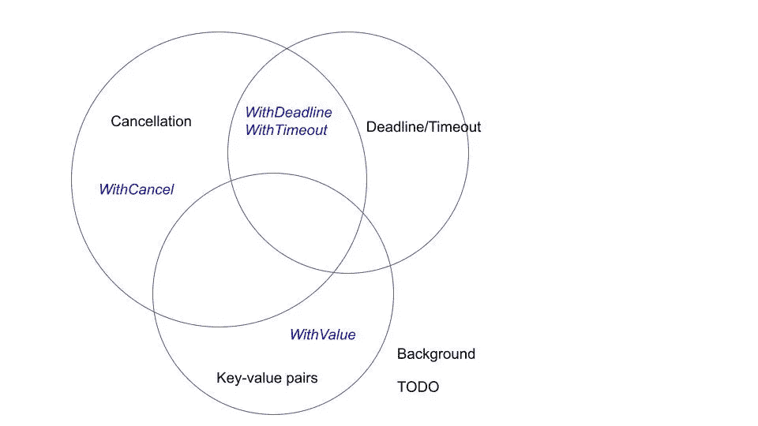
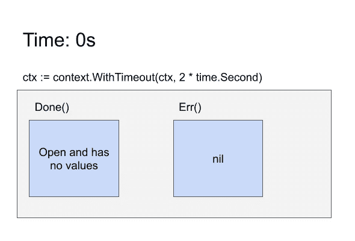
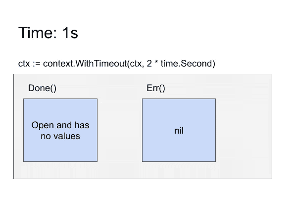
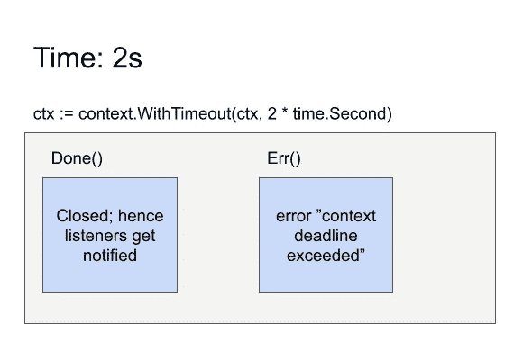
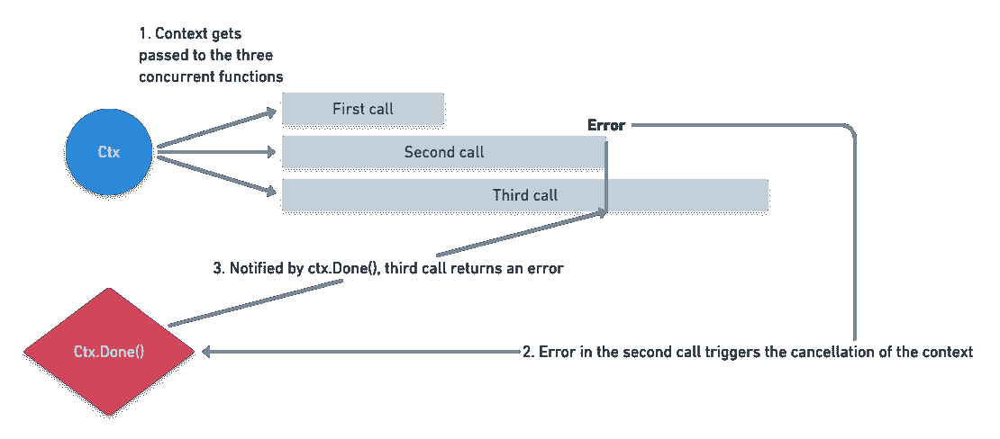

# 【学习中级围棋】语境是如何起作用的？

> 原文：<https://medium.com/nerd-for-tech/learn-intermediate-go-how-does-context-work-1898704c649b?source=collection_archive---------1----------------------->

首先，什么是语境？

在这个上下文(͡❛ ͜ʖ ͡❛)中，上下文是一个控制围棋最终期限的结构。它由上下文包提供。

你可能会问，什么截止日期？它可以用于任何事情，但是它最初的意图是用于单个服务器请求中操作的截止时间。如果你不确定那是什么意思，不要担心！这将在下面的章节中解释。

# 柔和的介绍

上下文有三个主要元素:

*   取消
*   截止日期/超时
*   键值对

取消是允许您手动取消上下文的功能。

截止日期和超时可以被认为是“有计划的”取消。虽然不是你打电话取消，但它是由机器控制的，基于你给的时间值。

上下文也可以携带自己的键值对。通常，它包含与单个请求相关的信息。我不会在这里讨论它们，因为这很简单，而且与上下文没有什么特别的关系。

在上下文包中，您会注意到有 6 种方法来构造上下文。您可以结合使用以上六种功能，将以上三种功能附加到上下文中:

*   `WithCancel`:取消
*   `WithDeadline`和`WithTimeout`:截止/超时*和*取消
*   `WithValue`:键值对
*   `Background`和`TODO`:无



你可能对`Background`和`TODO`很好奇。如果它们没有任何用途，为什么它们会存在？

`Background`通常用作其他类型上下文的“根”,因为其他类型的上下文必须有一个“父”上下文。当你不想要一个截止日期，但是你仍然需要传递一个上下文变量(例如，一个函数期望一个上下文作为它的参数)时，也可以使用它。

(如果你理解了它为什么这样命名就更容易了。假设您正在主线程上传递一个没有取消的上下文。该操作可能会无限期运行，冻结主线程——这不是您想要的。一个`background`是用来传递给“后台”进程的，它不需要阻塞其他进程。)

`Background`和`TODO`内部等价。

# 截止日期/超时是如何工作的？

期限机制非常简单。上下文对象持有截止日期，当截止日期过后，`cancel`就是上下文(我知道我们还没有介绍过`cancel`是如何工作的。下一节会解释！).如果你好奇的话，它会用时间来看时间。AfterFunc 函数。

如果父上下文的截止时间先于子上下文，子上下文也会被取消。

反之不成立-取消子上下文不会取消父上下文。

超时与截止日期完全相同，只是截止日期被设置为相对于当前的时间(构建上下文的时间)。

# 取消是如何工作的？

好了，有趣的部分来了！

我们来看一下`Context`接口的签名:

```
type Context interface {
    Done() <-chan struct{}
    Err() error
    Deadline() (deadline time.Time, ok bool)
    Value(key interface{}) interface{}
}
```

现在，请特别注意`Done`功能。它返回一个空结构的通道。

如果你熟悉其他语言，你可以把它想象成一个`Future`对象。也就是说，它现在可能没有任何值，但将来某个时候会有一个值。

这个“未来”在上下文被取消时解决(准确地说，通道被关闭)——通过显式取消或截止时间/超时。`Err()`函数现在也将返回一个非零错误。

就是这样。这就是当它被取消时上下文所做的一切。

**当上下文被取消**时，上下文不会神奇地取消操作本身。

如果您是获取上下文的函数的最终被调用方**,您应该处理上下文的取消。**

很多时候，你只是一个函数的**调用者**，来自第三方库，获取上下文。您可以简单地将上下文传递给它:

或者用您选择在*您的*层中应用的超时/截止时间来包装它:

并且库将(希望)在它们的末端处理上下文。

以下是超时时间为 2 秒的上下文如何随时间变化的直观表示:



# 例子

下面是示例代码(完整代码可以在[https://github . com/sanggonlee/learn _ intermediate _ go/02 _ context/main . go](https://github.com/sanggonlee/learn_intermediate_go/02_context/main.go)中看到)。它演示了当其他操作同时运行时，当其中一个操作返回错误时，如何取消其他操作。

`asyncutil.Collect`函数所做的就是:获取三个`returnErrAfterNSeconds`函数，同时运行它们，并从它们那里收集任何错误。

看到`returnErrAfterNSeconds`的 3 个调用了吗？

*   第一个调用将在 1 秒钟后向通道发送一个`nil`错误。
*   第二次调用将在 2 秒后发送非`nil`错误。
*   第三个调用将在 3 秒后发送一个`nil`错误。

因此，在不考虑上下文的情况下，我们期望输出是:

```
Error: err
```

因为只有第二个调用解决了一个错误。

实际控制台输出:

```
Error: err
Error: context canceled
```

最初，只有第二次调用`returnErrAfterNSeconds`函数会返回一个错误。但是第三个调用也失败了，因为第二个调用一结束，它就取消了上下文并传播到第三个调用。

注意，在`returnErrAfterNSeconds`函数中，上下文取消被显式地处理为一个错误:

```
case <-ctx.Done():
	errs <- ctx.Err()
```

正在进行的图表:



# 更多示例

我再抛几个例子帮助你理解。如果你已经理解了上下文是如何工作的，你可以跳过这一节！

你可以在[https://github . com/sanggonlee/learn _ intermediate _ go/tree/master/02 _ context/examples](https://github.com/sanggonlee/learn_intermediate_go/tree/master/02_context/examples)中找到完整的代码。

## **仅取消**

对于下面的代码，控制台将打印什么？

输出:

```
After 1 second: <nil>
After 3 seconds: <nil>
Context done!
After 5 seconds: context canceled
```

这里，上下文没有任何超时或截止时间。相反，我们在等待 4 秒后手动取消它。我们在 1 秒、3 秒和 5 秒后检查`ctx.Err()`，看看在哪个阶段上下文被取消了。由于上下文在 4 秒时被取消，5 秒后的上下文现在包含错误。

## **超时**

对于下面的代码，控制台将打印什么？

输出:

```
After 1 second: <nil>
After 3 seconds: <nil>
Context done!
After 5 seconds: context deadline exceeded
```

这次我们使用`WithTimeout`将上下文的超时设置为 4 秒，并且永远不要手动取消它。效果与上一个示例相同，但是请注意，我们得到了一个不同的错误:“超过了上下文截止时间”

## **超时前取消**

对于下面的代码，控制台将打印什么？

输出:

```
After 1 second: <nil>
Context done!
After 3 seconds: context canceled
After 5 seconds: context canceled
```

这次我们同时使用超时和手动取消。尽管超时设置为 4 秒，但手动取消会在 2 秒后发生。因此，上下文在 3 秒后出现“上下文已取消”错误，而不是“超过截止时间”错误。

请注意，4 秒钟后(即截止日期后)，错误仍然显示为“上下文已取消”。所以我们知道语境一旦被取消就不会改变。

# 其他重要注意事项

*   上下文是线程安全的(更确切地说，是 goroutine 安全的)。这使得上下文对于控制并发设置中的取消非常有用，如第一个示例代码所示。
*   上下文是不可变的。`context`包中没有一个 API 允许您改变上下文对象。您只能在现有上下文的基础上*创建*一个“子”上下文。
*   虽然很有用，但是键值对不应该被过度使用。它不提供类型安全，并且容易发生键冲突，因为上下文可以跨多个库/应用程序使用

# 结束语

在我看来，上下文很容易成为 Go 语言新手最常见的知识缺口。这不是最容易理解的一个，但却在很多地方使用！

我希望您现在对 Go 中的上下文更加熟悉了。感谢您的阅读。

# LIG 系列是什么？

*Learn 中级围棋系列旨在帮助你填补基础围棋教程之外的一些知识空白。它旨在包含从通常让你沮丧的事情中提取的精华，或者在基础教程之后的第一个项目中你错过了什么。目标受众:*

*   *你有学习另一种语言的经验，但是刚开始学，或者*
*   *你刚刚完成了一个基础教程(例如围棋之旅)，但不确定如何获得进一步的知识，或者*
*   *你已经写了几个月的围棋了，但是你想填补一些知识上的空白*

目录(它们不是按顺序排列的——你可以按你想要的任何顺序阅读！):

1.  [*Go 模块*](https://sanggon.medium.com/learn-intermediate-go-go-modules-c2f88f176fa6)
2.  [*语境是如何工作的？*](https://sanggon.medium.com/learn-intermediate-go-how-does-context-work-1898704c649b)